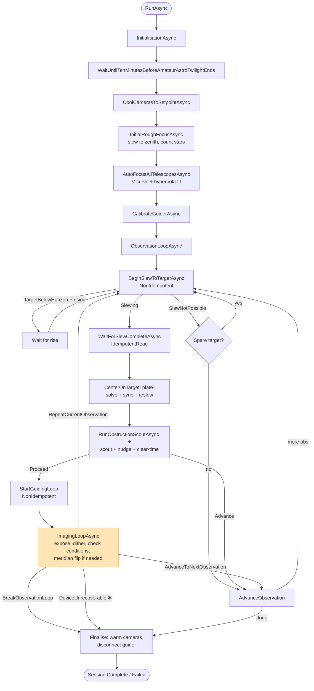
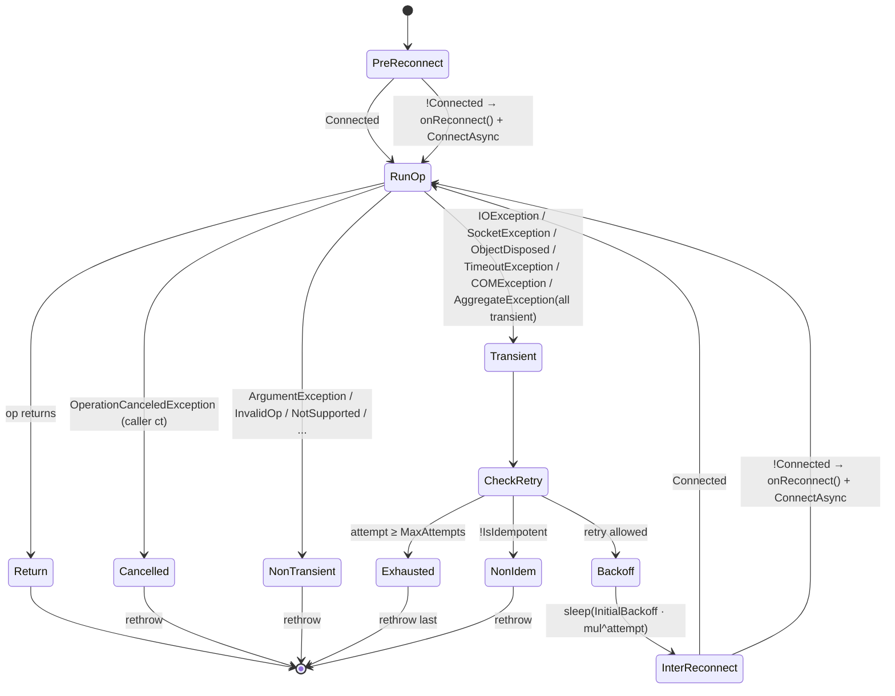
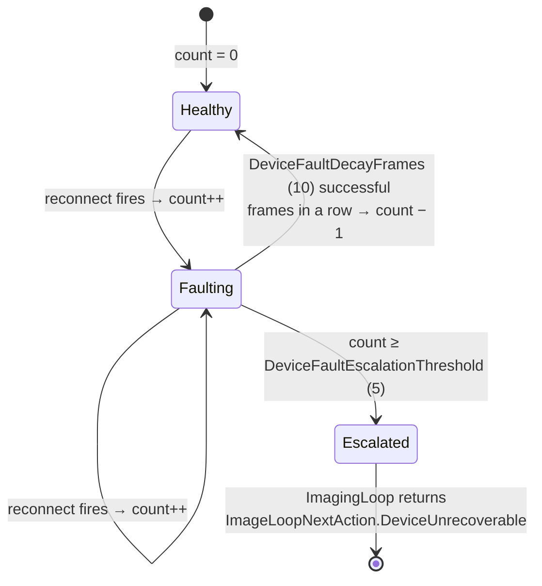
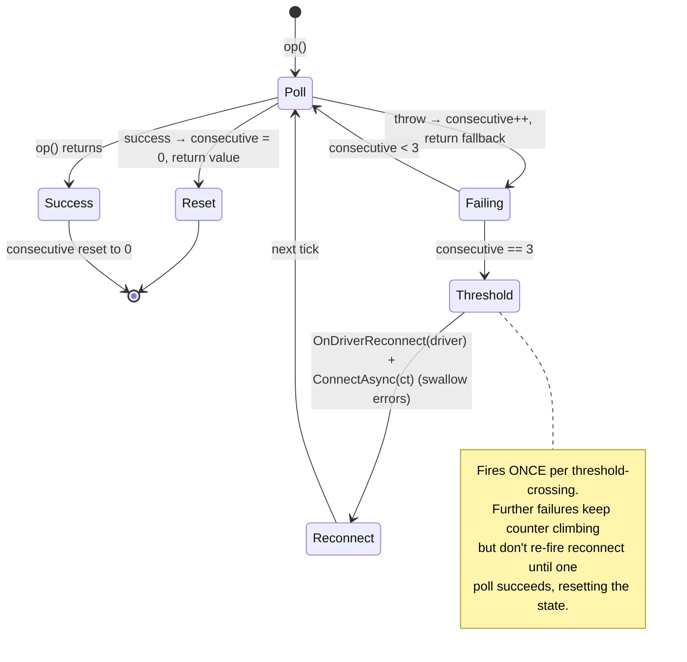

# Driver Resilience

Architecture reference for the driver-reconnect + retry layer shipped on branch
`driver-resilience` as PRs B1-B6. Designed in
[`PLAN-driver-resilience.md`](PLAN-driver-resilience.md).

**Goal:** a single USB bump, COM glitch, or TCP drop must not end the session.
Previously, every driver call in the imaging hot path was a naked `await` — the
first exception bubbled to `Session.RunAsync`'s outer catch, `SessionPhase.Failed`
was set, and finalise ran. Now transient faults retry silently, repeated faults
trigger proactive reconnects, and only a truly dead device escalates to a clean
session exit.

## Top-level session workflow



✱ = new escalation exit added by PR-B4. All driver calls along the highlighted
arrows are wrapped via `ResilientInvokeAsync`.

✦ = predictive FOV obstruction probe added on branch `fov-obstruction-detection`.
Detail in [`ARCH-fov-obstruction.md`](ARCH-fov-obstruction.md).

## ResilientCall.InvokeAsync

The wrapper every hot-path driver call goes through. Pre-reconnects disconnected
drivers, retries idempotent ops with exponential backoff, rethrows immediately on
caller cancellation or non-transient exceptions.



### Presets

| Preset | Attempts | Backoff | Use case |
|--------|---------:|---------|----------|
| `IdempotentRead` | 3 | 250 ms × 3.0 | Status polls, position reads, `WaitForSlewCompleteAsync`, `GetImageAsync` |
| `NonIdempotentAction` | 1 | none | Slew issue, exposure start, dither, guider start (retry would double-issue) |
| `AbsoluteMove` | 2 | 500 ms × 1.0 | Focuser / filter-wheel moves — target is an absolute coordinate, retry lands on the same position |

### Transient exception filter

Conservative by design. False positives (treating a config error as transient)
just log noise and spin through `MaxAttempts`; false negatives (not retrying a
cable bump) defeat the whole helper.

- `IOException` — serial / TCP / pipe
- `SocketException` — TCP disconnect
- `ObjectDisposedException` — driver transport recreated its handle
- `TimeoutException` / `TaskCanceledException` wrapping `TimeoutException` — driver's own timeout, not ours
- `COMException` — ASCOM hub disconnects surface here via `AscomDeviceDriverBase.SafeTask`
- `AggregateException` where every inner is transient

Anything else rethrows immediately.

## Per-driver fault counter

Each `IDeviceDriver` has a session-scoped reconnect counter, incremented by
`ResilientCall`'s `onReconnect` callback. Sustained healthy frames decay the
counter; crossing the threshold trips escalation.



`DeviceFaultEscalationThreshold` and `DeviceFaultDecayFrames` are on
`SessionConfiguration` (defaults 5 and 10). Counter state lives in
`Session._driverFaultCounts` (`ConcurrentDictionary<IDeviceDriver, int>`).
`DeviceUnrecoverable` is a new variant on `ImageLoopNextAction` — the imaging
loop drains pending FITS writes and bails out; `ObservationLoopAsync` logs and
breaks cleanly into `Finalise`.

## PollDriverReadAsync — telemetry proactive reconnect

`PollDeviceStatesAsync` polls focuser position / temperature / moving and mount
RA / Dec / HA / pier / slewing / tracking every imaging tick. Plain `CatchAsync`
would swallow failures forever; `PollDriverReadAsync` counts them and fires a
one-shot reconnect at the threshold so by the time the next exposure starts,
reconnect is already in flight.



`PROACTIVE_RECONNECT_THRESHOLD = 3`. The reconnect happens inline (no
fire-and-forget `Task.Run`); blocking budget is one `ConnectAsync` call, typically
sub-second. Subsequent failures in the same burst keep the counter climbing but
don't re-fire reconnect — the counter only resets on a successful poll.

PR-B6 also routed the three `Session.Cooling.cs` ramp polls (CCD temp, setpoint,
cooler power) through `PollDriverReadAsyncIf` — the capability-gated variant —
so a USB drop during a 30-minute cooldown no longer silently freezes the live
cooling graph.

## Composite operations: layering retry on top of `ResilientCall`

`ResilientCall` retries individual driver primitives. Composite operations made
of several primitives (take a scout exposure: `StartExposureAsync` → `SleepAsync` →
`GetImageReadyAsync` → `GetImageAsync` → `FindStarsAsync`) sometimes need a *second*
retry layer at the operation level. Two distinct failure classes call for it:

1. **Exception escapes Layer 1.** `NonIdempotentAction` has a 1-attempt budget by
   design — a transient on `StartExposureAsync` throws straight through. If the
   composite's caller treats the throw as "abort the whole flow", a single USB
   bump can derail a multi-step operation that had a perfectly cheap retry path.
2. **Successful primitive returns a degraded result.** Drivers don't throw on a
   cosmic-ray-spike-as-a-star, a brief cloud puff that drops star count, or a
   sensor glitch that produces an unusable image. `ResilientCall` only sees
   exceptions, not results.

The pattern that handles both:

```text
Caller (ObservationLoop, etc.)
    └─► Layer 3: try/catch around the composite
        - swallow → safe default (e.g. ScoutOutcome.Proceed)
        - imaging-loop deterioration check is the safety net for real issues

  Composite operation (TakeScoutFrameAsync)
      └─► Layer 2: per-result retry loop (typically 2 attempts)
          - retry on exception (Layer 1 exhausted)
          - retry on invalid result (degraded output)
          - first valid result wins

    Driver primitive (StartExposureAsync, GetImageAsync, ...)
        └─► Layer 1: ResilientCall.InvokeAsync
            - IdempotentRead: 3 attempts, backoff + reconnect
            - NonIdempotentAction: 1 attempt, pre-reconnect only
            - rethrows on hard errors / non-transient
```

Cost of Layer 2: one extra exposure / read per affected attempt. Benefit: a
single bad frame or a single transient that escapes Layer 1 doesn't propagate
to the operation outcome. Cost of Layer 3: nothing (only fires on uncaught
exception). Benefit: a composite that's gone fully sideways doesn't end the
session.

**When to add Layer 2 / Layer 3 to a new composite:**

- Layer 2 is appropriate when the composite is **idempotent at the operation
  level** (running it twice has the same effect as running it once — the second
  result supersedes the first). Scout exposures, telemetry probes, plate solves
  all qualify. Slewing a target does NOT — re-issuing while in motion is at best
  redundant and at worst misbehaves on some mounts.
- Layer 3 is appropriate when the composite has a **safe default outcome**
  (the operation can be skipped without ending the broader flow). Optional
  pre-flight checks, telemetry decorations, predictive probes all qualify.
  Critical path operations (slew to target, start exposure for the actual
  imaging frame) do NOT — silent failure there means lost frames or wrong
  pointing.

**Test seam pattern.** Composite-level retry needs scriptable transient injection
to be testable. The convention is an `internal int Transient<X>Failures` counter
on the fake driver: `Interlocked.Decrement` on each call, throw `IOException`
(classified as transient by Layer 1) when the result is `>= 0`, clamp to 0
afterwards. Set the counter to N to script "next N calls fail." See
`FakeCameraDriver.TransientStartExposureFailures` and the
`GivenFirstScoutAttemptThrowsThenSecondSucceedsWhenScoutAndProbeThenHealthy`
test for the canonical example. New fake-driver test seams should follow the
same pattern.

The first concrete user of all three layers is the FOV obstruction scout — see
[`ARCH-fov-obstruction.md`](ARCH-fov-obstruction.md) "Resilience layering" for
the worked example with its specific failure-class table.

## CatchAsync vs ResilientInvokeAsync vs PollDriverReadAsync

| Kind of call | Helper | Behaviour on throw |
|---|---|---|
| Hot-path driver call (slew, expose, get image, position read, dither, guide start) | `ResilientInvokeAsync` → `ResilientCall` | Classify → retry idempotent ones with backoff + reconnect, count fault, escalate at threshold |
| Telemetry poll (`PollDeviceStatesAsync`, cooling ramp) | `PollDriverReadAsync` / `PollDriverReadAsyncIf` | Return fallback + count consecutive failures; fire proactive reconnect at threshold |
| Best-effort / decision input / metadata read | `CatchAsync` (unchanged) | Log + return fallback, move on |
| Finaliser (warm, disconnect, close covers, park) | `CatchAsync` (unchanged) | Swallow — every step runs regardless of prior failures |

`CatchAsync` is deliberately kept for predicate decisions (`IsSlewingAsync`,
`IsTrackingAsync`) where `false` is a strictly safer default on fault, for FITS
header metadata reads where a missing value is annoying but a retry storm is
worse, and for all finaliser steps.

## Files

### New
- `src/TianWen.Lib/Sequencing/ResilientCall.cs` — static wrapper + options
- `src/TianWen.Lib/Sequencing/ResilientCallOptions.cs` — preset configurations
- `src/TianWen.Lib.Tests/ResilientCallTests.cs` — 11 tests
- `src/TianWen.Lib.Tests/SessionFaultCounterTests.cs` — 11 tests (PR-B4 + PR-B5 + PR-B6)

### Edited
- `src/TianWen.Lib/Sequencing/Session.cs` — fault counter dict, poll failure dict, `PollDeviceStatesAsync`
- `src/TianWen.Lib/Sequencing/Session.ErrorHandling.cs` — `ResilientInvokeAsync` (4 overloads), `OnDriverReconnect`, `DecayFaultCountersOnFrameSuccess`, `TryFindEscalatedDriver`, `PollDriverReadAsync`, `PollDriverReadAsyncIf`
- `src/TianWen.Lib/Sequencing/Session.Imaging.cs` — hot-path driver calls wrapped + `DeviceUnrecoverable` short-circuit + decay hook on successful frame
- `src/TianWen.Lib/Sequencing/Session.Focus.cs` — hot-path driver calls wrapped
- `src/TianWen.Lib/Sequencing/Session.Cooling.cs` — ramp-loop polls routed through `PollDriverReadAsync(If)`
- `src/TianWen.Lib/Sequencing/SessionConfiguration.cs` — `DeviceFaultEscalationThreshold`, `DeviceFaultDecayFrames`
- `src/TianWen.Lib/Sequencing/ImagingLoopResult.cs` — `DeviceUnrecoverable` variant

## Guard rails for future work

- **Never introduce a raw `await driver.X(...)` on the Session hot path.** The
  hot path is anything reachable from `ObservationLoopAsync`, `ImagingLoopAsync`,
  `PerformMeridianFlipAsync`, `RoughFocusAsync`, `AutoFocusAsync`,
  `CenterOnTargetAsync`, `CoolCamerasToSetpointAsync`. Wrap via
  `ResilientInvokeAsync`.
- **Don't forget the `onReconnect` callback.** `ResilientInvokeAsync` is
  preferred over `ResilientCall.InvokeAsync` because it auto-wires
  `OnDriverReconnect`. The raw `ResilientCall` exists for tests and for a future
  non-Session consumer.
- **Pick the preset deliberately.** Most reads are `IdempotentRead`. Anything
  effectful (slew issue, exposure start, dither, guide start) is
  `NonIdempotentAction`. Absolute-target moves (focuser, filter wheel) are
  `AbsoluteMove` (2 attempts, safe to re-issue).
- **Keep `CatchAsync` for the right cases.** See the table above — finaliser,
  predicate decisions, and metadata reads legitimately want swallow-and-default
  semantics.

## Not shipped in this branch

- **Lost-frame re-issue flow.** PR-B3 plan called for detecting "GetImageAsync
  empty after reconnect fired mid-exposure → don't count towards
  TotalFramesRequired, re-issue StartExposureAsync, two consecutive lost frames
  trip `DeviceUnrecoverable`." The mechanical wiring is in place (reconnects are
  counted via `OnDriverReconnect`, two-consecutive-lost-counted-as-faults would
  trip escalation) but the explicit "empty after reconnect" detector is not
  implemented. Candidate for a follow-up PR.
- **AbortSlew-first on reconnect.** Risk mitigation from the PLAN. Current code
  handles it via the `IsSlewingAsync` check before re-issuing in
  `PerformMeridianFlipAsync`; only material if a cold reconnect leaves a slew
  queued at the mount. Can be a driver-level concern.

## Commits

- `1ce1d56` PR-B1 — ResilientCall helper + options + 11 tests
- `be911f4` PR-B2 — wrap idempotent mount/focuser/FW reads
- `b1f02ba` PR-B3 — wrap non-idempotent slew/exposure/dither + absolute moves
- `db7ba83` PR-B4 — fault counter + `DeviceUnrecoverable` escalation + 5 tests
- `1374cbb` PR-B5 — proactive reconnect in `PollDeviceStatesAsync` + 4 tests
- `20394c3` PR-B6 — cooling ramp polls via `PollDriverReadAsyncIf` + 2 tests

All on branch `driver-resilience`. 1672 unit + 78 functional session tests pass.
