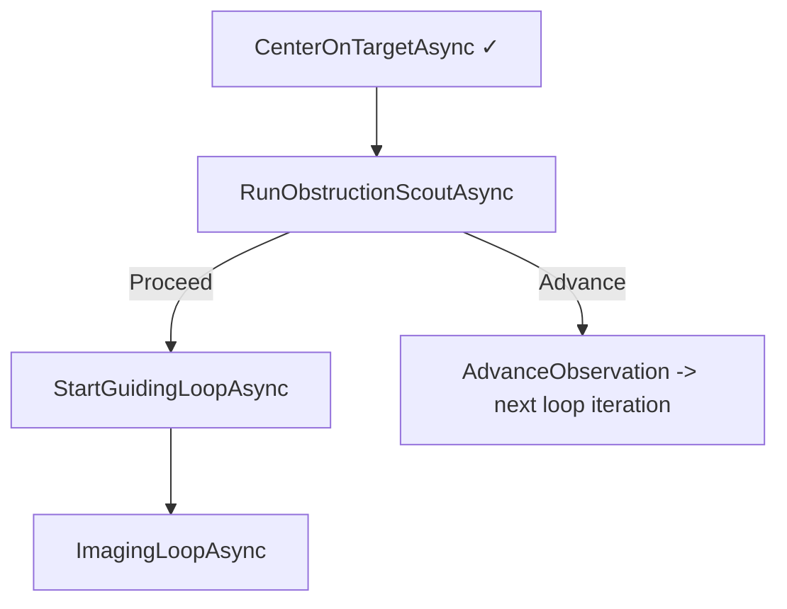
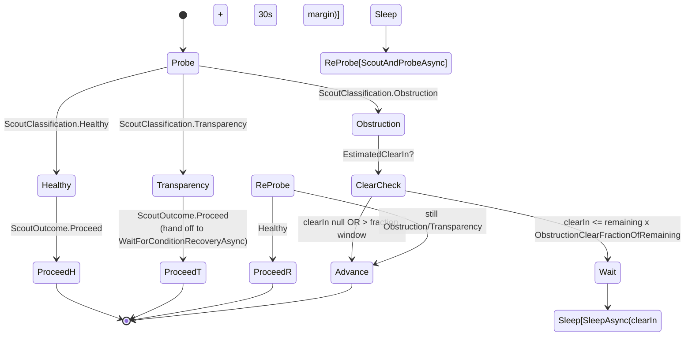

# FOV Obstruction Detection

Architecture reference for the predictive scout + altitude-nudge probe shipped on
branch `fov-obstruction-detection`. Designed in
[`PLAN-fov-obstruction-detection.md`](PLAN-fov-obstruction-detection.md);
sub-plan 2 of [`PLAN-first-light-resilience.md`](PLAN-first-light-resilience.md).

**Goal:** detect fixed FOV obstructions (tree, building, neighbour's roof) before
the imaging loop has committed to guiding + full-length exposures. Either wait
the obstruction out (if the trajectory will clear it within a useful fraction of
the allocated window) or advance cleanly. Disambiguate from transparency loss
(thin cloud, dew) so we don't skip a target the existing condition recovery
flow could have rescued.

## Where it sits in the observation loop



Inserted between centering and guider start so the cost of a failed scout is
~1 short exposure per OTA + (optionally) one nudge slew + scout pair, rather
than auto-focus-on-new-target + guider start + several full-length exposures.

## Three-phase decision

```mermaid
flowchart TD
    Start([ScoutAndProbeAsync]) --> Scout1[Take ScoutExposure on every OTA]
    Scout1 --> PrevBaseline{Previous obs<br/>baseline exists?}

    PrevBaseline -->|no, first observation| Healthy1[Return Healthy<br/>EstimatedClearIn=null]

    PrevBaseline -->|yes| Classify[ClassifyAgainstBaseline<br/>worst-OTA ratio<br/>scaled by sqrt(scout/baseline exposure)]
    Classify -->|ratio >= ObstructionStarCountRatioHealthy| Healthy2[Return Healthy]
    Classify -->|ratio < threshold| Nudge

    Nudge[NudgeTestAsync<br/>+N x half-FOV in declination] --> Scout2[Take ScoutExposure on every OTA]
    Scout2 --> Recovery{Any OTA<br/>post >= 2 x max(pre, 5)?}
    Recovery -->|yes| Obstruction[Return Obstruction<br/>+ EstimateObstructionClearTime]
    Recovery -->|no| Transparency[Return Transparency<br/>EstimatedClearIn=null]

    Obstruction --> ReSlew1[finally: re-slew to original target]
    Transparency --> ReSlew2[finally: re-slew to original target]

    classDef happy fill:#d4edda,stroke:#155724;
    classDef bad fill:#f8d7da,stroke:#721c24;
    class Healthy1,Healthy2 happy;
    class Obstruction,Transparency bad;
```

The classifier deliberately collapses borderline + severe into the same nudge
test branch — without the nudge, neither can be told apart from cloud cover.

The "any OTA recovers" rule (post >= 2 x max(pre, 5)) is biased toward
Transparency:

- Floor of 5 stars on `pre` prevents classifying noise (1 -> 3 stars) as recovery.
- Single-OTA recovery is enough because all OTAs share the mount; an obstruction
  that affects one optical path at a given altitude likely affects the rest after
  the rig moves.
- Bias matters because the existing condition-recovery flow handles transparency
  correctly — a false Transparency just delays imaging by `ConditionRecoveryTimeout`,
  while a false Obstruction skips a clear target entirely.

## Loop-side routing (`RunObstructionScoutAsync`)



`ObstructionClearFractionOfRemaining` defaults to 0.2: the session waits if the
obstruction will clear in at most 20% of the remaining allocation. The `+ 30s`
margin on the sleep duration absorbs ephemeris drift between estimate and reality.

Transparency intentionally falls through to `ScoutOutcome.Proceed` rather than
running its own recovery sequence — `WaitForConditionRecoveryAsync` already has
the right behaviour (poll, baseline-driven recovery threshold, clean exit on
timeout) and the imaging loop will route into it as soon as the per-target
baseline is established.

## Trajectory clear-time estimation

```mermaid
flowchart LR
    Now[transform.SetJ2000(target)<br/>DateTime=now<br/>altNow] --> Step{Sample t+2min}
    Step -->|alt <= altNow| Setting[Return null]
    Step -->|alt > altNow| Loop[Walk forward 2-min steps,<br/>cap at 2h]
    Loop -->|alt >= altNow + nudgeDeg| Found[Return elapsed]
    Loop -->|elapsed > 2h| Never[Return null]
```

`nudgeDeg = ObstructionNudgeRadii * half-FOV-of-widest-OTA`. For a typical 80mm
APO + APS-C combo at 480mm focal length, half-FOV is ~1.4°; for the rising
Seagull from Vienna (alt ~23°, climbing) clear time is on the order of minutes,
which is well within a 60-min observation window.

The "setting target" early exit is critical: a target near or past meridian
won't gain altitude, so there's no point walking the lookahead loop forward.

## SessionConfiguration knobs

| Field | Default | Purpose |
|---|---|---|
| `ScoutExposure` | 10 s | Per-OTA scout exposure length |
| `ObstructionStarCountRatioHealthy` | 0.7 | Ratio at/above which scout passes without nudge |
| `ObstructionStarCountRatioSevere` | 0.3 | Currently informational; both severe + borderline route to nudge test |
| `ObstructionNudgeRadii` | 1.0 | Multiplier on half-FOV for the upward declination nudge |
| `ObstructionClearFractionOfRemaining` | 0.2 | Wait if obstruction clears in <= this fraction of remaining time |
| `SaveScoutFrames` | false | Reserved; FITS-write path for scout frames not yet implemented |

## Files

### New
- `src/TianWen.Lib/Sequencing/ScoutResult.cs` — `ScoutResult`, `ScoutClassification`, `ScoutOutcome`
- `src/TianWen.Lib/Sequencing/Session.Imaging.Obstruction.cs` — partial: `ScoutAndProbeAsync`, `RunObstructionScoutAsync`, `ClassifyAgainstBaseline`, `NudgeTestAsync`, `EstimateObstructionClearTimeAsync`, `ComputeWidestHalfFovDeg`, `TakeScoutFrameAsync`, `TryGetPreviousObservationBaseline`
- `src/TianWen.Lib.Tests/SessionScoutClassifierTests.cs` — 6 unit tests
- `src/TianWen.Lib.Tests.Functional/SessionScoutAndProbeTests.cs` — 5 functional tests

### Edited
- `src/TianWen.Lib/Sequencing/Session.Imaging.cs` — `RunObstructionScoutAsync` call wired into `ObservationLoopAsync` between centering and guider start
- `src/TianWen.Lib/Sequencing/Session.cs` — `SetBaselineForObservationForTest` test seam
- `src/TianWen.Lib/Sequencing/SessionConfiguration.cs` — six new fields with XML docs

## Guard rails for future work

- **Don't bypass the scout from a hot-path slew.** If a future refactor adds a
  new "slew + image" entry point (e.g. mosaic panel switch), it must call
  `RunObstructionScoutAsync` after centering or document why not.
- **Don't tighten the recovery rule without data.** The "post >= 2 x max(pre, 5)"
  threshold is intentionally conservative. False obstruction = lost target;
  false transparency = delayed-by-recovery-timeout target. The asymmetry favours
  patience, not skipping.
- **Don't add per-OTA decisions.** Single-mount invariant: all OTAs share
  pointing. The classifier returns the worst-OTA ratio because the rig responds
  as one unit. Per-OTA branches don't compose with linear scheduling.
- **`ScoutExposure` should be tuned per setup.** Default 10s suits a wide-field
  short-FL scope at f/4-ish. A long-FL refractor at f/7 may want 20-30s to detect
  enough stars in low-density fields. The classifier's sqrt(exposure ratio)
  scaling means changing scout duration doesn't break the comparison.

## Not shipped on this branch

- **`ScoutCompletedEventArgs` UI event.** Plan flagged optional for v1.
  The live-session UI does not currently see scout frames or scout decisions.
- **`SaveScoutFrames` FITS write path.** Config key exists for future debugging
  but always discards (matches the false default).
- **Per-OTA `ScoutExposure`.** Currently global; per-OTA gain/filter means a
  10s LUM frame is not equivalent to a 10s Ha frame. Plan flagged as revisit.

## Known limitations (gaps the scout does *not* close)

Three first-light scenarios where an obstruction can still bite because the
scout's preconditions aren't met. Detail in
[`PLAN-fov-obstruction-detection.md`](PLAN-fov-obstruction-detection.md)
"Known limitations" section.

1. **First observation of the night** — no prior baseline → scout returns
   `Healthy` unconditionally. Detection falls back to the in-flight
   condition-deterioration check inside the imaging loop, which only fires
   after guider start + several full-length exposures.
2. **Guider calibration slew** (`Session.Lifecycle.cs:19`) — scout is not
   invoked before `CalibrateGuiderAsync` slews to `(HA=30min east, Dec=0°)`.
   TODO item L147 ("slew slightly above/below 0° dec to avoid trees") tracks
   this gap separately.
3. **Guider field vs. imaging field** — scout exposures run on imaging OTAs
   only. Side-by-side guide scopes with their own obstructions are not
   covered. OAGs are fine because the fields coincide.

Closing (1) needs an absolute star-count oracle (catalog-derived or
cross-session cache); closing (2) needs `RunObstructionScoutAsync` to be
called from `CalibrateGuiderAsync` (and inherits problem (1)); closing (3)
needs the scout to optionally exposure the guide camera. Lowest-risk path is
(2) → (1) → (3) in priority order if first-light operational data shows
these biting.

## Commit

- `fb4d0c3` — FOV obstruction detection: scout + altitude-nudge + trajectory wait

On branch `fov-obstruction-detection`. 1678 unit + 83 functional Session tests pass.
