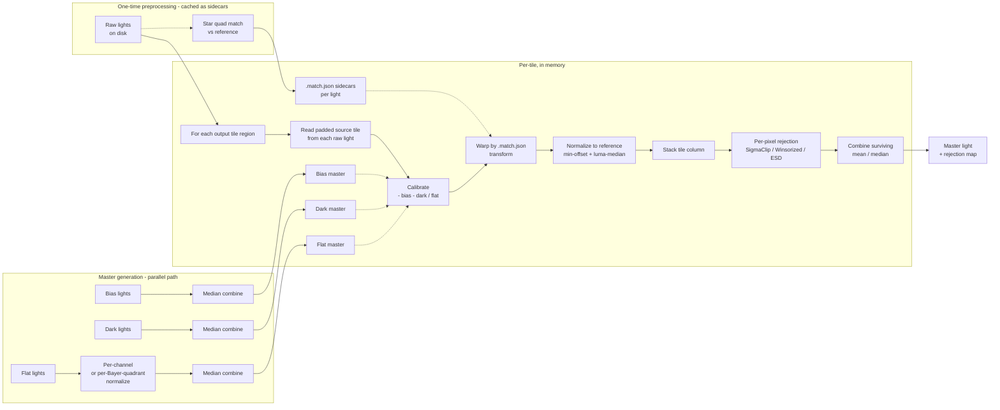

# PLAN: Image stacking — calibration, registration, normalization, rejection, integration

## Goal

Add a complete amateur-astrophotography stacking pipeline to TianWen: master
bias/dark/flat generation, per-light calibration, star-based registration with
sub-pixel warp, intensity normalization, per-pixel outlier rejection, and final
integration. Cover both batch (post-session) and live (during-session) workflows.

Reference implementation: SetiAstroSuitePro (Python — see `../../other/setiastrosuitepro/`).
Match feature parity for the core algorithms, but redesign for SIMD / tile-pipelined
async / strong-typed Span\<float\> in C#.

## Non-goals (v1)

- **Drizzle**. Sub-pixel placement integration. Useful for upscaling small-pixel-scale
  data but high-effort and orthogonal to the core pipeline; defer to a follow-up plan.
- **Comet stacking**. Template-match + StarNet/DarkStar star removal + dual-stack blend
  is a worthwhile feature but materially distinct from sidereal stacking. Defer.
- **SER/AVI video stack** (planetary). Different domain, different cadence, separate plan.
- **Dark scaling by exposure**. SetiAstro doesn't do it either; nearest-match selection
  is enough for amateur data. Revisit only if users report mismatched-darks artifacts.
- **Cosmetic correction / satellite masking**. Useful but orthogonal — add later as
  pre-rejection filters.

## Architecture

All math + I/O lives in `TianWen.Lib.Imaging.Calibration` and
`TianWen.Lib.Imaging.Stacking`. The CLI command (`tianwen stack …`) is a thin
orchestrator: parses args, picks files, wires the engine pieces, prints
progress. Zero pixel-math in `TianWen.Cli`. Same engine is later re-used by a
GUI tab and by the live-session capture loop without duplication.

**SIMD strategy.** Use `System.Numerics.Vector<float>` for the hot inner loops
(rejection per-pixel column stats, multi-frame median pass, calibration
arithmetic). `TensorPrimitives` is fine for one-shot whole-array ops we already
use (scalar multiply, sum), but the rejection kernels have masked stats +
iterative reject passes that need direct vectorised control — `Vector<float>`
+ `Vector<int>` masks beat the framework wrapper for those. Reference: the
existing `TensorPrimitives.Multiply` site in `Image.cs:87-88` for the shape of
SIMD code we already ship.

## Pipeline shape



**Disk discipline (diverges from SetiAstro).** SetiAstro writes a full
calibrated FITS per light then a full aligned FITS per light before integrating
— ~22 GB of intermediates for a 100-frame 3008² RGB session. We don't.

Disk-resident artifacts (small):
- Master bias / dark / flat — one per group, written once, reused across sessions
- `<light>.match.json` sidecar next to each raw light: `Matrix3x2` transform to
  the reference frame, per-frame median / sigma / star count for rejection
  weighting, registration quality score
- Final integrated master FITS (the output)
- Optional rejection-map FITS (one per integration, MEF extension HDU)

Pixels are tile-pipelined in memory only: for each output tile region, read the
corresponding padded source tile from each raw light (memory-mapped via
`Image.Fits.cs`), apply calibration + warp + normalize + reject + combine,
write the tile to the output buffer. Memory budget per tile = `frames × tileH ×
tileW × channels × 4 bytes` — ~78 MB for 100 frames × 256² × 3ch, comfortably
fits in RAM. Tile sizing via `compute_safe_chunk` derives from
`GC.GetGCMemoryInfo()`.

Re-running integration with a different rejector is a single re-read of the raw
lights + the cached `.match.json` transforms — no recompute of calibration or
registration. That's the value of keeping the small mapping files on disk.

## Memory provisioning

Three tiers of pressure → three responses:

### Tier 1 — Many frames (50–500), normal output (≤ 4K square)

Tile size adapts via `ComputeSafeChunkSide`:

```csharp
static int ComputeSafeChunkSide(int frameCount, int channelCount)
{
    var info = GC.GetGCMemoryInfo();
    // 50% of available, leave headroom for the output buffer + masters + framework
    var budget = (info.TotalAvailableMemoryBytes - info.MemoryLoadBytes) / 2;
    var perPixelBytes = (long)frameCount * channelCount * sizeof(float);
    var pixelsPerTile = budget / perPixelBytes;
    return Math.Clamp((int)Math.Sqrt(pixelsPerTile), 64, 2048);
}
```

For 500 frames × 3 ch on 8 GB free, that's a 730 px tile; for 50 frames the
same budget grows the tile to 2.3 K. Floor at 64 px to keep per-tile overhead
amortised; ceiling at 2048 to keep the column-rejection inner loop in cache.
Already in the plan as Phase 8's tile sizer.

### Tier 2 — Big output, normal frame count (mosaic master, 8K+ square)

The output buffer itself blows the budget — 16K × 16K × 3ch float32 = 3 GB.
Today `WriteToFitsFile` (`Image.Fits.cs:224`) builds the whole output array in
RAM; for big mosaics that fails.

**Fix: memory-mapped output FITS.** FITS structure is mmap-friendly — header is a
fixed-size 2880-byte-block prefix, data region is raw row-major pixels with
`BITPIX = -32` and channel planes back-to-back, no compression in the standard
write path. Strategy:

1. `MasterFitsWriter` writes the FITS header (via existing FITS.Lib) with a
   zero-filled data region of the correct final size.
2. Reopen the file via `MemoryMappedFile.CreateFromFile(path, FileMode.Open,
   mapName: null, capacity: 0)` — capacity 0 = use file size.
3. Acquire a `MemoryMappedViewAccessor` over the data region (offset = header
   length, length = `imageW × imageH × channels × 4`).
4. Integrator writes each tile via
   `accessor.WriteArray<float>(byteOffset, tileBuffer, 0, tileBuffer.Length)`.
5. Optional: `view.Flush()` per tile if we want crash-safety; otherwise the OS
   flushes on close.

The integrator API takes a `Span<float>` "row span" per tile region; the source
of that span is either a `float[,]` (typical case) or an `MemoryMappedViewAccessor`-
backed adapter (mosaic case). Same hot loop, different backing store.

Wire-up: a new `IIntegrationSink` abstraction.

```csharp
public interface IIntegrationSink
{
    void WriteTile(RectI region, ReadOnlySpan<float> tilePixels, int channel);
    void Finalize();
}
```

Two concrete: `ArraySink` (the typical case, holds `float[c][h, w]`) and
`MemoryMappedFitsSink` (mosaic case, writes through to disk). User picks via
CLI `--out-of-core-output` flag, or the orchestrator auto-picks when output
size > 1 GB.

### Tier 3 — Column stack alone exceeds RAM (500-frame mosaic at 16K²)

The per-tile column for 500 frames at the 64 px floor = 500 × 64² × 3 × 4 =
24.5 MB per tile. Fine. But at a 8 px tile it'd be 384 KB per tile and
processing becomes dominated by per-tile overhead. If even 8 px doesn't fit
(frames × ch × 4 > budget — never in practice with 8 GB free), we need:

**Multi-pass chunked integration** behind a `--chunked N` flag:

1. Split the frame list into K chunks of size N.
2. Integrate each chunk independently to a partial `(value, weight)` master.
   Weight = unrejected-pixel count per output pixel.
3. Combine the K partials with weighted-mean: `final = Σ(value_k × weight_k) / Σ weight_k`.

**Correctness caveat**: per-chunk rejection is not equivalent to across-all-frames
rejection — a pixel that's an outlier vs the full distribution may not be one
within its chunk. SetiAstro doesn't address this either; PixInsight has a
"large set integration" mode that does a two-pass approach (first pass = robust
stats per pixel, second pass = reject vs the pooled stats). Worth porting for
v2 if anyone hits it. For v1 the docs warn that chunked mode trades rejection
fidelity for memory headroom.

**Bottom line: ship tiers 1+2 in the v1 phases. Tier 3 is documented + a flag
slot but the implementation deferred until a real user hits the limit.**

## Existing assets (TianWen)

Verified 2026-05-14 against `src/`:

| # | Concern | Status | Source |
|---|---------|:---:|---|
| 1 | Image × Image arithmetic (subtract/divide/multiply) | ❌ | `Image.cs:87-88` has scalar mul only |
| 2 | Multi-frame integration (per-pixel median/mean) | ❌ | `StatisticsHelper.Median/Average` are per-span only |
| 3 | Master frame generation + application | ❌ | `FrameType` enum + per-type folders exist; nothing combines them |
| 4 | Registration warp (affine + bilinear) | ✅ | `Image.Transform.cs:50-112` `TransformAsync(Matrix3x2)` |
| 5 | Star quad matching → transform | ✅ | `StarReferenceTable.FindFit` + `FitAffineTransform` |
| 6 | Per-frame intensity normalization | ⚠️ | Only scalar rescale (`ScaleFloatValues`); no photometric fit |
| 7 | Streaming frame loader | ⚠️ | `TryReadFitsFile` is one-at-a-time, synchronous |
| 8 | Rejection algorithms | ❌ | Nothing |
| 9 | Drizzle / sub-pixel placement | ❌ | Out of scope v1 |
| 10 | Live stacking accumulator | ❌ | Nothing — `TODO.md:267` flags it |
| 11 | FITS write (BAYERPAT, FRAMETYP, WCS, etc.) | ✅ | `Image.Fits.cs:224-419` |
| 12 | Bayer split (4 sub-channels for pre-debayer stack) | ⚠️ | Debayer-to-RGB only; no per-Bayer-channel split |

**Verdict**: registration + FITS I/O are solid and directly reusable. The
computational core (Phase 1 arithmetic, Phase 3 integration + rejection,
master generation, live accumulator) is entirely new code.

## New primitives needed

Listed in dependency order — each builds on the ones above.

### A. `Image` ↔ `Image` arithmetic (`TianWen.Lib.Imaging`)

New file `Image.Arithmetic.cs`. Methods:

- `Image.Subtract(Image other, float pedestal = 0f)` — light − bias / dark
- `Image.Divide(Image other)` — light / flat (normalized to ~1.0 mean)
- `Image.Multiply(float scalar)` — already exists, expose properly
- `Image.AddInPlace(Image other)` — for live-stack accumulation

Use `TensorPrimitives` (System.Numerics) for SIMD — same library already used in
the scalar-multiply path. Output is a new `Image` so callers can keep the inputs
immutable. Shape mismatch throws. NaN propagation matches the source convention
(stacked-image NaN borders are already anticipated per `TODO.md:267`).

### B. Multi-frame statistics (`TianWen.Lib.Stat`)

Extend `StatisticsHelper` with:

- `MedianOfStack(ReadOnlySpan<float> column)` — median of one per-pixel column from N frames
- `WinsorizedMean(ReadOnlySpan<float> column, float kappa)` — for Winsorized-sigma rejection

These run inside the tile reduce loop, not per-image.

### C. Frame loader (`TianWen.Lib.Imaging.Calibration`)

New `IFrameSource` interface + concrete implementations. `IAsyncEnumerable<Image>` —
streaming, one frame in memory at a time (or N in a small windowed buffer for
median computation that needs all). Concrete: `FitsFolderFrameSource(string folder)`
filters by `FrameType` header (via existing `Image.Fits.cs` reader). Avoids loading
all N frames before processing.

### D. Calibration application (`TianWen.Lib.Imaging.Calibration`)

`Calibrator(Image? bias, Image? dark, Image? flat)` — pure function with two
modes: `Apply(Image light)` for whole-frame use (master flat normalization,
verification tests) and `ApplyTile(ReadOnlySpan<float> src, RectI region, Span<float> dst)`
for the integration hot path. Validates flat normalization (median ≈ 1.0);
applies the pedestal trick from SetiAstro (`subtract_dark_with_pedestal`) to
prevent negative pixels when the dark mean exceeds the light's background.

The whole-frame mode is used by `MasterFrameBuilder` (which has to read each
calibration frame in full anyway). The tile mode is used by the `Integrator`
inner loop so calibration runs over the same tile slice as warp + normalize +
reject — no full calibrated image ever materialises.

### E. Master generation (`TianWen.Lib.Imaging.Calibration`)

`MasterFrameBuilder.BuildBiasMasterAsync(IFrameSource, …)` — windowed median
combine. Bias has no rejection (super-fast frames, low signal variance). Returns
`Image` ready to write as master FITS.

`BuildDarkMasterAsync` — same as bias.

`BuildFlatMasterAsync` — per-frame normalization to mean=1.0 first (Bayer-aware:
per-quadrant for RGGB to keep CFA balance), then median combine. Stamps
`FRAMETYP=MasterFlat` + grouping keys (exposure, temp, filter) in the header.

Grouping for masters: pure `record MasterGroupKey(int Exposure, float Temp, string? Filter, string Sensor, ImageSize Size)`.
Folder scan groups files by this key; one master per group. Auto-generated names
embed the group: `master_dark_300s_-10C_2026-05-14.fits`.

### F. Normalization (`TianWen.Lib.Imaging.Stacking`)

Port SetiAstro's `normalize_images`: per-frame `(frame − min_luma) × (target_median / median_luma)`.
Luma weights via existing `LumaWeighting` enum (Rec.709 default — same as SetiAstro).
Applied to each frame just before tile integration.

### G. Registration metadata persistence (`TianWen.Lib.Imaging.Stacking`)

`Registrator.AlignAsync(IFrameSource lights, Image reference) → IAsyncEnumerable<RegistrationResult>`.
For each light: detect stars, quad-match against the reference's star table,
fit affine via existing `StarReferenceTable.FitAffineTransform`, validate via
`Decompose` (uniform scale + low skew). Emit per-light:

```csharp
public sealed record RegistrationResult(
    string LightPath,
    Matrix3x2 ToReference,    // affine: source -> reference grid
    float ResidualPx,         // mean post-fit residual
    int MatchedStars,
    float MedianAdu,          // for normalization
    float SigmaAdu);
```

Persist next to each light as `<light>.match.json` via the existing atomic-
write helper. The integrator reads these back without re-running registration,
so re-running with a different rejector skips Phase 5 entirely. Reference frame
is chosen by best (lowest FWHM × highest star count) per simple scoring.

### H. Pixel rejector interface (`TianWen.Lib.Imaging.Stacking`)

```csharp
public interface IPixelRejector
{
    void Reject(Span<float> column, Span<bool> rejected);
}
```

Implementations: `SigmaClipRejector(low, high, iterations)`, `WinsorizedSigmaRejector`,
`PercentileClipRejector`, `EsdRejector` (port SetiAstro's quartic `_soft_outlier_weight`).
Default: SigmaClip(3.0, 3.0, 5) — matches SetiAstro's default. Inner loop uses
`Vector<float>` explicitly: load mask-and-data in lockstep, compute Σ + Σx² over
the unrejected lane subset, broadcast the κ band, generate the new rejection
mask via `Vector.GreaterThan` / `Vector.LessThan`. The masked-stats kernel is
the hottest loop in the whole pipeline — benchmark first, optimize second.

### I. Tile-pipelined integrator (`TianWen.Lib.Imaging.Stacking`)

`Integrator.IntegrateAsync(IReadOnlyList<RegistrationResult> lights, Calibrator cal, IPixelRejector rejector, IntegrationCombiner combiner)`:

1. Compute tile size from `GC.GetGCMemoryInfo().MemoryLoadBytes` and frame count
   (port `compute_safe_chunk`).
2. For each output tile region:
   - For each light: compute the padded source region under the inverse
     transform (small halo, ~10–20 px for typical sub-pixel alignment) and read
     just that tile from the FITS file via memory-mapped reader.
   - Apply `Calibrator.ApplyTile` to the source slice.
   - Warp into output-tile coordinates with bilinear sampling (reuse
     `Image.SubpixelValue` from `Image.cs:142-246`).
   - Apply per-frame normalization scalar pre-computed from the
     `RegistrationResult.MedianAdu`.
3. For each pixel position in the output tile: collect the N-frame column →
   rejector → combiner (mean / median).
4. Write tile to a pre-allocated output `float[,]`. Also emit rejection-count
   per pixel into a second `float[,]`.
5. Producer/consumer via `System.IO.Pipelines` + `Channel<TileSlice>`. Disk reads
   are the slowest step; overlap them with compute via `Channel`.

Output: `IntegrationResult { Image Master, Image RejectionMap, IntegrationStats Stats }`.
FITS writer emits MEF (primary HDU = master, extension HDU = rejection map) —
SetiAstro pattern, but ours never wrote intermediate FITS so the diff is just
this final output file plus the per-light `.match.json` sidecars from Phase 5.

### J. Live stacking accumulator (`TianWen.Lib.Imaging.Stacking.Live`)

`LiveStacker` holds Welford state (`mu`, `m2`) per pixel as
`Float32HxWImageData mu` + `Float32HxWImageData m2` + `int n`. Bootstrap phase
(first 24 frames per SetiAstro): plain running mean — no rejection until we have
enough samples for σ. Then: mu-sigma clip with κ=3 (replace outlier with current
`mu`, not skip — matches SetiAstro). Two `ImmutableArray<float>` snapshots
exposed for UI: `MeanImage` (display) and `StdDevImage` (quality diagnostic).

Per-filter sub-stacks for narrowband (SHO/HOO/OSH compositing) — defer to a v2 of
the live path; v1 single-filter only.

### K. Bayer pre-debayer stacking (deferred, but reserve the seam)

When stacking raw CFA Bayer frames, current plan: **debayer first** (existing
`Image.DebayerAsync` path), then stack on 3-channel images. Matches SetiAstro's
default and avoids per-Bayer-quadrant arithmetic complexity.

Pre-debayer (CFA-drizzle-style) stacking is more accurate for fast-cadence data
(higher per-Bayer-cell SNR before demosaic interpolation smooths it out) but
needs: per-Bayer-quadrant flat normalization (have the math via the new
`BayerMediansInRegion`), 4 separate sub-channel integrations, then a final
demosaic of the integrated CFA. Reserve `Image.SplitBayerChannels()` as a future
primitive but don't ship in v1.

## Phasing

CLI-first: end-to-end pipeline shipped as `tianwen stack` before any GUI work.
Each phase is a separate PR target. Phases 1–11 land in `TianWen.Lib`; only
phase 12 touches `TianWen.Cli`. UI tab (phase 14) is optional and follows once
the CLI engine is stable.

| Phase | Scope | Depends on | LOC | Risk |
|---|---|---|---|---|
| 1 | `Image.Arithmetic.cs` — Subtract / Divide / Multiply / AddInPlace (`Vector<float>`) | — | ~150 | Low |
| 2 | `IFrameSource` + `FitsFolderFrameSource` (streaming) + memmap tile reader | — | ~250 | Low |
| 3 | `MasterFrameBuilder` (bias / dark / flat) + `MasterGroupKey` | 1, 2 | ~300 | Medium — Bayer flat norm |
| 4 | `Calibrator` whole-frame + `ApplyTile` (Span-based) | 1 | ~120 | Low |
| 5 | `Registrator` + `RegistrationResult` + `.match.json` sidecar | — | ~200 | Low — uses `Image.Transform` |
| 6 | `Normalizer` (luma-median match, BT.709) | — | ~100 | Low |
| 7 | `IPixelRejector` + `SigmaClipRejector` (`Vector<float>` masked stats) | — | ~200 | Medium |
| 8 | `Integrator` — tile-pipelined read→calibrate→warp→normalize→reject→combine | 1–7 | ~500 | High |
| 9 | MEF FITS write + `IIntegrationSink` interface + `ArraySink` | 8 | ~150 | Low |
| 10 | `MemoryMappedFitsSink` for tier-2 big-output stacks | 9 | ~150 | Medium |
| 11 | Additional rejectors: Winsorized, Percentile, ESD | 7 | ~250 | Medium |
| 12 | Additional combiners: median, exposure-weighted mean | 8 | ~80 | Low |
| **13** | **CLI: `tianwen stack` orchestrator** | 3, 4, 5, 8, 9 | ~250 | Low |
| 14 | `LiveStacker` with Welford accumulator | 1, 5, 6 | ~300 | Medium — concurrency |
| 15 | Tier-3 `--chunked` multi-pass integration | 8, 9 | ~300 | Medium — correctness caveat |
| 16 | GUI stacking tab (deferred) | 1–13 | ~700 | High — pure UI |

End-to-end smoke ships at **phase 13** — calibration → registration → integration
with the default SigmaClip rejector + mean combiner, accessible via `tianwen stack`.
Total to that milestone: ~2,520 LOC. Phase 10 (memmap output sink) unblocks
mosaic-scale masters; phase 11 expands the rejector menu; phase 14 (LiveStacker)
adds the in-session path. Phase 15 (chunked tier-3) is gated on real user need;
phase 16 is post-MVP UI work.

### Phase 13: CLI orchestrator detail

`TianWen.Cli/Commands/StackCommand.cs` — System.CommandLine subcommand. Pure
orchestration:

```bash
tianwen stack --lights ./Light --bias ./Bias --darks ./Dark --flats ./Flat \
              --output master.fits \
              [--reject sigmaclip:3,3,5 | winsorized:3,3 | esd:0.01] \
              [--combine mean | median] \
              [--reference auto | <path>] \
              [--no-cache]  # ignore existing .match.json, re-register
```

Steps the CLI runs:

1. Glob lights / calibration folders.
2. `MasterFrameBuilder.Build*Async` for bias/dark/flat groups missing masters.
3. `Registrator.AlignAsync(lights, reference)` — writes `.match.json` sidecars.
4. `Integrator.IntegrateAsync(...)` — emits the master + optional rejection map.
5. `Image.WriteToFitsFile(output)`.

No pixel math, no FITS reading, no SIMD in `StackCommand.cs`. Progress reporting
via the existing `IProgress<T>` plumbing the session loop already uses, rendered
through Pastel for the TTY.

## Detailed notes per phase

### Phase 1: `Image` × `Image` arithmetic

Match the existing scalar-multiply API for consistency. Span-based, SIMD via
`TensorPrimitives`. New output `Image` (not in-place) for the immutable
arithmetic — preserves Image's intended semantics. `AddInPlace` is the lone
in-place exception for live-stack accumulation.

```csharp
public Image Subtract(Image other, float pedestal = 0f);
public Image Divide(Image other);
public void AddInPlace(Image other);
```

Bayer awareness is not needed at this layer — bias/dark/flat are all "same-shape
operand" math. The Bayer concerns are pushed up to the flat-master normalization
in phase 3.

### Phase 3: Master generation

Flat masters need per-Bayer-quadrant normalization for CFA flats — the four
Bayer positions have different responses to the flat field (filter colour
× sensor QE per position). Bayer pattern from `ImageMeta.SensorType` +
`BayerOffsetX/Y`. Reuse the new `BayerMediansInRegion` helper from `Image.Histogram.cs`.

Mean-vs-median combine: bias and dark masters tolerate mean (high-frame-count,
near-Gaussian noise). Flat masters use median to reject star ghosts and
particles on the sensor.

### Phase 4: Calibration

Pedestal trick from SetiAstro's `subtract_dark_with_pedestal`: add a constant
offset (e.g. 100 ADU equivalent) before subtraction to avoid negative pixels
when dark mean > light background. Track the pedestal in `Image.Pedestal`
field (already exists) so downstream stretch / stats math can subtract it.

### Phase 7: SigmaClipRejector

Per-pixel column iteration with explicit `Vector<float>` for the masked stats —
this is the rejection inner loop and runs `tileH × tileW` times per integration:

```csharp
public void Reject(Span<float> column, Span<int> mask /* 0 = kept, -1 = rejected */)
{
    var width = Vector<float>.Count;
    for (var iter = 0; iter < _iterations; iter++)
    {
        // Pass 1: SIMD masked Σ + Σx² + active-lane count
        var sumVec = Vector<float>.Zero;
        var sqVec = Vector<float>.Zero;
        var countVec = Vector<int>.Zero;
        var i = 0;
        for (; i <= column.Length - width; i += width)
        {
            var x = new Vector<float>(column[i..]);
            var m = new Vector<int>(mask[i..]);                // 0 / -1
            var keep = Vector.Equals(m, Vector<int>.Zero);     // -1 where kept
            var keepF = Vector.AsVectorSingle(keep);           // -1f / 0f
            // -1f * x = -x ; we want kept * x, so negate sum at the end.
            sumVec += keepF * x;
            sqVec  += keepF * x * x;
            countVec += keep;  // -1 per kept lane
        }
        var sum = -Vector.Sum(sumVec); var sq = -Vector.Sum(sqVec);
        var count = -Vector.Sum(countVec);
        // ... scalar tail + mean/std + GreaterThan reject pass via Vector.GreaterThan
    }
}
```

Use `Span<int>` masks (`0` / `-1`) so the same vector becomes both a count and a
multiplicative weight. Benchmark this against a scalar baseline before adding
the other rejectors — if SIMD doesn't give a clear win for our typical
`frames ≤ 200`, the simpler scalar loop is fine and the other rejectors stay
scalar too.

### Phase 8: Tile integrator

`compute_safe_chunk` port:

```csharp
static int ComputeTileSide(int frameCount, int channelCount, long availableBytes)
{
    var perPixelBytes = frameCount * channelCount * sizeof(float);
    var pixelsPerTile = availableBytes / (perPixelBytes * 4); // 4x safety margin
    return (int)Math.Sqrt(pixelsPerTile);
}
```

`System.IO.Pipelines` producer reads tile slices from each FITS file in parallel
via `Channel<TileSlice>`. Consumer pulls N slices for the same tile region and
runs reject → combine. Output written into a pre-allocated master `float[,]`.

This is the new-code high-water mark — write a focused PR with tests first
(synthetic stack with known outliers, assert rejection map matches expectation).

### Phase 14: LiveStacker

Welford online variance — port the exact `delta/mu/m2` lines from
`live_stacking.py:1366`. Single struct holds state:

```csharp
internal struct WelfordPixel
{
    public float Mu;
    public float M2;
    public int N;
}
```

One `WelfordPixel[H * W]` array. Bootstrap: first 24 frames are plain `(prev_sum + x) / (n+1)`.
After that: mu-sigma clip with κ=3 — outliers replaced by `Mu`, not skipped, so
`n` increments uniformly and the variance estimate stays valid.

Threading: producer (capture loop) hands an `Image` to the LiveStacker; consumer
(UI render) reads the current `MeanImage` snapshot. Use `ImmutableInterlocked.Update`
on the snapshot reference — matches the project's "shared UI state =
`ImmutableArray<T>` atomic replace" pattern (per CLAUDE.md).

## Open questions for the user

1. **Bayer in v1**: debayer-first stacking only? (matches SetiAstro default, simpler).
   Or reserve a hook for CFA-drizzle later?

2. **Rejection default**: SigmaClip(3, 3, 5) like SetiAstro, or Winsorized-sigma
   (better for low-count stacks)?

3. **Master location**: under `%LOCALAPPDATA%/TianWen/Masters/<group-key>/`? Or
   stay alongside the lights?

4. **UI surface**: a new "Stacking" tab in the GUI, or a CLI-first workflow under
   `tianwen stack ...`? CLI-first is faster to ship (no UI plumbing) and lets the
   GUI come in phase 12 once the engine is stable.

5. **Live-stack scope v1**: single-filter only? Multi-filter SHO compositing
   adds 4-5 days but is what most narrowband users want.

6. **Drift correction in live stack**: register every Nth frame to the bootstrap
   stack? Or rely on plate-solved mount tracking and skip registration entirely
   for live? SetiAstro registers every frame.

7. **Reject WCS**: should the master inherit the reference frame's WCS, or
   propagate the registration-warped WCS from each input? Reference is simpler;
   warped is more correct but requires recomputing for each frame.

8. **Output bit depth**: float32 (matches stretch pipeline + SetiAstro) or
   uint16 (compatibility with older tools)? Float32 default with uint16 export
   as an option seems right.

## What we port wholesale

- `normalize_images` formula (min-offset + Rec.709 luma median match)
- Welford online accumulator transition logic (bootstrap → mu-sigma)
- `compute_safe_chunk` tile-sizing heuristic
- `_soft_outlier_weight` quartic weight (ESD rejector)
- `_bias_to_match_light` layout-normalization dispatch
- Pedestal-trick from `subtract_dark_with_pedestal`

## What we redesign

- **Rejection**: `IPixelRejector` interface + SIMD per-Span impl, not torch dispatch
  with DirectML workarounds. C#/SIMD is fast enough for our frame counts (≤ 200);
  GPU compute shaders are an optimization-later target.
- **Tile I/O**: `System.IO.Pipelines` producer/consumer, not ThreadPool +
  `_MMFits` ad-hoc memmap.
- **Registration thread architecture**: `Task` + `Channel<T>` + `CancellationToken`,
  not QThread.
- **MEF FITS output**: typed `IntegrationResult` record passed to a focused writer,
  not the mixed-concern reducer-that-also-writes pattern.
- **Group keys**: pure `record MasterGroupKey(...)` value type, not tangled in UI state.
- **No PyTorch / no Numba**. SIMD intrinsics from `System.Numerics.Tensors` give
  similar throughput in C# for the rejection inner loops.
