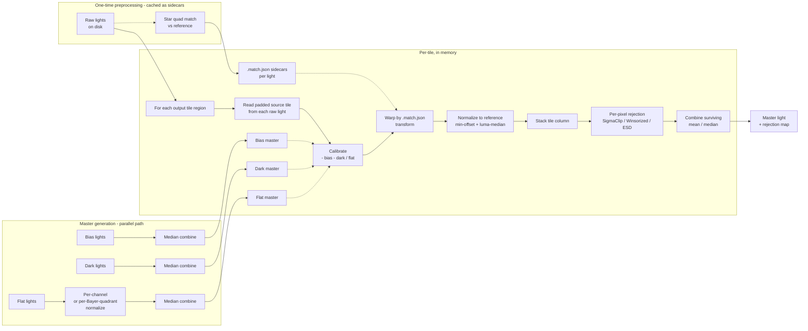

# PLAN: Image stacking — calibration, registration, normalization, rejection, integration

## Goal

Add a complete amateur-astrophotography stacking pipeline to TianWen: master
bias/dark/flat generation, per-light calibration, star-based registration with
sub-pixel warp, intensity normalization, per-pixel outlier rejection, and final
integration. Cover both batch (post-session) and live (during-session) workflows.

Reference implementation: SetiAstroSuitePro (Python — see `../../other/setiastrosuitepro/`).
Match feature parity for the core algorithms, but redesign for SIMD / tile-pipelined
async / strong-typed Span\<float\> in C#.

## Non-goals (v1)

- **Drizzle**. Sub-pixel placement integration. Useful for upscaling small-pixel-scale
  data but high-effort and orthogonal to the core pipeline; defer to a follow-up plan.
- **Comet stacking**. Template-match + StarNet/DarkStar star removal + dual-stack blend
  is a worthwhile feature but materially distinct from sidereal stacking. Defer.
- **SER/AVI video stack** (planetary). Different domain, different cadence, separate plan.
- **Dark scaling by exposure**. SetiAstro doesn't do it either; nearest-match selection
  is enough for amateur data. Revisit only if users report mismatched-darks artifacts.
- **Cosmetic correction / satellite masking**. Useful but orthogonal — add later as
  pre-rejection filters.

## Architecture

All math + I/O lives in `TianWen.Lib.Imaging.Calibration` and
`TianWen.Lib.Imaging.Stacking`. The CLI command (`tianwen stack …`) is a thin
orchestrator: parses args, picks files, wires the engine pieces, prints
progress. Zero pixel-math in `TianWen.Cli`. Same engine is later re-used by a
GUI tab and by the live-session capture loop without duplication.

**SIMD strategy.** Use `System.Numerics.Vector<float>` for the hot inner loops
(rejection per-pixel column stats, multi-frame median pass, calibration
arithmetic). `TensorPrimitives` is fine for one-shot whole-array ops we already
use (scalar multiply, sum), but the rejection kernels have masked stats +
iterative reject passes that need direct vectorised control — `Vector<float>`
+ `Vector<int>` masks beat the framework wrapper for those. Reference: the
existing `TensorPrimitives.Multiply` site in `Image.cs:87-88` for the shape of
SIMD code we already ship.

## Pipeline shape



**Disk discipline (diverges from SetiAstro).** SetiAstro writes a full
calibrated FITS per light then a full aligned FITS per light before integrating
— ~22 GB of intermediates for a 100-frame 3008² RGB session. We don't.

Disk-resident artifacts (small):
- Master bias / dark / flat — one per group, written once, reused across sessions
- `<light>.match.json` sidecar next to each raw light: `Matrix3x2` transform to
  the reference frame, per-frame median / sigma / star count for rejection
  weighting, registration quality score
- Final integrated master FITS (the output)
- Optional rejection-map FITS (one per integration, MEF extension HDU)

Pixels are tile-pipelined in memory only: for each output tile region, read the
corresponding padded source tile from each raw light (memory-mapped via
`Image.Fits.cs`), apply calibration + warp + normalize + reject + combine,
write the tile to the output buffer. Memory budget per tile = `frames × tileH ×
tileW × channels × 4 bytes` — ~78 MB for 100 frames × 256² × 3ch, comfortably
fits in RAM. Tile sizing via `compute_safe_chunk` derives from
`GC.GetGCMemoryInfo()`.

Re-running integration with a different rejector is a single re-read of the raw
lights + the cached `.match.json` transforms — no recompute of calibration or
registration. That's the value of keeping the small mapping files on disk.

## Memory provisioning

Three tiers of pressure → three responses:

### Tier 1 — Many frames (50–500), normal output (≤ 4K square)

Tile size adapts via `ComputeSafeChunkSide`:

```csharp
static int ComputeSafeChunkSide(int frameCount, int channelCount)
{
    var info = GC.GetGCMemoryInfo();
    // 50% of available, leave headroom for the output buffer + masters + framework
    var budget = (info.TotalAvailableMemoryBytes - info.MemoryLoadBytes) / 2;
    var perPixelBytes = (long)frameCount * channelCount * sizeof(float);
    var pixelsPerTile = budget / perPixelBytes;
    return Math.Clamp((int)Math.Sqrt(pixelsPerTile), 64, 2048);
}
```

For 500 frames × 3 ch on 8 GB free, that's a 730 px tile; for 50 frames the
same budget grows the tile to 2.3 K. Floor at 64 px to keep per-tile overhead
amortised; ceiling at 2048 to keep the column-rejection inner loop in cache.
Already in the plan as Phase 8's tile sizer.

### Tier 2 — Big output, normal frame count (mosaic master, 8K+ square)

The output buffer itself blows the budget — 16K × 16K × 3ch float32 = 3 GB.
Today `WriteToFitsFile` (`Image.Fits.cs:224`) builds the whole output array in
RAM; for big mosaics that fails.

**Fix: memory-mapped output FITS.** FITS structure is mmap-friendly — header is a
fixed-size 2880-byte-block prefix, data region is raw row-major pixels with
`BITPIX = -32` and channel planes back-to-back, no compression in the standard
write path. Strategy:

1. `MasterFitsWriter` writes the FITS header (via existing FITS.Lib) with a
   zero-filled data region of the correct final size.
2. Reopen the file via `MemoryMappedFile.CreateFromFile(path, FileMode.Open,
   mapName: null, capacity: 0)` — capacity 0 = use file size.
3. Acquire a `MemoryMappedViewAccessor` over the data region (offset = header
   length, length = `imageW × imageH × channels × 4`).
4. Integrator writes each tile via
   `accessor.WriteArray<float>(byteOffset, tileBuffer, 0, tileBuffer.Length)`.
5. Optional: `view.Flush()` per tile if we want crash-safety; otherwise the OS
   flushes on close.

The integrator API takes a `Span<float>` "row span" per tile region; the source
of that span is either a `float[,]` (typical case) or an `MemoryMappedViewAccessor`-
backed adapter (mosaic case). Same hot loop, different backing store.

Wire-up: a new `IIntegrationSink` abstraction.

```csharp
public interface IIntegrationSink
{
    void WriteTile(RectI region, ReadOnlySpan<float> tilePixels, int channel);
    void Finalize();
}
```

Two concrete: `ArraySink` (the typical case, holds `float[c][h, w]`) and
`MemoryMappedFitsSink` (mosaic case, writes through to disk). User picks via
CLI `--out-of-core-output` flag, or the orchestrator auto-picks when output
size > 1 GB.

### Tier 3 — Column stack alone exceeds RAM (500-frame mosaic at 16K²)

The per-tile column for 500 frames at the 64 px floor = 500 × 64² × 3 × 4 =
24.5 MB per tile. Fine. But at a 8 px tile it'd be 384 KB per tile and
processing becomes dominated by per-tile overhead. If even 8 px doesn't fit
(frames × ch × 4 > budget — never in practice with 8 GB free), we need:

**Multi-pass chunked integration** behind a `--chunked N` flag:

1. Split the frame list into K chunks of size N.
2. Integrate each chunk independently to a partial `(value, weight)` master.
   Weight = unrejected-pixel count per output pixel.
3. Combine the K partials with weighted-mean: `final = Σ(value_k × weight_k) / Σ weight_k`.

**Correctness caveat**: per-chunk rejection is not equivalent to across-all-frames
rejection — a pixel that's an outlier vs the full distribution may not be one
within its chunk. SetiAstro doesn't address this either; PixInsight has a
"large set integration" mode that does a two-pass approach (first pass = robust
stats per pixel, second pass = reject vs the pooled stats). Worth porting for
v2 if anyone hits it. For v1 the docs warn that chunked mode trades rejection
fidelity for memory headroom.

**Bottom line: ship tiers 1+2 in the v1 phases. Tier 3 is documented + a flag
slot but the implementation deferred until a real user hits the limit.**

## Existing assets (TianWen)

Verified 2026-05-14 against `src/`:

| # | Concern | Status | Source |
|---|---------|:---:|---|
| 1 | Image × Image arithmetic (subtract/divide/multiply) | ❌ | `Image.cs:87-88` has scalar mul only |
| 2 | Multi-frame integration (per-pixel median/mean) | ❌ | `StatisticsHelper.Median/Average` are per-span only |
| 3 | Master frame generation + application | ❌ | `FrameType` enum + per-type folders exist; nothing combines them |
| 4 | Registration warp (affine + bilinear) | ✅ | `Image.Transform.cs:50-112` `TransformAsync(Matrix3x2)` |
| 5 | Star quad matching → transform | ✅ | `StarReferenceTable.FindFit` + `FitAffineTransform` |
| 6 | Per-frame intensity normalization | ⚠️ | Only scalar rescale (`ScaleFloatValues`); no photometric fit |
| 7 | Streaming frame loader | ⚠️ | `TryReadFitsFile` is one-at-a-time, synchronous |
| 8 | Rejection algorithms | ❌ | Nothing |
| 9 | Drizzle / sub-pixel placement | ❌ | Out of scope v1 |
| 10 | Live stacking accumulator | ❌ | Nothing — `TODO.md:267` flags it |
| 11 | FITS write (BAYERPAT, FRAMETYP, WCS, etc.) | ✅ | `Image.Fits.cs:224-419` |
| 12 | Bayer split (4 sub-channels for pre-debayer stack) | ⚠️ | Debayer-to-RGB only; no per-Bayer-channel split |

**Verdict**: registration + FITS I/O are solid and directly reusable. The
computational core (Phase 1 arithmetic, Phase 3 integration + rejection,
master generation, live accumulator) is entirely new code.

## New primitives needed

Listed in dependency order — each builds on the ones above.

### A. `Image` ↔ `Image` arithmetic (`TianWen.Lib.Imaging`)

New file `Image.Arithmetic.cs`. Methods:

- `Image.Subtract(Image other, float pedestal = 0f)` — light − bias / dark
- `Image.Divide(Image other)` — light / flat (normalized to ~1.0 mean)
- `Image.Multiply(float scalar)` — already exists, expose properly
- `Image.AddInPlace(Image other)` — for live-stack accumulation

Use `TensorPrimitives` (System.Numerics) for SIMD — same library already used in
the scalar-multiply path. Output is a new `Image` so callers can keep the inputs
immutable. Shape mismatch throws. NaN propagation matches the source convention
(stacked-image NaN borders are already anticipated per `TODO.md:267`).

### B. Multi-frame statistics (`TianWen.Lib.Stat`)

Extend `StatisticsHelper` with:

- `MedianOfStack(ReadOnlySpan<float> column)` — median of one per-pixel column from N frames
- `WinsorizedMean(ReadOnlySpan<float> column, float kappa)` — for Winsorized-sigma rejection

These run inside the tile reduce loop, not per-image.

### C. Frame loader (`TianWen.Lib.Imaging.Calibration`)

New `IFrameSource` interface + concrete implementations. `IAsyncEnumerable<Image>` —
streaming, one frame in memory at a time (or N in a small windowed buffer for
median computation that needs all). Concrete: `FitsFolderFrameSource(string folder)`
filters by `FrameType` header (via existing `Image.Fits.cs` reader). Avoids loading
all N frames before processing.

### D. Calibration application (`TianWen.Lib.Imaging.Calibration`)

`Calibrator(Image? bias, Image? dark, Image? flat)` — pure function with two
modes: `Apply(Image light)` for whole-frame use (master flat normalization,
verification tests) and `ApplyTile(ReadOnlySpan<float> src, RectI region, Span<float> dst)`
for the integration hot path. Validates flat normalization (median ≈ 1.0);
applies the pedestal trick from SetiAstro (`subtract_dark_with_pedestal`) to
prevent negative pixels when the dark mean exceeds the light's background.

The whole-frame mode is used by `MasterFrameBuilder` (which has to read each
calibration frame in full anyway). The tile mode is used by the `Integrator`
inner loop so calibration runs over the same tile slice as warp + normalize +
reject — no full calibrated image ever materialises.

### E. Master generation (`TianWen.Lib.Imaging.Calibration`)

`MasterFrameBuilder.BuildBiasMasterAsync(IFrameSource, …)` — windowed median
combine. Bias has no rejection (super-fast frames, low signal variance). Returns
`Image` ready to write as master FITS.

`BuildDarkMasterAsync` — same as bias.

`BuildFlatMasterAsync` — per-frame normalization to mean=1.0 first (Bayer-aware:
per-quadrant for RGGB to keep CFA balance), then median combine. Stamps
`FRAMETYP=MasterFlat` + grouping keys (exposure, temp, filter) in the header.

Grouping for masters: pure `record MasterGroupKey(int Exposure, float Temp, string? Filter, string Sensor, ImageSize Size)`.
Folder scan groups files by this key; one master per group. Auto-generated names
embed the group: `master_dark_300s_-10C_2026-05-14.fits`.

### F. Normalization (`TianWen.Lib.Imaging.Stacking`)

Port SetiAstro's `normalize_images`: per-frame `(frame − min_luma) × (target_median / median_luma)`.
Luma weights via existing `LumaWeighting` enum (Rec.709 default — same as SetiAstro).
Applied to each frame just before tile integration.

### G. Registration metadata persistence (`TianWen.Lib.Imaging.Stacking`)

`Registrator.AlignAsync(IFrameSource lights, Image reference) → IAsyncEnumerable<RegistrationResult>`.
For each light: detect stars, quad-match against the reference's star table,
fit affine via existing `StarReferenceTable.FitAffineTransform`, validate via
`Decompose` (uniform scale + low skew). Emit per-light:

```csharp
public sealed record RegistrationResult(
    string LightPath,
    Matrix3x2 ToReference,    // affine: source -> reference grid
    float ResidualPx,         // mean post-fit residual
    int MatchedStars,
    float MedianAdu,          // for normalization
    float SigmaAdu);
```

Persist next to each light as `<light>.match.json` via the existing atomic-
write helper. The integrator reads these back without re-running registration,
so re-running with a different rejector skips Phase 5 entirely. Reference frame
is chosen by best (lowest FWHM × highest star count) per simple scoring.

### H. Pixel rejector interface (`TianWen.Lib.Imaging.Stacking`)

```csharp
public interface IPixelRejector
{
    void Reject(Span<float> column, Span<bool> rejected);
}
```

Implementations: `SigmaClipRejector(low, high, iterations)`, `WinsorizedSigmaRejector`,
`PercentileClipRejector`, `EsdRejector` (port SetiAstro's quartic `_soft_outlier_weight`).
Default: SigmaClip(3.0, 3.0, 5) — matches SetiAstro's default. Inner loop uses
`Vector<float>` explicitly: load mask-and-data in lockstep, compute Σ + Σx² over
the unrejected lane subset, broadcast the κ band, generate the new rejection
mask via `Vector.GreaterThan` / `Vector.LessThan`. The masked-stats kernel is
the hottest loop in the whole pipeline — benchmark first, optimize second.

### I. Tile-pipelined integrator (`TianWen.Lib.Imaging.Stacking`)

`Integrator.IntegrateAsync(IReadOnlyList<RegistrationResult> lights, Calibrator cal, IPixelRejector rejector, IntegrationCombiner combiner)`:

1. Compute tile size from `GC.GetGCMemoryInfo().MemoryLoadBytes` and frame count
   (port `compute_safe_chunk`).
2. For each output tile region:
   - For each light: compute the padded source region under the inverse
     transform (small halo, ~10–20 px for typical sub-pixel alignment) and read
     just that tile from the FITS file via memory-mapped reader.
   - Apply `Calibrator.ApplyTile` to the source slice.
   - Warp into output-tile coordinates with bilinear sampling (reuse
     `Image.SubpixelValue` from `Image.cs:142-246`).
   - Apply per-frame normalization scalar pre-computed from the
     `RegistrationResult.MedianAdu`.
3. For each pixel position in the output tile: collect the N-frame column →
   rejector → combiner (mean / median).
4. Write tile to a pre-allocated output `float[,]`. Also emit rejection-count
   per pixel into a second `float[,]`.
5. Producer/consumer via `System.IO.Pipelines` + `Channel<TileSlice>`. Disk reads
   are the slowest step; overlap them with compute via `Channel`.

Output: `IntegrationResult { Image Master, Image RejectionMap, IntegrationStats Stats }`.
FITS writer emits MEF (primary HDU = master, extension HDU = rejection map) —
SetiAstro pattern, but ours never wrote intermediate FITS so the diff is just
this final output file plus the per-light `.match.json` sidecars from Phase 5.

### J. Live stacking accumulator (`TianWen.Lib.Imaging.Stacking.Live`)

`LiveStacker` holds Welford state (`mu`, `m2`) per pixel as
`Float32HxWImageData mu` + `Float32HxWImageData m2` + `int n`. Bootstrap phase
(first 24 frames per SetiAstro): plain running mean — no rejection until we have
enough samples for σ. Then: mu-sigma clip with κ=3 (replace outlier with current
`mu`, not skip — matches SetiAstro). Two `ImmutableArray<float>` snapshots
exposed for UI: `MeanImage` (display) and `StdDevImage` (quality diagnostic).

Per-filter sub-stacks for narrowband (SHO/HOO/OSH compositing) — defer to a v2 of
the live path; v1 single-filter only.

### K. Bayer pre-debayer stacking (deferred, but reserve the seam)

When stacking raw CFA Bayer frames, current plan: **debayer first** (existing
`Image.DebayerAsync` path), then stack on 3-channel images. Matches SetiAstro's
default and avoids per-Bayer-quadrant arithmetic complexity.

Pre-debayer (CFA-drizzle-style) stacking is more accurate for fast-cadence data
(higher per-Bayer-cell SNR before demosaic interpolation smooths it out) but
needs: per-Bayer-quadrant flat normalization (have the math via the new
`BayerMediansInRegion`), 4 separate sub-channel integrations, then a final
demosaic of the integrated CFA. Reserve `Image.SplitBayerChannels()` as a future
primitive but don't ship in v1.

## Phasing

CLI-first: end-to-end pipeline shipped as `tianwen stack` before any GUI work.
Each phase is a separate PR target. Phases 1–11 land in `TianWen.Lib`; only
phase 12 touches `TianWen.Cli`. UI tab (phase 14) is optional and follows once
the CLI engine is stable.

| Phase | Scope | Depends on | LOC | Risk |
|---|---|---|---|---|
| 1 | `Image.Arithmetic.cs` — Subtract / Divide / Multiply / AddInPlace (`Vector<float>`) | — | ~150 | Low |
| 2 | `IFrameSource` + `FitsFolderFrameSource` (streaming) + memmap tile reader | — | ~250 | Low |
| 3 | `MasterFrameBuilder` (bias / dark / flat) + `MasterGroupKey` | 1, 2 | ~300 | Medium — Bayer flat norm |
| 4 | `Calibrator` whole-frame + `ApplyTile` (Span-based) | 1 | ~120 | Low |
| 5 | `Registrator` + `RegistrationResult` + `.match.json` sidecar | — | ~200 | Low — uses `Image.Transform` |
| 6 | `Normalizer` (luma-median match, BT.709) | — | ~100 | Low |
| 7 | `IPixelRejector` + `SigmaClipRejector` (`Vector<float>` masked stats) | — | ~200 | Medium |
| 8 | `Integrator` — tile-pipelined read→calibrate→warp→normalize→reject→combine | 1–7 | ~500 | High |
| 9 | MEF FITS write + `IIntegrationSink` interface + `ArraySink` | 8 | ~150 | Low |
| 10 | `MemoryMappedFitsSink` for tier-2 big-output stacks | 9 | ~150 | Medium |
| 11 | Additional rejectors: Winsorized, Percentile, ESD | 7 | ~250 | Medium |
| 12 | Additional combiners: median, exposure-weighted mean | 8 | ~80 | Low |
| **13** | **CLI: `tianwen stack` orchestrator** | 3, 4, 5, 8, 9 | ~250 | Low |
| 14 | `LiveStacker` engine — Welford online accumulator (pure math) | 1, 4, 5, 6 | ~250 | Medium |
| 15 | Session integration — `SessionConfiguration.LiveStacking*` config, per-target lifecycle, `LiveSessionTab` preview "show stack" toggle | 14 | ~300 | Medium |
| 16 | Tier-3 `--chunked` multi-pass integration | 8, 9 | ~300 | Medium — correctness caveat |

End-to-end smoke ships at **phase 13** — calibration → registration → integration
with the default SigmaClip rejector + mean combiner, accessible via `tianwen stack`.
Total to that milestone: ~2,520 LOC. Phase 10 (memmap output sink) unblocks
mosaic-scale masters; phase 11 expands the rejector menu; phases 14 + 15
(LiveStacker + session integration) add the in-session path so live preview
shows the accumulating stack during capture (per-target, automatic reset on
target switch). Phase 16 (chunked tier-3) is gated on real user need.

A standalone stacking GUI app is not in scope — the existing FITS viewer +
session live preview cover the user-facing UX for both batch (post-session
inspect masters in the viewer) and live (preview pane during capture)
workflows. If a dedicated stacking workbench becomes desirable later it
would be a separate project rather than an extension of tianwen.

### Phase 13: CLI orchestrator detail

`TianWen.Cli/Commands/StackCommand.cs` — System.CommandLine subcommand. Pure
orchestration:

```bash
tianwen stack --lights ./Light --bias ./Bias --darks ./Dark --flats ./Flat \
              --output master.fits \
              [--reject sigmaclip:3,3,5 | winsorized:3,3 | esd:0.01] \
              [--combine mean | median] \
              [--reference auto | <path>] \
              [--no-cache]  # ignore existing .match.json, re-register
```

Steps the CLI runs:

1. Glob lights / calibration folders.
2. `MasterFrameBuilder.Build*Async` for bias/dark/flat groups missing masters.
3. `Registrator.AlignAsync(lights, reference)` — writes `.match.json` sidecars.
4. `Integrator.IntegrateAsync(...)` — emits the master + optional rejection map.
5. `Image.WriteToFitsFile(output)`.

No pixel math, no FITS reading, no SIMD in `StackCommand.cs`. Progress reporting
via the existing `IProgress<T>` plumbing the session loop already uses, rendered
through Pastel for the TTY.

## Detailed notes per phase

### Phase 1: `Image` × `Image` arithmetic

Match the existing scalar-multiply API for consistency. Span-based, SIMD via
`TensorPrimitives`. New output `Image` (not in-place) for the immutable
arithmetic — preserves Image's intended semantics. `AddInPlace` is the lone
in-place exception for live-stack accumulation.

```csharp
public Image Subtract(Image other, float pedestal = 0f);
public Image Divide(Image other);
public void AddInPlace(Image other);
```

Bayer awareness is not needed at this layer — bias/dark/flat are all "same-shape
operand" math. The Bayer concerns are pushed up to the flat-master normalization
in phase 3.

### Phase 3: Master generation

Flat masters need per-Bayer-quadrant normalization for CFA flats — the four
Bayer positions have different responses to the flat field (filter colour
× sensor QE per position). Bayer pattern from `ImageMeta.SensorType` +
`BayerOffsetX/Y`. Reuse the new `BayerMediansInRegion` helper from `Image.Histogram.cs`.

Mean-vs-median combine: bias and dark masters tolerate mean (high-frame-count,
near-Gaussian noise). Flat masters use median to reject star ghosts and
particles on the sensor.

### Phase 4: Calibration

Pedestal trick from SetiAstro's `subtract_dark_with_pedestal`: add a constant
offset (e.g. 100 ADU equivalent) before subtraction to avoid negative pixels
when dark mean > light background. Track the pedestal in `Image.Pedestal`
field (already exists) so downstream stretch / stats math can subtract it.

### Phase 7: SigmaClipRejector

Per-pixel column iteration with explicit `Vector<float>` for the masked stats —
this is the rejection inner loop and runs `tileH × tileW` times per integration:

```csharp
public void Reject(Span<float> column, Span<int> mask /* 0 = kept, -1 = rejected */)
{
    var width = Vector<float>.Count;
    for (var iter = 0; iter < _iterations; iter++)
    {
        // Pass 1: SIMD masked Σ + Σx² + active-lane count
        var sumVec = Vector<float>.Zero;
        var sqVec = Vector<float>.Zero;
        var countVec = Vector<int>.Zero;
        var i = 0;
        for (; i <= column.Length - width; i += width)
        {
            var x = new Vector<float>(column[i..]);
            var m = new Vector<int>(mask[i..]);                // 0 / -1
            var keep = Vector.Equals(m, Vector<int>.Zero);     // -1 where kept
            var keepF = Vector.AsVectorSingle(keep);           // -1f / 0f
            // -1f * x = -x ; we want kept * x, so negate sum at the end.
            sumVec += keepF * x;
            sqVec  += keepF * x * x;
            countVec += keep;  // -1 per kept lane
        }
        var sum = -Vector.Sum(sumVec); var sq = -Vector.Sum(sqVec);
        var count = -Vector.Sum(countVec);
        // ... scalar tail + mean/std + GreaterThan reject pass via Vector.GreaterThan
    }
}
```

Use `Span<int>` masks (`0` / `-1`) so the same vector becomes both a count and a
multiplicative weight. Benchmark this against a scalar baseline before adding
the other rejectors — if SIMD doesn't give a clear win for our typical
`frames ≤ 200`, the simpler scalar loop is fine and the other rejectors stay
scalar too.

### Phase 8: Tile integrator

`compute_safe_chunk` port:

```csharp
static int ComputeTileSide(int frameCount, int channelCount, long availableBytes)
{
    var perPixelBytes = frameCount * channelCount * sizeof(float);
    var pixelsPerTile = availableBytes / (perPixelBytes * 4); // 4x safety margin
    return (int)Math.Sqrt(pixelsPerTile);
}
```

`System.IO.Pipelines` producer reads tile slices from each FITS file in parallel
via `Channel<TileSlice>`. Consumer pulls N slices for the same tile region and
runs reject → combine. Output written into a pre-allocated master `float[,]`.

This is the new-code high-water mark — write a focused PR with tests first
(synthetic stack with known outliers, assert rejection map matches expectation).

### Phase 14: LiveStacker engine

Welford online variance — port the exact `delta/mu/m2` lines from
`live_stacking.py:1366`. Pure-math engine, no session or UI awareness;
session-side wiring happens in phase 15.

```csharp
internal struct WelfordPixel
{
    public float Mu;
    public float M2;
    public int N;
}

public sealed class LiveStacker
{
    public LiveStacker(int width, int height, int channelCount);
    public int FrameCount { get; }
    public void Reset();                         // clear all state for new target
    public void Accept(Image calibratedAligned); // one frame -> in-place accumulate
    public ImmutableArray<float> MeanSnapshot { get; }   // for preview rendering
}
```

One `WelfordPixel[C * H * W]` array per channel. Bootstrap: first 24
frames are plain `(prev_sum + x) / (n+1)`. After that: mu-sigma clip
with κ=3 — outliers replaced by `Mu`, not skipped, so `N` increments
uniformly and the variance estimate stays valid.

Threading: producer (capture loop) calls `Accept` from the imaging
thread; consumer (UI render) reads `MeanSnapshot`. Snapshot rebuilds on
`Accept` and stays immutable for readers; matches the project's "shared
UI state = `ImmutableArray<T>` atomic replace" pattern (per CLAUDE.md).

### Phase 15: Session integration — per-target live preview

This is the **user-facing live stacking story**. Replaces the original
plan's "GUI stacking tab" entirely — the existing `LiveSessionTab` in
`TianWen.UI.Abstractions` becomes the stacking UI.

**Configuration:**

```csharp
public partial class SessionConfiguration
{
    /// Whether the session accumulates a live stack per target during imaging.
    public bool LiveStackingEnabled { get; set; }

    /// Reset the accumulator when the session switches to a different target.
    /// True (default) gives one master-light per target; false keeps a single
    /// running stack across the whole session.
    public bool LiveStackingResetOnTargetChange { get; set; } = true;

    /// When non-null, the accumulator's current state is auto-saved as a
    /// FITS file under this folder when the target changes or the session
    /// ends. Filename = "<targetname>_<expSec>s_<n>frames.fits".
    public string? LiveStackingAutoSaveFolder { get; set; }
}
```

**Lifecycle (owned by `Session`):**

```csharp
// In Session state
private LiveStacker? _liveStacker;
private string? _liveStackerTargetId;

// In ImagingLoopAsync, after a successful frame capture + calibrate + register:
if (config.LiveStackingEnabled && registrationResult.Registered)
{
    var targetId = currentTarget.UniqueId;
    if (config.LiveStackingResetOnTargetChange && targetId != _liveStackerTargetId)
    {
        if (_liveStacker is not null && config.LiveStackingAutoSaveFolder is { } folder)
        {
            await SaveLiveStackAsync(_liveStacker, _liveStackerTargetId, folder, ct);
        }
        _liveStacker?.Reset();
        _liveStackerTargetId = targetId;
    }
    _liveStacker ??= new LiveStacker(image.Width, image.Height, image.ChannelCount);
    // Calibrate + register + normalize already happened above; warp + accept now.
    using var warped = await image.TransformAsync(registrationResult.ToReference, ct);
    _liveStacker.Accept(warped);
    
    // Push snapshot to the live-session state for the preview to render.
    liveSessionState.LiveStackSnapshot = _liveStacker.MeanSnapshot;
    liveSessionState.LiveStackFrameCount = _liveStacker.FrameCount;
}
```

**Preview switch (`LiveSessionTab`):**

Add a state field + keyboard binding:

```csharp
public sealed class LiveSessionState
{
    // existing fields...
    public bool ShowLiveStackInsteadOfLatestFrame { get; set; }
    public ImmutableArray<float>? LiveStackSnapshot { get; set; }
    public int LiveStackFrameCount { get; set; }
}
```

The preview pane's render switches source based on the toggle: when
`ShowLiveStackInsteadOfLatestFrame` is true, it renders
`LiveStackSnapshot` reshaped into the preview viewport; otherwise it
renders the latest single frame (current behaviour). Keyboard `K`
toggles. Toolbar gets a small `Stack` button alongside the existing
preview controls.

The status bar shows `Stack: <N> frames` when enabled, so the user can
see accumulation progress without switching the view.

**Why per-target reset is the default:** TianWen's session loop already
treats multi-target imaging as first-class (planner + scheduler). One
live stack per target means the user gets N usable masters out of a
multi-target session, not one mush. Users who want a single all-night
stack can toggle the config off.

## Open questions for the user

1. **Bayer in v1**: debayer-first stacking only? (matches SetiAstro default, simpler).
   Or reserve a hook for CFA-drizzle later?

2. **Rejection default**: SigmaClip(3, 3, 5) like SetiAstro, or Winsorized-sigma
   (better for low-count stacks)?

3. **Master location**: under `%LOCALAPPDATA%/TianWen/Masters/<group-key>/`? Or
   stay alongside the lights?

4. ~~**UI surface**~~: **RESOLVED** — CLI-first (phase 13 `tianwen stack`) for
   batch; the live-session preview pane in `LiveSessionTab` gets a "show stack"
   toggle (phase 15) for during-capture viewing. No new "Stacking tab" needed.

5. **Live-stack scope v1**: single-filter only? Multi-filter SHO compositing
   adds 4-5 days but is what most narrowband users want.

6. **Drift correction in live stack**: register every Nth frame to the bootstrap
   stack? Or rely on plate-solved mount tracking and skip registration entirely
   for live? SetiAstro registers every frame.

7. **Reject WCS**: should the master inherit the reference frame's WCS, or
   propagate the registration-warped WCS from each input? Reference is simpler;
   warped is more correct but requires recomputing for each frame.

8. **Output bit depth**: float32 (matches stretch pipeline + SetiAstro) or
   uint16 (compatibility with older tools)? Float32 default with uint16 export
   as an option seems right.

## What we port wholesale

- `normalize_images` formula (min-offset + Rec.709 luma median match)
- Welford online accumulator transition logic (bootstrap → mu-sigma)
- `compute_safe_chunk` tile-sizing heuristic
- `_soft_outlier_weight` quartic weight (ESD rejector)
- `_bias_to_match_light` layout-normalization dispatch
- Pedestal-trick from `subtract_dark_with_pedestal`

## What we redesign

- **Rejection**: `IPixelRejector` interface + SIMD per-Span impl, not torch dispatch
  with DirectML workarounds. C#/SIMD is fast enough for our frame counts (≤ 200);
  GPU compute shaders are an optimization-later target.
- **Tile I/O**: `System.IO.Pipelines` producer/consumer, not ThreadPool +
  `_MMFits` ad-hoc memmap.
- **Registration thread architecture**: `Task` + `Channel<T>` + `CancellationToken`,
  not QThread.
- **MEF FITS output**: typed `IntegrationResult` record passed to a focused writer,
  not the mixed-concern reducer-that-also-writes pattern.
- **Group keys**: pure `record MasterGroupKey(...)` value type, not tangled in UI state.
- **No PyTorch / no Numba**. SIMD intrinsics from `System.Numerics.Tensors` give
  similar throughput in C# for the rejection inner loops.

---

## Phase 8 implementation status (2026-05-16)

Phase 8's "tile integrator" entry above is the v1 plan. The shipped implementation
is much richer: a **strategy-pattern selector** that picks one of six executors
based on a runtime memory + disk probe, plus a **`FrameCache`** that turns the
RAM-staging memory wall into a soft-degrade curve. Phase 8 is essentially feature-
complete; the original "high-risk" entry now reads as "shipped, six strategies,
56 unit tests, validated on real Liberty 120s dataset."

### Resume here (when picking the work back up)

**Verdict, measured 2026-05-16: skip rejector SIMD; chase debayer.**

`PixelRejectorBenchmarks` (untracked, 112 LOC at `src/TianWen.UI.Benchmarks/PixelRejectorBenchmarks.cs`)
ran on the host (Snapdragon X 12-core Arm64, ShortRunJob). Per-call cost, zero alloc across all five impls:

| Rejector | N=10 clean / 1-outlier | N=50 | N=244 (SoL operating point) |
|---|---:|---:|---:|
| Sigma | 118 / 189 ns | 361 / 561 ns | 2.31 / **2.68 µs** |
| Winsorized | 193 / 303 ns | 682 / 1622 ns | 6.60 / 7.22 µs |
| LinearFit | 132 / 221 ns | 1335 / 2387 ns | 16.18 / 15.17 µs |
| Percentile | 47 / 40 ns | 203 / 232 ns | 1.32 / 1.40 µs |
| MinMax | 43 / 38 ns | 204 / 235 ns | 1.52 / 1.40 µs |

End-to-end SoL 244-frame (Statue of Liberty Nebula, 3008² IMX533M, mount-flip mid-session
producing a 3179×3159 canvas, 242 matched + 2 skipped, SigmaClipRejector, Float16Staged):

| Phase | Wall | Share |
|---|---:|---:|
| Integration total | **334.3 s** | 100% |
| → Debayer (43 frames) | 133.0 s | **40%** of integration, 63% of per-frame |
| → Load | 43.8 s | 13% / 21% |
| → FindStars | 15.5 s | 5% / 7% |
| → Warp | 12.4 s | 4% / 6% |
| → Calibrate | 5.6 s | 2% / 3% |
| → Stage + read-back + reject + combine + IO (remainder) | 123.7 s | 37% |
| Post-process (plate solve + SPCC + write FITS+PNG + autocrop) | 5.5 s | — |
| 137.4M rejections, 1.88% mean rate |  |  |

**Rejection-only ceiling** for SoL: 2.68 µs × 27M pixel-columns ÷ 12 cores ≈ **6 s wall ≈ 1.8% of 334 s**.
Even a perfect 2× SIMD speedup is ≤ 3 s on a 5.5-min run. **Do not write the SIMD rejector kernel.**

**Real targets, in order:**
1. **Debayer** — 133 s on 243 frames = 547 ms/frame. AHD is already vectorised
   (`Unsafe.Add` Phases 1+2+3, ~28% speedup commits 958e42e + ee0afd2). Either
   port to sub-region debayer so TilePipelined can decode only the strip footprint
   it's about to integrate (Phase 8.x "Sub-region debayer + per-tile warp helpers"
   listed below — was lower priority before; **now is the biggest single win**),
   or move debayer to GPU compute (Vulkan pipeline already exists in
   `TianWen.UI.Shared/VkFitsImagePipeline`).
2. **Float16Staged staging IO** — ~118 s of the "remainder 123.7 s" bucket is writing
   14.6 GB warped-half-precision to `_staging/` then reading it back. TilePipelined
   skips this entirely (re-decodes raw per strip via `PartialFitsReader`). On a
   roomy host TilePipelined could win; on the SoL workload it actually lost
   badly due to cache thrashing (see selector fixes below).

**Selector fixes landed in this session (2026-05-16, all uncommitted):**

- **Memory-pressure penalty on floor, not target.** Added `FloorRamBytes` (init-only
  property) to `StrategyFit`, defaulting to `EstimatedRamBytes` so non-adaptive
  strategies keep current behavior. `TilePipelinedStrategy` opts in with
  `FloorRamBytes = minRam` (the 2.82 GB strip + in-flight + output floor). The
  selector's `MemoryPressurePenalty` now reads `FloorRamBytes`. Confirmed correct
  by the first SoL rerun: TilePipelined went from `score=0.719` (penalised down
  by 18%) to `score=0.980` (no penalty fired — floor comfortably under free RAM).
- **Default `RankingPolicy.Balanced` (was `FidelityFirst`).** `FidelityFirst` has
  `SpeedWeight=0` which made the selector completely indifferent to wall time —
  a 0.06-fidelity bump justified arbitrary slowdown. `Balanced` (50/50) still
  favours fidelity within the same speed bucket but lets normalised speed break
  ties.
- **Excess-eta penalty.** Same multiplicative shape as the memory penalty:
  `if eta > 1.5 × cheapest-survivor-eta, score *= (1 - clamp((ratio-1.5)*0.30, 0, 0.5))`.
  Defence-in-depth when the cost model under-reports a slow strategy. Composes
  multiplicatively with the memory penalty so combined cap is `(1-0.5)*(1-0.5)=0.25`,
  i.e. no strategy loses more than 75% of its score.
- **Cost-model `DebayerAllFrames` constant.** Added `CpuNsPerDebayerPixel = 60.0`
  (calibrated from Skull/SoL measurements: 547 ms/frame on 3008² AHD = 60 ns/pixel
  single-thread-equivalent). All five frame-grouped strategies now add
  `_costs.DebayerAllFrames(probe)` to their eta. **TilePipelined gets an extra
  cache-miss term**: `EstimateCacheMissRate(probe, freeRam/4) * DebayerAllFrames`
  for pass-2 re-decode work. On SoL 244-frame this predicts ~1310 s vs
  Float16Staged's ~725 s — Float16Staged then wins comfortably under Balanced
  + excess-eta penalty.
- **`IntegrationProgress` + `IntegrationPhase`** records for structured status
  reporting from strategies. `IntegrationJob` carries `IProgress<IntegrationProgress>?`.
  TilePipelined reports `LoadingFrames f/N` per-frame in pass-1 and
  `Integrating strip/totalStrips` per-strip in pass-2. Test orchestrator
  collects events into a `ConcurrentDictionary<IntegrationPhase, IntegrationProgress>`
  and the 30 s monitor emits ONE `[stage] phase X/Y (Z%) elapsed=Xs eta=Ys`
  line per active phase per tick — fire-and-forget producer, consumer is the
  sole rate limiter.
- **Monitor enrichment** (also in `SnapshotResourcesAsync`): now emits
  `cpu=XX% ws=X.XGB load=X.X/X.XGB alloc=XMB/s free=X.XGB(C:\)` per tick —
  CPU% via `Process.TotalProcessorTime` delta, alloc/s via
  `GC.GetTotalAllocatedBytes` delta. Disambiguates CPU-bound vs IO-stalled
  vs idle/deadlocked without per-strategy progress callbacks.

**Verified during this session:**

- First SoL rerun (selector fix + Balanced policy, but no cost model fix yet)
  picked TilePipelined and ran for **20+ minutes before user cancelled**
  vs Float16Staged baseline of 334 s — confirmed the cost model itself was
  the real bug, not just the ranking weights. Triggered the cost-model
  calibration above.
- Cancelled-run cleanup: `output/_staging/` removed, disk recovered.
- 13 `IntegrationStrategySelectorTests` + 22 integration/stacking/strategy
  tests pass after all changes.

**Suggested concrete next step (was #1, now #2 since rejector SIMD is dead):**
1. **Fix the selector memory-pressure penalty** (~10 LOC) + re-run SoL 244 to confirm
   TilePipelined gets auto-picked + beats Float16Staged's 334 s. Predicted savings
   ~80-100 s by skipping staging IO.
2. **Debug why 2 of 244 SoL frames were skipped.** Evidence captured from the
   2026-05-16 run log (since the log is `append: false` and gets clobbered on the
   next run, this is the only copy):

   - Reference: `2026-02-14_23-30-25__-5.00_60.00s_0045.fits` (6420 stars, 240 quads)
   - Both skips: same failure mode `SKIP (no quad fit at any tolerance)` — the
     `StarReferenceTable.FindFit` widening tolerance ladder (0.000 → 0.020 →
     0.050 → 0.100 → 0.200) returned zero matches at every level.

   **Skip #1** (timestamp `2026-02-15_00-14-19`, frame `_0021`):
   ```
   [..._0019] stars=6559 quads=304 -> MATCH qt=0.100 tx=4062.9px rot=-179.920deg
   [..._0020] stars=6631 quads=309 -> MATCH qt=0.100 tx=4056.1px rot=-179.915deg
   [..._0021] stars=6567 quads=310 -> SKIP (no quad fit at any tolerance)
   [..._0022] stars=6283 quads=302 -> MATCH qt=0.100 tx=4056.3px rot=-179.924deg
   [..._0023] stars=6285 quads=299 -> MATCH qt=0.100 tx=4059.0px rot=-179.939deg
   ```

   **Skip #2** (timestamp `2026-02-15_01-26-17`, frame `_0084`):
   ```
   [..._0082] stars=6972 quads=312 -> MATCH qt=0.200 tx=4057.7px rot=-179.987deg
   [..._0083] stars=6770 quads=311 -> MATCH qt=0.050 tx=4058.5px rot=-179.982deg
   [..._0084] stars=6884 quads=304 -> SKIP (no quad fit at any tolerance)
   [..._0085] stars=6929 quads=307 -> MATCH qt=0.050 tx=4058.6px rot=-179.972deg
   [..._0086] stars=6869 quads=296 -> MATCH qt=0.050 tx=4062.0px rot=-179.991deg
   ```

   **Why this is interesting**: star counts (6567, 6884) and quad counts (310, 304)
   on the failing frames are in the middle of the neighbouring distribution. Their
   neighbours all match cleanly at the same translated/rotated state (`tx≈4060 px,
   rot≈-179.97°` — these are flipped-side frames). Nothing about the failing frames'
   front-of-pipeline stats screams "bad data". Likely causes:
   - The top-500-by-flux quad selector happens to pick a different subset of stars
     on these two frames, missing the quads that hash to reference matches.
   - A transient (sat trail, aircraft) inserts a few bright fake stars that climb
     into the top-500 and poison the quad signatures only at certain tolerances.
   - Numerical edge case in `StarReferenceTable.FindFit` widening loop.

   **Debug starting points**: raw frames still on disk at
   `C:\temp\stack\LIGHT\2026-02-15_00-14-19__-5.00_60.00s_0021.fits` and
   `..._01-26-17__-5.00_60.00s_0084.fits`. Run `FindStars` + quad build manually
   against just those two vs the reference, dump the quad signatures, compare to
   a matching neighbour's quad list. If the quad selector is the culprit, the fix
   may be "rebuild quads from top-N stars where N adapts to the reference's quad
   count, not a fixed 500." Every dropped frame is ~1 minute of paid telescope time
   so this is worth doing before perf work.
3. **Phase 13 CLI `tianwen stack` orchestrator.** `StackingEndToEndManualTest`
   already wires every piece end-to-end; promote to `TianWen.Cli/Commands/StackCommand.cs`
   System.CommandLine subcommand. ~250 LOC arg parsing + progress.
4. **Sub-region debayer + halo-aware AHD/VNG** — the biggest end-to-end win once
   the selector picks TilePipelined more often. ~300-500 LOC.
5. **Phase 15 session integration of `LiveAccumulatorStrategy`** — selector
   placeholder exists; missing the `SessionConfiguration.LiveStacking*` config,
   `ImagingLoopAsync` per-target lifecycle, and `LiveSessionState.LiveStackSnapshot`
   + `K` toggle in `LiveSessionTab`. Pure-math engine already shipped.

**Resource-snapshot logging** (committed in this session): `StackingEndToEndManualTest`
now spins up `SnapshotResourcesAsync` after `[start]`, logging working set / GC load /
free disk every 30 s. Eliminates the "did it crash or is staging just slow?" ambiguity
that bit this session — Float16Staged's 5-minute staging pass on a 9.8 GB-free disk
went from "must have crashed" (it didn't) to a visible `[mon]` line every 30 s.

**Lower-priority Phase 8.x leftovers** (see "Open follow-ups" below): SIMD byte-swap in
`PartialFitsReader`, MEF MMAP output sink (Phase 10), `PartialFitsReader` promotion to FITS.Lib.

### Strategy menu

| Strategy | Source of truth | Best for | Files |
|---|---|---|---|
| `InRamAllFramesStrategy` | RAM (N × warped canvas) | Roomy host, fidelity 1.00 | `InRamAllFramesStrategy.cs` |
| `TilePipelinedStrategy` | Raw FITS on disk; re-decode + warp per strip | Memory-tight host where stage-to-disk is undesirable | `TilePipelinedStrategy.cs` |
| `FootprintStagedStrategy` | Disk-staged warped float32, per-frame AABB-trimmed | Most production stacks; saves 5-50% disk vs full-canvas staging | `FootprintStagedStrategy.cs` |
| `Float16StagedStrategy` | Disk-staged warped Half, full canvas | Tight disk; ~half the staging cost of float32 | `Float16StagedStrategy.cs` |
| `ChunkedTwoPassStrategy` | RAM, chunk-flushed partial sums | Huge frame counts where RAM-for-all-frames busts the cap but a chunk does fit | `ChunkedTwoPassStrategy.cs` |
| `LiveAccumulatorStrategy` | Welford online; one frame at a time | Live capture preview (Phase 14 lifecycle) | `LiveAccumulatorStrategy.cs` |

### Selector machinery

- **`IntegrationProbe`** snapshots the host: `AvailableRamBytes` (physical, from
  `GC.GetGCMemoryInfo().TotalAvailableMemoryBytes`), `FreeRamBytes` (currently free,
  used for soft scoring only), disk space + kind, frame geometry, live flag.
- **`ResourceBudget`** (default 75% RAM / 80% disk safety) maps the probe to a
  working cap.
- **`IntegrationStrategySelector.Pick`** is a two-phase chooser: each strategy's
  `Evaluate` reports `CanRun` + `EstimatedRamBytes` + `EstimatedDuration` against
  the hard gate. Survivors get a `(fidelity, speed)` weighted score under a
  `RankingPolicy` (default `FidelityFirst`); a **memory-pressure soft penalty**
  multiplies the score by `(1 - clamp((est/free - 1) * 0.25, 0, 0.5))` so a
  RAM-heavy strategy loses points when free RAM is tight even though it passed
  the physical-RAM gate. `preferred` parameter lets test code force a specific
  strategy.

### `FrameCache` — the shared accelerator

Two-tier strong+weak cache keyed by frame index (`FrameCache.cs`):
- `_strong[f]` holds first `StrongCap` frames — guaranteed-alive for the
  integration's lifetime. `StrongCap` is `FrameCache.DecideCacheCap(n, frameBytes)`
  ≈ 50% of currently-free heap at construction time, capped at N.
- `_weak[f]` holds **every** registered frame as a `WeakReference<Image>`. A weak
  hit on `TryGet` auto-promotes to a strong-ref so subsequent passes can't lose
  the frame mid-integration.

Wired into:
- **`TilePipelinedStrategy`** directly (pass 1 populates, pass 2's strip loop
  `TryGet`s; miss → re-decode raw + re-register).
- **`StreamingFrameReader`** holds an optional `WeakReference<Image>` registered
  via `SetCachedImage`. `ReadStripe` slices from the in-memory channel data when
  alive, falling through to the disk + byte-decode path when the GC reclaimed it.
  **`FootprintStagedStrategy`** + **`Float16StagedStrategy`** wire a `FrameCache`
  + call `reader.SetCachedImage(warped)` per frame at staging time.
- `ChunkedTwoPassStrategy` not wired — it doesn't use `StreamingFrameReader`,
  it's RAM-only with a per-chunk buffer drop, so there's no read-path surface
  to interpose on.
- `InRamAllFrames` doesn't need it (everything in RAM by design).
- `LiveAccumulator` is incremental, no re-read pattern.

### Phase 8 sub-phase ship log

| Sub-phase | Commit | Scope |
|---|---|---|
| 8.0 | `bbab3c8` | `IntegrationJob` v2 surface (`RawLightSources`, `Calibrator`, `DebayerAlgorithm`, `CanvasWidth/Height`) + `TilePipelined` scaffolding |
| 8.1 | `f4a7013` | `PartialFitsReader` — memory-mapped FITS sub-region reader, 9 unit tests, supports `BITPIX in {8, 16, 32, -32, -64}` + BZERO/BSCALE + BE→host swap |
| 8.2 | `330b4b3` | `Image.WarpRegionAsync` (sub-rectangle inverse-bilinear warp) + strip-pipelined `TilePipelinedStrategy.RunAsync` |
| selector | `da67544` | Physical-RAM hard gate + free-RAM soft penalty + `FreeRamBytes` probe field + 75% safety default |
| 8.2 perf | `7415671` | Strong+weak cached debayered frames inside TilePipelined → **~10× speedup** on Liberty 120s (10.9 min → 1.6 min) |
| log polish | `7dcc873` | `(raw-sourced, N=...)` label for strategies that don't use `WarpedFrames` |
| refactor | `40fce57` | `FrameCache` extracted as shared helper |
| 8.3 bench | `7ece80b` | BDN `PartialFitsReaderBenchmarks` vs FITS.Lib: **36× faster on tile reads** (0.40 ms vs 14.28 ms), 6000× lower allocation |
| cache wire | `e17d585` | `StreamingFrameReader.SetCachedImage` + FrameCache wired into FootprintStaged + Float16Staged |
| 8.4 | `8d16b3d` | Spill-to-disk in FootprintStaged + Float16Staged + IProgress wiring + cost-model recalibration (LoadAndCalibrateAllFrames + stack ns/px 8→40) + SVBony alias fix + Parallel.For star detection + MedianFast |
| 8.5 | _staged_ | Producer double-work elimination: pass A's `calibrated` image cached in `FrameCache`, pass B's `WarpedFramesProducer` skips Load+Calibrate on hits (debayer stays per-pass: VNG vs AHD) |
| 8.x | `2faacab` | SIMD byte-swap in `PartialFitsReader`: Vector128.Shuffle prologue + scalar tail for BITPIX 16/32/-32 |
| promotion | _staged_ | `PartialFitsReader` promoted to FITS.Lib 4.6.0 under `nom.tam.fits.IO`; TianWen.Lib.IO copy deleted, two callsite `using`s updated |

### Phase 8.3 benchmark (numbers worth remembering)

Host: win-arm64, .NET 10, synthetic 3008² BITPIX=16 fixture.

| Read | FITS.Lib | PartialFitsReader | Ratio |
|---|---|---|---|
| Full 3008² | 13.0 ms / 55 MB alloc | 22.3 ms / 9 KB alloc | mmap 1.72× slower CPU, **6000× less alloc** |
| **Tile 256×256** | 14.3 ms / 55 MB alloc | **0.40 ms** / 9 KB alloc | mmap **36×** faster |

FITS.Lib has no sub-rectangle API, so a 256² read still allocates the full 36 MB
plane. PartialFitsReader's tile read is what TilePipelined actually drives.

### Open follow-ups (Phase 8.x)

- **Producer double-work elimination** -- on the 2026-05-17 SoL 60s run,
  predicted 772 s for Float16Staged-with-spill but actual was 1497 s (1.94x
  over) under concurrent CPU load. Diagnosis: the test's WarpedFramesProducer
  re-runs Load + Calibrate + Debayer + FindStars + Warp per frame when
  iterated by the strategy, even though registration already did this work
  seconds earlier. Per-stage measured (242 frames): Debayer 786 s,
  FindStars 110 s, Load 106 s, Warp 107 s, Calibrate 78 s; StreamingIntegrator
  pass-2 (sigma-clip+combine) ~309 s. Mitigations landed (2026-05-17):
  - Added `CpuNsPerLoadCalibratePixel = 50` and `LoadAndCalibrateAllFrames`
    helper; wired into every strategy's eta (was missing entirely).
  - Bumped `CpuNsPerStackPixelPerFrame` from 8 to 40 (calibrated from the
    309 s pass-2 / 7.53G canvas-pixels = 41 ns/px).
  - Debayer + warp constants left alone: today's data was contention-biased
    so the 6x debayer overshoot is mostly user-load + AHD, not a model bug.
    Re-measure on a clean run before adjusting.

  Architectural fix landed (2026-05-17): pass A's match loop now stashes
  every successful frame's post-`Calibrator.Apply` image in a `FrameCache`
  (sized by `DecideCacheCap` against currently-free RAM). Pass B's
  `WarpedFramesProducer` checks the cache before re-loading; on a hit it
  skips Load + Calibrate entirely. The debayer hop stays per-pass because
  pass A uses VNG (centroid accuracy) and pass B uses AHD (color fidelity)
  -- swapping them breaks SPCC, confirmed empirically. Strong cap fills
  first; remaining frames land as weak refs that may survive a bonus hit.
  Expected savings on a 244-frame SoL run with ~6 GB free: ~80 strong-hit
  frames * 1.5 s/frame (Load+Calibrate) = ~120 s minimum, more if weak
  refs survive. Hit rate is logged after pass B as
  `[cache] calibrated-frame cache: H/T hits (P%, strongCap=N)`.

  FindStars is single-work (only pass A) and Warp is single-work
  (only pass B), so no further sharing is possible across passes without
  pre-computing the canvas BB before pass A (would require two full
  scans of the source set just to get transforms). Defer.

- **Spill-to-disk staging (Phase 8.4 candidate)** -- extend `FootprintStaged`
  and `Float16Staged` so frames that fit in `FrameCache.StrongCap` skip the
  disk write entirely. Today both strategies write all N frames regardless of
  how many will live in RAM the whole time; the FrameCache wire-up (e17d585)
  only accelerates the *read* side. With spill semantics, disk usage scales
  with overflow instead of total: roomy 64GB host -> 0 disk, 16GB SoL host
  with 244 frames @ 108MB -> ~11GB float16 (vs 13GB today). Sketch:
  - RunAsync loop: `if (index < cache.StrongCap)` register a `CacheBackedReader`
    that returns the warped Image straight from cache; else stage to disk +
    `StreamingFrameReader` as today.
  - Reader uniformity: both branches implement the same `IFrameReader` (or
    just the existing reader contract with an "in-cache" sentinel path) so
    `StreamingIntegrator` doesn't branch.
  - Cost-model: `diskBytes = max(0, N - strongCap) * bytesPerFrameFormat`.
    The selector will already prefer the spill variant on roomy hosts because
    the disk-IO cost line drops to zero; on tight hosts it degrades to today's
    full-stage behaviour. No new strategy kinds needed -- just edit the two
    existing classes.
  - Open question on precision: float-only (float32 via `FootprintStaged`,
    float16 via `Float16Staged`). Scaled int16 was discussed and dropped
    (per-frame `(offset, scale)` header bookkeeping not worth the small
    precision gain over float16). Float32 spilled bytes ~12B/px, float16
    ~6B/px; the selector picks between them on disk budget + fidelity policy.
  - Risk: if `FrameCache.DecideCacheCap` ever shrinks mid-run (GC reclaim,
    other RSS pressure), the strong-ref guarantee breaks and a CacheBackedReader
    would have nothing to read. Mitigation: pin the strong-cap frames in a
    `_strong[]` array that survives until RunAsync's `finally`. The cache
    already does this -- just need to ensure the spilled-tier reader path
    doesn't drop the strong reference prematurely.
- **Sub-region debayer + per-tile warp helpers** (originally planned as Phase 8.2):
  the current TilePipelined still does a full-canvas debayer per frame, then a
  per-strip `WarpRegionAsync`. Adding true sub-region debayer (with halo-aware
  AHD/VNG) would let the strategy decode only the raw bytes the current strip's
  inverse-transform footprint covers. With `PartialFitsReader` (Phase 8.1) the
  raw read is already region-bounded; the bottleneck moves to "full debayer per
  frame." Estimated ~300-500 LOC for halo-aware sub-region BilinearMono/VNG/AHD.
  Low priority: the cached debayered path already covers the common roomy-host
  case end-to-end.
- **SIMD byte-swap in `PartialFitsReader`** — full-read scalar loop costs ~3×
  FITS.Lib's bulk-swap path. `Vector<uint>` + `BinaryPrimitives.ReverseEndianness`
  closes the gap. Low priority: production hot path never does full reads
  through `PartialFitsReader` (it does sub-tile reads where the gap is moot).
- **PLAN-summary.md entry** for PLAN-stacking.md (untracked today).
- ~~**Promote `PartialFitsReader` to FITS.Lib**~~ -- DONE (FITS.Lib 4.6.0,
  namespace `nom.tam.fits.IO`, net10.0-only target).
- ~~**SIMD byte-swap in `PartialFitsReader`**~~ -- DONE (Vector128.Shuffle
  prologue + scalar tail for BITPIX 16/32/-32; ~4x decode-CPU speedup,
  end-to-end masked by memory bandwidth on the full-frame bench).

### What did NOT happen (deferred from the original plan)

- **Phase 13 CLI `tianwen stack` orchestrator** — not started. The
  `StackingEndToEndManualTest` (1457 LOC) is the orchestrator in flight today;
  it doubles as the CLI sketch. Promotion to a `tianwen.Cli` command is a
  separate task.
- **Phase 14 `LiveStacker` engine** — `LiveAccumulatorStrategy` is the
  selector-level placeholder (Welford lifecycle), but the session-side wiring
  (Phase 15) hasn't started.
- **Phase 10 `MemoryMappedFitsSink`** for tier-3 mosaic outputs — not started.
  Tier-3 isn't a live user need yet; `ChunkedTwoPass` covers the in-between case
  where N×canvas exceeds RAM but a chunk fits.

### Where to look in the codebase (cold-start guide)

```
src/TianWen.Lib/Imaging/Calibration/
├── IntegrationProbe.cs          # Probe + ResourceBudget + IntegrationCostModel + DiskKind + StrategyFit
├── IIntegrationStrategy.cs      # Interface + IntegrationStrategyKind enum
├── IntegrationStrategySelector.cs  # Two-phase picker + memory-pressure soft penalty
├── IntegrationJob.cs            # The v2 job record (RawLightSources, Calibrator, ...)
├── FrameCache.cs                # Two-tier strong+weak cache, DecideCacheCap heuristic
├── InRamAllFramesStrategy.cs
├── TilePipelinedStrategy.cs     # 2-pass strip-pipelined; uses FrameCache directly
├── FootprintStagedStrategy.cs   # Staged warped float32, footprint-trimmed; wires FrameCache + reader cache
├── Float16StagedStrategy.cs     # Half-precision staging; wires FrameCache + reader cache
├── ChunkedTwoPassStrategy.cs    # RAM-only chunked partial sums; no cache surface
├── LiveAccumulatorStrategy.cs   # Welford online (selector-level only today)
├── StreamingFrameStaging.cs     # StreamingFrameReader (cache-aware ReadStripe), staging writers
├── StreamingIntegrator.cs       # Chunk reader/reject/combine for staged strategies
├── Integrator.cs                # In-memory integrator used by InRam + per-strip in TilePipelined
├── Normalizer.cs                # Per-channel min/median stats + Normalizer.Apply
└── Calibrator.cs                # bias/dark/flat application; Apply + ApplyTile (Span-based)

../FITS.Lib/CSharpFITS/IO/
└── PartialFitsReader.cs         # mmap'd FITS sub-rectangle reader (was Phase 8.1
                                 # in TianWen.Lib.IO; promoted to FITS.Lib 4.6.0,
                                 # namespace nom.tam.fits.IO; net10.0-only)

src/TianWen.Lib/Imaging/
└── Image.Transform.cs           # WarpToReferenceGridAsync + WarpRegionAsync (Phase 8.2a)
```

Tests: `src/TianWen.Lib.Tests/` — `IntegrationStrategySelectorTests`,
`TilePipelinedStrategyTests`, `WarpRegionAsyncTests`, `PartialFitsReaderTests`,
plus the master `StackingEndToEndManualTest` for real-dataset validation
(skipped when `C:\temp\stack\` is absent so CI stays green).

Benchmarks: `src/TianWen.UI.Benchmarks/PartialFitsReaderBenchmarks.cs`
(synthetic int16 FITS fixture written at `[GlobalSetup]`).
