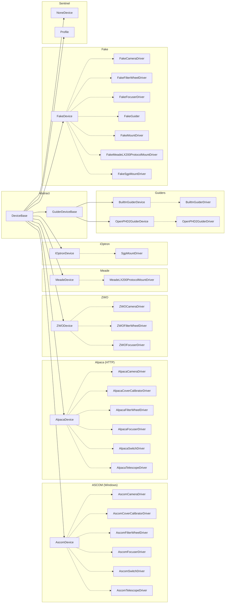

TianWen library
===============

The TianWen library is a comprehensive .NET library designed for astronomical device management and image processing. It includes features for handling various devices, profiles, and image analysis.

## Features

- **Device Management**: 
  - Supports various device types such as Camera, Mount, Focuser, FilterWheel, Switch, and more.
  - Provides interfaces for device drivers and serial connections.
  - Includes a profile virtual device for managing device descriptors.

- **Profile Management**:
  - Create and manage profiles.
  - Serialize and deserialize profiles using JSON.
  - List existing profiles from a directory.

- **Image Processing**:
  - Read and write FITS files.
  - Analyze images to find stars and calculate metrics like HFD, FWHM, SNR, and flux.
  - Generate image histograms and background levels.
  - Debayer OSC images (AHD, bilinear) to color or synthetic luminance.
  - Scale-invariant star detection works on both raw ADU and normalized [0,1] images.

- **FITS Viewer** (`TianWen.UI.FitsViewer`):
  - GPU-accelerated stretch (MTF) with per-channel, linked, and luma modes.
  - HDR compression via Hermite soft-knee in the GLSL shader.
  - Automatic star detection with HFD-sized overlay circles and status bar metrics.
  - Contrast boost with star-masked background estimation for clean nebula enhancement.
  - WCS coordinate grid overlay with RA/Dec labels.
  - Celestial object annotation overlay (NGC, IC, Messier, etc.) when plate-solved.
  - Per-channel histogram overlay (R/G/B colored) with log/linear scale toggle and stretch-aware bin remapping.
  - Plate solving via ASTAP or astrometry.net.

- **External Integration**:
  - Interfaces for external operations such as logging, `TimeProvider` based time management, and file management.
  - Connect to external guider software using JSON-RPC over TCP.

## Device Architecture

Devices are URI-addressed records that act as factories for their corresponding drivers via `NewInstanceFromDevice`. The hierarchy is rooted at `DeviceBase`:



> Solid arrows = inheritance, dashed arrows = instantiates driver via `NewInstanceFromDevice`.

## Installation

### Library

You can install the TianWen library via NuGet:

```bash
dotnet add package TianWen.Lib
```

### CLI

Pre-built native AOT binaries of `TianWen.Lib.CLI` are available from [GitHub Releases](https://github.com/SharpAstro/tianwen/releases):

| Platform | Architecture | Artifact |
|----------|-------------|----------|
| Windows  | x64         | `tianwen-cli-win-x64.tar.gz` |
| Windows  | ARM64       | `tianwen-cli-win-arm64.tar.gz` |
| Linux    | x64         | `tianwen-cli-linux-x64.tar.gz` |
| Linux    | ARM64       | `tianwen-cli-linux-arm64.tar.gz` |
| macOS    | x64         | `tianwen-cli-osx-x64.tar.gz` |
| macOS    | ARM64       | `tianwen-cli-osx-arm64.tar.gz` |

### FITS Viewer

Pre-built native AOT binaries of `TianWen.UI.FitsViewer` are available from [GitHub Releases](https://github.com/SharpAstro/tianwen/releases):

| Platform | Architecture | Artifact |
|----------|-------------|----------|
| Windows  | x64         | `tianwen-fits-viewer-win-x64.tar.gz` |
| Windows  | ARM64       | `tianwen-fits-viewer-win-arm64.tar.gz` |
| Linux    | x64         | `tianwen-fits-viewer-linux-x64.tar.gz` |
| Linux    | ARM64       | `tianwen-fits-viewer-linux-arm64.tar.gz` |
| macOS    | x64         | `tianwen-fits-viewer-osx-x64.tar.gz` |
| macOS    | ARM64       | `tianwen-fits-viewer-osx-arm64.tar.gz` |

#### Keyboard Shortcuts

| Key | Action |
|-----|--------|
| T | Cycle stretch mode (none / per-channel / luma) |
| S | Toggle star overlay |
| C | Cycle channel display |
| D | Cycle debayer algorithm |
| V | Toggle histogram overlay |
| Shift+V | Toggle histogram log scale |
| F / Ctrl+0 | Zoom to fit |
| R / Ctrl+1 | Zoom 1:1 |
| Ctrl+2..9 | Zoom 1:N |
| Mouse wheel | Zoom in viewport |
