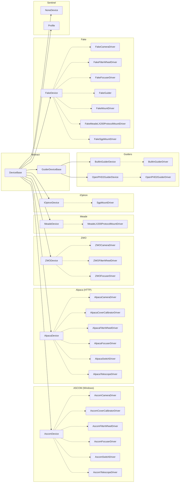
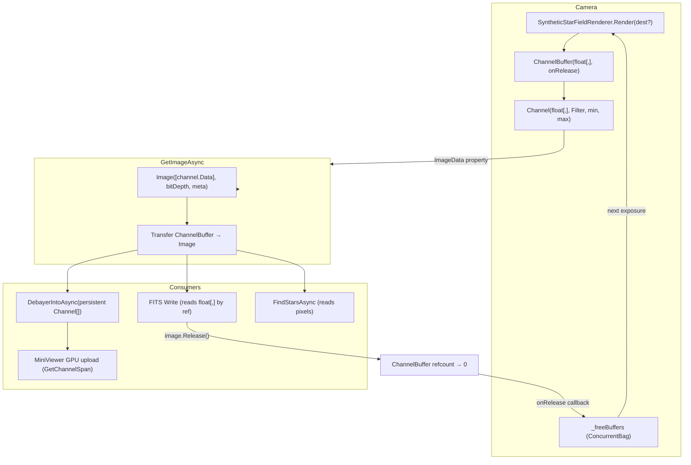

TianWen (天文)
=============

TianWen is a free, open-source astronomical imaging suite for .NET. It manages cameras, mounts, focusers, filter wheels, and guiders via ASCOM, Alpaca, ZWO, and Meade protocols — with first-class support for multi-OTA (dual rig) setups that are difficult or expensive to achieve with existing software.

It ships as a NuGet library (`TianWen.Lib`), a cross-platform CLI with interactive TUI (`TianWen.Lib.CLI`), a standalone FITS viewer (`TianWen.UI.FitsViewer`), and an integrated N.I.N.A.-style GUI (`TianWen.UI.Gui`).

## Features

- **Device Management**: 
  - Supports various device types such as Camera, Mount, Focuser, FilterWheel, Switch, and more.
  - Provides interfaces for device drivers and serial connections.
  - Includes a profile virtual device for managing device descriptors.

- **Profile Management**:
  - Create and manage profiles.
  - Serialize and deserialize profiles using JSON.
  - List existing profiles from a directory.

- **Image Processing**:
  - Read and write FITS files.
  - Analyze images to find stars and calculate metrics like HFD, FWHM, SNR, and flux.
  - Generate image histograms and background levels.
  - Debayer OSC images (AHD, bilinear) to color or synthetic luminance.
  - Scale-invariant star detection works on both raw ADU and normalized [0,1] images.

- **FITS Viewer** (`TianWen.UI.FitsViewer`):
  - GPU-accelerated stretch (MTF) with per-channel, linked, and luma modes.
  - HDR compression via Hermite soft-knee in the GLSL shader.
  - Automatic star detection with HFD-sized overlay circles and status bar metrics.
  - Contrast boost with star-masked background estimation for clean nebula enhancement.
  - WCS coordinate grid overlay with RA/Dec labels.
  - Celestial object annotation overlay (NGC, IC, Messier, etc.) when plate-solved.
  - Per-channel histogram overlay (R/G/B colored) with log/linear scale toggle and stretch-aware bin remapping.
  - Plate solving via ASTAP or astrometry.net.

- **External Integration**:
  - Interfaces for external operations such as logging, `TimeProvider` based time management, and file management.
  - Connect to external guider software using JSON-RPC over TCP.

## Device Architecture

Devices are URI-addressed records that act as factories for their corresponding drivers via `NewInstanceFromDevice`. The hierarchy is rooted at `DeviceBase`:



> Solid arrows = inheritance, dashed arrows = instantiates driver via `NewInstanceFromDevice`.

## Image Pipeline & Buffer Lifecycle

The image pipeline manages `float[,]` pixel data from camera capture through debayer, star detection, FITS writing, and GPU display — with zero-copy buffer reuse to minimize allocations.

### Types

| Type | Kind | Purpose |
|------|------|---------|
| `float[,]` | Raw array | Pixel data in H×W layout. The actual memory being managed. |
| `Channel` | `readonly record struct` | Typed view over a `float[,]` with `Filter`, `MinValue`, `MaxValue`, `Index`. Zero overhead. Returned by `ICameraDriver.ImageData`. |
| `ChannelBuffer` | `sealed class` (internal) | Ref-counted owner of a `float[,]`. When refcount reaches zero, `onRelease` fires → camera recycles the buffer. |
| `Image` | `partial class` | Wraps `float[][,]` (jagged array of channel planes) + `ImageMeta`. Used by star detection, FITS write, plate solve. Holds optional `ChannelBuffer` refs — call `Release()` when done. |
| `Array2DPool<T>` | `static class` | Separate pool for temporary scratch arrays (AHD debayer uses 6 per frame). Not used for camera buffers. |

### Data Flow



### Buffer Lifecycle

1. **First exposure**: `_freeBuffers` is empty → `Render()` allocates a fresh `float[,]`.
2. **`StopExposureCore`**: Wraps the array in `ChannelBuffer(array, onRelease: bag.Add)` and stores as `Channel` in `ImageData`.
3. **`GetImageAsync`**: Builds `Image` from `Channel.Data`, transfers `ChannelBuffer` ownership to the Image, calls `ReleaseImageData()` to clear camera state.
4. **Consumer**: Reads pixel data (debayer, star detection, FITS write). The `float[,]` stays alive because the `Image` holds the `ChannelBuffer` ref.
5. **`image.Release()`**: Decrements `ChannelBuffer` refcount to zero → `onRelease` fires → `float[,]` goes into `_freeBuffers`.
6. **Next exposure**: `StopExposureCore` grabs a buffer from `_freeBuffers` via `TryTake()` and passes it as `dest` to `Render()` → **zero allocation**.

### Viewer Path (Zero-Copy)

The session owns persistent `Channel[]` per telescope (`_viewerChannels`). `DebayerIntoAsync` writes AHD/BilinearMono output directly into these channels — no new `float[,]` allocated per frame. The `MiniViewer` uploads the channel spans to the GPU synchronously via `UploadChannelTexture()` and computes stretch stats inline. No `AstroImageDocument` is created for live preview.

### AHD Debayer Scratch

AHD uses 6 temporary `float[,]` arrays (3 for `debayered`, 3 for `rgbV`). These are rented from `Array2DPool<float>` via `RentScoped()` and returned when the debayer method completes. The output channels (`rgbH`/`filtered`) are the persistent viewer channels — not pooled.

### Guide Camera

The guide camera follows the same `ChannelBuffer` lifecycle. `CaptureGuideFrameAsync` calls `GetImageAsync` → gets an `Image` with transferred `ChannelBuffer`. `GuideLoop.RunAsync` releases the old frame before each new capture. The double-buffer mechanism ensures the camera never overwrites pixel data still being read by the viewer.

## Installation

### Library

You can install the TianWen library via NuGet:

```bash
dotnet add package TianWen.Lib
```

### CLI

Pre-built native AOT binaries of `TianWen.Lib.CLI` are available from [GitHub Releases](https://github.com/SharpAstro/tianwen/releases):

| Platform | Architecture | Artifact |
|----------|-------------|----------|
| Windows  | x64         | `tianwen-cli-win-x64.tar.gz` |
| Windows  | ARM64       | `tianwen-cli-win-arm64.tar.gz` |
| Linux    | x64         | `tianwen-cli-linux-x64.tar.gz` |
| Linux    | ARM64       | `tianwen-cli-linux-arm64.tar.gz` |
| macOS    | x64         | `tianwen-cli-osx-x64.tar.gz` |
| macOS    | ARM64       | `tianwen-cli-osx-arm64.tar.gz` |

### CLI Reference

The `tianwen` CLI (`TianWen.Lib.CLI`) provides non-interactive commands and a full-screen tabbed TUI (`tianwen tui`).

#### Global Options

| Option | Description |
|--------|-------------|
| `-a`, `--active <name>` | Select active profile by name or ID |
| `<path>` | FITS file or directory to view (shorthand for `view <path>`) |

#### Profile Management

```
tianwen profile list                           # List all profiles
tianwen profile create <name>                  # Create empty profile
tianwen profile delete <nameOrId>              # Delete a profile
```

#### Profile — Mount & Site

```
tianwen profile set-mount <deviceId>           # Set the mount device
tianwen profile set-site --lat 48.2 --lon 16.3 [--elevation 200]
                                               # Set observing site location
tianwen profile set-mount-port --port COM3 [--baud 9600]
                                               # Set serial port/baud on mount
```

#### Profile — Guider

```
tianwen profile set-guider <deviceId>          # Set the guider (PHD2 or built-in)
tianwen profile set-guider-camera <deviceId>   # Set dedicated guider camera
tianwen profile set-guider-focuser <deviceId>  # Set guider focuser
tianwen profile set-oag-ota <index>            # Set which OTA hosts the OAG
tianwen profile set-guider-options [--pulse-guide-source Auto|Camera|Mount]
                                  [--reverse-dec-after-flip true|false]
```

#### Profile — OTA (Optical Tube Assembly)

```
tianwen profile add-ota <name> --focal-length <mm> --camera <deviceId>
    [--focuser <id>] [--filter-wheel <id>] [--cover <id>]
    [--aperture <mm>] [--optical-design Refractor|Newtonian|SCT|...]
tianwen profile remove-ota <index>
tianwen profile update-ota <index> [--name <name>] [--focal-length <mm>]
    [--aperture <mm>] [--optical-design <design>]
    [--prefer-outward true|false] [--outward-is-positive true|false]
```

#### Profile — Camera & Filters

```
tianwen profile set-camera-defaults --ota <N> [--gain <N>] [--offset <N>]
tianwen profile set-filters --ota <N> --filters Luminance:0 Ha:+21 OIII:-3 SII:+25
```

Filter specs are `Name:FocusOffset` pairs. Offset is in focuser steps relative to the
reference filter (typically Luminance=0).

#### Profile — Quick Device Add

```
tianwen profile add <deviceId> [--ota <N>]     # Add device by type auto-detection
```

#### Device Discovery

```
tianwen device list                             # List cached devices
tianwen device discover                         # Force rediscovery
```

#### FITS Viewer (Terminal)

```
tianwen view <path>                             # Render to terminal (Sixel or ASCII)
tianwen <path>                                  # Shorthand for view <path>
```

#### Observation Planner

```
tianwen plan                                    # Tonight's best targets (requires profile)
```

#### Interactive TUI

```
tianwen tui                                     # Full-screen tabbed TUI (alternate screen)
```

The TUI provides an Equipment tab, Planner with altitude charts, Session configuration,
Live Session monitor with Sixel preview, and Guider tab with Braille target view.

#### Example: Building a Dual-Scope Rig

```bash
tianwen profile create "Dual Scope"
tianwen -a "Dual Scope" profile set-mount FakeMount1
tianwen -a "Dual Scope" profile set-site --lat 48.2 --lon 16.3 --elevation 200
tianwen -a "Dual Scope" profile set-guider FakeGuider1
tianwen -a "Dual Scope" profile set-guider-camera FakeCamera1

# OTA 0: widefield
tianwen -a "Dual Scope" profile add-ota "Samyang 135" \
    --focal-length 135 --camera FakeCamera1 --focuser FakeFocuser1
tianwen -a "Dual Scope" profile set-camera-defaults --ota 0 --gain 100

# OTA 1: narrowband with filter wheel
tianwen -a "Dual Scope" profile add-ota "RC8" \
    --focal-length 1625 --camera FakeCamera2 --focuser FakeFocuser2 \
    --filter-wheel FakeFilterWheel1 --aperture 203 --optical-design Astrograph
tianwen -a "Dual Scope" profile set-filters --ota 1 \
    --filters Luminance:0 Ha:+21 OIII:-3 SII:+25 R:+20 G:0 B:-15
tianwen -a "Dual Scope" profile set-camera-defaults --ota 1 --gain 120 --offset 10

# Plan tonight's observations
tianwen -a "Dual Scope" plan
```

### FITS Viewer

Pre-built native AOT binaries of `TianWen.UI.FitsViewer` are available from [GitHub Releases](https://github.com/SharpAstro/tianwen/releases):

| Platform | Architecture | Artifact |
|----------|-------------|----------|
| Windows  | x64         | `tianwen-fits-viewer-win-x64.tar.gz` |
| Windows  | ARM64       | `tianwen-fits-viewer-win-arm64.tar.gz` |
| Linux    | x64         | `tianwen-fits-viewer-linux-x64.tar.gz` |
| Linux    | ARM64       | `tianwen-fits-viewer-linux-arm64.tar.gz` |
| macOS    | x64         | `tianwen-fits-viewer-osx-x64.tar.gz` |
| macOS    | ARM64       | `tianwen-fits-viewer-osx-arm64.tar.gz` |

#### Keyboard Shortcuts

| Key | Action |
|-----|--------|
| T | Cycle stretch mode (none / per-channel / luma) |
| S | Toggle star overlay |
| C | Cycle channel display |
| D | Cycle debayer algorithm |
| V | Toggle histogram overlay |
| Shift+V | Toggle histogram log scale |
| F / Ctrl+0 | Zoom to fit |
| R / Ctrl+1 | Zoom 1:1 |
| Ctrl+2..9 | Zoom 1:N |
| Mouse wheel | Zoom in viewport |

### Interactive TUI (`tianwen -i`)

The interactive TUI provides a tabbed interface for the full imaging workflow:

| Tab | Key | Description |
|-----|-----|-------------|
| Equipment | 1 / F1 | Profile management, device discovery, OTA/filter configuration |
| Planner | 2 / F2 | Tonight's best targets with altitude chart, handoff sliders, scheduling |
| Session | 3 / F3 | Session configuration (cooling, guiding, horizon, focus), per-OTA camera settings |
| Live | 4 / F4 | Live session monitor: exposure progress, cooler sparklines, mount status, Sixel image preview |
| Guider | 5 / F5 | Guide error sparklines (RA/Dec), RMS stats, settle progress |

The live session tab includes a real-time Sixel image preview with viewer controls:

| Key | Action |
|-----|--------|
| T | Cycle stretch mode (None / Unlinked / Linked / Luma) |
| B | Cycle curves boost |
| +/- | Cycle stretch parameter presets |
| F | Zoom to fit |
| R | Zoom 1:1 |
| Escape | Abort session (with confirmation) |

### GUI (`TianWen.UI.Gui`)

The integrated GUI provides a N.I.N.A.-style interface with GPU-accelerated Vulkan rendering,
including all the same tabs as the TUI plus a full FITS image viewer with real-time stretch,
star overlay, WCS grid, and histogram.
