# Device Architecture

> Device model deep-dive (moved out of the top-level README to keep it focused). See also [`docs/plans/`](../plans/) and CLAUDE.md.

Devices are URI-addressed records that act as factories for their corresponding drivers via `NewInstanceFromDevice`. The hierarchy is rooted at `DeviceBase`:

```mermaid
graph LR
    subgraph Abstract
        DeviceBase
        GuiderDeviceBase
    end

    subgraph "ASCOM (Windows)"
        AscomDevice
        AscomCameraDriver
        AscomCoverCalibratorDriver
        AscomFilterWheelDriver
        AscomFocuserDriver
        AscomSwitchDriver
        AscomTelescopeDriver
    end

    subgraph "Alpaca (HTTP)"
        AlpacaDevice
        AlpacaCameraDriver
        AlpacaCoverCalibratorDriver
        AlpacaFilterWheelDriver
        AlpacaFocuserDriver
        AlpacaSwitchDriver
        AlpacaTelescopeDriver
    end

    subgraph ZWO
        ZWODevice
        ZWOCameraDriver
        ZWOFilterWheelDriver
        ZWOFocuserDriver
    end

    subgraph QHYCCD
        QHYDevice
        QHYCameraDriver
        QHYCameraControlledFilterWheelDriver
        QHYSerialControlledFilterWheelDriver
        QHYFocuserDriver
    end

    subgraph Gemini
        GeminiDevice
        GeminiFlatPanelDriver
        GeminiFocuserDevice
        GeminiFocuserDriver
    end

    subgraph Meade
        MeadeDevice
        MeadeLX200ProtocolMountDriver
    end

    subgraph iOptron
        IOptronDevice
        SgpMountDriver
    end

    subgraph OnStep
        OnStepDevice
        OnStepMountDriver
    end

    subgraph Skywatcher
        SkywatcherDevice
        SkywatcherMountDriver
    end

    subgraph Guiders
        BuiltInGuiderDevice
        BuiltInGuiderDriver
        OpenPHD2GuiderDevice
        OpenPHD2GuiderDriver
    end

    subgraph Fake
        FakeDevice
        FakeCameraDriver
        FakeFilterWheelDriver
        FakeFocuserDriver
        FakeGuider
        FakeMountDriver
        FakeMeadeLX200ProtocolMountDriver
        FakeSgpMountDriver
    end

    subgraph Sentinel
        NoneDevice
        Profile
    end

    DeviceBase --> AscomDevice
    DeviceBase --> AlpacaDevice
    DeviceBase --> ZWODevice
    DeviceBase --> QHYDevice
    DeviceBase --> GeminiDevice
    DeviceBase --> GeminiFocuserDevice
    DeviceBase --> MeadeDevice
    DeviceBase --> IOptronDevice
    DeviceBase --> OnStepDevice
    DeviceBase --> SkywatcherDevice
    DeviceBase --> FakeDevice
    DeviceBase --> NoneDevice
    DeviceBase --> Profile
    DeviceBase --> GuiderDeviceBase
    GuiderDeviceBase --> BuiltInGuiderDevice
    GuiderDeviceBase --> OpenPHD2GuiderDevice

    AscomDevice -.-> AscomCameraDriver
    AscomDevice -.-> AscomCoverCalibratorDriver
    AscomDevice -.-> AscomFilterWheelDriver
    AscomDevice -.-> AscomFocuserDriver
    AscomDevice -.-> AscomSwitchDriver
    AscomDevice -.-> AscomTelescopeDriver

    AlpacaDevice -.-> AlpacaCameraDriver
    AlpacaDevice -.-> AlpacaCoverCalibratorDriver
    AlpacaDevice -.-> AlpacaFilterWheelDriver
    AlpacaDevice -.-> AlpacaFocuserDriver
    AlpacaDevice -.-> AlpacaSwitchDriver
    AlpacaDevice -.-> AlpacaTelescopeDriver

    ZWODevice -.-> ZWOCameraDriver
    ZWODevice -.-> ZWOFilterWheelDriver
    ZWODevice -.-> ZWOFocuserDriver

    QHYDevice -.-> QHYCameraDriver
    QHYDevice -.-> QHYCameraControlledFilterWheelDriver
    QHYDevice -.-> QHYSerialControlledFilterWheelDriver
    QHYDevice -.-> QHYFocuserDriver

    GeminiDevice -.-> GeminiFlatPanelDriver
    GeminiFocuserDevice -.-> GeminiFocuserDriver

    MeadeDevice -.-> MeadeLX200ProtocolMountDriver
    IOptronDevice -.-> SgpMountDriver
    OnStepDevice -.-> OnStepMountDriver
    SkywatcherDevice -.-> SkywatcherMountDriver

    BuiltInGuiderDevice -.-> BuiltInGuiderDriver
    OpenPHD2GuiderDevice -.-> OpenPHD2GuiderDriver

    FakeDevice -.-> FakeCameraDriver
    FakeDevice -.-> FakeFilterWheelDriver
    FakeDevice -.-> FakeFocuserDriver
    FakeDevice -.-> FakeGuider
    FakeDevice -.-> FakeMountDriver
    FakeDevice -.-> FakeMeadeLX200ProtocolMountDriver
    FakeDevice -.-> FakeSgpMountDriver
```

> Solid arrows = inheritance, dashed arrows = instantiates driver via `NewInstanceFromDevice`.
