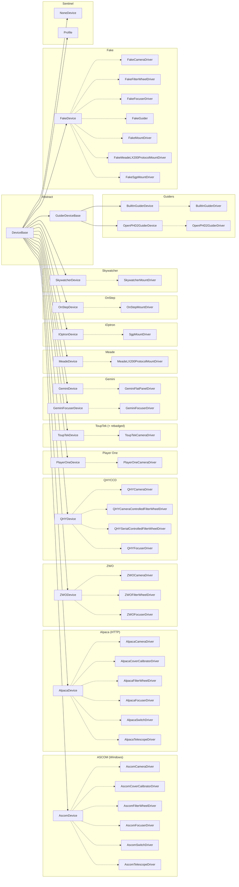

# Device Architecture

> Device model deep-dive (moved out of the top-level README to keep it focused). See also [`docs/plans/`](../plans/) and CLAUDE.md.

Devices are URI-addressed records that act as factories for their corresponding drivers via `NewInstanceFromDevice`. The hierarchy is rooted at `DeviceBase`:

```mermaid
graph LR
    subgraph Abstract
        DeviceBase
        GuiderDeviceBase
    end

    subgraph "ASCOM (Windows)"
        AscomDevice
        AscomCameraDriver
        AscomCoverCalibratorDriver
        AscomFilterWheelDriver
        AscomFocuserDriver
        AscomSwitchDriver
        AscomTelescopeDriver
    end

    subgraph "Alpaca (HTTP)"
        AlpacaDevice
        AlpacaCameraDriver
        AlpacaCoverCalibratorDriver
        AlpacaFilterWheelDriver
        AlpacaFocuserDriver
        AlpacaSwitchDriver
        AlpacaTelescopeDriver
    end

    subgraph ZWO
        ZWODevice
        ZWOCameraDriver
        ZWOFilterWheelDriver
        ZWOFocuserDriver
    end

    subgraph QHYCCD
        QHYDevice
        QHYCameraDriver
        QHYCameraControlledFilterWheelDriver
        QHYSerialControlledFilterWheelDriver
        QHYFocuserDriver
    end

    subgraph "Player One"
        PlayerOneDevice
        PlayerOneCameraDriver
    end

    subgraph "ToupTek (+ rebadged)"
        ToupTekDevice
        ToupTekCameraDriver
    end

    subgraph Gemini
        GeminiDevice
        GeminiFlatPanelDriver
        GeminiFocuserDevice
        GeminiFocuserDriver
    end

    subgraph Meade
        MeadeDevice
        MeadeLX200ProtocolMountDriver
    end

    subgraph iOptron
        IOptronDevice
        SgpMountDriver
    end

    subgraph OnStep
        OnStepDevice
        OnStepMountDriver
    end

    subgraph Skywatcher
        SkywatcherDevice
        SkywatcherMountDriver
    end

    subgraph Guiders
        BuiltInGuiderDevice
        BuiltInGuiderDriver
        OpenPHD2GuiderDevice
        OpenPHD2GuiderDriver
    end

    subgraph Fake
        FakeDevice
        FakeCameraDriver
        FakeFilterWheelDriver
        FakeFocuserDriver
        FakeGuider
        FakeMountDriver
        FakeMeadeLX200ProtocolMountDriver
        FakeSgpMountDriver
    end

    subgraph Sentinel
        NoneDevice
        Profile
    end

    DeviceBase --> AscomDevice
    DeviceBase --> AlpacaDevice
    DeviceBase --> ZWODevice
    DeviceBase --> QHYDevice
    DeviceBase --> PlayerOneDevice
    DeviceBase --> ToupTekDevice
    DeviceBase --> GeminiDevice
    DeviceBase --> GeminiFocuserDevice
    DeviceBase --> MeadeDevice
    DeviceBase --> IOptronDevice
    DeviceBase --> OnStepDevice
    DeviceBase --> SkywatcherDevice
    DeviceBase --> FakeDevice
    DeviceBase --> NoneDevice
    DeviceBase --> Profile
    DeviceBase --> GuiderDeviceBase
    GuiderDeviceBase --> BuiltInGuiderDevice
    GuiderDeviceBase --> OpenPHD2GuiderDevice

    AscomDevice -.-> AscomCameraDriver
    AscomDevice -.-> AscomCoverCalibratorDriver
    AscomDevice -.-> AscomFilterWheelDriver
    AscomDevice -.-> AscomFocuserDriver
    AscomDevice -.-> AscomSwitchDriver
    AscomDevice -.-> AscomTelescopeDriver

    AlpacaDevice -.-> AlpacaCameraDriver
    AlpacaDevice -.-> AlpacaCoverCalibratorDriver
    AlpacaDevice -.-> AlpacaFilterWheelDriver
    AlpacaDevice -.-> AlpacaFocuserDriver
    AlpacaDevice -.-> AlpacaSwitchDriver
    AlpacaDevice -.-> AlpacaTelescopeDriver

    ZWODevice -.-> ZWOCameraDriver
    ZWODevice -.-> ZWOFilterWheelDriver
    ZWODevice -.-> ZWOFocuserDriver

    QHYDevice -.-> QHYCameraDriver
    QHYDevice -.-> QHYCameraControlledFilterWheelDriver
    QHYDevice -.-> QHYSerialControlledFilterWheelDriver
    QHYDevice -.-> QHYFocuserDriver

    PlayerOneDevice -.-> PlayerOneCameraDriver
    ToupTekDevice -.-> ToupTekCameraDriver

    GeminiDevice -.-> GeminiFlatPanelDriver
    GeminiFocuserDevice -.-> GeminiFocuserDriver

    MeadeDevice -.-> MeadeLX200ProtocolMountDriver
    IOptronDevice -.-> SgpMountDriver
    OnStepDevice -.-> OnStepMountDriver
    SkywatcherDevice -.-> SkywatcherMountDriver

    BuiltInGuiderDevice -.-> BuiltInGuiderDriver
    OpenPHD2GuiderDevice -.-> OpenPHD2GuiderDriver

    FakeDevice -.-> FakeCameraDriver
    FakeDevice -.-> FakeFilterWheelDriver
    FakeDevice -.-> FakeFocuserDriver
    FakeDevice -.-> FakeGuider
    FakeDevice -.-> FakeMountDriver
    FakeDevice -.-> FakeMeadeLX200ProtocolMountDriver
    FakeDevice -.-> FakeSgpMountDriver
```

> Solid arrows = inheritance, dashed arrows = instantiates driver via `NewInstanceFromDevice`.

## Native serial protocols

The drivers TianWen speaks a device's own wire protocol to, with no ASCOM, Alpaca or vendor SDK in
between. Each has one architecture document: the framing, the commands, the connect handshake,
discovery, the fake, and a mapping from every driver member to the wire, including what the member
does when the device is connected and does not answer.

| Device | Document | Driver code | Transports |
|---|---|---|---|
| Meade LX200 (the base OnStep extends) | [`lx200-protocol.md`](lx200-protocol.md) | `Devices/MeadeLX200ProtocolMountDriverBase.cs`, `Devices/Meade/` | serial |
| OnStep / OnStepX | [`onstep-protocol.md`](onstep-protocol.md) | `Devices/OnStep/` | serial, TCP over WiFi (`Connections/TcpSerialConnection.cs`) |
| Skywatcher motor controller | [`skywatcher-protocol.md`](skywatcher-protocol.md) | `Devices/Skywatcher/` | serial, UDP over WiFi (`SkywatcherUdpConnection`) |
| iOptron SkyGuider Pro | [`sgp-protocol.md`](sgp-protocol.md) | `Devices/IOptron/` | serial |
| Gemini Focuser Pro | [`gemini-focuser-pro-protocol.md`](gemini-focuser-pro-protocol.md) | `Devices/Gemini/GeminiFocuser*.cs` | USB serial |
| Gemini FlatPanel Lite | [`gemini-flatpanel-lite-protocol.md`](gemini-flatpanel-lite-protocol.md) | `Devices/Gemini/GeminiFlatPanel*.cs` | USB serial |

All of them share the transport in `Connections/` (`ISerialConnection`, `SerialConnectionBase`'s read
helpers, `SerialConnection` for COM ports) and one rule from [`driver-resilience.md`](driver-resilience.md):
**a read the device did not answer throws a transient exception, never a value**, because the
session's retry and reconnect layer only ever sees exceptions. Where a driver still breaks that rule,
its document says so and #810 tracks the fix. A new native driver gets its document with its first
commit, not after.

## ToupTek: one binding for eleven libraries

`ToupTekDevice` covers ToupTek and the ten brands that ship the same SDK under their own library and
function prefix (Altair, Bresser, MallinCam, Nn, OGMAVision, Omegon, Orion, Teleskop Service, SVBONY's
ToupTek line, Meade). `ToupTek.SDK` resolves each brand's entry points at run time from its own library
handle, so a rebadged camera works wherever its library sits beside the app; only ToupTek's natives ship
in the package, and only a ToupTek body (G3M678M) has been verified. A camera enumerated by two brand
libraries is listed once, keyed by serial: the SDK's own id is a USB device PATH and names a port. The
device source shows a rebadged body under its brand name. ToupTek's own ASCOM driver
(`ASCOM.ToupTek.Camera1..3`) is hidden by `NativeDriverBlacklist` when the native camera is found,
because both opening one body fails the second with `E_BUSY`.

The binding's design notes (why the DAL struct keys into a session registry, the software-trigger
capture, the left-aligned 12-bit pixels, the Windows upside-down default, the frame-rate table and the
video-mode stall that `INativeDeviceInfo.ResetDevice` recovers) are in the ToupTek.SDK README.
