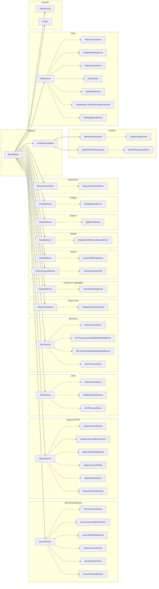

# Device Architecture

> Device model deep-dive (moved out of the top-level README to keep it focused). See also [`docs/plans/`](../plans/) and CLAUDE.md.

Devices are URI-addressed records that act as factories for their corresponding drivers via `NewInstanceFromDevice`. The hierarchy is rooted at `DeviceBase`:

```mermaid
graph LR
    subgraph Abstract
        DeviceBase
        GuiderDeviceBase
    end

    subgraph "ASCOM (Windows)"
        AscomDevice
        AscomCameraDriver
        AscomCoverCalibratorDriver
        AscomFilterWheelDriver
        AscomFocuserDriver
        AscomSwitchDriver
        AscomTelescopeDriver
    end

    subgraph "Alpaca (HTTP)"
        AlpacaDevice
        AlpacaCameraDriver
        AlpacaCoverCalibratorDriver
        AlpacaFilterWheelDriver
        AlpacaFocuserDriver
        AlpacaSwitchDriver
        AlpacaTelescopeDriver
    end

    subgraph ZWO
        ZWODevice
        ZWOCameraDriver
        ZWOFilterWheelDriver
        ZWOFocuserDriver
    end

    subgraph QHYCCD
        QHYDevice
        QHYCameraDriver
        QHYCameraControlledFilterWheelDriver
        QHYSerialControlledFilterWheelDriver
        QHYFocuserDriver
    end

    subgraph "Player One"
        PlayerOneDevice
        PlayerOneCameraDriver
    end

    subgraph "ToupTek (+ rebadged)"
        ToupTekDevice
        ToupTekCameraDriver
    end

    subgraph Gemini
        GeminiDevice
        GeminiFlatPanelDriver
        GeminiFocuserDevice
        GeminiFocuserDriver
    end

    subgraph Meade
        MeadeDevice
        MeadeLX200ProtocolMountDriver
    end

    subgraph iOptron
        IOptronDevice
        SgpMountDriver
    end

    subgraph OnStep
        OnStepDevice
        OnStepMountDriver
    end

    subgraph Skywatcher
        SkywatcherDevice
        SkywatcherMountDriver
    end

    subgraph Guiders
        BuiltInGuiderDevice
        BuiltInGuiderDriver
        OpenPHD2GuiderDevice
        OpenPHD2GuiderDriver
    end

    subgraph Fake
        FakeDevice
        FakeCameraDriver
        FakeFilterWheelDriver
        FakeFocuserDriver
        FakeGuider
        FakeMountDriver
        FakeMeadeLX200ProtocolMountDriver
        FakeSgpMountDriver
    end

    subgraph Sentinel
        NoneDevice
        Profile
    end

    DeviceBase --> AscomDevice
    DeviceBase --> AlpacaDevice
    DeviceBase --> ZWODevice
    DeviceBase --> QHYDevice
    DeviceBase --> PlayerOneDevice
    DeviceBase --> ToupTekDevice
    DeviceBase --> GeminiDevice
    DeviceBase --> GeminiFocuserDevice
    DeviceBase --> MeadeDevice
    DeviceBase --> IOptronDevice
    DeviceBase --> OnStepDevice
    DeviceBase --> SkywatcherDevice
    DeviceBase --> FakeDevice
    DeviceBase --> NoneDevice
    DeviceBase --> Profile
    DeviceBase --> GuiderDeviceBase
    GuiderDeviceBase --> BuiltInGuiderDevice
    GuiderDeviceBase --> OpenPHD2GuiderDevice

    AscomDevice -.-> AscomCameraDriver
    AscomDevice -.-> AscomCoverCalibratorDriver
    AscomDevice -.-> AscomFilterWheelDriver
    AscomDevice -.-> AscomFocuserDriver
    AscomDevice -.-> AscomSwitchDriver
    AscomDevice -.-> AscomTelescopeDriver

    AlpacaDevice -.-> AlpacaCameraDriver
    AlpacaDevice -.-> AlpacaCoverCalibratorDriver
    AlpacaDevice -.-> AlpacaFilterWheelDriver
    AlpacaDevice -.-> AlpacaFocuserDriver
    AlpacaDevice -.-> AlpacaSwitchDriver
    AlpacaDevice -.-> AlpacaTelescopeDriver

    ZWODevice -.-> ZWOCameraDriver
    ZWODevice -.-> ZWOFilterWheelDriver
    ZWODevice -.-> ZWOFocuserDriver

    QHYDevice -.-> QHYCameraDriver
    QHYDevice -.-> QHYCameraControlledFilterWheelDriver
    QHYDevice -.-> QHYSerialControlledFilterWheelDriver
    QHYDevice -.-> QHYFocuserDriver

    PlayerOneDevice -.-> PlayerOneCameraDriver
    ToupTekDevice -.-> ToupTekCameraDriver

    GeminiDevice -.-> GeminiFlatPanelDriver
    GeminiFocuserDevice -.-> GeminiFocuserDriver

    MeadeDevice -.-> MeadeLX200ProtocolMountDriver
    IOptronDevice -.-> SgpMountDriver
    OnStepDevice -.-> OnStepMountDriver
    SkywatcherDevice -.-> SkywatcherMountDriver

    BuiltInGuiderDevice -.-> BuiltInGuiderDriver
    OpenPHD2GuiderDevice -.-> OpenPHD2GuiderDriver

    FakeDevice -.-> FakeCameraDriver
    FakeDevice -.-> FakeFilterWheelDriver
    FakeDevice -.-> FakeFocuserDriver
    FakeDevice -.-> FakeGuider
    FakeDevice -.-> FakeMountDriver
    FakeDevice -.-> FakeMeadeLX200ProtocolMountDriver
    FakeDevice -.-> FakeSgpMountDriver
```

> Solid arrows = inheritance, dashed arrows = instantiates driver via `NewInstanceFromDevice`.

## Native serial protocols

The drivers TianWen speaks a device's own wire protocol to, with no ASCOM, Alpaca or vendor SDK in
between. Each has one architecture document: the framing, the commands, the connect handshake,
discovery, the fake, and a mapping from every driver member to the wire, including what the member
does when the device is connected and does not answer.

| Device | Document | Driver code | Transports |
|---|---|---|---|
| Meade LX200 (the base OnStep extends) | [`lx200-protocol.md`](lx200-protocol.md) | `Devices/MeadeLX200ProtocolMountDriverBase.cs`, `Devices/Meade/` | serial |
| OnStep / OnStepX | [`onstep-protocol.md`](onstep-protocol.md) | `Devices/OnStep/` | serial, TCP over WiFi (`Connections/TcpSerialConnection.cs`) |
| Skywatcher motor controller | [`skywatcher-protocol.md`](skywatcher-protocol.md) | `Devices/Skywatcher/` | serial, UDP over WiFi (`SkywatcherUdpConnection`) |
| iOptron SkyGuider Pro | [`sgp-protocol.md`](sgp-protocol.md) | `Devices/IOptron/` | serial |
| Gemini Focuser Pro | [`gemini-focuser-pro-protocol.md`](gemini-focuser-pro-protocol.md) | `Devices/Gemini/GeminiFocuser*.cs` | USB serial |
| Gemini FlatPanel Lite | [`gemini-flatpanel-lite-protocol.md`](gemini-flatpanel-lite-protocol.md) | `Devices/Gemini/GeminiFlatPanel*.cs` | USB serial |

All of them share the transport in `Connections/` (`ISerialConnection`, and `SerialConnection` for COM ports,
an adapter over the Serial.Lib sibling, docs/plans/serial-lib.md) and one rule from [`driver-resilience.md`](driver-resilience.md):
**a read the device did not answer throws a transient exception, never a value**, because the
session's retry and reconnect layer only ever sees exceptions. Where a driver still breaks that rule,
its document says so and #810 tracks the fix. A new native driver gets its document with its first
commit, not after.

## ToupTek: one binding for eleven libraries

`ToupTekDevice` covers ToupTek and the ten brands that ship the same SDK under their own library and
function prefix (Altair, Bresser, MallinCam, Nn, OGMAVision, Omegon, Orion, Teleskop Service, SVBONY's
ToupTek line, Meade). `ToupTek.SDK` resolves each brand's entry points at run time from its own library
handle, so a rebadged camera works wherever its library sits beside the app; only ToupTek's natives ship
in the package, and only a ToupTek body (G3M678M) has been verified. A camera enumerated by two brand
libraries is listed once, keyed by serial: the SDK's own id is a USB device PATH and names a port. The
device source shows a rebadged body under its brand name. ToupTek's own ASCOM driver
(`ASCOM.ToupTek.Camera1..3`) is hidden by `NativeDriverBlacklist` when the native camera is found,
because both opening one body fails the second with `E_BUSY`.

The binding's design notes (why the DAL struct keys into a session registry, the software-trigger
capture, the left-aligned 12-bit pixels, the Windows upside-down default, the frame-rate table and the
video-mode stall that `INativeDeviceInfo.ResetDevice` recovers) are in the ToupTek.SDK README.

## Device management rules (moved from CLAUDE.md, 2026-09-29)

URI-addressed: `DeviceBase` (URI identity), `IDeviceSource<T>` (driver backends),
`ICombinedDeviceManager` (coordinates sources), `IDeviceUriRegistry` (URI → instance map).
Each subclass reads query keys (`?key=value`) defined in `DeviceQueryKey`. See class XML doc comments
for supported keys. Full driver hierarchy (ASCOM / Alpaca / ZWO / QHY / native-serial subgraphs):
`docs/architecture/device-architecture.md`.

**Every native serial protocol has ONE architecture document** (LX200, OnStep, Skywatcher, SGP and
both Gemini devices, indexed under "Native serial protocols" in that file), and a new native driver
ships with its document in its first commit: OnStep went without one for five months and its wire
notes survived only in a commit message. Each maps every driver member to the wire, including what
it does when the device is connected and does not answer, which must be a transient THROW (#810).

**A node holds ONE driver per device, and a driver's connect is all or nothing (#806).** `DeviceHub` runs one
connect, adoption or disconnect of a device at a time (a gate per device key), so two at once (a session's
initialisation and an Alpaca `Connected=true`) leave one driver and hand both callers it. A driver the hub holds
that went down is RECONNECTED, the same instance, while its URI is unchanged, since a run still holds it and its
resilient calls reconnect it; only a changed URI under the same key builds a new one, and never while a run leases
the device (session end mirrors `focuserBacklashIn`/`Out` into a focuser's query). A changed URI under the same key
only ever happens for a family whose key survives a re-plug (see "Device keys by family" below).
`DeviceDriverBase` runs one connect or disconnect at a time per driver, and a connect whose transport will not
open, or whose `InitDeviceAsync` returns `false` or throws, closes what it opened and throws, leaving the driver
not connected: it used to read `Connected` after a refused init, so the retry skipped init and the disconnect had
no connection id to close. Pinned by `DeviceDriverConnectionTests` and `DeviceHubAdoptionTests`.

**A vendor's native binaries reach an app through the REFERENCE GRAPH, and nothing downstream can
filter them out.** The ZWO and QHYCCD drivers therefore live in `TianWen.Devices.Native`, not in
`TianWen.Lib`: an SDK project marks its natives `CopyToOutputDirectory` deliberately (a
`runtimes/<rid>/native` layout is a NuGet mechanism a `ProjectReference` does not honour), MSBuild
propagates that to every transitive consumer, and trimming cannot undo it because it reasons about
MANAGED reachability while a native library is an opaque blob a `DllImport` may resolve by name at run
time. Not calling `AddZWO()` changes nothing; only not referencing does. The viewer shipped 8.2 MB of
camera, focuser and filter-wheel drivers to the Store this way. **Namespaces stayed
`TianWen.Lib.Devices.*` / `TianWen.Lib.Extensions` on purpose** (a deployment split, not an API
redesign), so the assembly name and the namespace root differ; the drivers stay `internal` and see
Lib's internals through `InternalsVisibleTo` rather than the DAL abstraction being promoted to public
API. Only the process that drives hardware references the project, and since P6 (#936) that is `tianwen-server`
alone: the GUI, the CLI (the TUI with it) and `tianwen-fits` must NOT, and neither must a new consumer, which reaches
the rig through the node.

**A profile scan never probes a COM port, and a port that will not TAKE bytes is given up, not retried.**
`DiscoverOnlyDeviceType(type)` runs the serial probe pass only when a source for that type consumes it (it
used to run for `Profile` -- at GUI start-up on the main thread and from `MountLimitWatcher` every 5 s).
Serial.Lib (the sibling `SerialConnection` adapts to `ISerialConnection`) bounds every write twice (port
`WriteTimeout` + task deadline) and the close, because a Windows Bluetooth SPP listener port (`bthmodem.sys`, created for any paired
device advertising SPP) accepts an open and then never completes a write, and `SerialStream` ignores its
token. Only a write the driver never completed raises `ISerialConnection.HasAbandonedIo`, on which the pass
drops the port for the rest of the discovery; a READ timeout never does -- a device at the wrong baud or
awaiting another protocol completes the write and stays silent, and still gets every probe and baud. Found
and measured live 2026-08-30: `docs/plans/mount-safety-limits.md`,
"Live verification".

**Serial I/O is the Serial.Lib sibling's, and closing a connection is asynchronous.** `SerialConnection` only
adapts it to `ISerialConnection`: the library's typed failures become the `Try*` null / -1 / false, and reads are
bounded by the caller's token alone (`Timeout.InfiniteTimeSpan`), as they always were. `ISerialConnection` is
`IAsyncDisposable` and closes through `TryCloseAsync`; a synchronous `Dispose` that cannot await starts the close
with `CloseInBackground` and never waits on it. A new transport guarantee goes into Serial.Lib with a test there,
never into the adapter: `docs/plans/serial-lib.md`.

### Device keys by family

A device's key is `Uri.DeviceKey` (`DeviceUriExtensions`): scheme, host and path, compared with
`DeviceKeyComparer` (ordinal, case-insensitive). It is the ONE definition, and `DeviceKeyHasOneDefinitionTests` fails
on a second `GetLeftPart(UriPartial.Path)` anywhere in `src/`. `DeviceBase.DeviceId` (the path alone) is a NAME for a
device's files and secrets, never a comparison of two devices; the whole URI, query included, is the device as
configured.

"Identity lives in the path, transport in the query" is the design intent, and it is **not true for every family**.
The rule is identity first: a key names the hardware, and a serial port or USB path goes into it only where the device
offers nothing else. The Skywatcher handshake names the model and the firmware and nothing else, the SkyGuider Pro has
no serial number, and an LX200/OnStep mount has none when its spare site slot cannot take a UUID. The path is whatever
the device source writes, and these families write the port or the USB path into it:

| Family | Path id | Survives a re-plug on another port? |
|---|---|---|
| ZWO, QHY, Player One, ToupTek | serial number, else custom id, else the model name | yes (no port involved), except on the model-name fallback |
| Canon, raw USB (LibUsbDotNet; needs a WinUSB driver on Windows) | the USB descriptor's serial number, else the device path, else `VID:PID` | yes with a serial; **no** on the device-path fallback |
| Canon over WiFi | the PTP/IP responder GUID, else the IP address | yes with the GUID; **no** on the IP fallback |
| Canon, Windows' stock driver (WPD; the same USB cable) | the WPD device path, which is the USB device instance: its last part is the USB serial when the body reports one, else an id Windows generates from the hub it is plugged into and the hub port, `<hub's ParentIdPrefix>&<port>` (an EOS 6D reports none) | **no** on the 6D: one body was seen under three keys (#1097) |
| Alpaca | `uniqueId`; host, port and device number are query | yes |
| Meade, OnStep **with a UUID** (the probe writes one into a spare site slot) | model plus UUID | yes, and the same across USB and WiFi |
| Meade, OnStep **without a UUID** | model, site names **and the port** (`MeadeSerialProbe`, `OnStepSerialProbe`: "NOT transport-stable") | **no**: the key changes with the port |
| Skywatcher | `Skywatcher_<model>_<fw>_<port>` (`SkywatcherSerialProbe`) | **no** |
| iOptron SkyGuider Pro | `SkyGuider-Pro_<fw>_<port>` (`IOptronSerialProbe`) | **no** |

So wherever the key carries the port or a USB path, a re-plug is a NEW device: a lease does not follow it,
`ReconcileUri` does not match it (it compares by `SameDevice`, which compares the path the port is in), and the hub's
"a changed URI under the same key is rebuilt" rule (#806) never applies to it.

Canon through WPD is the one of these that did not have to be (WPD is Windows' stock driver for a camera on a USB cable, not a second kind of link). The body's DeviceInfo serial (32 hex digits, stable) is
readable over WPD with a bare PTP `GetDeviceInfo`, no `OpenSession`: measured on an EOS 6D at 7 ms to open the device and
21 ms to read, and it changes nothing on the camera (#1097). It is not free of interference, though. While another
program streamed live view, 2 of 11 such reads coincided with a live view frame answering `InternalError` (one frame, the
next was fine; the error was stamped to the millisecond a read finished), so it is a read for a camera nobody holds,
taken once per path and remembered, never for one the hub is driving. Enumeration alone (`EnumerateWpdCameras`) opens
nothing and caused none, but it returns only the port-shaped path, so the serial needs this read, made as rarely as
possible (#1097). The Skywatcher, SkyGuider Pro and UUID-less LX200/OnStep rows have no such option.

### Known limitations of device keys

- **Same key, two devices.** ZWO, QHY, Player One and ToupTek fall back to the model name when a camera has no serial
  or custom id, so two same-model cameras without a serial share a key. ToupTek discovery skips the second one
  outright, and the Player One source already says the name is not unique.
- **The manual filter holder and the manual cover have a constant path (`manual`)** and keep the filter in the query.
  Two holders with different filters share one key (`filterwheel://manualfilterwheeldevice/manual`), and the hub
  hands the second the first's driver, which reads its filter from its own device: on a rig with manual holders on
  two OTAs, the second reports the first's filter. The owner has accepted this for now (review of #1089).
- **The port-qualified ids above** (Skywatcher, SkyGuider Pro, UUID-less LX200/OnStep) cannot be improved by reading more
  from the hardware, which offers no identity; what is left is a profile migration or a rule for matching a moved mount,
  which is work of its own (#1090).
- **Canon through WPD** is keyed by the USB device path although its serial is readable (#1097), and the path it is keyed by is
  passed to WPD still percent-escaped, which WPD rejects, so a Canon found over WPD cannot connect (#1096).

## Alpaca camera image transfer

`AddAlpaca()` is a **fully functional** device source (camera, telescope, focuser, filter wheel,
switch, cover-calibrator) over the ASCOM Alpaca REST API; wired into CLI / Server / GUI alongside
`AddAscom()`. It is the primary cross-platform path for a headless Linux / Raspberry Pi host, where
the Windows-only native ASCOM COM bridge is unavailable.

**Camera image transfer goes through the binary `application/imagebytes` protocol, NOT the legacy
JSON `imagearray`.** JSON encodes every pixel as a decimal-ASCII integer (an order of magnitude
slower for full frames); ImageBytes sends a 44-byte little-endian `ArrayMetadataV1` header followed
by raw pixels. `AlpacaImageBytes.DecodeChannel` is the pure decoder;
`AlpacaClient.GetImageArrayBytesAsync` negotiates it via `Accept: application/imagebytes,
application/json` and verifies the response `Content-Type`. **Wire-order gotcha:** ImageBytes is laid
out `[Dimension1 = Width(X), Dimension2 = Height(Y)]` row-major, i.e. column-major in image terms, so
the flat index of `(x, y)` is `y + x*Height`; `DecodeChannel` transposes that into `Channel`'s `[y, x]`
layout. `AlpacaCameraDriver` downloads + decodes **once** when the server first reports `imageready`,
populating `ImageData` / `ChannelBuffer`, and `StartExposureAsync` clears them so the next frame
re-downloads. **The HTTP round-trip is validated against a live OmniSim** by
`AlpacaSimulatorTests.Camera_ExposesAndDownloadsViaImageBytes`; the decoder stays separately byte-pinned
by `AlpacaImageBytesTests`.
