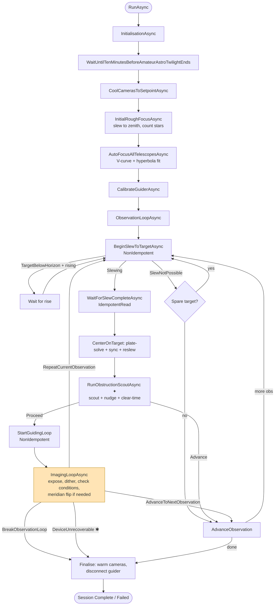
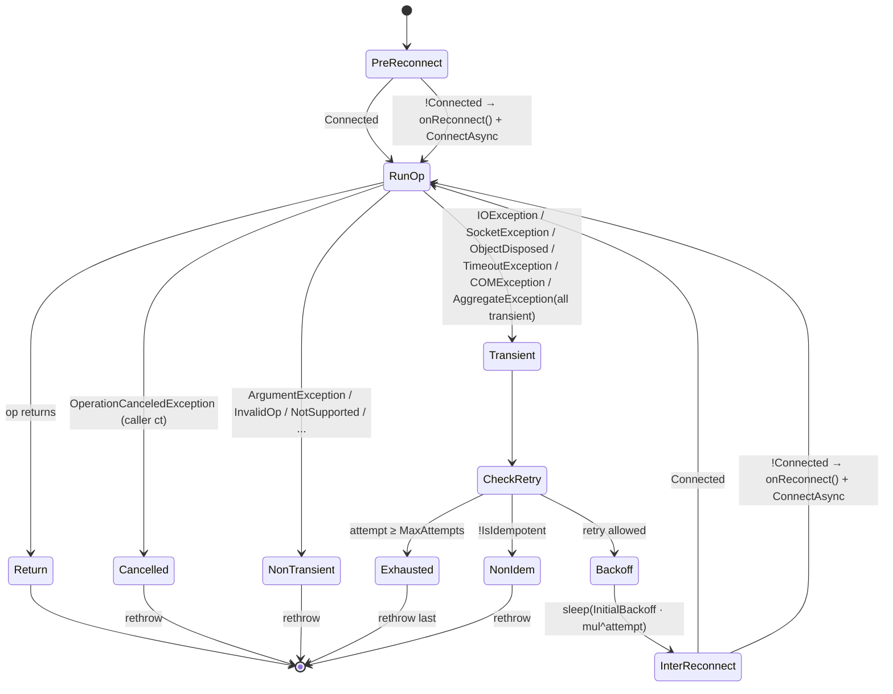
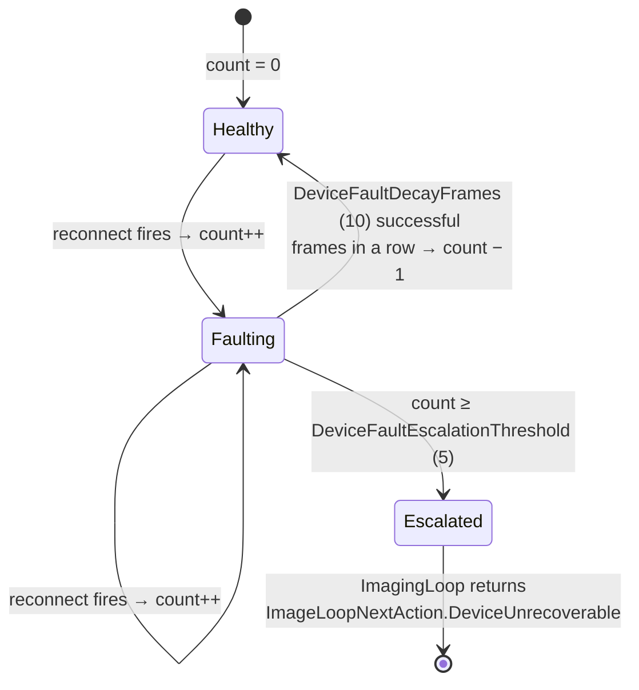
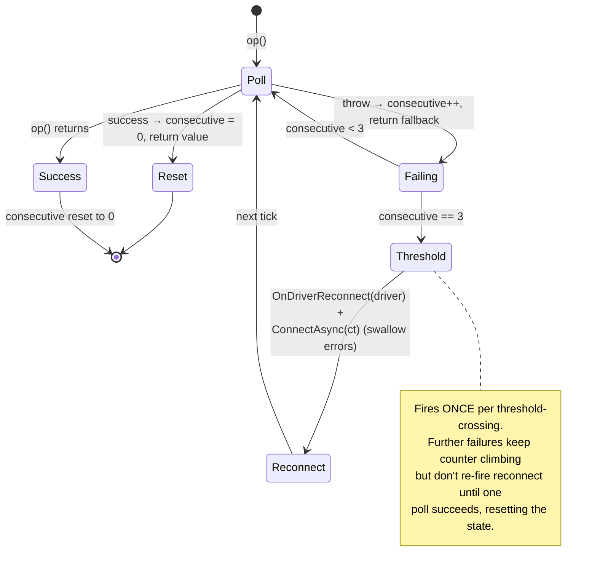

# Driver Resilience

Architecture reference for the driver-reconnect + retry layer shipped on branch
`driver-resilience` as PRs B1-B6. Designed in
[`driver-resilience.md`](../plans/driver-resilience.md).

**Goal:** a single USB bump, COM glitch, or TCP drop must not end the session.
Previously, every driver call in the imaging hot path was a naked `await`; the
first exception bubbled to `Session.RunAsync`'s outer catch, `SessionPhase.Failed`
was set, and finalise ran. Now transient faults retry silently, repeated faults
trigger proactive reconnects, and only a truly dead device escalates to a clean
session exit.

## Top-level session workflow



✱ = new escalation exit added by PR-B4. All driver calls along the highlighted
arrows are wrapped via `ResilientInvokeAsync`.

✦ = predictive FOV obstruction probe added on branch `fov-obstruction-detection`.
Detail in [`fov-obstruction.md`](fov-obstruction.md).

## ResilientCall.InvokeAsync

The wrapper every hot-path driver call goes through. Pre-reconnects disconnected
drivers, retries idempotent ops with exponential backoff, rethrows immediately on
caller cancellation or non-transient exceptions.



### Presets

| Preset | Attempts | Backoff | Use case |
|--------|---------:|---------|----------|
| `IdempotentRead` | 3 | 250 ms × 3.0 | Status polls, position reads, `WaitForSlewCompleteAsync`, `GetImageAsync` |
| `NonIdempotentAction` | 1 | none | Slew issue, exposure start, dither, guider start (retry would double-issue) |
| `AbsoluteMove` | 2 | 500 ms × 1.0 | Focuser / filter-wheel moves: target is an absolute coordinate, retry lands on the same position |

### Transient exception filter

Conservative by design. False positives (treating a config error as transient)
just log noise and spin through `MaxAttempts`; false negatives (not retrying a
cable bump) defeat the whole helper.

- `IOException`: serial / TCP / pipe
- `SocketException`: TCP disconnect
- `ObjectDisposedException`: driver transport recreated its handle
- `TimeoutException` / `TaskCanceledException` wrapping `TimeoutException`; driver's own timeout, not ours
- `COMException`: ASCOM hub disconnects surface here via `AscomDeviceDriverBase.SafeTask`
- `AggregateException` where every inner is transient

Anything else rethrows immediately.

**A read the device did not answer must THROW, never return a value.** Every layer in this document
reacts to an exception, so a driver that turns a missing or unparseable reply into `false`,
`int.MinValue` or `NaN` hands all of them a value. For a poll that decides something is FINISHED
that is the wrong answer rather than no answer: the Gemini focuser's `:01#` read "not moving" on a
lost reply, so a compensated move-wait stopped polling while the focuser travelled on (#781). Not
connected is a different case and keeps its neutral value; connected with no valid reply is an
`IOException`, which the filter above already treats as transient.

## Per-driver fault counter

Each `IDeviceDriver` has a session-scoped reconnect counter, incremented by
`ResilientCall`'s `onReconnect` callback. Sustained healthy frames decay the
counter; crossing the threshold trips escalation.



`DeviceFaultEscalationThreshold` and `DeviceFaultDecayFrames` are on
`SessionConfiguration` (defaults 5 and 10). Counter state lives in
`Session._driverFaultCounts` (`ConcurrentDictionary<IDeviceDriver, int>`).
`DeviceUnrecoverable` is a new variant on `ImageLoopNextAction`; the imaging
loop drains pending FITS writes and bails out; `ObservationLoopAsync` logs and
breaks cleanly into `Finalise`.

## PollDriverReadAsync: telemetry proactive reconnect

`PollDeviceStatesAsync` polls focuser position / temperature / moving and mount
RA / Dec / HA / pier / slewing / tracking every imaging tick. Plain `CatchAsync`
would swallow failures forever; `PollDriverReadAsync` counts them and fires a
one-shot reconnect at the threshold so by the time the next exposure starts,
reconnect is already in flight.



`PROACTIVE_RECONNECT_THRESHOLD = 3`. The reconnect happens inline (no
fire-and-forget `Task.Run`); blocking budget is one `ConnectAsync` call, typically
sub-second. Subsequent failures in the same burst keep the counter climbing but
don't re-fire reconnect; the counter only resets on a successful poll.

PR-B6 also routed the three `Session.Cooling.cs` ramp polls (CCD temp, setpoint,
cooler power) through `PollDriverReadAsyncIf`, the capability-gated variant,
so a USB drop during a 30-minute cooldown no longer silently freezes the live
cooling graph.

## Composite operations: layering retry on top of `ResilientCall`

`ResilientCall` retries individual driver primitives. Composite operations made
of several primitives (take a scout exposure: `StartExposureAsync` → `SleepAsync` →
`GetImageReadyAsync` → `GetImageAsync` → `FindStarsAsync`) sometimes need a *second*
retry layer at the operation level. Two distinct failure classes call for it:

1. **Exception escapes Layer 1.** `NonIdempotentAction` has a 1-attempt budget by
   design; a transient on `StartExposureAsync` throws straight through. If the
   composite's caller treats the throw as "abort the whole flow", a single USB
   bump can derail a multi-step operation that had a perfectly cheap retry path.
2. **Successful primitive returns a degraded result.** Drivers don't throw on a
   cosmic-ray-spike-as-a-star, a brief cloud puff that drops star count, or a
   sensor glitch that produces an unusable image. `ResilientCall` only sees
   exceptions, not results.

The pattern that handles both:

```text
Caller (ObservationLoop, etc.)
    └─► Layer 3: try/catch around the composite
        - swallow → safe default (e.g. ScoutOutcome.Proceed)
        - imaging-loop deterioration check is the safety net for real issues

  Composite operation (TakeScoutFrameAsync)
      └─► Layer 2: per-result retry loop (typically 2 attempts)
          - retry on exception (Layer 1 exhausted)
          - retry on invalid result (degraded output)
          - first valid result wins

    Driver primitive (StartExposureAsync, GetImageAsync, ...)
        └─► Layer 1: ResilientCall.InvokeAsync
            - IdempotentRead: 3 attempts, backoff + reconnect
            - NonIdempotentAction: 1 attempt, pre-reconnect only
            - rethrows on hard errors / non-transient
```

Cost of Layer 2: one extra exposure / read per affected attempt. Benefit: a
single bad frame or a single transient that escapes Layer 1 doesn't propagate
to the operation outcome. Cost of Layer 3: nothing (only fires on uncaught
exception). Benefit: a composite that's gone fully sideways doesn't end the
session.

**When to add Layer 2 / Layer 3 to a new composite:**

- Layer 2 is appropriate when the composite is **idempotent at the operation
  level** (running it twice has the same effect as running it once, the second
  result supersedes the first). Scout exposures, telemetry probes, plate solves
  all qualify. Slewing a target does NOT; re-issuing while in motion is at best
  redundant and at worst misbehaves on some mounts.
- Layer 3 is appropriate when the composite has a **safe default outcome**
  (the operation can be skipped without ending the broader flow). Optional
  pre-flight checks, telemetry decorations, predictive probes all qualify.
  Critical path operations (slew to target, start exposure for the actual
  imaging frame) do NOT; silent failure there means lost frames or wrong
  pointing.

**Test seam pattern.** Composite-level retry needs scriptable transient injection
to be testable. The convention is an `internal int Transient<X>Failures` counter
on the fake driver: `Interlocked.Decrement` on each call, throw `IOException`
(classified as transient by Layer 1) when the result is `>= 0`, clamp to 0
afterwards. Set the counter to N to script "next N calls fail." See
`FakeCameraDriver.TransientStartExposureFailures` and the
`GivenFirstScoutAttemptThrowsThenSecondSucceedsWhenScoutAndProbeThenHealthy`
test for the canonical example. New fake-driver test seams should follow the
same pattern.

The first concrete user of all three layers is the FOV obstruction scout; see
[`fov-obstruction.md`](fov-obstruction.md) "Resilience layering" for
the worked example with its specific failure-class table.

## CatchAsync vs ResilientInvokeAsync vs PollDriverReadAsync

| Kind of call | Helper | Behaviour on throw |
|---|---|---|
| Hot-path driver call (slew, expose, get image, position read, dither, guide start) | `ResilientInvokeAsync` → `ResilientCall` | Classify → retry idempotent ones with backoff + reconnect, count fault, escalate at threshold |
| Telemetry poll (`PollDeviceStatesAsync`, cooling ramp) | `PollDriverReadAsync` / `PollDriverReadAsyncIf` | Return fallback + count consecutive failures; fire proactive reconnect at threshold |
| Best-effort / decision input / metadata read | `CatchAsync` (unchanged) | Log + return fallback, move on |
| Finaliser (warm, disconnect, close covers, park) | `CatchAsync` (unchanged) | Swallow: every step runs regardless of prior failures |

`CatchAsync` is deliberately kept for predicate decisions (`IsSlewingAsync`,
`IsTrackingAsync`) where `false` is a strictly safer default on fault, for FITS
header metadata reads where a missing value is annoying but a retry storm is
worse, and for all finaliser steps.

## A lost exposure: the driver's own rung, below all of the above

Everything above reacts to a driver call that THROWS. A camera that stops delivering frames does not
throw: every call succeeds and the exposure simply never finishes. Before the rung below, a DAL
camera in that state reported `Exposing` for ever, and since the imaging loop only starts an
exposure on an `Idle` camera, the night stopped taking frames without an error anywhere.

`DALCameraDriver` (`DALCameraDriver.Recovery.cs`) therefore owns two steps of its own, for every
DAL vendor:

1. **Deadline.** An exposure still working at `duration + 15 s + duration / 10`
   (`LostExposureGrace`), or one the SDK reports `Failed`, is LOST: the driver stops it on the device
   and returns to `Idle` with no image, so the loop logs a failed fetch and starts the next frame. It
   is counted once however often the state is polled.
2. **Reset.** Two lost exposures in a row (`ResetAfterConsecutiveLostExposures`) on a body with
   `INativeDeviceInfo.CanResetDevice` reset it before the NEXT exposure, never inside a state poll:
   `ResetDevice()`, re-find it by the same identity `DoConnectDeviceAsync` uses (up to 20 s), re-run
   `InitCamera`, and restore the driver's settings (ROI, binning, bit depth, fast readout) plus gain,
   offset, white balance, cooler target and cooler on, read from the wedged device before the reset.
   A camera that does not come back leaves the driver in `CameraState.Error` and throws, which the
   session's own rungs then handle. A frame that arrives clears the count.

Measured on a ToupTek G3M678M 2026-09-23, the one body that can reset from software today: 1 lost
trigger in 600 with no SDK event at all (only the deadline sees it; the next trigger worked), and video
stalls that survived close and reopen and cleared only with the reset. The hardware check of the
reset path is `ToupTekResetRecoveryProbe` (`TIANWEN_TOUPTEK_PROBE=1`): back in 1.4 s, gain and offset
restored, the next frame taken binned. The binding's half (arming the SDK's no-packet and no-frame
timeouts so a stalled transfer fails the exposure at once) is in ToupTek.SDK 1.1.

## A lost exposure on a Canon body

The same rung for a body whose frame arrives as an event (`CanonCameraDriver`, over WPD or USB), found on an EOS 6D on
2026-09-30. A release that produced no picture threw nothing, and the waits on it had no end.

1. **Deadline.** `duration * 1.1 + 30 s` (`LostExposureGrace`), checked where the imaging loop polls
   (`GetImageReadyAsync`, no timer, so a fake clock sees it). Past it the exposure is abandoned: no raw is owed any more, a
   picture that arrives later is released rather than taken for the next exposure's (`_exposureGeneration`), and
   `GetImageReadyAsync` throws a message that names the body and says to look at its LCD for a blinking Err (or, when the
   body sent only a JPEG, to set its image quality to RAW).
2. **Every failure reaches the waiting job.** A download that throws or is refused, and a CR2 that does not decode, were
   logged and then waited on for ever; the release's own answer (`TakePictureAsync` returns an `EdsError`) was ignored, and is
   checked now, as is a bulb start's.
3. **`DeviceBusy` is answered.** A body still busy with its last write refuses the next with `DeviceBusy` and does not make it.
   The shutter speed and ISO writes are retried (`CanonBusyRetry`: six tries, 500 ms apart) and refused loudly when the body
   stays busy. Before, the exposure ran at the previous setting with nothing said (seven times in one session).
4. **A preview's wait is bounded and abortable, for every driver, and so is a dark run's.** `PreviewCapture.CaptureAsync`
   gives up at `exposure + ReadyGrace` (2 min), and when cancelled (the node's Stop, a quit) it aborts the exposure; so does
   `DarkFrameRun` (`DarkFrameRunCancelTests`). A wait that only stops watching left the camera `Exposing`: its next exposure,
   or the disconnect after a cancelled run, was refused for that.
5. **The quit ends a running preview first** (`PictureJobs.StopPreviewsAsync`, used by `RigShutdown` and the preview's Stop
   button), because the node refuses to disconnect a device a job holds. The window used to sit on "Quitting... please
   wait" behind it, saying nothing.

### What stopped the body, and why it would not come back (established 2026-09-30)

The body went silent after a handful of frames, then answered `DeviceBusy` to everything, blinked Err, and needed its battery
out. That was four faults of the driver's and one of FC.SDK's, each found in a CLI burst on a power-cycled 6D over WPD and
each measured before and after:

- **Every shot is two objects, and one was never released.** The body was set to RAW+JPEG, and a host-destination frame
  stays in the body's RAM until it is told `TransferComplete`. The driver took the first handle a shot announced and dropped
  any other, so every JPEG was held: FC.SDK counted 8 frames still held after 8 downloads, and the 9th release got no picture.
  A late raw (after its exposure was given up) was dropped the same way. Every announced object now goes through one queue
  with one reader (`PumpAnnouncedObjectsAsync`) that downloads the raw an exposure is owed and releases everything else:
  28 announced, 28 released, 14 downloaded, nothing held at close. The 6D answers `GetObjectInfo` with `InternalError` over
  WPD, so an object cannot be told by its name; a name-less one is downloaded when a raw is owed and judged by its bytes (a
  JPEG's SOI marker), and released as a JPEG if it is one. That queue's reader must be able to COUNT: a single-reader
  unbounded channel's `Count` threw after the first object and left every later one unread.
- **Mirror lockup armed on the body means no picture.** The connect armed the body's own mirror lockup setting; on a 6D in
  a single-shot drive an armed release only RAISES the mirror, the body waits for a second press and drops the mirror again
  30 s later. A power-cycled body armed at connect took no picture at all, twice (18:04 and 18:20; the drive read back as
  single shot). The connect now disarms it, and each exposure up to 30 s is taken with lockup through FC.SDK's
  `TakePictureWithMirrorLockupAsync` (the body's 2 s self-timer raises, settles and exposes on its own: 14 frames of 14). The
  drive that capture changes is put back once the frame is released, since the body refuses writes while it holds one, and
  before every release; a body found on a self-timer drive at connect is set back to single shot. The device's **Mirror
  lockup** setting (on by default) turns it off. An earlier session's 25 good frames with lockup "enabled" were a write the
  body acknowledged and did not keep: the user found it off in the menu.
- **A shutter speed the body does not offer is answered busy.** The driver asked for 10 s as the half-stop code 0x1C; the
  6D is in third-stop steps (0x1D) and answered `DeviceBusy`, for nine seconds of retries. Its hand-kept table also had four
  durations wrong (0x24 is 6 s, not 5; 0x24 was the `Tv=36 failed: DeviceBusy` before the first wedge). There is no table
  now: the body announces its allowed Tv codes, a code is its own duration (APEX in eighths of a stop above 0x38, `TvDuration`),
  and the frame's EXIF says what it was taken at (a 7 s request exposes 6 s, and EXPTIME says 6).
- **A half press left held keeps the body busy, and closing the session does not let go of it.** A bulb start refused with
  the mode dial off B (`NotSupported`) returned with FC.SDK's half press still held, and so did a release whose transport failed
  mid-press (17:03, `InternalError`): every write after it was refused busy, across reconnects, until a power cycle. Measured
  directly: ISO refused busy, one `ReleaseShutterAsync`, ISO taken. FC.SDK now lets go of every press it made whatever
  answered after it (`ShutterPresses`), and the connect lets go of a half press an earlier session left held.
- **A shot given up is still being taken.** A Tv exposure cannot be stopped once released, so after a cancel the body goes
  on exposing and answers busy to every write until it is done: a 30 s dark cancelled 14 s in made the next run's ISO write
  fail. The driver knows until when (`_bodyBusyUntilTicks`, cleared by the shot's first object) and waits for it, up to the
  shot's deadline, before an ISO or shutter write, and before a disconnect closes the session, so the frame is released and
  the drive put back rather than left on the self-timer.

A dark carried a further fault of its own: black-subtracted, half of its read noise is negative, and a 16-bit FITS file writes
each of those as 0, so every Canon dark and bias read back with a median of 0. The frame keeps the body's black level (2048)
as a camera's offset (`CanonWhitePoint.ClampRow`'s offset): medians are 2048 in every colour.

The sweep that validated it (CLI, `tianwen darks`, one power-cycled 6D over WPD): 14 x 0.1 s at ISO 320, 4 x 1 s at ISO 8000,
10 s, 7 s (taken at 6 s), 5 s, 30 s, a bulb refused with its own message and a burst straight after, and a 30 s dark cancelled
mid-exposure with a burst straight after. Pinned by `CanonCaptureTests`, `CanonPreviewRobustnessTests`, `DarkFrameRunCancelTests`
and FC.SDK's `ShutterPressesTests`.

## Files

### New
- `src/TianWen.Lib/Sequencing/ResilientCall.cs`: static wrapper + options
- `src/TianWen.Lib/Sequencing/ResilientCallOptions.cs`: preset configurations
- `src/TianWen.Lib.Tests/ResilientCallTests.cs`: 11 tests
- `src/TianWen.Lib.Tests/SessionFaultCounterTests.cs`: 11 tests (PR-B4 + PR-B5 + PR-B6)

### Edited
- `src/TianWen.Lib/Sequencing/Session.cs`: fault counter dict, poll failure dict, `PollDeviceStatesAsync`
- `src/TianWen.Lib/Sequencing/Session.ErrorHandling.cs`: `ResilientInvokeAsync` (4 overloads), `OnDriverReconnect`, `DecayFaultCountersOnFrameSuccess`, `TryFindEscalatedDriver`, `PollDriverReadAsync`, `PollDriverReadAsyncIf`
- `src/TianWen.Lib/Sequencing/Session.Imaging.cs`: hot-path driver calls wrapped + `DeviceUnrecoverable` short-circuit + decay hook on successful frame
- `src/TianWen.Lib/Sequencing/Session.Focus.cs`: hot-path driver calls wrapped
- `src/TianWen.Lib/Sequencing/Session.Cooling.cs`: ramp-loop polls routed through `PollDriverReadAsync(If)`
- `src/TianWen.Lib/Sequencing/SessionConfiguration.cs`: `DeviceFaultEscalationThreshold`, `DeviceFaultDecayFrames`
- `src/TianWen.Lib/Sequencing/ImagingLoopResult.cs`: `DeviceUnrecoverable` variant

## Guard rails for future work

- **Never introduce a raw `await driver.X(...)` on the Session hot path.** The
  hot path is anything reachable from `ObservationLoopAsync`, `ImagingLoopAsync`,
  `PerformMeridianFlipAsync`, `RoughFocusAsync`, `AutoFocusAsync`,
  `CenterOnTargetAsync`, `CoolCamerasToSetpointAsync`. Wrap via
  `ResilientInvokeAsync`.
- **Don't forget the `onReconnect` callback.** `ResilientInvokeAsync` is
  preferred over `ResilientCall.InvokeAsync` because it auto-wires
  `OnDriverReconnect`. The raw `ResilientCall` exists for tests and for a future
  non-Session consumer.
- **Pick the preset deliberately.** Most reads are `IdempotentRead`. Anything
  effectful (slew issue, exposure start, dither, guide start) is
  `NonIdempotentAction`. Absolute-target moves (focuser, filter wheel) are
  `AbsoluteMove` (2 attempts, safe to re-issue).
- **Keep `CatchAsync` for the right cases.** See the table above; finaliser,
  predicate decisions, and metadata reads legitimately want swallow-and-default
  semantics.

## Not shipped in this branch

- **Lost-frame re-issue flow.** PR-B3 plan called for detecting "GetImageAsync
  empty after reconnect fired mid-exposure → don't count towards
  TotalFramesRequired, re-issue StartExposureAsync, two consecutive lost frames
  trip `DeviceUnrecoverable`." The mechanical wiring is in place (reconnects are
  counted via `OnDriverReconnect`, two-consecutive-lost-counted-as-faults would
  trip escalation) but the explicit "empty after reconnect" detector is not
  implemented. Candidate for a follow-up PR.
- **AbortSlew-first on reconnect.** Risk mitigation from the PLAN. Current code
  handles it via the `IsSlewingAsync` check before re-issuing in
  `PerformMeridianFlipAsync`; only material if a cold reconnect leaves a slew
  queued at the mount. Can be a driver-level concern.

## Commits

- `1ce1d56` PR-B1: ResilientCall helper + options + 11 tests
- `be911f4` PR-B2: wrap idempotent mount/focuser/FW reads
- `b1f02ba` PR-B3: wrap non-idempotent slew/exposure/dither + absolute moves
- `db7ba83` PR-B4: fault counter + `DeviceUnrecoverable` escalation + 5 tests
- `1374cbb` PR-B5: proactive reconnect in `PollDeviceStatesAsync` + 4 tests
- `20394c3` PR-B6: cooling ramp polls via `PollDriverReadAsyncIf` + 2 tests

All on branch `driver-resilience`. 1672 unit + 78 functional session tests pass.
