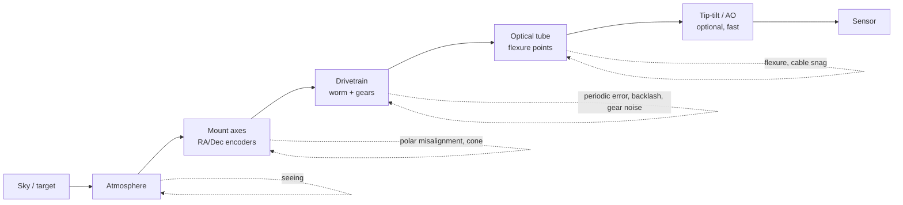

# Fake Mount/Camera Disturbance Model

**Status: DONE.** All disturbance physics now lives in one place -- the `Disturbance/` subsystem --
composed by both `FakeSkywatcher` (true-pointing seam) and `FakeMountDriver` (believed-only leak), plus
the camera's `SensorDelta` seeing. No bespoke duplicate term math remains.

- **Steps 1-2 DONE** (commit f8e71a9): the pure `Disturbance/` subsystem -- `IDisturbanceTerm`,
  `DisturbanceModel` (`PointingDelta` vs `SensorDelta`), `CorrectionActuator` (derived
  correctability), and the additive terms (PeriodicError positional, Flexure, CableSnag, WindGust,
  GearNoise, AtmosphericSeeing) over a shared `OrnsteinUhlenbeck2D`. 9 unit tests in
  `DisturbanceModelTests`.
- **Step 6 (partial, earlier)**: the neural-vs-P comparison test
  (`GuideLoopTests.GivenSameScenarioWhenNeuralPlusPVsPOnlyThenNeuralIsNotWorse`) already runs on the
  coupling harness via `SetupCoupledGuidedMount` (~99 real samples, asserts `TotalSamples > 50`).
- **Step 3 DONE** (commit 713ce6d): `FakeSkywatcher` composes a `DisturbanceModel` and layers
  `PointingDelta` onto the believed->true read; inert until a knob is set.
- **Steps 4 + 2b DONE**: worm periodic error moved camera->mount. `FakeSkywatcher.ReadRaWormPhaseRadiansAsync`
  computes the worm phase from its own RA encoder (`PosRa` mod the probed worm period) and feeds the
  positional `PeriodicErrorTerm`, so PE rides on the TRUE pointing and the coupled guide camera
  observes it through the live projection centre. `FakeCameraDriver.IntegratePeDrift` now applies
  camera-side PE only when NO mount is coupled (standalone unit-test path); the worm-encoder snapshot
  machinery (`_mountRaAxisPos` / `_mountWormStepsRa`) is gone. This also makes `pePeakToPeakArcsec=0`
  a genuinely PE-free scenario (previously the camera's 20" default leaked in) and applies the
  physical `cos(dec)` factor PE picks up on conversion to sensor pixels. Verified: adding 15" PE
  nearly doubles the P-only RA RMS (0.026 -> 0.049 px) with Dec ~flat -- the RA-dominant signature.
- **Step 5 DONE**: removed the sidereal-into-RA bug first (5a) -- a tracking `FakeMountDriver` holds the
  commanded RA/Dec while the RA-axis ENCODER (`HA = LST - RA`) advances at the sidereal rate, completing
  the half-landed axis-encoder fix; two latent bugs (per-call Dec accumulation; one-shot cable-snag
  latch) were fixed in the same pass. Then (5b) `FakeMountDriver` was rearchitected from its
  checkpoint-fold model to the same **on-read disturbance delta** FakeSkywatcher uses: `_ra`/`_dec` are
  the commanded position and the additive disturbances are computed per read as a pure function of
  elapsed-since-a-stable-epoch via the shared `DisturbanceModel`. The epoch re-bases on slew / sync /
  set-position / tracking-start, NOT on guide pulses, so the disturbance keeps accumulating while the
  guider corrects `_ra`/`_dec` underneath it (the checkpoint-on-pulse reset was incompatible with the
  OU terms' monotonic-elapsed assumption -- that is why the rearchitecture was required, not a swap).
  Deleted: the bespoke `_accumulated*` term math, the duplicate OU/Gaussian code, and `Checkpoint` /
  `UpdateTrackingState`. Polar drift became a new shared `LinearDriftTerm` (constant-rate, MountAxis
  stage); `GetTrackingError*` returns the model's pointing-delta directly. `GearNoiseArcsec` now
  defaults to 0 (matching FakeSkywatcher) so an unconfigured mount is truly perfect -- disturbance
  values are now exact (cable-snag Dec exactly -5.00", was -4.77" under the old always-on 0.3" jitter).
- **Steps 6 + 7 DONE**: `SetupCoupledGuidedMount` gained wind / flexure / cable-snag params (on the
  FakeSkywatcher's composed model) and a `seeingArcsec` param (on the guide camera). `FakeCameraDriver`
  now has a `SeeingArcsec` knob wired through `SeeingOffsetPixels()` -- a one-term `DisturbanceModel`
  (`AtmosphericSeeingTerm`) whose `SensorDelta` is added post-projection to the rendered star, the
  canonical sensor-side wander a mount pulse cannot null. All three legacy `SetupGuidedMount` guide
  tests (wind+PE, cable-snag+PE, combined+seeing) are migrated to the coupling harness and the
  hand-rolled `SetupGuidedMount` helper is retired (deleted). Each now records 119 real samples (was
  ~2) and asserts `TotalSamples > 50`: wind+PE RMS 0.484 px, cable-snag 0.061 px, combined 0.362 px
  (~= the pure 2" seeing floor of ~0.34 px -- seeing dominates, as expected for an un-correctable
  disturbance), all far under the 15 px bound.

### Design refinement adopted during implementation

The arch originally listed **polar misalignment as an additive `IDisturbanceTerm`**. On contact with
the code that is wrong: `FakeSkywatcher`'s misalignment is a *stateful believed->true coordinate
transform* with three lifecycle regimes (near-pole encoder sweep, pre-sync axis tilt, post-sync
tracking drift + commanded-deviation), position- and sync/goto-state-dependent. That is exactly what
this doc calls *the universal carrier* -- so polar misalignment **stays the believed->true transform**,
and the `DisturbanceModel` carries only the *additive perturbations* (PE, flexure, wind, gear) layered
on top of it (plus seeing on the camera). Each effect still has exactly one home -- PE moves
camera->mount -- which is the unification goal; there is no `PolarMisalignmentTerm`.

A coherent way to model guiding disturbances (periodic error, polar misalignment,
flexure, cable snag, wind, atmospheric seeing, gear noise) across the fake mount and
fake camera, so that:

- the simulated guide star behaves like a real one (stays in frame, drifts realistically),
- the guide loop can correct what is physically correctable and cannot correct what isn't,
- there is **one** disturbance model, not three overlapping ones.

## Why this exists (the problem)

Today disturbances live in three disconnected places with different fidelity and, in one
case, wrong physics:

| Where | Models | Fidelity | Consumed by |
|---|---|---|---|
| `FakeMountDriver._accumulated*` (`UpdateTrackingState`) | sidereal, PE, polar drift, wind, cable-snag, flexure, gear-noise -- all summed into `GetRA/Dec` | crude (constant-rate); **sidereal is added to reported RA, which is physically wrong for a tracking mount** | hand-rolled `GuideLoopTests.SetupGuidedMount.RenderFrame` |
| `FakeSkywatcherMountDriver` | polar misalignment (real az/alt axis tilt) via the believed/true seam | high | `FakeCameraMountCouplingTests` |
| `FakeCameraDriver` | worm PE (positional, from RA encoder), seeing jitter hook, ST-4 integrator | medium | `FakeCameraMountCouplingTests` |

The same physical effect (periodic error) is modelled in two places; sidereal is a
disturbance in one model and absent in the other; seeing exists only on the camera.

The concrete failure this surfaced: the neural-vs-P comparison test
(`GivenSameScenarioWhenNeuralPlusPVsPOnlyThenNeuralIsNotWorse`) records only **2 error
samples over 360 frames**. `FakeMountDriver.GetRightAscensionAsync` returns
`_ra + _accumulatedRaHours`, and `_accumulatedRaHours` includes the full sidereal advance
(`SIDEREAL_RATE_HOURS_PER_SECOND * elapsed`). With a 2 s exposure that is
`24/86164 h/s * 2 s * 15 * 3600 = 30.1" = 20.0 px` of RA motion per frame, against a 16 px
tracker search radius and a guide-rate correction capped at ~13 px/frame (and ~0 on the
first frame, since a P-controller's correction is proportional to a near-zero initial
error). The star leaves the ROI after ~2 frames and never returns. The RMS "comparison" is
two early samples -- both runs identical, ratio 1.000 -- and the guardrail proves nothing.

## Core principle: the believed/true split is the universal carrier

`IFakeTruePointingSource` already exists, but only carries polar misalignment today. Promote
it to the single carrier for **every** mount-mechanical error:

```
believed_pointing(t)  = encoders: slews + guide pulses; tracks sidereal perfectly
                        => the sky RA/Dec the mount THINKS it points at stays ~constant
                           while tracking. A real mount can only report this.

true_pointing(t)      = believed_pointing(t) + SUM( mount_mechanical_errors(ctx) )
                        => where the optical axis actually points.
                        => only a camera/plate-solve can witness it (as in reality).
```

Two consequences kill the current bugs:

- **Sidereal is not a disturbance term.** A tracking mount holds sky-RA constant; the guide
  render subtracts a captured reference, so the sidereal baseline cancels structurally.
  `FakeMountDriver` adding `SIDEREAL_RATE * elapsed` to reported RA is simply the wrong
  model and is removed.
- **Guide pulses move `believed`, which moves `true`, which moves the rendered star.** The
  loop closes through the mount exactly as `FakeSkywatcher` + `FakeCamera` already do.

## The optical chain and where disturbances inject



Disturbances entering at the **axis / drivetrain / optical-tube** stages move the optical
axis: they show up as a `believed -> true` pointing delta and a mount pulse (which moves the
axis) can null them. Disturbances entering at the **atmosphere** stage move only the apparent
centroid: they are *not* reflected in pointing, so a mount pulse cannot null them -- and
chasing them just injects the seeing variance into the corrections.

## Correctability is derived, not declared

We deliberately do **not** tag a term "uncorrectable." Seeing is uncorrectable *with a mount
at ~0.5 Hz*, but a fast tip-tilt / adaptive-optics actuator (or, for differential flexure, an
on-axis guider) changes that. So correctability is computed from two facts:

```
a term is correctable by actuator A  <=>  A.stage is at or downstream of term.stage
                                          AND A.bandwidth >= term.bandwidth
```

- **Mount pulse actuator**: stage = `MountAxis`, bandwidth ~ 0.5 Hz. Reaches every
  pointing-stage term (axis/drivetrain/tube) that is slow enough; misses fast gear noise and
  anything at the atmosphere stage.
- **Tip-tilt / AO actuator (future)**: stage = `Sensor`-adjacent, bandwidth ~ 50-1000 Hz.
  Reaches the atmosphere stage too -- so adding it flips seeing to "correctable" with **no
  change to any disturbance term.** That is the whole point of deriving it.

## Components

```
IDisturbanceTerm                     // shared abstraction for ALL disturbances
    Stage      : DisturbanceStage    // Atmosphere | MountAxis | Drivetrain | OpticalTube
    Character  : DisturbanceCharacter// drift | periodic | impulse | stochastic (+ correlation time)
    Evaluate(DisturbanceContext ctx) : (dRaArcsec, dDecArcsec)   // native frame, deterministic
    // implementations: PeriodicError, PolarMisalignment, Flexure, CableSnag, Backlash,
    //                   WindGust, GearNoise, AtmosphericSeeing

DisturbanceContext                   // everything a term needs to evaluate
    { elapsedSeconds, raWormPhase, hourAngle, pierSide, lastPulseRa, lastPulseDec }

DisturbanceModel                     // ONE ordered list of IDisturbanceTerm, deterministic, pure
    PointingDelta(ctx)  = SUM(term.Evaluate(ctx) for term where term.Stage != Atmosphere)
    SensorDelta(ctx)    = SUM(term.Evaluate(ctx) for term where term.Stage == Atmosphere)

CorrectionActuator                   // mount pulse now; AO later
    { Stage, BandwidthHz }
    Corrects(term)  =>  Stage >= term.Stage && BandwidthHz >= term.BandwidthHz
```

Placement:

- **Fake mount** (both `FakeMountDriver` and `FakeSkywatcherMountDriver`) holds a
  `DisturbanceModel`. `IFakeTruePointingSource.GetTruePointingNativeAsync` returns
  `believed + model.PointingDelta(ctx)`. Public `GetRA/Dec` return believed only.
- **Fake camera** reads true pointing for the guide cam (it already does), projects relative
  to the captured reference, then adds `model.SensorDelta(ctx)` (seeing) post-projection.
- A single `IDisturbanceTerm` list is configured per device from `DeviceQueryKey` URI keys
  (the existing pattern: `PePeakTopeakArcsec`, `PePeriodSeconds`,
  `polarMisalignmentAzArcmin`, etc.), so both fake mounts and the camera read the same knobs.

## Loop closure (uniform, mechanism unchanged)

```mermaid
sequenceDiagram
    participant GL as GuideLoop
    participant Cam as FakeCamera
    participant Mnt as Fake mount (believed)
    participant Mdl as DisturbanceModel

    GL->>Cam: PulseGuide(dir, ms)
    Cam->>Mnt: ST-4 pulse -> believed += correction
    GL->>Cam: GetImage (next exposure)
    Cam->>Mnt: read true = believed + Mdl.PointingDelta(ctx)
    Cam->>Mdl: SensorDelta(ctx)  (seeing)
    Cam-->>GL: star at project(true - reference) + sensorDelta
    Note over GL: correctable pointing error shrinks;\nseeing remains as a noise floor
```

## Term catalog

| Term | Stage | Character | Correctable by mount pulse? | Source today |
|---|---|---|:--:|---|
| Periodic error | Drivetrain | periodic (worm phase) | yes | `PeriodicErrorTerm` -- FakeSkywatcher positional (worm encoder); FakeMountDriver wall-clock fallback |
| Polar misalignment | MountAxis | drift (HA-dependent) | yes | FakeSkywatcher: real believed->true tilt transform (the carrier). FakeMountDriver: `LinearDriftTerm` stand-in |
| Flexure | OpticalTube | drift (HA-dependent) | yes | `FlexureTerm` (both fakes) |
| Cable snag | OpticalTube | impulse (at HA/time) | yes (as a step) | `CableSnagTerm` (both fakes) |
| Backlash | Drivetrain | dead-zone on correction | partially (interacts with pulses) | `FakeMountDriver` (applied in PulseGuide, not a disturbance term) |
| Wind gust | OpticalTube | stochastic (OU, slow) | partially (bandwidth-limited) | `WindGustTerm` (both fakes) |
| Gear noise | Drivetrain | stochastic (OU, fast) | no (too fast for 0.5 Hz) | `GearNoiseTerm` (both fakes; default off) |
| Atmospheric seeing | Atmosphere | stochastic (zero-mean, per-frame) | no with mount; yes with AO | `FakeCamera.SeeingArcsec` -> `AtmosphericSeeingTerm` / `SensorDelta` |

## Migration plan

| # | Step | Size |
|---|---|---|
| 1 | Introduce `IDisturbanceTerm`, `DisturbanceStage`, `DisturbanceCharacter`, `DisturbanceContext`, `DisturbanceModel`, `CorrectionActuator` (pure, in `TianWen.Lib/Devices/Fake/Disturbance/`) | M |
| 2 | Port the existing math into terms: `PeriodicError`, `PolarMisalignment`, `Flexure`, `CableSnag`, `WindGust`, `GearNoise`, `AtmosphericSeeing` (lift from `FakeMountDriver.UpdateTrackingState` + the `FakeCamera` PE + `SyntheticStarFieldRenderer` seeing hook) | M |
| 3 | **DONE.** `FakeSkywatcherMountDriver` composes a `DisturbanceModel`; `GetTruePointingNativeAsync` = believed + `PointingDelta`. | M |
| 4 | **DONE.** Worm PE is now a mount Drivetrain term (positional, on the TRUE pointing via `ReadRaWormPhaseRadiansAsync`); `FakeCameraDriver.IntegratePeDrift` applies camera-side PE only standalone. | S |
| 5 | **DONE.** Sidereal-into-RA term removed (5a). `FakeMountDriver` rearchitected to the on-read disturbance-delta model composing the shared `DisturbanceModel` (5b); bespoke `_accumulated*` term math + `Checkpoint`/`UpdateTrackingState` deleted; polar drift -> shared `LinearDriftTerm`; gear default off. | M |
| 6 | **DONE.** All three `SetupGuidedMount` guide tests (wind+PE, cable-snag+PE, combined+seeing) drive frames through a `FakeCamera` coupled to a `FakeSkywatcher` via `DeviceHub`; the legacy `SetupGuidedMount` helper is deleted. Records 119 real samples (was ~2). | L |
| 7 | **DONE.** Wind + flexure + cable-snag are mount knobs on the coupling path; `AtmosphericSeeing` is a `FakeCamera.SeeingArcsec` knob via `SensorDelta`. The coupling harness can configure the full disturbance palette. | S |

## Test impact

- The neural-vs-P comparison and the formerly `SetupGuidedMount`-based tests
  (`GivenWindGusts...`, `GivenCableSnag...`, `GivenCombinedDisturbances...`) used to record
  ~2 samples; **migrated** to the coupling harness they record 119 real samples and their RMS
  assertions are meaningful (each also asserts `TotalSamples > 50`). The RMS bound stayed 15 px
  (very loose); the real-sample-count assertion is the substantive new check.
- `FakeCameraMountCouplingTests` should pass unchanged -- it already uses the believed/true
  seam; it just gains more term types behind the same coupling.
- `FakeSkywatcherMisalignmentTests` (pure static math) and `PolarAlignmentSessionTests`
  (NSubstitute + synthetic source) are unaffected.

## Verification

1. `cd src && dotnet build` -- zero warnings.
2. `dotnet test TianWen.Lib.Tests` then `dotnet test TianWen.Lib.Tests.Functional` (sequential, never parallel suites).
3. The migrated comparison test reports ~360 samples (not 2) and a non-trivial neural-vs-P ratio.
4. Live sanity with the fake SkyWatcher profile (run-gui + inspector): guiding stays bounded under PE + polar misalignment + (added) wind/seeing.

## Out of scope

- Real adaptive-optics / tip-tilt hardware drivers. The `CorrectionActuator` abstraction
  leaves room for one, but only the mount-pulse actuator exists initially.
- On-axis guider differential-flexure modelling (a separate optical-train concern).
