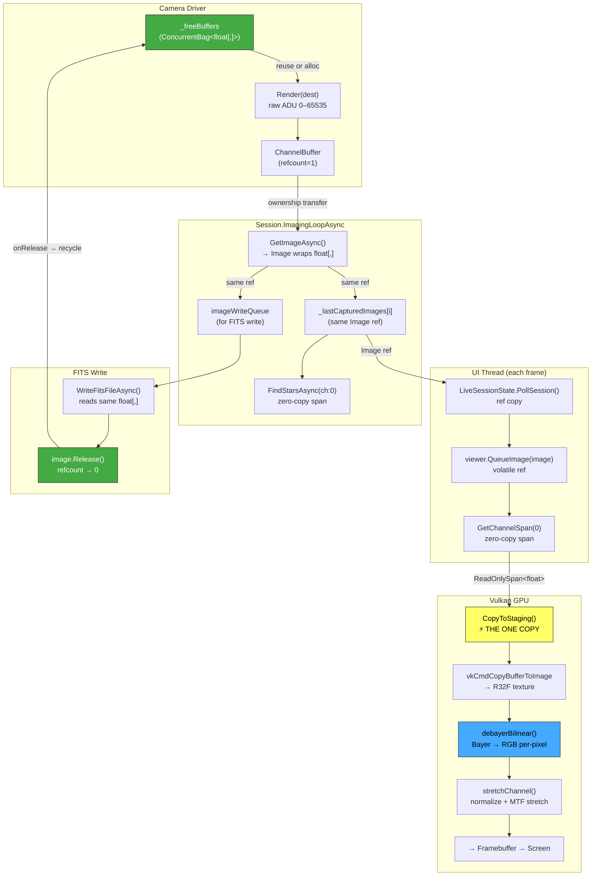

# Image Pipeline & Buffer Lifecycle

> Image pipeline + buffer-lifecycle deep-dive (moved out of the top-level README). See also the stretch-pipeline notes in CLAUDE.md.

The image pipeline manages `float[,]` pixel data from camera capture through star detection, FITS writing, and GPU display — with zero-copy buffer reuse and GPU-side debayer/stretch to minimize allocations.

## Types

| Type | Kind | Purpose |
|------|------|---------|
| `float[,]` | Raw array | Pixel data in H×W layout. The actual memory being managed. |
| `Channel` | `readonly record struct` | Typed view over a `float[,]` with `Filter`, `MinValue`, `MaxValue`, `Index`, and an optional internal `Buffer` (the ref-counted owner travels WITH the channel). Zero overhead. Returned by `ICameraDriver.ImageData`. `MinValue`/`MaxValue` are rescanned from the actual pixel data on every capture — they are the observed extent of *this* frame, not the sensor's fixed ADC capacity. |
| `ChannelBuffer` | `sealed class` (internal) | Ref-counted owner of a `float[,]`. When refcount reaches zero, `onRelease` fires → camera recycles the buffer. |
| `Image` | `partial class` | Wraps `ImmutableArray<Channel>` + `ImageMeta` (primary ctor; a legacy `float[][,]` overload stamps image-wide min/max on every channel). Image-wide `MaxValue`/`MinValue` are the derived extrema across channels; per-channel values via `GetChannel`. The ctor harvests each channel's `Buffer` — call `Release()` when done. Used by star detection, FITS write, plate solve. |
| `ImageMeta.SensorFullScaleAdu` | `float?` | The saturation level of the pixel data, in the SAME units as the data — distinct from `Image.MaxValue` above. Populated from `ICameraDriver.MaxADU` at the `GetImageAsync` choke point (live captures) or a FITS `SATURATE` card (read AND written — round-trips). The vendor SDK hands TianWen NATIVE-scale values (16383 for the 14-bit ASI533MC Pro) and TianWen does not left-shift on capture, so `DALCameraDriver.MaxADU` reports the native ADC full-scale (`AdcResolution`); N.I.N.A. files span the full 16-bit container only because N.I.N.A. multiplies on recording. `Image.UnitScaleDivisor` (single source of truth, shared by `ScaleFloatValuesToUnit(InPlace)` + TIFF export) prefers this over `MaxValue` (clamped to never go below the observed peak), so an under-exposed live capture lands below 1.0 instead of always stretching its own peak to exactly 1.0; rescales with the pixels through every rescale (`Image.RescaleMeta`). Null → observed-peak fallback. |

## Data Flow (Live Session)

One copy in the entire live path: `memcpy` into the Vulkan staging buffer. Everything else is reference passing or zero-copy spans. No CPU debayer, no CPU normalization, no scratch arrays.

## Buffer Lifecycle

1. **First exposure**: `_freeBuffers` is empty → `Render()` allocates a fresh `float[,]`.
2. **`StopExposureCore`**: Wraps the array in `ChannelBuffer(array, onRelease: bag.Add)` and stores it ON the `Channel` (`Channel.Buffer` init-prop) in `ImageData` — the buffer travels with its channel from here on.
3. **`GetImageAsync`**: The single typed hand-off — `new Image([channel], bitDepth, pedestal, meta)`; the `Image` constructor harvests the channel's `Buffer` ref (no `AddRef`, no attach-after-construct), then `ReleaseImageData()` clears camera state. Consequence for callers: `ImageData` reads null after `GetImageAsync` — if you need the raw `Channel`, read it *before* the call (this ordering trap cost a red sim test; see `AlpacaSimulatorTests.Camera_ExposesAndDownloadsViaImageBytes`). `FakeCameraDriver` deliberately keeps its `ImageData` but strips the (transferred) `Buffer` from it, so a second `GetImageAsync` re-wraps without double-harvesting the ref.
4. **Consumers**: Star detection, FITS write, and GPU upload all read the same `float[,]` via zero-copy spans. No debayer, no normalization on CPU.
5. **`image.Release()`**: Decrements `ChannelBuffer` refcount to zero → `onRelease` fires → `float[,]` goes into `_freeBuffers`.
6. **Next exposure**: `StopExposureCore` grabs a buffer from `_freeBuffers` via `TryTake()` and passes it as `dest` to `Render()` → **zero allocation**.

## GPU Debayer & Stretch

The fragment shader handles all image processing in a single pass per pixel:

1. **Bayer demosaic** (`imgSource=RawBayer`): bilinear interpolation from 3×3 neighborhood via `texelFetch` on the raw mosaic texture, with configurable Bayer pattern offset
2. **Normalization**: `raw × normFactor` where `normFactor = 1/MaxValue`
3. **MTF stretch**: pedestal subtraction → shadow clip → midtone transfer function
4. **Curves boost** and **HDR compression** (optional)
5. **WCS grid overlay** (optional, in FITS viewer)

For mono cameras (`imgSource=RawMono`), step 1 is skipped. For pre-debayered RGB files (`imgSource=ProcessedChannels`), all 3 channel textures are sampled individually.

## FITS Viewer Path

The FITS viewer (`AstroImageDocument`) normalizes the raw image to [0,1] in-place and computes histogram-based stretch statistics on CPU. For RGGB images, CPU debayer is skipped — the raw mosaic is uploaded and the GPU shader debayers. Per-channel stats are computed from the Bayer sub-channel pixels.

## Guide Camera

The guide camera follows the same `ChannelBuffer` lifecycle. `CaptureGuideFrameAsync` calls `GetImageAsync` → gets an `Image` with transferred `ChannelBuffer`. `GuideLoop.RunAsync` releases the old frame before each new capture. The double-buffer mechanism ensures the camera never overwrites pixel data still being read by the viewer.

## Driver Coverage (audit 2026-07-06; gaps closed same day)

The zero-alloc recycle loop above is the *design*; per-driver state:

| Driver | `ChannelBuffer` | Recycle (`_freeBuffers`) | Notes |
|--------|:---------------:|:------------------------:|-------|
| DAL (ZWO / QHY) | ✅ | ✅ | The reference implementation (`DALCameraDriver.cs`) |
| Fake | ✅ | ✅ | Mirrors DAL |
| Alpaca | ✅ | ✅ | `AlpacaImageBytes.DecodeChannel(payload, recycled)` decodes into a recycled buffer on shape match (drops it on ROI/bin change); `onRelease` returns it to the bag. (Was a no-op release — fresh LOH alloc per frame — until the 2026-07-06 audit.) |
| ASCOM | ✅ | ✅ | `ImageData` caches the COM `ImageArray` marshal + `FromWxHImageData(sourceData, recycled)` transpose **once per exposure**; cleared by `ReleaseImageData` + `StartExposureAsync` (mirrors Alpaca). (Was a computed property — full COM re-marshal on every read, no-op release — until the audit. The "reads null after `GetImageAsync`" contract in step 3 now holds for ASCOM too.) |
| Canon | ❌ | ❌ | Wraps the RAW-decode output array (no copy); decode allocates per frame anyway, so recycling has little to win. Deliberate. |

Consumer-side copies that are **by design** (do not "fix"):

- `LiveCameraFrameStream.Push` deep-copies each pushed frame into a ring-owned image (normalising ADU → `[0,1]`). Required: the camera recycles its buffer immediately, and `LoadAsync` hands out shared references with a "not overwritten for Capacity pushes" guarantee — recycling ring slots would violate it.
- `LiveFramePreviewSource.AcceptFrame` copies into persistent owned buffers (reused across frames unless geometry changes) while normalising to `[0,1]` — the copy IS the normalisation pass, and it decouples the viewer from the camera recycle.
- `Image.Arithmetic` / `Image.Masks` identity paths return `CopyChannelData()` — result independence is part of the contract.
- `RollingWindowStacker.BuildMasterAsync`'s mono/RGB normalise destination — `PlanetaryMaster.NormalizeInto` wraps the destination into the returned master (`MergeAndDemosaicAsync` passes mono/RGB through), so it must own fresh arrays per publish; only the split-CFA sub-planes (consumed by merge+demosaic) reuse the persistent `_sumScratch`. Pinned by `Published_mono_master_stays_valid_after_the_next_publish`.
