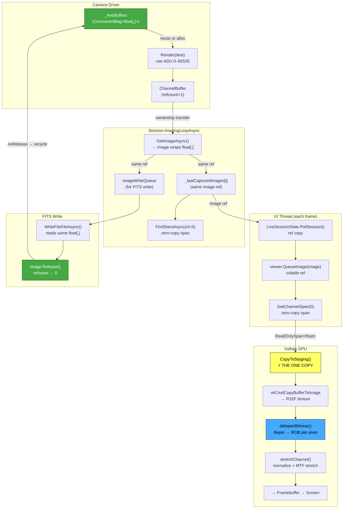

# Image Pipeline & Buffer Lifecycle

> Image pipeline + buffer-lifecycle deep-dive (moved out of the top-level README). See also the stretch-pipeline notes in CLAUDE.md.

The image pipeline manages `float[,]` pixel data from camera capture through star detection, FITS writing, and GPU display — with zero-copy buffer reuse and GPU-side debayer/stretch to minimize allocations.

## Types

| Type | Kind | Purpose |
|------|------|---------|
| `float[,]` | Raw array | Pixel data in H×W layout. The actual memory being managed. |
| `Channel` | `readonly record struct` | Typed view over a `float[,]` with `Filter`, `MinValue`, `MaxValue`, `Index`. Zero overhead. Returned by `ICameraDriver.ImageData`. |
| `ChannelBuffer` | `sealed class` (internal) | Ref-counted owner of a `float[,]`. When refcount reaches zero, `onRelease` fires → camera recycles the buffer. |
| `Image` | `partial class` | Wraps `float[][,]` (jagged array of channel planes) + `ImageMeta`. Used by star detection, FITS write, plate solve. Holds optional `ChannelBuffer` refs — call `Release()` when done. |

## Data Flow (Live Session)

One copy in the entire live path: `memcpy` into the Vulkan staging buffer. Everything else is reference passing or zero-copy spans. No CPU debayer, no CPU normalization, no scratch arrays.

## Buffer Lifecycle

1. **First exposure**: `_freeBuffers` is empty → `Render()` allocates a fresh `float[,]`.
2. **`StopExposureCore`**: Wraps the array in `ChannelBuffer(array, onRelease: bag.Add)` and stores as `Channel` in `ImageData`.
3. **`GetImageAsync`**: Builds `Image` from `Channel.Data`, transfers `ChannelBuffer` ownership to the Image, calls `ReleaseImageData()` to clear camera state.
4. **Consumers**: Star detection, FITS write, and GPU upload all read the same `float[,]` via zero-copy spans. No debayer, no normalization on CPU.
5. **`image.Release()`**: Decrements `ChannelBuffer` refcount to zero → `onRelease` fires → `float[,]` goes into `_freeBuffers`.
6. **Next exposure**: `StopExposureCore` grabs a buffer from `_freeBuffers` via `TryTake()` and passes it as `dest` to `Render()` → **zero allocation**.

## GPU Debayer & Stretch

The fragment shader handles all image processing in a single pass per pixel:

1. **Bayer demosaic** (`imgSource=RawBayer`): bilinear interpolation from 3×3 neighborhood via `texelFetch` on the raw mosaic texture, with configurable Bayer pattern offset
2. **Normalization**: `raw × normFactor` where `normFactor = 1/MaxValue`
3. **MTF stretch**: pedestal subtraction → shadow clip → midtone transfer function
4. **Curves boost** and **HDR compression** (optional)
5. **WCS grid overlay** (optional, in FITS viewer)

For mono cameras (`imgSource=RawMono`), step 1 is skipped. For pre-debayered RGB files (`imgSource=ProcessedChannels`), all 3 channel textures are sampled individually.

## FITS Viewer Path

The FITS viewer (`AstroImageDocument`) normalizes the raw image to [0,1] in-place and computes histogram-based stretch statistics on CPU. For RGGB images, CPU debayer is skipped — the raw mosaic is uploaded and the GPU shader debayers. Per-channel stats are computed from the Bayer sub-channel pixels.

## Guide Camera

The guide camera follows the same `ChannelBuffer` lifecycle. `CaptureGuideFrameAsync` calls `GetImageAsync` → gets an `Image` with transferred `ChannelBuffer`. `GuideLoop.RunAsync` releases the old frame before each new capture. The double-buffer mechanism ensures the camera never overwrites pixel data still being read by the viewer.
