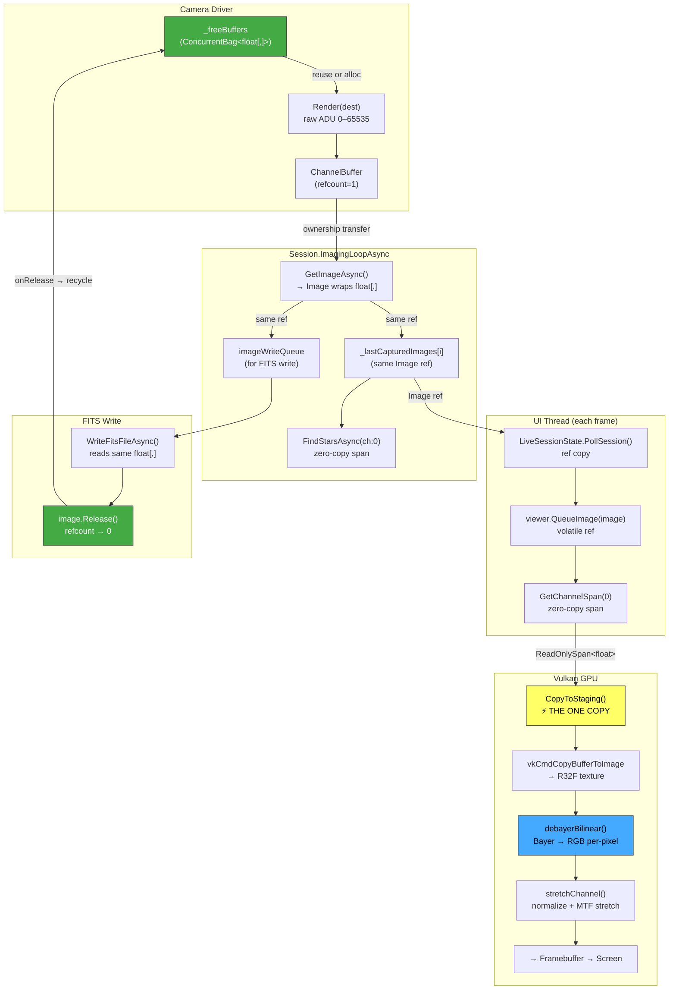

# Image Pipeline & Buffer Lifecycle

> Image pipeline + buffer-lifecycle deep-dive (moved out of the top-level README). See also the stretch-pipeline notes in CLAUDE.md.

The image pipeline manages `float[,]` pixel data from camera capture through star detection, FITS writing, and GPU display, with zero-copy buffer reuse and GPU-side debayer/stretch to minimize allocations.

## Types

| Type | Kind | Purpose |
|------|------|---------|
| `float[,]` | Raw array | Pixel data in H×W layout. The actual memory being managed. |
| `Channel` | `readonly record struct` | Typed view over a `float[,]` with `Filter`, `MinValue`, `MaxValue`, `Index`, and an optional internal `Buffer` (the ref-counted owner travels WITH the channel). Zero overhead. Returned by `ICameraDriver.ImageData`. `MinValue`/`MaxValue` are rescanned from the actual pixel data on every capture; they are the observed extent of *this* frame, not the sensor's fixed ADC capacity. |
| `ChannelBuffer` | `sealed class` (internal) | Ref-counted owner of a `float[,]`. When refcount reaches zero, `onRelease` fires → camera recycles the buffer. |
| `Image` | `partial class` | Wraps `ImmutableArray<Channel>` + `ImageMeta` (primary ctor; a legacy `float[][,]` overload stamps image-wide min/max on every channel). Image-wide `MaxValue`/`MinValue` are the derived extrema across channels; per-channel values via `GetChannel`. The ctor harvests each channel's `Buffer`; call `Release()` when done. Used by star detection, FITS write, plate solve. |
| `ImageMeta.SensorFullScaleAdu` | `float?` | The saturation level of the pixel data, in the SAME units as the data; distinct from `Image.MaxValue` above. Populated from `ICameraDriver.MaxADU` at the `GetImageAsync` choke point (live captures) or a FITS `SATURATE` card (read AND written, round-trips). The vendor SDK hands TianWen NATIVE-scale values (16383 for the 14-bit ASI533MC Pro) and TianWen does not left-shift on capture, so `DALCameraDriver.MaxADU` reports the native ADC full-scale (`AdcResolution`); N.I.N.A. files span the full 16-bit container only because N.I.N.A. multiplies on recording. `Image.UnitScaleDivisor` (single source of truth, shared by `ScaleFloatValuesToUnit(InPlace)` + TIFF export) prefers this over `MaxValue` (clamped to never go below the observed peak), so an under-exposed live capture lands below 1.0 instead of always stretching its own peak to exactly 1.0; rescales with the pixels through every rescale (`Image.RescaleMeta`). Null → observed-peak fallback. |

## Data Flow (Live Session)

One copy in the entire live path: `memcpy` into the Vulkan staging buffer. Everything else is reference passing or zero-copy spans. No CPU debayer, no CPU normalization, no scratch arrays.

```mermaid
flowchart TD
    subgraph Camera["Camera Driver"]
        Free["_freeBuffers\n(ConcurrentBag&lt;float[,]&gt;)"]
        Render["Render(dest)\nraw ADU 0–65535"]
        CB["ChannelBuffer\n(refcount=1)"]
    end

    subgraph Session["Session.ImagingLoopAsync"]
        GIA["GetImageAsync()\n→ Image wraps float[,]"]
        LAST["_lastCapturedImages[i]\n(same Image ref)"]
        STARS["FindStarsAsync(ch:0)\nzero-copy span"]
        QUEUE["imageWriteQueue\n(for FITS write)"]
    end

    subgraph UI["UI Thread (each frame)"]
        POLL["LiveSessionState.PollSession()\nref copy"]
        QIMG["viewer.QueueImage(image)\nvolatile ref"]
        SPAN["GetChannelSpan(0)\nzero-copy span"]
    end

    subgraph GPU["Vulkan GPU"]
        STAGE["CopyToStaging()\n⚡ THE ONE COPY"]
        DMA["vkCmdCopyBufferToImage\n→ R32F texture"]
        DEBAYER["debayerBilinear()\nBayer → RGB per-pixel"]
        STRETCH["stretchChannel()\nnormalize + MTF stretch"]
        SCREEN["→ Framebuffer → Screen"]
    end

    subgraph FITS["FITS Write"]
        WRITE["WriteFitsFileAsync()\nreads same float[,]"]
        REL["image.Release()\nrefcount → 0"]
    end

    Free -->|"reuse or alloc"| Render
    Render --> CB
    CB -->|"ownership transfer"| GIA
    GIA -->|"same ref"| LAST
    GIA -->|"same ref"| QUEUE
    LAST --> STARS
    LAST -->|"Image ref"| POLL
    POLL --> QIMG
    QIMG --> SPAN
    SPAN -->|"ReadOnlySpan&lt;float&gt;"| STAGE
    STAGE --> DMA
    DMA --> DEBAYER
    DEBAYER --> STRETCH
    STRETCH --> SCREEN
    QUEUE --> WRITE
    WRITE --> REL
    REL -->|"onRelease → recycle"| Free

    style STAGE fill:#ff6,stroke:#333,color:#000
    style DEBAYER fill:#4af,stroke:#333,color:#000
    style Free fill:#4a4,stroke:#333,color:#fff
    style REL fill:#4a4,stroke:#333,color:#fff
```

## Buffer Lifecycle

1. **First exposure**: `_freeBuffers` is empty → `Render()` allocates a fresh `float[,]`.
2. **`StopExposureCore`**: Wraps the array in `ChannelBuffer(array, onRelease: bag.Add)` and stores it ON the `Channel` (`Channel.Buffer` init-prop) in `ImageData`; the buffer travels with its channel from here on.
3. **`GetImageAsync`**: The single typed hand-off; `new Image([channel], bitDepth, pedestal, meta)`; the `Image` constructor harvests the channel's `Buffer` ref (no `AddRef`, no attach-after-construct), then `ReleaseImageData()` clears camera state. Consequence for callers: `ImageData` reads null after `GetImageAsync`, if you need the raw `Channel`, read it *before* the call (this ordering trap cost a red sim test; see `AlpacaSimulatorTests.Camera_ExposesAndDownloadsViaImageBytes`). `FakeCameraDriver` deliberately keeps its `ImageData` but strips the (transferred) `Buffer` from it, so a second `GetImageAsync` re-wraps without double-harvesting the ref.
4. **Consumers**: Star detection, FITS write, and GPU upload all read the same `float[,]` via zero-copy spans. No debayer, no normalization on CPU.
5. **`image.Release()`**: Decrements `ChannelBuffer` refcount to zero → `onRelease` fires → `float[,]` goes into `_freeBuffers`.
6. **Next exposure**: `StopExposureCore` grabs a buffer from `_freeBuffers` via `TryTake()` and passes it as `dest` to `Render()` → **zero allocation**.

## How a plane is READ, and why the storage type is not the lever (2026-09-15)

The planes are `float[,]` and stay `float[,]`: `Channel.Data`, `ChannelBuffer`, `Image.FromChannel`
and `AlpacaImageBytes.DecodeChannel` are public with that type, four camera drivers recycle it
through their free-buffer bags, and FITS.Lib hands it back. The question whether to migrate them to
a flat `float[]` came up after the `BitMatrix` rework (which did exactly that for `ulong[,]`), and
was answered by measurement rather than by analogy.

**The microbenchmark** (3024 x 3025 plane, best of 9, one plane, three access shapes in three
spellings; the AOT columns are what ships). **Measured on both boxes, and the second is not a
re-run of the first**: the harness was re-derived from this description on the desktop rather than
copied, and every spelling of a shape walks the same pixels in the same order, so their checksums
agree exactly. A mismatch there would mean the variants were not comparable.

| shape / spelling | arm64 JIT | arm64 AOT | x64 JIT | x64 AOT |
|---|---|---|---|---|
| stream, `float[,]` `[y, x]` | 8.07 | 8.10 | 8.75 | 8.50 |
| stream, `float[]` `y * w + x` | 8.07 | 8.14 | 8.59 | 8.21 |
| stream, row slices of a span over the `float[,]` | 8.12 | 8.09 | 8.22 | 7.96 |
| 3x3 stencil, `float[,]` `[y, x]` | 28.14 | 28.68 | 33.49 | 27.48 |
| 3x3 stencil, `float[]` `y * w + x` | 19.19 | 19.35 | 25.50 | 18.20 |
| 3x3 stencil, row slices of a span over the `float[,]` | 16.53 | **11.75** | 19.83 | **13.05** |
| bilinear gather, `float[,]` `[y, x]` | 18.79 | 17.46 | 21.77 | 19.48 |
| bilinear gather, `float[]` `y * w + x` | 17.02 | 15.43 | 15.15 | 12.37 |
| bilinear gather, flat span over the `float[,]` | 16.43 | 14.72 | 13.66 | 11.32 |

arm64 is the Surface (win-arm64, 2026-09-15); x64 is the desktop (win-x64, 16 cores, 2026-09-15).
**Neither box is uniformly faster** under AOT: the desktop wins both gather rows that use a span or a
flat array (14.72 to 11.32, 15.43 to 12.37) and loses the stencil's span row (11.75 to 13.05). So the
absolute times are not a ranking of the two machines, and the thing that actually differs between
them is how much the SPELLING costs on each, which is the next bullet.

Three things follow, and they are the rules:

- **The storage type is not the lever, on either box.** A span over the EXISTING `float[,]`, sliced
  per row, beats a native flat `float[]` on the stencil under AOT (11.8 against 19.4 ms on arm64,
  13.1 against 18.2 on x64), because a bounded slice is what lets the compiler drop the per-element
  checks, where `y * w + x` on a 1D array still checks every load. It wins the gather on both too.
  Migrating `Channel.Data` would have made the loops slower than the idiom already in
  `Image.Arithmetic` / `Masks` / `Resize` / `Stretch`, at the price of a package break.
- **The `[y, x]` spelling is the cost and AOT widens it; HOW MUCH is per architecture, so quote the
  multiplier with a box attached.** A multi-dimensional index is a multiply and two bounds
  checks the compiler cannot lift. On a neighbourhood loop that is 2.4x on arm64 and 2.1x on x64, the
  one figure that travels. On a gather it does NOT travel: 15 percent on arm64 against **72 percent**
  on x64, nearly five times the penalty on the box that is not the Surface. A stream is unaffected on
  both (it is bound by the dependent add, not the address). AOT widens the gap on each: on x64 the
  stencil goes 1.69x under JIT to 2.11x under AOT.
- **Take the view once per operation, exactly as residency is resolved once.** `Image.ResidentPlanes`
  exists because a per-sample residency check cost +8.7 to +20.3 percent; a per-sample
  `MemoryMarshal.CreateReadOnlySpan(ref plane[0, 0], plane.Length)` is the same mistake one level
  down. `SubpixelValue` and `Lanczos3Value` therefore have span-plus-width overloads, the `float[,]`
  ones are wrappers for a caller sampling a handful of positions, and the warp loops take the view
  once per ROW (a span cannot be captured by the `Parallel.For` lambda; once per row is 1 / width of
  the per-sample cost). The row is the natural unit for a stencil too: MHC reads its five source rows
  as spans and runs the same kernels unclamped over the interior, with the clamped path kept for the
  two-pixel border.

**What it bought, measured with `PlaneAccessBenchmarks`, `DebayerBenchmarks` and `WarpBenchmarks`
before and after, same box, same day** (the baseline from a worktree at the benchmark commit, so the
edits could not leak into it):

| benchmark (win-arm64, JIT, Release) | size | before | after |
|---|---|---|---|
| `Lanczos3Value`, every pixel, single-threaded | 1024 sq | 164.0 ms | 120.8 ms |
| `Lanczos3Value` | 2048 sq | 518.7 ms | 470.2 ms |
| `GetLumaStretchStatsAsync` | 1024 sq | 8.36 ms | 4.01 ms |
| `GetLumaStretchStatsAsync` | 2048 sq | 26.7 ms | 14.2 ms |
| `SplitBayerChannels` + `MergeBayerChannels` | 1024 sq | 3.79 ms | 1.93 ms |
| `SplitBayerChannels` + `MergeBayerChannels` | 2048 sq | 12.3 ms | 9.73 ms |
| `Accumulate_Mono` (CONTROL: sampler through the `float[,]` wrapper) | 1024 / 2048 sq | 9.11 / 36.5 ms | 8.89 / 35.4 ms |
| `Accumulate_Color` (CONTROL) | 1024 / 2048 sq | 25.3 / 110.4 ms | 23.8 / 102.8 ms |
| MHC debayer, `Parallel.For`, real 3008 sq frame | 3008 sq | 27 to 85 ms (four runs) | 6.0 to 16 ms (three runs) |
| BilinearMono debayer (2x2 fold), same | 3008 sq | 3.0 to 10 ms | 3.5 to 4.2 ms |
| VNG debayer (CONTROL, untouched), same | 3008 sq | 73 to 141 ms | 41 to 74 ms |

Read the two halves differently. The single-threaded rows are default-job BenchmarkDotNet (15 or more
iterations) and the controls moved by 2 to 7 percent, within the spread `WarpBenchmarks` records, so the
changed rows are attributable: the luma statistic HALVED, and that is the per-sample residency check
removed (it went through the `Planes` accessor three times per pixel), not the index; Lanczos3 gained
26 percent at 1024 and 9 at 2048 ON ARM64 (see the x64 table below, where it is 6 and 5), so at the
larger plane the 36-tap gather is partly memory-bound and the address arithmetic was never all of it;
the CFA split/merge gained 49 and 21 percent the same way.

**The same three rows on the desktop (2026-09-15), from a worktree at the same benchmark commit**,
with `UseLocalSiblings` resolving true on both sides so only TianWen's own imaging code differed, and
with the baseline verified to carry no span overload and to still read `Planes[c].Data[y, x]` three
times per pixel:

| benchmark (win-x64, JIT, Release) | size | before | after | x64 gain | arm64 gain |
|---|---|---|---|---|---|
| `Lanczos3Value`, every pixel, single-threaded | 1024 sq | 232.3 ms | 218.2 ms | 6% | 26% |
| `Lanczos3Value` | 2048 sq | 922.5 ms | 877.9 ms | 5% | 9% |
| `GetLumaStretchStatsAsync` | 1024 sq | 10.96 ms | 5.67 ms | 48% | 52% |
| `GetLumaStretchStatsAsync` | 2048 sq | 42.78 ms | 22.74 ms | 47% | 47% |
| `SplitBayerChannels` + `MergeBayerChannels` | 1024 sq | 3.34 ms | 1.58 ms | 53% | 49% |
| `SplitBayerChannels` + `MergeBayerChannels` | 2048 sq | 13.50 ms | 7.32 ms | 46% | 21% |

Two of the three carry over and one does not. **The luma statistic halves on both boxes** (47 to 48
percent here, 47 to 52 there), which is the strongest support for the attribution above: it is the
per-sample residency check, and a residency check costs much the same anywhere because it is a branch
rather than an addressing mode. The CFA split and merge carries over too, and beats its arm64 figure
at 2048. **Lanczos3 is the row that does not travel**, 6 percent here against 26 at 1024. The gain is
real and outside the error bars (232.3 +/- 2.4 to 218.2 +/- 1.2), simply small. **Do not quote the 26
percent as the gain this change buys.**

**Why it is small here was measured rather than reasoned about, and the first answer written down was
wrong.** That answer was "the 36-tap gather is memory-bound on this box", which a bigger L1 and L2
argue against before any measurement does, and which the numbers refute outright. A decomposition of
the kernel into four variants (the shipped shape with `[sy, sx]`, the shipped shape with row spans,
the same with the weights hoisted out, and the twelve weights on their own) says:

| share of the Lanczos3 loop, x64 | 1024 sq (4 MB) | 2048 sq (16 MB) |
|---|---|---|
| the addressing, which is what this commit changed | 5.7% | 5.4% |
| the weight math, which nothing changed | 71.7% | 71.8% |

**Both shares are flat across a four-fold change in working set**, which is the opposite of what a
cache effect looks like, and the weights-only variant prices the same 72 percent on its own rather
than by subtracting two other measurements. So on x64 the loop is dominated by the twelve
`MathF.Sin` calls per destination pixel, and the addressing was only ever about a twentieth of it.
The Surface's own fall from 26 percent at 1024 to 9 at 2048 IS size-dependent and is still consistent
with a cache effect there; this box's flat 5 to 6 percent is a different situation with the same
symptom, and reading one as the other is what produced the wrong sentence.

**The 72 percent was reducible, and the lever was algebra rather than a table (SHIPPED,
`Image.Lanczos3Weights`).** The six taps of one axis sit at `t_i = f + 2 - i` for one fraction `f`, so
their sines are not six independent values: `sin(PI*t_i)` is `(-1)^i sin(PI*f)`, and `sin(PI*t_i/3)`
is one angle addition away from `sin` and `cos` of `PI*f/3`, whose per-tap coefficients are constants.
One axis therefore needs a `Math.Sin` and a `Math.SinCos` where the direct form made six `MathF.Sin`
calls. No approximation and no lookup table, so this is the same kernel rather than a cheaper one.

| `PlaneAccessBenchmarks.Lanczos3`, x64, JIT, Release | before | after |
|---|---|---|
| 1024 sq | 218.2 ms | **122.4 ms** (1.78x) |
| 2048 sq | 877.9 ms | **488.1 ms** (1.80x) |

Two things worth reading off that. It is **larger than the whole `[y, x]` pass bought on this box**,
by a factor of about twelve, which is what a decomposition is for: the 5 percent was measured and
optimised first because it was visible, and the 72 percent was not looked at until the shares were
priced. And it puts x64 at 122.4 ms where arm64's post-pass figure was 120.8, so a row that was 1.8x
apart between the two boxes is now level, which is itself a check that the win is the arithmetic and
not something local.

**It is also ten times NEARER the window than the form it replaced**, worst weight error 3.0e-8
against 2.9e-7 over 10,001 fractions, because it evaluates from the fraction instead of from a
float-rounded tap offset. `Lanczos3WeightTests` pins that as a DIRECTION (`TheIdentityIsNearer...`)
rather than a bound, so if a later edit turns the speed into a trade the test says so.

**Two traps found while proving it, both of which made the working version look wrong when it was not.**
The reduction has to be done in the tap offset's own arithmetic: `double t = f + 2 - i` with `f` a
float and int literals is FLOAT arithmetic that widens afterwards, so `fl(f + 2)` rounds by up to
half an ulp of 3, and a numerator taken from the exact fraction against a denominator taken from the
rounded offset reads as a 2.4e-3 weight error at the tap nearest the sample. The OLD kernel was immune
to this precisely because it used one rounded offset in both halves, where the error cancels, which is
also why it beat a careless "more exact" rewrite. And the comparison that settles it is against a
DOUBLE reference, never against the old form: judged against the old form a correct identity and a
wrong one are indistinguishable, since a disagreement does not say which side moved. The first two
diagnoses written down were both wrong for exactly that reason, and a reference settled it in one run.
That is why `Lanczos3WeightTests` compares against a reference it computes itself and keeps
`Image.Lanczos3` only as the definition to judge, not as the expected value.

**Not re-measured on x64**: the two `Accumulate_*` controls and all three debayer rows. The controls
are worth having and would make the x64 rows attributable the way the arm64 ones are; the debayer
rows are a `Parallel.For` whose UNTOUCHED control swung by a factor of two between runs of the same
binary, and a 16-core box will not make that quieter.

The debayer rows are a `Parallel.For` across every core judged by a `[ShortRunJob]`, and the
UNTOUCHED control swung by a factor of two between runs of the same binary (VNG 73 to 141 ms; AHD, also
untouched, read 338, 871 and 409 ms). Nothing finer than an order of magnitude can be read off them,
which is why they are ranges and not means. Two things can: **MHC is an order of magnitude faster**
(its worst after-reading, 16 ms, is under its best before-reading, 27 ms, and the typical pairing is
64 to 6 ms), which is what removing thirty clamped `float[,]` reads per pixel should buy; and **the 2x2
mono fold did not measurably change**, exactly as the stream row of the microbenchmark predicted for a
loop that touches each element about once. The fold's span spelling is kept for uniformity, not as a
win, and a future reader should not cite it as one. A parallel debayer wants the default job and a
quiet box before any single-digit-percent claim, the same rule `WarpBenchmarks` already states.

Loops still spelled `[y, x]` after this pass, by site count: `Stacking/CometModel.cs` (26),
`Stacking/ChunkedTwoPassStrategy.cs` (20), `Planetary/FrameSharpnessMap.cs` (10),
`Calibration/BadPixelAccumulator.cs` (7), plus the planetary `Accumulate*Into` kernels' STORE side
(`channelAccum[c][y, x] +=`, left as the control that shows whether the sampler or the store is the
cost). Convert one per measured commit; the import decoders (`Image.Import.cs`) are I/O-bound and not
worth touching.

## GPU Debayer & Stretch

The fragment shader handles all image processing in a single pass per pixel:

1. **Bayer demosaic** (`imgSource=RawBayer`): one of five branches selected by `stretchBlend.z`
   (`ImageRendererBase.GpuDebayerMode`), all `texelFetch` on the raw mosaic texture with a
   configurable Bayer pattern offset -- `0` bilinear colour, `1` MHC, `2` the raw mosaic as grey,
   `3` monochrome (the 2×2 quad average), `4` VNG.

   **Below 100% the colour branches demosaic at the screen's resolution, not the mosaic's.** One
   demosaic sample per screen pixel subsamples the CFA-period noise texture every interpolating
   demosaic leaves behind, and that beats against the screen grid at `1/(zoom - 0.5)` -- a square
   lattice near fit zoom, a fine mesh around 55%. `stretchBlend.w` carries mosaic texels per screen
   pixel; at 2 and above the shader draws the pattern-aligned 2×2 **superpixel** (one R, two G, one B:
   a half-res colour image with no interpolation in it, what N.I.N.A. and PixInsight previews show),
   between 1 and 2 it averages the 2×2 texel box around the fragment (`debayerForZoom`). Display
   only: the save path is CPU-debayered at full resolution and never sees this.

   **Every demosaic the viewer OFFERS has a branch here, and that is a rule rather than a
   coincidence.** The save path CPU-debayers (`DisplayRasterExport` -> `Image.DebayerAsync`) while
   the screen shows the shader's output, so an algorithm with no branch is one where the file is not
   what the user was looking at. `debayerMhc` and `debayerVng` are transcriptions of
   `Image.DebayerMHCAsync` / `Image.DebayerVNGAsync` down to the epsilons; `GpuVngDebayerParityTests`
   renders a synthetic mosaic through both and holds them to zero bytes differing by more than the
   8-bit quantisation floor. AHD is the one algorithm with no branch, which is exactly why
   `ViewerActions.DebayerAlgorithms` does not offer it (it stays in `DebayerAlgorithm` for the batch
   paths, and `GpuDebayerMode` still answers MHC for a viewer state persisted before it was
   withdrawn).

   **VNG's direction thresholds are ABSOLUTE (`+ 0.01` in the frame's own units), so the branch is
   only correct on a mosaic normalised to `[0, 1]`** -- which `AstroImageDocument` guarantees for
   both the texture upload and the image `DisplayRasterExport` later debayers.

   **Every gradient compares two samples of the SAME colour, and that is what makes it a gradient.**
   A gradient has to be zero on a flat field whatever the sky's colour is doing, or the threshold that
   selects on it is selecting on colour. All four VNG helpers had colour differences instead
   (`|2g - v - c|` is `2*(green - centre)` when flat), and worse, that quantity is an affine function
   of the value it selects (`val = c + signed_grad / 2`) -- so "keep the smallest gradient" literally
   meant "keep the value nearest the centre pixel's own level". Measured on a 120 s SV605CC sub
   (GRBG, L-Quad; sky R 1472, G 2680, B 2888 ADU): **green interpolated at a blue site read 2779
   against a true 2680**, while at a red site it was right -- blue sits near green so the four
   gradients came out small and comparable and the 1.5x threshold really selected, red sits 1200 ADU
   below so every direction cleared it and the average came out unbiased. Blue sites occupy alternate
   rows AND alternate columns, so the bias landed as a **two-pixel alternation on both axes: 6.4
   display levels against 12 of pixel noise, i.e. fine stripes over the whole background at 1:1**,
   thirty times what MHC and AHD show on the same frame. Fixed 2026-09-14 by giving each direction the
   centre's OWN colour two away (`|v - c|`) plus the green pair across the axis (`|gN - gS|`), both
   zero when flat; the same rule fixes the horizontal / vertical helpers (gradient on the green two
   away rather than on `|neighbour - centre|`) and the diagonal one (the diagonal two away carries the
   centre's colour; the one away does not). On the real frame the alternation fell to 0.16 / 0.01
   levels -- below MHC and AHD -- the star ring dip stayed at 0.00% (the property VNG is the viewer's
   default for) and the colour fringe around real stars *improved*, 18.40% to 16.60% mean.

   **Nothing in the suite could see it, which is the part worth keeping.** A demosaic was checked
   against its own pinned hash (a bias is stable, so the hash was green) and against the GPU
   (`GpuVngDebayerParityTests`, which mirrors the same mistake on both sides, so it was green too).
   `VngFlatFieldBiasTests` is the missing kind of test: a FLAT field, where each channel has exactly
   one right answer and a bias has nowhere to hide, asserted for all three colour algorithms so it
   cannot be satisfied by the behaviour it is meant to catch.
2. **Normalization**: `raw × normFactor` where `normFactor = 1/MaxValue`
3. **MTF stretch**: pedestal subtraction → shadow clip → midtone transfer function
4. **Curves boost** and **HDR compression** (optional)
5. **WCS grid overlay** (optional, in FITS viewer)

For mono cameras (`imgSource=RawMono`), step 1 is skipped. For pre-debayered RGB files (`imgSource=ProcessedChannels`), all 3 channel textures are sampled individually.

## A Canon raw file is cropped on import

`Image.TryReadCanonRaw` (`Image.Import.cs`) reshapes only `CanonRawFile.ActiveArea` out of the decoded
raster, because the raster is bigger than the photograph on every Canon body: shielded photosites down
the left and across the top, a partly-shielded transition, and a few spare columns and rows at the far
edges.

| body | decoded | imported |
|---|---|---|
| 5D Mark IV | 6888x4546 | 6720x4480 at (156, 58) |
| EOS M50 | 6288x4056 | 6000x4000 at (276, 48) |
| EOS R5 | 5248x3510 | 5088x3392 at (144, 108) |
| CR2 (6D) | 5568x3708 | 5472x3648 at (84, 50) |

Uncropped, that margin was a flat black L on any stretched render and ~3% of the frame sitting at the
black level inside every statistic computed over it -- including the subsampled median/MAD the stretch
solves from. The rules that go with it are in the repo `CLAUDE.md` ("A Canon raw is cropped to its
active area on import"): FC.SDK.Raw deliberately does not crop the mosaic, the CFA pattern comes from
the active area rather than the raster, and `MaxValue` is measured over the kept pixels.

**What the discarded margin is worth keeping for.** Its left columns are optical black: same
amplifier, ADC, gain and timing as the picture, zero photons. Measured on a 5D Mark IV frame over
`x < 144` (655k px, per CFA cell) the level is 2047.9 to 2048.3 against the hardcoded
`blackLevel = 2048` FC.SDK.Raw subtracts, and the spread is 15.6 to 17.9 ADU of pure read noise with
no sky shot noise in it -- which nothing measured from the active area can give. Three caveats before
anyone builds on it, all measured: the TOP strip is not clean (its `G(r)` reads 2027 with three times
the noise, and R and G(b) reach 3287 and 4411, so use columns); Canon's `BlackMaskLeftBorder` fields
read 0 on every file inspected, so the usable window must be found by measurement; and the masked
region is NARROWER than the discarded margin (black stops at column 143, the active area starts at
156). It is a bias and read-noise reference, **not** a dark: dark current is per-pixel and structured,
and a strip at one edge cannot predict a hot pixel in the middle. Tracked in FC.SDK.Raw's `TODO.md`.

## FITS Viewer Path

The FITS viewer (`AstroImageDocument`) normalizes the raw image to [0,1] in-place and computes histogram-based stretch statistics on CPU. For RGGB images, CPU debayer is skipped; the raw mosaic is uploaded and the GPU shader debayers. Per-channel stats are computed from the Bayer sub-channel pixels.

## Guide Camera

The guide camera follows the same `ChannelBuffer` lifecycle. `CaptureGuideFrameAsync` calls `GetImageAsync` → gets an `Image` with transferred `ChannelBuffer`. `GuideLoop.RunAsync` releases the old frame before each new capture. The double-buffer mechanism ensures the camera never overwrites pixel data still being read by the viewer.

## Driver Coverage (audit 2026-07-06; gaps closed same day)

The zero-alloc recycle loop above is the *design*; per-driver state:

| Driver | `ChannelBuffer` | Recycle (`_freeBuffers`) | Notes |
|--------|:---------------:|:------------------------:|-------|
| DAL (ZWO / QHY) | ✅ | ✅ | The reference implementation (`DALCameraDriver.cs`) |
| Fake | ✅ | ✅ | Mirrors DAL |
| Alpaca | ✅ | ✅ | `AlpacaImageBytes.DecodeChannel(payload, recycled)` decodes into a recycled buffer on shape match (drops it on ROI/bin change); `onRelease` returns it to the bag. (Was a no-op release, fresh LOH alloc per frame, until the 2026-07-06 audit.) |
| ASCOM | ✅ | ✅ | `ImageData` caches the COM `ImageArray` marshal + `FromWxHImageData(sourceData, recycled)` transpose **once per exposure**; cleared by `ReleaseImageData` + `StartExposureAsync` (mirrors Alpaca). (Was a computed property, full COM re-marshal on every read, no-op release, until the audit. The "reads null after `GetImageAsync`" contract in step 3 now holds for ASCOM too.) |
| Canon | ❌ | ❌ | Wraps the RAW-decode output array (no copy); decode allocates per frame anyway, so recycling has little to win. Deliberate. Note the file path crops to the sensor's active area (see below); the live-capture path here is already a cropped live-view frame. |

Consumer-side copies that are **by design** (do not "fix"):

- `LiveCameraFrameStream.Push` deep-copies each pushed frame into a ring-owned image (normalising ADU → `[0,1]`). Required: the camera recycles its buffer immediately, and `LoadAsync` hands out shared references with a "not overwritten for Capacity pushes" guarantee; recycling ring slots would violate it.
- `LiveFramePreviewSource.AcceptFrame` copies into persistent owned buffers (reused across frames unless geometry changes) while normalising to `[0,1]`; the copy IS the normalisation pass, and it decouples the viewer from the camera recycle.
- `Image.Arithmetic` / `Image.Masks` identity paths return `CopyChannelData()`; result independence is part of the contract.
- `RollingWindowStacker.BuildMasterAsync`'s mono/RGB normalise destination; `PlanetaryMaster.NormalizeInto` wraps the destination into the returned master (`MergeAndDemosaicAsync` passes mono/RGB through), so it must own fresh arrays per publish; only the split-CFA sub-planes (consumed by merge+demosaic) reuse the persistent `_sumScratch`. Pinned by `Published_mono_master_stays_valid_after_the_next_publish`.

## The two "full scale" numbers, and why conflating them is the bug (from CLAUDE.md, 2026-08-22)

`Channel.MaxValue` / `Image.MaxValue` is the peak pixel **actually OBSERVED in that specific frame**
(rescanned per capture by `DALCameraDriver.DownloadImage`, ASCOM's `Channel.FromWxHImageData`,
Alpaca's `AlpacaImageBytes.DecodeChannel`); it intentionally varies frame to frame with scene
brightness, seeing and hot pixels. It is **NOT** the sensor's saturation level. That fixed value
travels separately as the optional `ImageMeta.SensorFullScaleAdu`, populated (a) at the
`ICameraDriver.GetImageAsync` choke point from `ICameraDriver.MaxADU` for live captures, and (b) from
a FITS `SATURATE` card on read (the astrometry.net / SExtractor / PixInsight convention; TianWen
writes it back out, so it round-trips, but **neither N.I.N.A. nor SharpCap emits it**, verified
empirically). Null when neither source applies (most file imports, calibration masters, stacking
output).

Two "full scale" numbers exist:

1. **The FITS/BITPIX *container* width** (`BitDepth`, `BitDepthEx.UnsignedFullScale` = 65535 for
   Int16). This is the right divisor for **N.I.N.A.-recorded files**, because *N.I.N.A. multiplies the
   native ADC output on recording*: its ASI533 lights span [0, 65532] with 100% of values divisible by
   4, and that combing is N.I.N.A.'s recording-time scaling, **NOT** SDK behaviour. Never infer the
   SDK's delivered scale from third-party capture files.
2. **The native ADC resolution** (`AdcResolution`, 2^14-1 = 16383 for the ASI533MC Pro) -- the scale
   the vendor SDK actually hands TianWen, which does **NOT** left-shift on capture. So
   `DALCameraDriver.MaxADU` / `SensorFullScaleAdu` report the native value for live TianWen captures.

**A native ADC depth (10/12/14-bit) is never a valid `BitDepth` member**; routing it through
`BitDepthEx.FromValue` silently falls back to the container width, which was the original bug.

`Image.UnitScaleDivisor` is the single source of truth for [0,1] normalisation: `SensorFullScaleAdu`
when known (clamped to never go below the observed peak, so a hot pixel above nominal full-scale
cannot map above 1.0), else `MaxValue`. Used by `ScaleFloatValuesToUnit(InPlace)` AND the TIFF export;
a private `1/MaxValue` in any normalisation path diverges the moment `SensorFullScaleAdu` is present
(`TiffRoundTripTests` is the regression guard, and the `PlateSolveTestFile` fixture genuinely carries
`SATURATE = 255`). `SensorFullScaleAdu` rescales with the pixels through every rescale
(`Image.RescaleMeta`, like `Pedestal`), so after normalisation it reads 1.0 and a written SATURATE
stays unit-consistent with the stored data; the post-scale `MaxValue` stamp is `MaxValue * invMax`,
never a hardcoded `1.0f`, so an under-exposed live frame correctly lands below 1.0. A source without
`SensorFullScaleAdu` falls back to the prior observed-peak behaviour unchanged.

## One header parse, and where a frame's pixel scale comes from (2026-08-25)

**`ParseImageMetaFromHeader` is the ONLY place a FITS header becomes an `ImageMeta`, and both read
paths call it.** `Image.TryReadFitsFile` (pixels) and `Image.TryReadFitsHeader` (headers only, which
is what the calibration scan walks) used to be separate copies of the same ~35-card parse, ending in
two argument-for-argument identical `new ImageMeta(...)` blocks. The shared helper already existed --
its own comment says it was extracted "so the header-only path uses the same logic" -- and the pixel
path simply never called it.

The copies had drifted, and the drift was carrying three dead locals and two real defects:

| local | what it did |
|---|---|
| `pixelScale` | parsed by the pixel path and **discarded**; the header path never parsed it at all, so a declared `PIXSCALE` was unreachable however you opened the file |
| `maybeExposure` | parsed and **discarded in both**: the fallback list read `{ EXPTIME, EXPTIME, 0 }`, so `EXPOSURE` was dead everywhere and a frame carrying only that card read as a **zero-second exposure** |
| `equinox` | parsed, never used |

The zero-second exposure is the one with teeth: `ExposureDuration` is part of `MasterGroupKey`, so it
decides which dark calibrates what. **A card added to one read path is a bug in the other**, which is
why `FitsPixelScaleTests.TheTwoReadPathsAgreeOnEveryMetadataField` compares the WHOLE `ImageMeta`
record rather than the fields anyone happened to suspect: a future divergence fails there without
somebody remembering to extend an assertion.

**`ImageMeta.DeclaredPixelScale` beats `FOCALLEN`, because `FOCALLEN` is only ever a hint.** It holds
whatever was typed into a capture profile and nothing validates it -- on the 10P/Tempel 2 set it read
205 mm for a 202.5 mm rig, a 1.2% error the solver had to work against and detected on its own,
recovering 202.4 mm from the stars alone. So `Image.GetImageDim` prefers a scale the FILE states
(`PIXSCALE`, else `SCALE`) and falls back to deriving one from pixel size x binning x focal length;
with neither it returns `null` rather than guess. A declared scale is either repeating the same guess
(no worse) or reporting a solved one (much better).

**The two scales are in different conventions and must not be substituted for one another.**
`DeclaredPixelScale` is the ACTUAL image scale, so it already includes binning; `DerivedPixelScale` is
per unbinned photosite, which is why `GetImageDim` multiplies pixel size by `BinX` only on that
branch. Collapsing them into one property would silently double-count binning on a binned frame.

## A light carries the guiding quality of its own exposure

`ImageMeta.Guiding` (`GuidingStats`) is written as `GUIDERMS` / `GUIRMSRA` / `GUIRMSDE` / `GUIDEPK` /
`GUIDEN`, all arcsec. `GuideStatistics.OverExposure` reduces `Session.GuideSamples` over
`[ExposureStartTime, +ExposureDuration]` and never a rolling session average: that answers "how is the
rig doing tonight", a different question, and is actively misleading stamped on a sub taken during the
other hour. Three rules: settling/dither samples inside the window are INCLUDED (a live guiding
display excludes them because a dither is a commanded move, but if the guider had not settled while
the shutter was open the sub IS smeared, and filtering makes the worst frames report the cleanest
numbers); null is not zero, so an unguided rig writes NO cards rather than `GUIDERMS = 0`, which would
claim perfect guiding; and `GUIDEPK` earns its keep because RMS hides the single gust that trails one
sub, which is the defect it is worst at describing. Nothing else in the wild writes these cards; a
survey of the reference archive found zero guiding keywords across N.I.N.A.- and SharpCap-authored
lights, so they are ours. The session stamps `ICameraDriver.GuideStats` just before `GetImageAsync`,
since the statistic is only complete once the shutter closes and that call is the one place an
`ImageMeta` is built. Pinned by `GuideStatisticsTests` + an end-to-end `SessionImagingTests` case.
