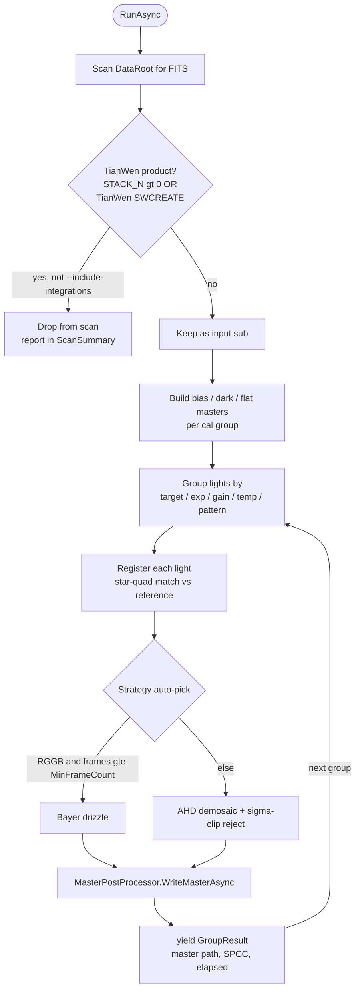
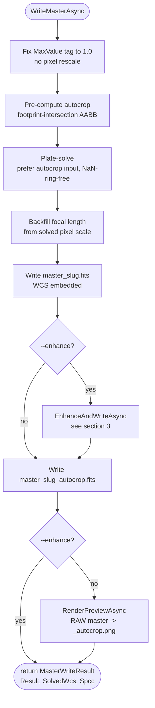
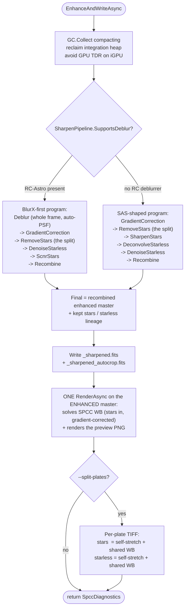
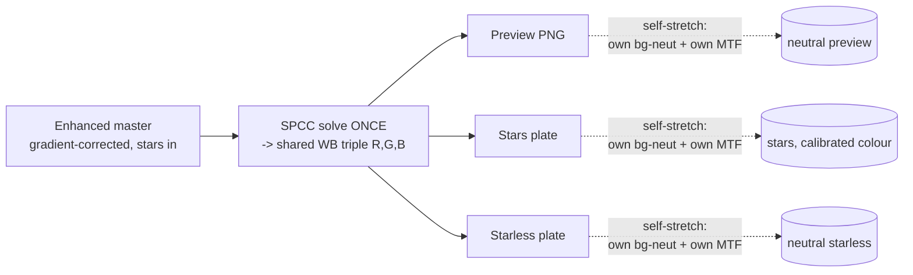
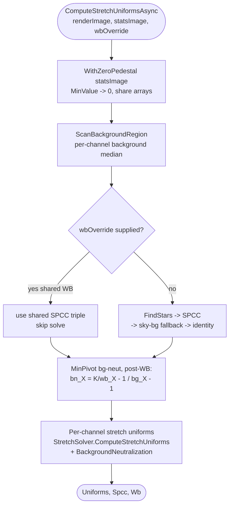

# Deep-Sky Stacking, Enhance & Display-Render Pipeline

Architecture reference for the deep-sky integration pipeline (`tianwen stack`) and,
specifically, the **unified display-render** layer that turns a linear integrated
master into the colour-calibrated PNG quick-look and the `--split-plates` edit
TIFFs. Sibling of, but completely separate from, the planetary lucky-imaging
stacker (`docs/plans/planetary-stacking.md`).

**Scope of this doc:** the flow from `StackingPipeline.RunAsync` down to the
per-pixel stretch, with the colour / white-balance / pedestal decisions that keep
the PNG and the split plates colour-matched and neutral. The buffer-lifecycle /
live-capture path is a different doc (`image-pipeline.md`).

## Code map

| Concern | Type | Project |
|---------|------|---------|
| Orchestrator (scan -> cal -> register -> integrate) | `StackingPipeline` | `TianWen.Lib/Imaging/Stacking/` |
| Post-integration disk side-effects + enhance + render | `MasterPostProcessor` | `TianWen.Lib/Imaging/Stacking/` |
| SPCC + sky-bg WB, bg-neut, MTF stretch, PNG/TIFF render | `MasterPreviewRenderer` | `TianWen.Lib/Imaging/Stacking/` |
| Pure stretch-uniform math (CPU/GPU single source) | `StretchSolver` | `TianWen.Lib/Imaging/` |
| AI enhance step program (BlurX-first / SAS-shaped) | `SharpenPipeline` | `TianWen.Lib/Imaging/Enhancement/` |
| Per-pixel CPU stretch | `Image.RenderStretchedRgba16` / `StretchChannelCpu` | `TianWen.Lib/Imaging/` |
| CLI verb | `StackSubCommand` | `TianWen.Cli/` |

`MasterPreviewRenderer` + `StretchSolver` are **CPU-only** (no GPU, no UI), so they
live in `TianWen.Lib` and `MasterPostProcessor` drives them in-pipeline. The
viewer's `AstroImageDocument.ComputeStretchUniforms` / `ComputeSkyBackgroundWB`
forward to `StretchSolver`, so the stretch math has one source the GLSL + CPU
paths agree on.

---

## 1. Top-level pipeline: `StackingPipeline.RunAsync`



**Provenance skip (never re-ingest our own outputs).** The scan drops any
TianWen-produced FITS so a processed image parked alongside the lights is never
re-stacked. Two markers (`IntegrationFitsWriter`): `STACK_N > 0` (a master) OR a
TianWen `SWCREATE` prefix (`IsTianWenProduct` -- catches sharpen / enhance outputs
which inherit the master's `SWCREATE` but carry no `STACK_N` and an
`IMAGETYP=Light`). The `ScanSummary` is reported on the progress channel so a
silent skip is visible.

---

## 2. Post-processing: `MasterPostProcessor.WriteMasterAsync`



**Output contract by data type (do not regress):**

| Tier | Files | Cropped? | Notes |
|------|-------|:--------:|-------|
| Linear (canonical) | `master_<slug>.fits` + `master_<slug>_autocrop.fits` | both | only place uncropped raster exists; `--output-format exr` mirrors both |
| Enhanced linear | `master_<slug>_sharpened.fits` + `_sharpened_autocrop.fits` | both | `--enhance`; raw masters never overwritten |
| Display PNG | `master_<slug>_autocrop.png` | **always** | bare `_<slug>.png` only when coverage is full (no autocrop) |
| Split plates | `master_<slug>_stars.tif` + `_starless.tif` | always | `--split-plates`; sRGB-ICC float, Screen-blend stars over starless |

The PNG is a display artifact, so the pipeline (NOT the CLI) renders **only the
autocrop** -- the autocrop region is NaN-ring-free, so WB / bg-neut can never be
poisoned by partial-coverage edges. The CLI renders nothing; it sets
`StackingOptions.RenderPreviewPng`, writes EXR from the emitted FITS, and prints
the SPCC summary from `GroupResult.Spcc`.

---

## 3. Enhance + render: `EnhanceAndWriteAsync`

This is where the **PixInsight OSC order** is enforced: gradient correction, then
**one** SPCC white balance with the stars in, then star removal, then a **per-plate
stretch**.



`--split-plates` is a **single AI pass**: `KeepIntermediates =
StarsAndStarlessLineage` keeps the stars-only + denoised-starless plates from the
SAME `ProcessAsync`. No second enhance runs.

---

## 4. The render model: WB once, per-plate self-stretch

This is the load-bearing colour decision. It mirrors the PixInsight OSC workflow:

```
gradient correction  ->  SPCC / WB  ONCE (stars in)  ->  star removal  ->  per-plate STRETCH
```



**Only the white balance is shared.** Each output (preview, stars, starless)
computes its **own** background-neutralisation + shadow/MTF from its own pixels.
Sharing the master's *full* stretch uniforms instead would graft the master's
bg-neut onto a plate whose background differs -> double-correction -> a colour cast
(this was the original `--split-plates` regression). Sharing only the WB keeps the
star colours on the SPCC calibration while every plate's background lands neutral.

| Quantity | Source | Shared? |
|----------|--------|:-------:|
| White balance (SPCC) | enhanced master, stars in | **yes** (one solve) |
| Background neutralisation | each plate's own pixels | no (per-plate) |
| Shadow / midtones / rescale (MTF) | each plate's own pixels | no (per-plate) |

---

## 5. The unified solve: `ComputeStretchUniformsAsync`

Single source of the bg-neut + stretch math, used by both the PNG render
(`RenderAsync`) and the split-plate TIFF (`RenderStretchedPlateTiffAsync`).



### Why `WithZeroPedestal` (the parity-restoring fix)

The stretch derives per-channel shadows from the **pedestal-subtracted** median
(`GetPedestralMedianAndMADScaledToUnit` subtracts `MinValue/MaxValue`). Raw stacked
masters happen to have `MinValue ~ 0`, so the subtraction is a no-op -- which is the
*only* reason the historical raw-master render path was colour-neutral.

An **enhanced** master is different: GraXpert background-extraction flattens the
floor to roughly half-scale (`MinValue ~ 0.16-0.41`). Subtracting that floor leaves
the faint per-channel medians as tiny near-zero residues, where small absolute
differences explode:

- 120s: `R - ped = 0.012` vs `G - ped = 0.002` -> 6x -> **green crushed** (magenta cast)
- drizzle: `median 0.012 - pedestal 0.164` -> **negative** -> the whole frame renders **black**

The auto-stretch's own shadow clipping (`median - k * MAD`) already finds the black
point, so the floor is just a uniform DC offset best left in place. `WithZeroPedestal`
rewraps the stats image with `MinValue = 0` (a cheap by-reference array share, no
pixel copy), so the enhanced master behaves exactly like the proven raw path. The
render images are stretched with the resulting `Pedestal = 0` uniform, so render +
stats stay in one coordinate space.

---

## 6. Per-pixel CPU stretch order (`StretchChannelCpu`)

The CPU loop mirrors the GLSL shader (`feedback_cpu_gpu_stretch_mirror`). For each
channel, with `Pedestal = 0` from the zero-pedestal stats:


Order: normalize -> **bg-neut -> WB** -> shadow/rescale -> MTF -> normalize-scale ->
gamut clamp. bg-neut runs *before* WB; the MinPivot bn gains are solved in post-WB
space so the post-shader background is neutral across channels by construction.

---

## 7. Parity verification (`temp/stack/output` reference)

Measured per-channel percentiles, background ratio at the 5th percentile of
luminance (`1.000` = neutral):

| Output | New (`output_split`) | Old reference (`output`) |
|--------|----------------------|--------------------------|
| 120s preview PNG | R/G=1.00, B/G=1.00 @ median 0.098 | R/G=1.00, B/G=1.00 @ median 0.098 |
| 120s starless plate bg | R/G=1.025, B/G=0.999 | R/G=1.20, B/G=0.94 (old `DualStretchPlates` cast) |
| 120s stars plate bg | R/G=1.00, B/G=1.00 | n/a (old path) |

The PNG is at parity; the split plates are *more* neutral than the old
`DualStretchPlates` output (which carried the R/G=1.20 background cast the unified
render was built to remove).

---

## 8. Dedup notes

The unification collapsed several near-duplicate code paths into single sources:

- `DualStretchPlates` (deleted) -- the self-contained plate stretch that lacked the
  PNG's WB + bg-neut. Replaced by the shared `MasterPreviewRenderer` path.
- The CLI-side PNG render + autocrop-fallback logic (deleted) -- moved into
  `MasterPostProcessor` so PNG + plates share one solve.
- `ComputeStretchUniformsAsync` is the single producer of bg-neut + stretch
  uniforms for both the PNG and the plates.
- `StretchSolver` is the single producer of the stretch-uniform math the viewer
  (`AstroImageDocument`), the CPU stretch, and the GLSL shader all agree on.
