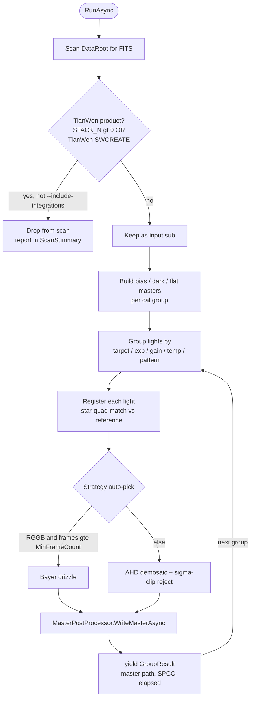
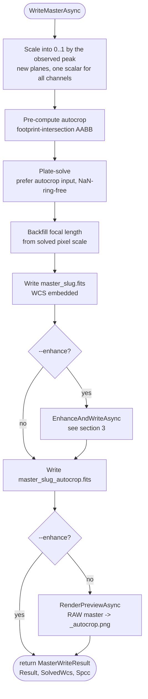
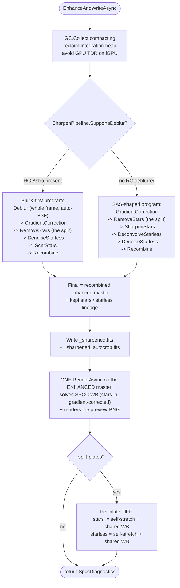
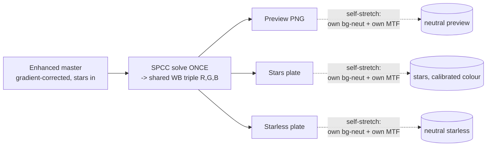
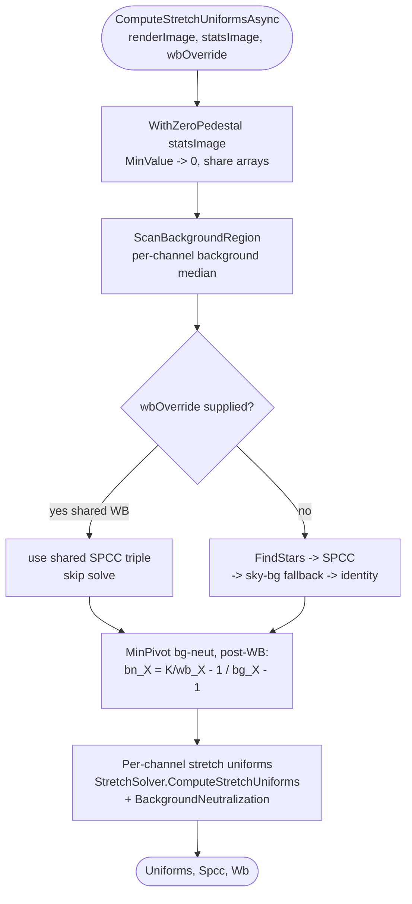

# Deep-Sky Stacking, Enhance & Display-Render Pipeline

Architecture reference for the deep-sky integration pipeline (`tianwen stack`) and,
specifically, the **unified display-render** layer that turns a linear integrated
master into the colour-calibrated PNG quick-look and the `--split-plates` edit
TIFFs. Sibling of, but completely separate from, the planetary lucky-imaging
stacker (`docs/plans/planetary-stacking.md`).

**Scope of this doc:** the flow from `StackingPipeline.RunAsync` down to the
per-pixel stretch, with the colour / white-balance / pedestal decisions that keep
the PNG and the split plates colour-matched and neutral. The buffer-lifecycle /
live-capture path is a different doc (`image-pipeline.md`).

## Code map

| Concern | Type | Project |
|---------|------|---------|
| Orchestrator (scan -> cal -> register -> integrate) | `StackingPipeline` | `TianWen.Lib/Imaging/Stacking/` |
| Post-integration disk side-effects + enhance + render | `MasterPostProcessor` | `TianWen.Lib/Imaging/Stacking/` |
| SPCC + sky-bg WB, bg-neut, MTF stretch, PNG/TIFF render | `MasterPreviewRenderer` | `TianWen.Lib/Imaging/Stacking/` |
| Pure stretch-uniform math (CPU/GPU single source) | `StretchSolver` | `TianWen.Lib/Imaging/` |
| AI enhance step program (BlurX-first / SAS-shaped) | `SharpenPipeline` | `TianWen.Lib/Imaging/Enhancement/` |
| Per-pixel CPU stretch | `Image.RenderStretchedRgba16` / `StretchChannelCpu` | `TianWen.Lib/Imaging/` |
| CLI verb | `StackSubCommand` | `TianWen.Cli/` |

`MasterPreviewRenderer` + `StretchSolver` are **CPU-only** (no GPU, no UI), so they
live in `TianWen.Lib` and `MasterPostProcessor` drives them in-pipeline. The
viewer's `AstroImageDocument.ComputeStretchUniforms` / `ComputeSkyBackgroundWB`
forward to `StretchSolver`, so the stretch math has one source the GLSL + CPU
paths agree on.

---

## 1. Top-level pipeline: `StackingPipeline.RunAsync`


```mermaid
flowchart TD
    Start([RunAsync]) --> Scan[Scan DataRoot for FITS]
    Scan --> Prov{TianWen product?<br/>STACK_N gt 0 OR<br/>TianWen SWCREATE}
    Prov -->|yes, not --include-integrations| Drop[Drop from scan<br/>report in ScanSummary]
    Prov -->|no| Keep[Keep as input sub]
    Keep --> Cal[Build bias / dark / flat masters<br/>per cal group]
    Cal --> Group[Group lights by<br/>target / exp / gain / temp / pattern]
    Group --> Reg[Register each light<br/>star-quad match vs reference]
    Reg --> Strat{Strategy auto-pick}
    Strat -->|RGGB and frames gte MinFrameCount| Driz[Bayer drizzle]
    Strat -->|else| Ahd[AHD demosaic + sigma-clip reject]
    Driz --> Post[MasterPostProcessor.WriteMasterAsync]
    Ahd --> Post
    Post --> Yield[yield GroupResult<br/>master path, SPCC, elapsed]
    Yield -->|next group| Group
```

**Provenance skip (never re-ingest our own outputs).** The scan drops any
TianWen-produced FITS so a processed image parked alongside the lights is never
re-stacked as a fresh sub. Two markers, both gated by `--include-integrations`
(`IntegrationFitsWriter`): `STACK_N > 0` (a master) OR a TianWen `SWCREATE` prefix
(`IsTianWenProduct` -- catches AI sharpen / enhance outputs, which inherit the
master's `SWCREATE` but carry NO `STACK_N` and an `IMAGETYP=Light` copied from the
original subs, so the `STACK_N` check alone misses them, and they silently
re-stack into a ghost master). The `ScanSummary` is reported on the progress
channel -- silent re-ingestion was the footgun this closes.

**Registration, and what a master's width is made of (2026-09-07).** Detection runs once per light on
the pre-debayer mosaic (`FrameRegistration.DetectAsync`), where a single warm photosite is refused by
its peak-photosite share of the 3 by 3 flux (`Image.SinglePhotositeFractionMax`, measured 0.92 to 0.99
for warm pixels against 0.15 to 0.41 for stars); the bulk affine is a RANSAC over quad centres
(`StarReferenceTable`), and `RegistrationRefiner.RefineRigid` closes its residual with a Procrustes over
nearest-neighbour pairs, dropping any pair whose raw positions coincide while the bulk affine moved the
detection (`UnmovedTolerancePx`): a detection fixed to the sensor pairs with its own copy at minus the
drift, and averaging those in halved every shift under 5 px on a warm night. Each frame is then placed
on the union canvas by `Image.WarpToReferenceGridAsync` with the kernel `--warp-interpolation` names:
clamped Lanczos-3 (`Lanczos3Clamped`, the default since 7.1) adds none measurable and bounds the ring
the plain kernel draws on a debayered plane (13 percent of a star's peak, since per colour a 2 px
star is a spike; the clamp is PixInsight's rule at a measured 0.7), bilinear (every master built
before 7.1) adds phase times one minus phase of a pixel's variance per axis, about a pixel of FWHM in
quadrature at 2 px seeing. **A master is the mean of its
warped frames to 0.3 percent**, star by star: the combine, the rejection and the normalisation add no
width, so a master's width is its subs' plus the kernel's plus any misregistration, and nothing else.
The measurements behind each clause: `docs/plans/deconvolver-training.md`, E2.10a "the third finding
placed" and R1; the traps: `docs/known-limitations.md`.

**Drizzle normalises per frame, per CFA COLOUR, same as every other strategy normalises per channel.**
`DrizzleStrategy` and `TilePipelinedDrizzleStrategy` forward-project raw CFA samples directly (no
debayer, no warp), and used to skip `Normalizer` entirely on the theory that "every interior pixel
averages the same frames, so a session-long sky trend is one constant across the whole master." That
was never true: the forward-project deposit spreads weight UNEVENLY across the 2x2 CFA phases under
sub-pixel dither (measured 13-30% per-frame variance on a real 135-sub RGGB session), so different
output channels end up as the weighted average of a different effective MIX of frames. A session-long
sky trend then bakes into the master as a fixed phase-locked 2x2 colour bias (measured R 1.67, G 1.06,
B 1.90 sigma of block-median spread on 10P/Tempel 2), independent of any comet mask -- see "A masked
layer needs a strategy that NORMALISES" in `docs/plans/comet-integration.md`, which found the same root
cause first, just amplified by masking.

The first fix called `Normalizer.ComputeStats`/`Apply` on each frame's whole raw CFA plane -- ONE
scalar per frame, mixing all four Bayer positions together, dominated by green (2x the photosites of
red or blue). That closed most of the gap (R 1.67 -> 0.45, B 1.90 -> 0.40 sigma) but left a visible
residual (R 0.31, B 0.30 sigma even/odd COLUMN level, same sign in 100% of blocks) because a pooled
scalar cannot follow a per-COLOUR drift: measured on the same 10P/Tempel 2 session, bias-subtracted
sky G fell 46% while R/G and B/G held within only ~2-3% -- small, but real, and invisible to a scalar
dominated by G. Both strategies now call `Normalizer.ComputeCfaStats`/`ApplyCfa` instead: Red, Green
and Blue photosites are each mapped onto `IntegrationJob.Options.NormalizationTarget` with their OWN
scale (mirroring how every debayered strategy already normalises R/G/B independently via
`Normalizer.ComputeStats`'s per-`ChannelCount` loop -- a raw Bayer plane is `ChannelCount == 1`, so the
per-channel discretion needs a per-colour CFA traversal instead). This dropped the residual to R 0.02,
B 0.01 sigma even/odd column level (same sign in ~57% of blocks, i.e. noise, not bias) and R 0.06,
B 0.06 sigma block-median phase spread (down from 0.45/0.40, now level with G's 0.04). Per-pixel noise
did not move materially.

**Matched-star R/G and B/G colour ratios DID move substantially (measured ~3.7x and ~1.6x) between a
single-scalar/unfixed master and a per-colour one -- checked, and this is expected, not a regression.**
A single WHOLE-FRAME scalar is the SAME multiplier for every colour, so it cannot change the RATIO
between channels (confirmed: R/G, B/G moved <0.4% between the unfixed and single-scalar masters).
Per-colour normalisation maps each colour's OWN median to the target independently, which is
mathematically equivalent to DIVIDING every star's apparent brightness in that colour by that colour's
own sky level -- so it erases the camera's raw inter-channel colour balance, star and sky alike, not
just the session-long DRIFT in it. That sounds alarming until you check what the STANDARD (debayered)
path already does: `Integrator`/`TilePipelinedStrategy`'s existing, unmodified `ApplyNormalization`
(default on everywhere) runs the exact same per-channel scale-to-target on a debayered frame's R/G/B
planes, and on the shared `RgbBayerSyntheticFixture` (a fixed per-colour gain baked into BOTH sky and
star equally) it washes the master's R/G/B medians to EXACTLY 1.0000, not the raw gain ratio --
confirmed by instrumenting `StackingPipelineRgbBayerSyntheticTest`. TianWen has never preserved raw
camera colour through integration on EITHER path: § 4 below, "The render model: WB once, per-plate
self-stretch", is why -- SPCC fits colour against real Gaia photometry on the FINISHED master, which is where a
systematic per-channel multiplicative error (exactly what per-colour normalisation introduces, and
exactly what SPCC's white-balance fit corrects) belongs. Per-colour drizzle bringing its PRE-SPCC
colour handling in line with the standard path's PRE-SPCC colour handling is the fix working as
intended, not a side effect to walk back. (The two masters compared here used `--no-plate-solve`, so
neither ever reached SPCC; the comparison is pre-SPCC against pre-SPCC on both sides.)

**An UNNORMALISED drizzle has the same phase bias, and the fix there is a SHIFT, not a rescale.** The
dataset bake (`SessionRegistrar`) integrates with `ApplyNormalization` off on purpose: its master must
stay on the subs' linear scale for the tiler and the N2N pairs, so none of the above reached it, and
its drizzled masters carried the pattern. Measured on the 2026-09-16 bake with the even/odd
adjacent-difference metric (`tools/master-quality/measure.py`, background pixels of the central square,
in per-pixel sigma): 57 drizzled masters at a median 0.28 sigma, 27 above 0.3, 9 above 1, worst 8.9
(Statue of Liberty); 28 non-drizzle masters at most 0.053, which is the metric's floor.
`IntegrationOptions.DrizzleSkyReference` fixes it without touching the scale: every frame's per-CFA
colour sky is shifted onto one session-wide sky (`Normalizer.OffsetCfaToReference`), so the phases
agree and a star keeps its flux over the sky. The registrar takes that sky as each colour's MEDIAN
over the subs, measured on the calibrated raw frames its warp pass already loads, and hands the same
sky to the master and both halves, so the pair stays level-matched. **Not the registration
reference's own sky**, which was the first version: the reference is chosen for its stars, and on
Statue of Liberty its sky was 2.1x the session's, which lifted the whole master onto that pedestal
and halved every structure's contrast relative to the sky (the absolute differences were unchanged),
the quantity the tile stretch works in. Rebaked Great Orion (SV605CC, 68 frames): R and B column
offsets 2.20 and 2.39 sigma (94 and 96 percent sign agreement) became 0.02 and 0.00 (51 and 50
percent), and the green checkerboard (0.77, invisible to the row and column terms until the metric
gained one) went to 0.03. Rebaked Statue of Liberty (SV605CC, 256 frames, median sky): the worst
master's blue column offset of 8.88 sigma (100 percent) became 0.06 (52 percent), every term of every
channel is at most 0.12, and the field median sits 6 to 7 percent under the old master in all three
colours (R 0.00622 against 0.00665), where the reference-frame sky had doubled it. Blue's background
sigma fell from 7.1e-4 to 1.8e-4: three quarters of what that plane had been reporting as noise was the
pattern. Old against new, per channel, is `measure.py` over both files (level, background sigma and
the three pattern terms) and `compare_masters.py` beside it for the eye. It also removes the dark and bright bands along a drizzled master's
partly covered edges, which were the same drift: an edge pixel averages only the frames that reached
it. Pinned by `DrizzlePerFrameNormalizationTests` (the unnormalised pattern, then its removal at the
reference's levels), `NormalizerCfaTests` and `DatasetSessionRegistrarTests`.

The old final `flux/weight * (1/sourceMaxValue)` divide is now
the identity in the normalised case (dividing twice would re-introduce the bug in a different form)
and survives only as the fallback for a caller that explicitly disables normalisation.
`TilePipelinedDrizzleStrategy` normalises once at load time (pass 1 and the pass-2 cache-miss reload
path), not per strip, so a cached frame stays byte-identical to `DrizzleStrategy`'s single full-canvas
pass -- pinned by the existing `Stack_TilePipelinedDrizzle_MatchesBayerDrizzleByteForByte` parity test.
It normalises IN PLACE (`Normalizer.ApplyCfaInPlace`), because it owns the calibrated frame and keeps only
the normalised one; the copy was a whole plane of garbage per frame, about 36 MB at 3008 squared.
`DrizzleStrategy` keeps the copying `ApplyCfa`: both of today's
`RawBayerFrame` producers drop the frame after yielding it, but the record states no hand-over, and
convention 4 fails silently in the pixels.
Reproduced and pinned by `DrizzlePerFrameNormalizationTests` (a flat RGGB set whose dither drifts and
sky level both ramp monotonically with frame index, the same time-correlated shape a real session's
periodic tracking error / progressive dithering plus its sky trend produce, PLUS a small per-colour
ratio drift riding on top -- the second fixture case that fails the single-scalar version and passes
the per-colour one).

---

## 2. Post-processing: `MasterPostProcessor.WriteMasterAsync`


```mermaid
flowchart TD
    In([WriteMasterAsync]) --> Fix[Scale into 0..1 by the observed peak<br/>new planes, one scalar for all channels]
    Fix --> Crop[Pre-compute autocrop<br/>footprint-intersection AABB]
    Crop --> Solve[Plate-solve<br/>prefer autocrop input, NaN-ring-free]
    Solve --> FL[Backfill focal length<br/>from solved pixel scale]
    FL --> WriteFull[Write master_slug.fits<br/>WCS embedded]
    WriteFull --> Enh{--enhance?}

    Enh -->|yes| EnhPath[EnhanceAndWriteAsync<br/>see section 3]
    Enh -->|no| CropFits[Write master_slug_autocrop.fits]

    EnhPath --> CropFits
    CropFits --> Prev{--enhance?}
    Prev -->|no| RawPng[RenderPreviewAsync<br/>RAW master -> _autocrop.png]
    Prev -->|yes| Done([return MasterWriteResult<br/>Result, SolvedWcs, Spcc])
    RawPng --> Done
```

**A master's labels are true, and it is written in [0, 1].** Every strategy normalises each frame so a
channel's sky median lands on `NormalizationTarget` (0.5), and nothing divides back afterwards, so a
star sits tens of times above it. Measured on the 10P/Tempel 2 set on 2026-09-17: the tile strategy's
master peaked at 61.7, the per-colour drizzle's at 62.0, with 0.07 to 0.17 percent of pixels above 1.
The strategies labelled those masters `MaxValue = 1` (the first source frame's value, or a hard-coded
1), and step 0 here re-tagged anything else to 1 on the belief the data were "already in [0, 1]", so the
file claimed `DATAMAX = 1` over pixels up to 62 and the viewer, trusting the label, clipped every star
core flat. Three rules now hold:

- **`IntegratedMaster.Labelled` at every strategy's master creation** (and the comet composite): the
  observed peak as `MaxValue` (`Image.ObservedRange`, the vectorised NaN-skipping scan the FITS reader
  uses), and **no `SensorFullScaleAdu`**. The second is not cosmetic: a TianWen-captured light carries its
  MaxADU as `SATURATE`, `UnitScaleDivisor` prefers it over the peak, and without the clear a master of
  such lights is divided by 65535 instead of its peak (measured in the test: a peak of 0.0009 instead of
  1). A normalised master has no sensor saturation level.
- **Step 0 scales by the canonical divisor whenever anything is above 1**, `Image.ScaleFloatValuesToUnitCeiling`,
  into NEW planes: one scalar for every channel, so colour and the sky-to-star ratio survive, and never in
  place, because the pipeline still holds the integration and builds the comet composite from it
  afterwards. It is deliberately NOT `ScaleFloatValuesToUnit`, which is the same division behind a different
  question, "are these samples ADU?", and so leaves a peak up to 2.0 alone (`Image.UnitScaleTolerance`,
  flat-division overshoot). A starless or nebula-only layer normalised to a sky of 0.5 can peak at 1.5; the
  first version of this step asked the tolerant question and wrote it with `DATAMAX = 1.5`. Pinned by
  `MasterUnitScaleTests`, which asserts the ratios alongside the ceiling (a per-channel divide would also
  "fit in [0, 1]" and change every star's colour) and has a 1.5 case.
- **Pedestal and black point are the integration's.** The normaliser maps each frame's pedestal to zero,
  so the strategy tells the labeller whether its frames went through it (`normalised`) and a normalised
  master states pedestal 0 and `MinValue` 0. Five strategies had copied the first frame's pedestal, which
  the writer put in `PEDESTAL` and the display subtracts; both drizzle strategies had hard-coded 0 with
  normalisation OFF, where the frames' pedestal divided by their full scale is still in the data.
  **`MinValue` stays the stated zero, never the observed minimum**: it is the black point the display
  takes its pedestal from (`GetPedestralMedianAndMADScaledToUnit`), and the 10P/Tempel 2 drizzle master's
  darkest finite pixel is 69 percent of its sky median (0.00488 against 0.00712), so labelling it would
  lift the zero most of the way to the sky off one pixel. The comet composite did exactly that until
  `IntegratedMaster.Composite` gave it its layer's zero. Pinned for every strategy, drizzle both ways, by
  `IntegratedMasterLabelTests`.

**Output contract by data type (do not regress):**

| Tier | Files | Cropped? | Notes |
|------|-------|:--------:|-------|
| Linear (canonical) | `master_<slug>.fits` + `master_<slug>_autocrop.fits` | both | only place uncropped raster exists; `--output-format exr` mirrors both |
| Enhanced linear | `master_<slug>_sharpened.fits` + `_sharpened_autocrop.fits` | both | `--enhance`; raw masters never overwritten |
| Display PNG | `master_<slug>_autocrop.png` | **always** | bare `_<slug>.png` only when coverage is full (no autocrop) |
| Split plates | `master_<slug>_stars.tif` + `_starless.tif` | always | `--split-plates`; sRGB-ICC float, Screen-blend stars over starless |

The PNG is a display artifact, so the pipeline (NOT the CLI) renders **only the
autocrop** -- the autocrop region is NaN-ring-free, so WB / bg-neut can never be
poisoned by partial-coverage edges. The CLI renders nothing; it sets
`StackingOptions.RenderPreviewPng`, writes EXR from the emitted FITS, and prints
the SPCC summary from `GroupResult.Spcc`.

**Ultra HDR (gain-map JPEG) display output.** Alongside the cICP-PQ PNG, the pipeline emits a
gain-map (Ultra HDR / hdrgm 1.0) JPEG -- a broadly-supported HDR delivery format (Android / Chrome /
Adobe). It rides the same stretched display raster this section renders (never the linear FITS/EXR
masters or split-plate TIFFs, same rule as `MaskedBoost`). Where it *differs* from the cICP-PQ PNG is
the point: the PQ path is a uniform re-map of the already-clamped SDR raster, whereas the gain map does
**per-pixel highlight recovery**. `Image.RenderHdrLinearRgb` renders a display-referred *linear*
rendition (1.0 = SDR white) from the PRE-MTF signal -- `rescaled = (norm - shadows) * rescale`, the
value the midtones transfer function (which clamps its input to `[0,1]`) flattens to a white plate in
SDR. So a bright core the stretch over-blew keeps its structure + gradient on HDR viewers, while the
faint field matches SDR exactly (the gain is gated on the clip -- `rescaled > 1` -- so it is 0 below it,
NOT read off the MTF-vs-sRGB-EOTF shadow-lift difference). One luminance gain per pixel preserves the
SDR base's hue (a gray gain map recovers luminance/structure, not saturation). Chain:
`MasterPreviewRenderer.RenderAsync(ultraHdrPath:)` builds the SDR-8 base + HDR-linear pair ->
`JpegGainMap.Compute` fits the map (auto-fitting `HdrCapacityMax` to the recovered headroom) ->
`JpegEncoder.Encode` encodes both renditions -> `JpegGainMap.Assemble` splices GContainer XMP + MPF.
Selected via the `MasterRenderOutputs` `[Flags]` enum (`stack --output-format uhdr`, `--hdr-peak-nits`)
or `ImageOutputFormat.UltraHdr` (`image render/sharpen --output-format uhdr`, `--png-pq-peak-nits`);
headroom = peak nits / 203-nit BT.2408 SDR reference white, cores rolled off smoothly toward the cap.
Backlog: [`../todo/imaging.md`](../todo/imaging.md) (RGB gain map for saturation recovery; read-side
reconstruction).

---

## 3. Enhance + render: `EnhanceAndWriteAsync`

This is where the **PixInsight OSC order** is enforced: gradient correction, then
**one** SPCC white balance with the stars in, then star removal, then a **per-plate
stretch**.


```mermaid
flowchart TD
    In([EnhanceAndWriteAsync]) --> GC[GC.Collect compacting<br/>reclaim integration heap<br/>avoid GPU TDR on iGPU]
    GC --> Steps{SharpenPipeline.SupportsDeblur?}

    Steps -->|RC-Astro present| Blur["BlurX-first program:<br/>Deblur (whole frame, auto-PSF)<br/>-> GradientCorrection<br/>-> RemoveStars (the split)<br/>-> DenoiseStarless<br/>-> ScnrStars<br/>-> Recombine"]
    Steps -->|no RC deblurrer| Sas["SAS-shaped program:<br/>GradientCorrection<br/>-> RemoveStars (the split)<br/>-> SharpenStars<br/>-> DeconvolveStarless<br/>-> DenoiseStarless<br/>-> Recombine"]

    Blur --> Final[Final = recombined enhanced master<br/>+ kept stars / starless lineage]
    Sas --> Final
    Final --> WriteSharp[Write _sharpened.fits<br/>+ _sharpened_autocrop.fits]
    WriteSharp --> OneSolve["ONE RenderAsync on the ENHANCED master:<br/>solves SPCC WB (stars in, gradient-corrected)<br/>+ renders the preview PNG"]
    OneSolve --> Plates{--split-plates?}
    Plates -->|yes| Tiff["Per-plate TIFF:<br/>stars  = self-stretch + shared WB<br/>starless = self-stretch + shared WB"]
    Plates -->|no| Ret([return SpccDiagnostics])
    Tiff --> Ret
```

`--split-plates` is a **single AI pass**: `KeepIntermediates =
StarsAndStarlessLineage` keeps the stars-only + denoised-starless plates from the
SAME `ProcessAsync`. No second enhance runs.

---

## 4. The render model: WB once, per-plate self-stretch

This is the load-bearing colour decision. It mirrors the PixInsight OSC workflow:

```
gradient correction  ->  SPCC / WB  ONCE (stars in)  ->  star removal  ->  per-plate STRETCH
```


```mermaid
flowchart LR
    Enh[Enhanced master<br/>gradient-corrected, stars in] --> SPCC[SPCC solve ONCE<br/>-> shared WB triple R,G,B]
    SPCC --> P[Preview PNG]
    SPCC --> S[Stars plate]
    SPCC --> SL[Starless plate]
    P -. self-stretch:<br/>own bg-neut + own MTF .-> Pout[(neutral preview)]
    S -. self-stretch:<br/>own bg-neut + own MTF .-> Sout[(stars, calibrated colour)]
    SL -. self-stretch:<br/>own bg-neut + own MTF .-> SLout[(neutral starless)]
```

**Only the white balance is shared.** Each output (preview, stars, starless)
computes its **own** background-neutralisation + shadow/MTF from its own pixels.
Sharing the master's *full* stretch uniforms instead would graft the master's
bg-neut onto a plate whose background differs -> double-correction -> a colour cast
(this was the original `--split-plates` regression). Sharing only the WB keeps the
star colours on the SPCC calibration while every plate's background lands neutral.

| Quantity | Source | Shared? |
|----------|--------|:-------:|
| White balance (SPCC) | enhanced master, stars in | **yes** (one solve) |
| Background neutralisation | each plate's own pixels | no (per-plate) |
| Shadow / midtones / rescale (MTF) | each plate's own pixels | no (per-plate) |

---

## 5. The unified solve: `ComputeStretchUniformsAsync`

Single source of the bg-neut + stretch math, used by both the PNG render
(`RenderAsync`) and the split-plate TIFF (`RenderStretchedPlateTiffAsync`).


```mermaid
flowchart TD
    In([ComputeStretchUniformsAsync<br/>renderImage, statsImage, wbOverride]) --> Zero[WithZeroPedestal statsImage<br/>MinValue -> 0, share arrays]
    Zero --> Bg[ScanBackgroundRegion<br/>per-channel background median]
    Bg --> Wb{wbOverride supplied?}
    Wb -->|yes shared WB| UseShared[use shared SPCC triple<br/>skip solve]
    Wb -->|no| SolveWb[FindStars -> SPCC<br/>-> sky-bg fallback -> identity]
    UseShared --> Bn[MinPivot bg-neut, post-WB:<br/>bn_X = K/wb_X - 1 / bg_X - 1]
    SolveWb --> Bn
    Bn --> Uni[Per-channel stretch uniforms<br/>StretchSolver.ComputeStretchUniforms<br/>+ BackgroundNeutralization]
    Uni --> Out([Uniforms, Spcc, Wb])
```

### Why `WithZeroPedestal` (the parity-restoring fix)

The stretch derives per-channel shadows from the **pedestal-subtracted** median
(`GetPedestralMedianAndMADScaledToUnit` subtracts `MinValue/MaxValue`). Raw stacked
masters happen to have `MinValue ~ 0`, so the subtraction is a no-op -- which is the
*only* reason the historical raw-master render path was colour-neutral.

An **enhanced** master is different: GraXpert background-extraction flattens the
floor to roughly half-scale (`MinValue ~ 0.16-0.41`). Subtracting that floor leaves
the faint per-channel medians as tiny near-zero residues, where small absolute
differences explode:

- 120s: `R - ped = 0.012` vs `G - ped = 0.002` -> 6x -> **green crushed** (magenta cast)
- drizzle: `median 0.012 - pedestal 0.164` -> **negative** -> the whole frame renders **black**

The auto-stretch's own shadow clipping (`median - k * MAD`) already finds the black
point, so the floor is just a uniform DC offset best left in place. `WithZeroPedestal`
rewraps the stats image with `MinValue = 0` (a cheap by-reference array share, no
pixel copy), so the enhanced master behaves exactly like the proven raw path. The
render images are stretched with the resulting `Pedestal = 0` uniform, so render +
stats stay in one coordinate space.

---

## 6. Per-pixel CPU stretch order (`StretchChannelCpu`)

The CPU loop mirrors the GLSL shader (`feedback_cpu_gpu_stretch_mirror`). For each
channel, with `Pedestal = 0` from the zero-pedestal stats:


```mermaid
flowchart LR
    raw[raw pixel] --> n1["norm = raw * NormFactor - Pedestal"]
    n1 --> n2["bg-neut: norm = norm*bn + (1-bn)"]
    n2 --> n3["WB: norm = max(norm * wb, 0)"]
    n3 --> n4["shadow+rescale: (norm - sh) * re"]
    n4 --> n5["MTF(midtones, .)"]
    n5 --> n6["* NormalizeScale"]
    n6 --> n7["gamut clamp: /max if max gt 1"]
    n7 --> out[16-bit channel]
```

Order: normalize -> **bg-neut -> WB** -> shadow/rescale -> MTF -> normalize-scale ->
gamut clamp. bg-neut runs *before* WB; the MinPivot bn gains are solved in post-WB
space so the post-shader background is neutral across channels by construction.

---

## 7. Parity verification (`temp/stack/output` reference)

Measured per-channel percentiles, background ratio at the 5th percentile of
luminance (`1.000` = neutral):

| Output | New (`output_split`) | Old reference (`output`) |
|--------|----------------------|--------------------------|
| 120s preview PNG | R/G=1.00, B/G=1.00 @ median 0.098 | R/G=1.00, B/G=1.00 @ median 0.098 |
| 120s starless plate bg | R/G=1.025, B/G=0.999 | R/G=1.20, B/G=0.94 (old `DualStretchPlates` cast) |
| 120s stars plate bg | R/G=1.00, B/G=1.00 | n/a (old path) |

The PNG is at parity; the split plates are *more* neutral than the old
`DualStretchPlates` output (which carried the R/G=1.20 background cast the unified
render was built to remove).

---

## 8. Dedup notes

The unification collapsed several near-duplicate code paths into single sources:

- `DualStretchPlates` (deleted) -- the self-contained plate stretch that lacked the
  PNG's WB + bg-neut. Replaced by the shared `MasterPreviewRenderer` path.
- The CLI-side PNG render + autocrop-fallback logic (deleted) -- moved into
  `MasterPostProcessor` so PNG + plates share one solve.
- `ComputeStretchUniformsAsync` is the single producer of bg-neut + stretch
  uniforms for both the PNG and the plates.
- `StretchSolver` is the single producer of the stretch-uniform math the viewer
  (`AstroImageDocument`), the CPU stretch, and the GLSL shader all agree on.

---

## 9. Two opt-in display stages, and the rule both obey

Both are **render** stages that touch the display raster only. The linear FITS / EXR masters and the
`--split-plates` TIFFs are never touched (the plates stay edit-ready for the user's own finishing),
and identity options collapse to null so the untouched render path stays byte-identical.

### Masked finishing boost

`Image.MaskedBoost` (`Image.Masks.cs`) composes the mask primitives (`LuminanceRangeMask` ->
`Saturate` / `ContrastBoost` -> `BlendThroughMask`) into the Affinity "masked contrast boost +
saturation" finishing macro; the basic mask support (`Invert`, `Binarize`, `GaussianBlur` =
feathering, scalar `Multiply` for partial-strength masks) lives alongside it. `stack --saturation X
--contrast-boost Y` (and the same flags on `image render`, for iterating against an existing master
without re-stacking) bake it into the rendered preview PNG ONLY, applied to the STRETCHED rgba16
buffer between `RenderStretchedRgba16` and the PNG/PQ encode
(`MasterPreviewRenderer.ApplyMaskedBoost`).

**Never apply the mask primitives to a LINEAR master.** The luminance mask degenerates to ~0
everywhere (background at ~0, star cores rolled off, nebulosity a few percent of peak), which is
exactly why this is a render stage and not a `SharpenStep`. Pinned by `ImageMaskTests` +
`MasterPreviewMaskedBoostTests`.

### Ultra HDR: the two load-bearing invariants

Section 2 above describes the format and the chain. The two things not to regress:

1. **The recovery gain is gated on the clip** (`maxRescaled > 1`) and is exactly 1 below it. Do NOT
   derive it from `Rec709(rescaled)/Rec709(base_lin)` across the whole frame: the MTF's shadow-lift
   versus the sRGB EOTF makes `rescaled > base_lin` in the faint field too, which would push the
   background into HDR. That is the bug the `RenderHdrLinearRgb` background test caught.
2. **ONE luminance gain multiplies all three channels**, preserving the SDR base's hue. A gray gain
   map recovers luminance/**structure, not saturation**; per-channel re-saturation needs an RGB gain
   map, which is deferred.

Cores roll off smoothly toward the cap via `RollOffHeadroom`. It can only recover headroom the master
actually holds -- a sensor-saturated core stays flat. Pinned by `MasterPreviewUltraHdrTests`.

### The one stretched-TIFF writer

`Image.WriteStretchedTiffAsync` (verbatim [0,1] floats -- no `1/MaxValue` rescale -- plus
`IccProfiles.SRgbV4`) is shared by `stack --split-plates` and `image sharpen`. Do not add a second
one; the float-TIFF on-disk convention it implements is in `CLAUDE.md` under "Float TIFF Convention".

## 10. Captured intermediates: `SessionConfiguration.SaveIntermediates`

Moved here verbatim from `CLAUDE.md` on 2026-09-12.

**A CAPTURED frame that is not a light says so in `IMAGETYP`, and never relies on the skip above.**
`SessionConfiguration.SaveIntermediates` (default OFF, one switch, `Session.IO.cs`'s
`WriteIntermediateFrameToFitsFileAsync` the one write path) keeps the frames a session takes to
*measure* something and would otherwise release unseen, under
`<output>/Intermediates/<date>/<filter>/<frame type>/[group/]`:

- **`FrameType.Focus`** -- every auto-focus V-curve rung plus the verification exposure, grouped one
  folder per run (`ota<n>_<runStart>/`, a directory rather than a filename convention because our
  timestamp format contains underscores). This is a real defocus ladder for the deconvolver corpus;
  [docs/plans/ai-denoise-deconv.md](docs/plans/ai-denoise-deconv.md) 2.1b carries the measurements
  that say why the archive could not supply one.
- **`FrameType.Scout`** -- the FOV-obstruction probe and nudge-test frames, kept whatever the star
  count (a zero-star scout is the interesting one), which is what answers "why did it think the field
  was blocked?" the morning after.

**Each kind gets its OWN frame type rather than one `Intermediate`,** because path is cosmetic here as
everywhere and headers are truth: collapse them and the only way to tell an AF rung from a scout is
the folder. Exclusion from stacking is by frame type -- the scan and the dataset builder both select
`Light`, so these drop out by the same mechanism that excludes darks, NOT by the provenance heuristic
(authorship) or the folder. A scout is the one that most needs this: it is in focus and points where
the lights point, differing only in exposure, so nothing about the pixels would stop a scan ingesting
it. **Never widen a consumer's filter to admit `Focus` or `Scout`.**

Deliberately NOT covered, so the switch can never fill a disk: condition-recovery test exposures
(unbounded while cloud lasts), the rough-focus sweep, plate-solve frames and flat-metering frames.
Each is one `WriteIntermediateFrameToFitsFileAsync` call away if it earns its keep.

## The rules in full (moved from CLAUDE.md, 2026-09-25)

CLAUDE.md keeps one line per rule; this is the full text, with the measurements behind each rule.

`StackingPipeline.RunAsync` (CLI `tianwen stack`): scan DataRoot -> build bias/dark/flat masters -> per
light group register (star-quad match) -> integrate (strategy auto-picked: Bayer drizzle on RGGB with
>= `DrizzleOptions.MinFrameCount`, else AHD + sigma-clip rejection) -> `MasterPostProcessor.WriteMasterAsync`
(plate-solve, SPCC WB, FITS + autocrop + optional enhance + previews). Sibling of, but **completely
separate from**, the Planetary stacker below. **Full flowcharts, the render model, the two opt-in
display stages and the parity notes: `docs/architecture/stacking-render-pipeline.md`.**

**Output contract is by data type -- do not regress it:** **Linear (canonical)** is FITS, full-frame
`master_<slug>.fits` AND cropped `_autocrop.fits` (`--output-format exr` mirrors both; full-frame linear
pixels live only here). **Display / stretched** (the PNG quick-look, `--split-plates` TIFFs) is ALWAYS
autocropped: `MasterPostProcessor`, NOT the CLI, renders ONLY the autocrop, so WB / bg-neut can never
be poisoned by partial-coverage / NaN-ring edges.

**A written master is in [0, 1] and its labels are true.** Normalisation puts every channel's sky at 0.5
and stars tens of times above it (61.7 on a real master), so **every strategy's master goes through
`IntegratedMaster.Labelled(master, normalised)`** (observed peak as `MaxValue`, NO `SensorFullScaleAdu`: a
light's `SATURATE` would otherwise win `UnitScaleDivisor` and black the master out; and, when the STRATEGY
says its frames were normalised, pedestal and black point zero, never the first frame's) and
`MasterPostProcessor` scales it with **`ScaleFloatValuesToUnitCeiling`**, into NEW planes, never in place
(the comet composite is built from the integration afterwards). **Not `ScaleFloatValuesToUnit`**: that
asks whether samples are ADU and leaves any peak up to 2.0 alone, so a layer peaking at 1.5 was written
unscaled. **`MinValue` is the black point, not a range statistic** (the display takes its pedestal from
it, and a real drizzle master's darkest pixel is 69 percent of its sky), so it stays the strategy's zero;
the composite takes its layer's via `IntegratedMaster.Composite`. A new strategy that skips the labeller
writes `DATAMAX = 1` over pixels up to 62 again, which the viewer clips flat.
`docs/architecture/stacking-render-pipeline.md` section 2.

**Comet / moving-target integration (`stack --comet [designation]`)** registers on the BODY (comet
sharp, stars trail); the rate derives from the frames (`OBJECT` + site + exposure epochs -> topocentric
JPL Horizons track fitted through the reference WCS), `--comet-rate dx,dy` is the offline override.
**Read `docs/plans/comet-integration.md` before touching this** -- it carries the design, every
measurement, and thirteen traps that break the model SILENTLY. Four that reach beyond the feature:

- **Registration is the ONE place the pipeline plate-solves anything but the finished master** -- the
  rate is needed *while* integrating.
- **The star layer SUBTRACTS the body; it does not exclude or reject it,** and the model MUST come from
  star-removed plates. Kappa-sigma cannot substitute (the body inflates the very sigma meant to catch
  it), and a model differenced from stars-still-in plates smears every star into a dark streak.
- **A NaN in a rejection sample column disabled rejection everywhere, in every rejector** (NaN
  comparisons are all false), so canvas edges had never been rejected -- fixed via
  `PixelRejection.MarkAbsent`; not comet-specific.
- **Judge these layers at 1:1, never by a band median** (use p0.5/min for streaks, and never compare
  differently-integrated layers against each other).

**A WHOLE-FRAME STATISTIC OVER A CFA MOSAIC DESCRIBES NONE OF ITS FOUR POPULATIONS**, and the four
need not share a level even in the dark: a non-neutral in-camera white balance is a digital gain on
the raw stream, so it scales the PEDESTAL, and on the eta Carinae ASI294MC the photosite colours sit
at R 540, G 520, G 520, B 621 ADU in a 10 s dark and 536/512/512/616 in a 32 us bias. Three places
know this and each learned it the hard way -- `Normalizer.ApplyCfaInPlace` (a whole-frame scalar left
a column stripe), `ClassicalBackgroundExtractor` (one plane removed the AVERAGE gradient and left
each colour's own), and now `BadPixelDetection`, whose sampling stride was EVEN, which on a mosaic
lands on (even, even) everywhere: the noise scale was one colour's, the sigma-8 threshold landed
below blue's floor, 100% of blue was flagged hot and the master was written with an all-NaN blue
plane while the session reported success. **Split by photosite before any median, MAD, sigma or
gain**, keep a subsample stride ODD so an UNDECLARED mosaic cannot phase-lock, and remember the
guard: a threshold flagging more than `BadPixelDetection.DefaultMaxMaskedFraction` is a degenerate
estimate, not a defect set, so it masks nothing. `IntegratedMaster.Labelled` is the backstop for
every strategy -- a master with a channel holding no finite pixel throws rather than being written.

**A master's per-pixel sidecars are QUANTISED then gzipped, and the defect mask is one of them.**
One rule, `IntegrationFitsWriter.MapStorage`, for coverage, rejection and bad pixels alike: whole
numbers that fit keep unit steps (a coverage COUNT stays that count, 8-bit to 255 frames), anything
else spreads its own observed range over 16 bits through `BSCALE`, and the file is written `.fits.gz`.
**The order is the whole point** -- a real 3072x3060x3 float32 coverage map is 112.8 MB and gzips to
94.7 MB (1.2x) because mantissa bits are noise, while quantised first it is 1.71 MB (66x). Write
through `WriteCoverageMap` / `WriteRejectionMap` / `WriteBadPixelMap`, address a sidecar by its
LOGICAL path and resolve it with `ExistingSidecarPath` (older stores hold the uncompressed form), and
ask `IsMapSidecarPath` before treating a `.fits` in a master folder as a master. The bad pixel map is
APP's format (`BITPIX = 8`, 127 linear / 255 hot / 0 cold) so their maps and ours are interchangeable,
and it is on the SENSOR's geometry, never the master's canvas.

**Drizzle rejects per DEPOSITED SAMPLE, at the stack's own thresholds, and coverage is not a
substitute** (#93). Coverage says whether any frame reached a cell; a satellite trail has full
coverage. Both drizzle strategies used to ignore `job.Options.Rejector`, so every trail and airplane
in a drizzled session reached the master (the gallery's Omega Cen card). `DrizzleClip` now runs two
passes (moments, then a clipped deposit) and judges each sample against the OTHER samples in its
cell: **leave-one-out is not optional**, since an outlier inflates the spread it is judged by and its
naive z can never pass (n - 1) / sqrt(n), about 4.6 for a red cell of a 91-frame session, under the
high sigma of 5. **A sample may also deviate by the cell's local SLOPE** (`DrizzleClip.SlopeScale`,
2, astrodrizzle's `driz_cr_scale` term): a drizzle deposits a photosite as it is, so near a star a
deposit varies with WHERE the star fell inside it, and without the allowance the clip took a median
0.75% of every faint star's flux on that master (0.05% with it, the trails removed just the same).
The tile strategy's strip moments carry a one-row halo so the slope reads the same neighbours as on
the full canvas. A rejecting drizzle streams `RawBayerFrames` twice, so a producer must be
re-enumerable. It does NOT replace the dark gate: a hot photosite that tracking lands in the same
cell every frame is the rest of that cell, not an outlier. Pinned by `DrizzleOutlierRejectionTests`.
**Its cost is paid in parallel and once per stream, and both are BIT-IDENTICAL to the serial code**
(2026-09-24; the bake had doubled on drizzled sessions, all of it in the single-threaded deposit
kernels). A deposit is split across canvas strips (`DrizzleKernel.ForEachStrip`): each strip writes
only its rows and still visits its photosites in row-major order, so every cell sums in the same
order, and its source halo is sized from the transform's smallest singular value (a fixed halo
drops contributions on a flipped or scaled frame). `DrizzleStrategy.RunSubsetsAsync` builds several
integrations from one stream, **each with its own rejector** (`BuildRejector` follows the frame
count), so the bake's master, halves and pier sides cost two passes over the raw lights, not two
each. Pinned bit for bit by `DrizzleParallelBitIdentityTests`, which fail with the halo removed.

**Provenance skip (never re-ingest our own outputs).** The scan drops any TianWen-produced FITS
(`STACK_N > 0` OR a TianWen `SWCREATE`, gated by `--include-integrations`). Markers, the ghost-master
failure mode and the `ScanSummary` reporting: the architecture doc above.

**Calibration is grouped by temperature RUN, never by the degree, and a session is matched on its
lights' MEDIAN temperature.** `MasterGroupKey.FromFrame` rounds one frame's `CCD-TEMP`; group
calibration by `CalibrationEpochs.SetGroupKey` (a flat's exposure to three significant figures, since a
flat wizard jitters it) and split with `CalibrationEpochs.SplitSets` (epochs, then `TemperatureClusters`
runs at a measured 1.5 C), and key a session with `CalibrationResolver.SessionKey`, in the resolver,
the coverage report and `tianwen stack` alike. By the degree, an uncooled run became one group per degree and 18 of
145 sessions got masters of 2 to 7 frames; by `Lights[0]`, one unsettled first frame chose the dark.
Flats rank filter, proof tier, then DAYS from the lights; temperature only breaks ties (a cold flat set
had taken 18 sessions from their own). `docs/known-limitations.md`, 2026-09-24.

**The archive scan is ONE function, `SessionDiscovery.ScanAsync`, and it never excludes before
reading.** The build, its discovery listing and the coverage report all call it (three loops used to,
and a bake scanned the archive twice), and the CLI hands its scan to the build. An unchanged file's
header comes from the root's `FitsHeaderIndex` (raw header BYTES under `<scratch-root>/_header-index`,
keyed on path, size and write time, replayed through the same parse and stored only when the replay
matches), which took a cold 26-minute scan of the USB disk to seconds. The same frames feed calibration
grouping, and a calibration frame under an `ExcludePathSegments` folder still calibrates, so a scan that
skipped excluded folders would silently change a session's calibration. **A resume fingerprints the
calibration a session CHOSE** (`CalibrationResolver.Choose`, the metadata-only half `ResolveAsync`
builds from), never the whole library, so deleting one camera's frames leaves every other camera's
sessions valid. A store fingerprinted the old (whole-library) way is RECOGNISED and re-recorded, never
rebuilt for its format (`DatasetSessionLedger.LegacyCalibrationLibraryDigest`, deletable once no such
store remains), and **`--rebuild-session <wildcard>` rebuilds named sessions** whose inputs did not
move, for a fix that reaches only some of them (a solver that now places a field it refused).

**A master is the mean of its warped frames, star by star, to 0.3 percent, so its width is its subs'
plus the warp kernel's plus any misregistration, and NOTHING in the combine.** Three things measured
on one warm night (2026-09-07) bite anyone reading a master's sharpness: a detection fixed to the
sensor (a residual warm pixel) pairs with its own copy in `RegistrationRefiner` and a least-squares
refiner averages it in, which HALVED every shift under 5 px until the unmoved rule (`UnmovedTolerancePx`;
the log's `N unmoved dropped` is a calibration diagnostic); the detector's mono fold turned one warm
photosite into a 2 by 2 blob that passed the size floor, so half a star list was warm pixels and every
median over it read their width (the guard is the peak photosite's share of the 3 by 3 flux,
`Image.SinglePhotositeFractionMax`); and bilinear resampling costs phase times one minus phase of a
pixel's variance per axis, about a pixel of FWHM in quadrature at 2 px seeing (Lanczos-3 costs none
measurable, and **`Lanczos3Clamped` is the DEFAULT since 7.1**, decided 2026-09-12, for `stack` and
the dataset bake alike; every master built before it is bilinear). **The clamp is not optional on
OSC data: a debayered plane samples a 2 px star on a 2 px pitch, so per plane it is a spike and the
plain kernel digs a ring of 13 percent of the peak two pixels out on every fractional-phase sub**
(the synthetic RGGB fixture; a mono 2 px star rings 0.04 percent), deep enough to push the SAS
auto-detect's min-anchored gate statistic over 0.125 and hand a LINEAR sub to the net unstretched.
PixInsight's rule at a MEASURED threshold of 0.7, not its 0.3, which lifts every smooth star's skirt
by 0.73 px of second-moment FWHM in quadrature; the sweep is on `Image.LanczosClampingThreshold`
and the pin is `WarpInterpolationTests`. Integer-phase frames (the reference, any frame whose shift is near-integer)
are the free control for the kernel's cost. The star profile fit (`PsfProfileFit`) fits the CORE and
reports the wing: a fit over the far wing refused every sharp input. Measurements:
[docs/plans/deconvolver-training.md](docs/plans/deconvolver-training.md) (E2.10a "the third finding
placed", R1, E1g-2).

**A CAPTURED frame that is not a light says so in `IMAGETYP`, and never relies on the skip above.**
`SessionConfiguration.SaveIntermediates` (default OFF; `Session.IO.cs`'s
`WriteIntermediateFrameToFitsFileAsync` the one write path) keeps every AF V-curve rung plus the
verification exposure (`FrameType.Focus`, one folder per run) and the FOV-obstruction probe and
nudge-test frames (`FrameType.Scout`, kept whatever the star count) under
`<output>/Intermediates/<date>/<filter>/<frame type>/[group/]`. **Each kind gets its OWN frame type,
never one `Intermediate`** (path is cosmetic, headers are truth); exclusion from stacking is by frame
type, NOT the provenance heuristic or the folder, and **never widen a consumer's filter to admit `Focus`
or `Scout`** (a scout is in focus and points where the lights point). Deliberately NOT covered, so the
switch can never fill a disk: condition-recovery exposures, the rough-focus sweep, plate-solve and
flat-metering frames. `docs/architecture/stacking-render-pipeline.md` § 10; the AF ladder's use:
`docs/plans/ai-denoise-deconv.md` 2.1b.

**`--enhance`** runs `SharpenPipeline` on the master ONCE, writing `_sharpened.fits` (never
overwriting the linear masters); deblurrer-aware (RC-Astro present -> BlurX-first PixInsight-OSC
flow, no stellar-sharpen; none -> SAS-shaped remove/sharpen/deconvolve). `--split-plates` is the
SAME AI pass exporting the kept stars/starless plates as edit-ready TIFFs -- NO second enhance run.

**Render model: WB once, per-plate self-stretch (the PixInsight OSC order).** ONE SPCC white balance
on the enhanced master; each plate then computes its OWN background-neutralisation + MTF from its own
pixels -- grafting the master's bg-neut onto a plate double-corrects it into a colour cast (the
original `--split-plates` regression). **Three colour defects fixed on the SWAN/10P sets, measured in
`docs/plans/comet-integration.md` (colour section):** SPCC's clip test reads the frame's OBSERVED peak
from the pixels, never `MaxValue` (a rewrapped `MaxValue = 1.0` is a display convention; 10P dropped
545 of 545 stars); SPCC's matcher claims each catalogue star ONCE, brightest detection first (a deep
master out-detects Tycho-2); the stacking normaliser anchors every frame on its PEDESTAL
(`Image.Pedestal`), never a pixel statistic (a per-channel MINIMUM let one hot pixel swing a frame's
gain x3.7; absolute normalised levels quoted before 2026-08-27 are in the old units).

**SPCC is BROADBAND-ONLY; a narrowband master has no colour path at all.** Do not extend it by
swapping a narrow passband over the existing Pickles SEDs (a spectral type average cannot tell Ha
absorption from emission over 3 nm). **Narrowband SPCC is BLOCKED on data, not maths** (per-star Gaia
DR3 `xp_sampled` spectra, ADR-3). **Naive HOO is rank-deficient** (`G = B = OIII` renders uniformly
teal by construction). Algorithms + thirteen ADRs: `docs/plans/narrowband-colour.md`.

**"Broadband-only" is a statement about the MODEL, not a gate, and nothing refuses to run SPCC on a
narrowband master.** It fits, it returns a triple, and the triple is shown, because the user asked for
it and the manual sliders sit on top of it. The gate is downstream and is about the STRETCH: the fit
is not asserted as colour (see `ResolveAuto` under the stretch pipeline). Reading the sentence above
as "it will not happen" is how a 3 nm master came to render with blue up 86 percent in every headless
output for as long as that path existed.

**The filter-curve matcher must never answer with a brand, nor a MORE SPECIFIC product.**
`FilterCurveDatabase` matches by token overlap over 183 curves; three gates -- a two-token
(BRAND+CHANNEL) key must be covered in FULL, an unmatched token absent from every other filter name
refuses the match (by document frequency, not a stop-list), and a two-sided token difference refuses
it (a ONE-sided difference still resolves, e.g. `Baader R CCD 31mm`). Re-run
`ReportKnownLightPollutionFilters` after every added curve. Seven standalone light-pollution curves
are ours, digitised via `tools/digitize-filter-curve/` (the **`digitize-filter`** skill); the
`L-eNhance` tri-line (Hb 486.1) trap, gate table and coverage: `docs/known-limitations.md`.

**A QE curve keys on the DIE; the crop fallback's geometry keys on the CAMERA.** Opposite answers to
what looks like one question, and both are right: silicon sets quantum efficiency, so an IMX585 is an
IMX585 in a ZWO or a Player One body, while ACTIVE AREA differs between them (ASI585MC Pro 3840x2160
against Uranus-C 3856x2180), which is why `SensorGeometry` is keyed the other way. A camera whose
product number does not contain its die (ASI2600, QHY268, anything Player One) reaches its curve only
through `_cameraToSensorAliases`; the digit heuristic finds the rest. **A wrong alias is worse than a
missing one** -- missing falls back, wrong applies a confidently incorrect QE to a colour
calibration -- so a token that is a substring of another word is qualified (`aresc`, not `ares`,
which lives inside "Antares"), an ambiguous product line gets no alias at all (Player One Apollo is
IMX428 OR IMX432), and **a vendor's marketing name is read off the vendor, never recalled**: Artemis
is the IMX492, not the IMX533 its stablemates Ares and Saturn use.

**Zero-pedestal render (do not regress).** Shadows derive from the pedestal-SUBTRACTED median -- a
no-op on raw masters, but an enhanced (GraXpert-flattened) master needs
`MasterPreviewRenderer.WithZeroPedestal` or subtracting the floor explodes or blacks out a drizzle
frame.

**Unified display render** (`MasterPreviewRenderer` + `StretchSolver`, CPU-only, in `TianWen.Lib`) is
driven in-pipeline by `MasterPostProcessor`. **The CLI renders nothing** -- it only sets
`RenderPreviewPng`, writes EXR, and prints the SPCC summary; the viewer forwards to the same
`StretchSolver`. **Two opt-in DISPLAY stages** (`--saturation`/`--contrast-boost` via `Image.MaskedBoost`,
and `--output-format uhdr`) touch **only the display raster**, never the linear masters or split-plate
TIFFs; **never apply the mask primitives to a LINEAR master** (the luminance mask degenerates to ~0).
**Stellar-sharpen is opt-in** (default OFF) and **hard-skipped when a deblurrer is live** (BlurX already
tightens stars; the SAS sharpener turns tight cores into square white blocks):
`docs/plans/rc-astro-enhancers.md`.

**CLI flags + viewer Enhance action.** `--ai-backend auto|rc|sas|n2n` + tuning flags parse through the
shared **`EnhanceOptions.TryParse`** (also used by the server endpoint) into an immutable
`EnhanceOptions` -- no mutable settings singleton, so parallel enhances cannot tear. `tianwen-fits`'s
Enhance action runs off the render thread via `ViewerController._enhanceTask`; the GUI has no
document-viewer tab yet. **Server enhance endpoint:** `POST /api/v1/image/enhance` + `GET .../status`,
single-flight, tied to `ApplicationStopping` not the request: `docs/architecture/hosting-api.md`.
