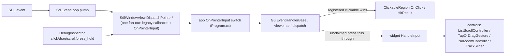

# Widgets and Controls

Taxonomy of the UI component layers (2026-07-21, post interaction-primitives P4). The distinction is
load-bearing: **widgets** own a screen region and receive host-routed input; **controls** are reusable
interaction/display elements a widget delegates to, and never receive host routing themselves. The
interaction-primitives project ([../plans/interaction-primitives.md](../plans/interaction-primitives.md))
is exactly the control layer -- "needs treatment" always means *a widget hand-rolling logic that should
be a control*.

## Contracts

| Layer | Contract | Input | Paint |
|---|---|---|---|
| Widget (pixel hosts) | `PixelWidgetBase<TSurface>` (DIR.Lib) | host routes `HitTestAndDispatch` first, then `HandleInput` on miss (desktop `GuiEventHandlerBase`, web `Planner.razor`; the viewer is `ISelfDispatchingInputWidget` -- it dispatches its own hits) | layout DSL / draw helpers; registers clickables |
| Widget (TUI) | `ITuiTab` / `TuiTabBase` (TianWen.Cli) | keyboard only, over Console.Lib widgets | Console.Lib |
| Control | plain class/struct/static, no base | the OWNING widget forwards events (`controller.HandleInput(evt)`) or wires callbacks | either draws via caller-passed delegates (`DrawScrollBar(FillRect)`) or is state-only |

Input flow (pixel hosts):

`SdlWindowView.DispatchPointer{Down,Move,Up,Wheel}` is the single synthesis point (SdlVulkan.Renderer
6.28): real release coordinates on MouseUp, SDL button byte mapped to `MouseButton`, and the
DebugInspector routes through the same methods -- synthesized input can never drift from real input.

## Widget inventory

| Widget | Project | Interactive surfaces | Hand-rolled logic left |
|---|---|---|---|
| `PlannerTab` | UI.Abstractions | target list, handoff sliders, search box + autocomplete, chart (display) | none (sliders/search are controls) |
| `EquipmentTab` | UI.Abstractions | device list, segment buttons, confirm strips | none |
| `SessionTab` | UI.Abstractions | config panel, text inputs | none |
| `LiveSessionTab` | UI.Abstractions | exposure log, preview pan/zoom, charts (display) | **preview pan/zoom** (duplicate of viewer's -- P5) |
| `NotificationsTab` | UI.Abstractions | list | none |
| `GuiderTab` | UI.Abstractions | none (`HandleInput => false`) | none |
| `SkyMapTab` | UI.Abstractions | map pan + click-vs-drag, wheel/pinch FOV zoom, F3 search modal | **tap-vs-drag slop** (`Search.cs` `ClickDragThresholdPx` -- P5); FOV zoom stays custom (unproject-based, not pixel pan-zoom) |
| `ImageRendererBase` -> `VkImageRenderer` | UI.Abstractions -> UI.Shared | file list, WB/wavelet/scrub sliders, viewport pan/zoom, resize divider, toolbar dropdown, histogram | **viewport pan + cursor-anchored zoom** (P5) |
| `VkPlanetaryTab` (extends `VkImageRenderer`) | UI.Gui | PiP ROI drag + inherited viewer surfaces | PiP drag (drag-to-position; gesture adoption optional) |
| `PixelMenuWidget` | DIR.Lib | dropdown menu list | clip-only by design |
| `TuiPlanner/Equipment/Session/LiveSession/Notifications/GuiderTab`, `TuiTabBar` | Cli/Tui | keyboard | n/a (pointer primitives do not apply) |

Viewer hosts: the ONE `ImageRendererBase` serves tianwen-fits (standalone), the GUI viewer tab, and the
chromeless Live Session / polar / guide-cam previews (`ViewerState.HideChrome`).

## Control inventory

| Control | Lives in | Used by | Notes |
|---|---|---|---|
| `ListScrollController` | DIR.Lib | Planner, Equipment, Notifications, Session config, LiveSession log, FITS FileList | the "atom" scroll model; fully adopted (6/6 lists) |
| `TapOrDragGesture` | DIR.Lib | inside `ListScrollController` only | direct widget adoption pending (SkyMap, P5) |
| `PanZoomController` | DIR.Lib | none yet | adopters pending (viewer + LiveSession preview, P5) |
| `ClickableRegion` / `HitResult` + Layout `.Clickable` | DIR.Lib | everything | the universal button/row primitive |
| `TextInputState` | DIR.Lib | planner search, sky-map F3, session config, equipment | state + callback contract (`OnCommit/OnCancel/OnTextChanged/OnKeyOverride`) |
| `DropdownMenuState` | DIR.Lib | viewer toolbar dropdowns, `PixelMenuWidget` | clip-only; controller adoption deferred until a menu overflows |
| `TrackSlider` (`DrawTrackSlider` + `TrackFrac`) | tianwen (`ImageRendererBase.TrackSlider.cs`) | WB, 6 wavelet layers, SER scrub | generic; DIR.Lib promotion candidate (see [../plans/controls-upstreaming.md](../plans/controls-upstreaming.md)) |
| `TextInputInteraction` | tianwen (UI.Abstractions) | all text inputs | key routing/clipboard/suggestion-cycling over `TextInputState`; promotion candidate |
| `PlannerSearchInteraction` | tianwen (UI.Abstractions) | planner search box | callback wiring over `TextInputState`; candidate subclass of a DIR.Lib search base |
| sky-map F3 search (`SkyMapSearchState` + `SkyMapTab.Search`) | tianwen (UI.Abstractions) | sky map | same shape as planner search (input + results + selected index + key-nav + commit); second subclass candidate |
| `PlannerSliderInteraction` | tianwen (UI.Abstractions) | planner handoff sliders | click-to-place semantics; deliberately NOT on `TapOrDragGesture` |
| `AltitudeChartRenderer`, `GuideGraphRenderer` | tianwen (UI.Abstractions) | planner, guider | display-only |
| `ScrollableList` | Console.Lib | TUI tabs | keyboard row scroller; thumb formula already unified into `ListScrollController` at P1 |

## Rules

1. **Widgets delegate; controls implement.** A widget carrying inline scroll/drag/tap/pan-zoom math is a
   defect of layering -- adopt (or create) a control.
2. **Generic controls live in DIR.Lib** (the widget-framework layering rule): if a control has no
   TianWen domain dependency, it belongs next to `PixelWidgetBase`/`TextInputState`. Domain-specific
   interaction glue (planner slider placement, catalog search resolution) stays in UI.Abstractions --
   ideally as a thin subclass/wiring over a DIR.Lib base.
3. **Draw == hit**: controls that paint do it through caller-passed delegates and register hits from the
   same rects (`DrawScrollBar(FillRect)`, `DrawTrackSlider(..., hitBand, hit)`), so placement and hit
   regions cannot drift.
4. **Hosts route, apps wire one callback**: pointer wiring goes through `SdlWindowView.OnPointerInput`
   (never four hand-wired lambdas), and any new inspector input command must go through
   `SdlWindowView.DispatchPointer*`.
