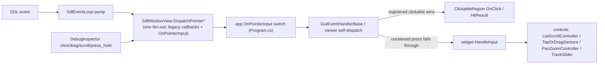

# Widgets and Controls

Taxonomy of the UI component layers (2026-07-21, post interaction-primitives P4). The distinction is
load-bearing: **widgets** own a screen region and receive host-routed input; **controls** are reusable
interaction/display elements a widget delegates to, and never receive host routing themselves. The
interaction-primitives project ([../plans/interaction-primitives.md](../plans/interaction-primitives.md))
is exactly the control layer -- "needs treatment" always means *a widget hand-rolling logic that should
be a control*.

## Contracts

| Layer | Contract | Input | Paint |
|---|---|---|---|
| Widget (pixel hosts) | `PixelWidgetBase<TSurface>` (DIR.Lib) | host routes `HitTestAndDispatch` first, then `HandleInput` on miss (desktop `GuiEventHandlerBase`, web `Planner.razor`; the viewer is `ISelfDispatchingInputWidget` -- it dispatches its own hits) | layout DSL / draw helpers; registers clickables |
| Widget (TUI) | `ITuiTab` / `TuiTabBase` (TianWen.Cli) | keyboard only, over Console.Lib widgets | Console.Lib |
| Control | plain class/struct/static, no base | the OWNING widget forwards events (`controller.HandleInput(evt)`) or wires callbacks | either draws via caller-passed delegates (`DrawScrollBar(FillRect)`) or is state-only |

Input flow (pixel hosts):

```mermaid
flowchart LR
    SDL[SDL event] --> Pump[SdlEventLoop pump]
    Pump --> DP["SdlWindowView.DispatchPointer*<br/>(one fan-out: legacy callbacks + OnPointerInput)"]
    Insp[DebugInspector click/drag/scroll/press_hold] --> DP
    DP --> App["app OnPointerInput switch (Program.cs)"]
    App --> Host["GuiEventHandlerBase / viewer self-dispatch"]
    Host -->|registered clickable wins| Click[ClickableRegion OnClick / HitResult]
    Host -->|unclaimed press falls through| HI["widget HandleInput"]
    HI --> Ctl["controls: ListScrollController / TapOrDragGesture / PanZoomController / TrackSlider"]
```

`SdlWindowView.DispatchPointer{Down,Move,Up,Wheel}` is the single synthesis point (SdlVulkan.Renderer
6.28): real release coordinates on MouseUp, SDL button byte mapped to `MouseButton`, and the
DebugInspector routes through the same methods -- synthesized input can never drift from real input.

## Widget inventory

| Widget | Project | Interactive surfaces | Hand-rolled logic left |
|---|---|---|---|
| `PlannerTab` | UI.Abstractions | target list, handoff sliders, search box + autocomplete, chart (display) | none (sliders/search are controls) |
| `EquipmentTab` | UI.Abstractions | device list, segment buttons, confirm strips | none |
| `SessionTab` | UI.Abstractions | config panel, text inputs | none |
| `LiveSessionTab` | UI.Abstractions | exposure log, preview pan/zoom, charts (display) | none (log P4, preview `PanZoomController` P5) |
| `NotificationsTab` | UI.Abstractions | list | none |
| `GuiderTab` | UI.Abstractions | none (`HandleInput => false`) | none |
| `SkyMapTab` | UI.Abstractions | map pan + click-vs-drag, wheel/pinch FOV zoom, F3 search modal | none (click-vs-drag on `TapOrDragGesture`, P5); FOV zoom stays custom by design (unproject-based, not pixel pan-zoom) |
| `ImageRendererBase` -> `VkImageRenderer` | UI.Abstractions -> UI.Shared | file list, WB/wavelet/scrub sliders, viewport pan/zoom, resize divider, before/after split divider, toolbar dropdown, histogram | file-list divider drag + the WB / wavelet / scrub drag flags (see the drag-flag note below); the split divider is on `SplitCompareController` |
| `VkPlanetaryTab` (extends `VkImageRenderer`) | UI.Gui | PiP ROI drag + inherited viewer surfaces | PiP drag (drag-to-position; gesture adoption optional) |
| `PixelMenuWidget` | DIR.Lib | dropdown menu list | clip-only by design |
| `TuiPlanner/Equipment/Session/LiveSession/Notifications/GuiderTab`, `TuiTabBar` | Cli/Tui | keyboard | n/a (pointer primitives do not apply) |

Viewer hosts: the ONE `ImageRendererBase` serves tianwen-fits (standalone), the GUI viewer tab, and the
chromeless Live Session / polar / guide-cam previews (`ViewerState.HideChrome`).

## Control inventory

| Control | Lives in | Used by | Notes |
|---|---|---|---|
| `ListScrollController` | DIR.Lib | Planner, Equipment, Notifications, Session config, LiveSession log, FITS FileList | the "atom" scroll model; fully adopted (6/6 lists) |
| `TapOrDragGesture` | DIR.Lib | `ListScrollController` (internal), `SkyMapTab` click-vs-drag | adopted (P5) |
| `PanZoomController` | DIR.Lib | `ImageRendererBase` viewport, `LiveSessionTab` preview | adopted (P5); gesture on the controller, display transform stays on `ViewerState` (seed per gesture, write back) |
| `ClickableRegion` / `HitResult` + Layout `.Clickable` | DIR.Lib | everything | the universal button/row primitive |
| `TextInputState` | DIR.Lib | planner search, sky-map F3, session config, equipment | state + callback contract (`OnCommit/OnCancel/OnTextChanged/OnKeyOverride`) |
| `DropdownMenuState` | DIR.Lib | viewer toolbar dropdowns, `PixelMenuWidget` | clip-only; controller adoption deferred until a menu overflows |
| `TrackSlider` (`DrawTrackSlider` + `TrackFrac`) | **DIR.Lib** (`PixelWidgetBase`, U1 of [../plans/controls-upstreaming.md](../plans/controls-upstreaming.md)) | WB, 6 wavelet layers, SER scrub | promoted; there is no `ImageRendererBase.TrackSlider.cs` any more. A new track-style control calls `DrawTrackSlider` / `TrackFrac`, never re-triplicates the bar/fill/handle/clamp math |
| `TextInputInteraction` | **DIR.Lib** (U6, shipped 2026-08-14) | all text inputs, all three hosts | key routing/clipboard/suggestion-cycling over `TextInputState`; reads the focused field from `ctx.Focus.Current` and takes `KeyContext.TabFields` as a callback, so no `IPixelWidget` appears in it |
| `PlannerSearchInteraction` | tianwen (UI.Abstractions) | planner search box | callback wiring over `TextInputState`; candidate subclass of a DIR.Lib search base |
| sky-map F3 search (`SkyMapSearchState` + `SkyMapTab.Search`) | tianwen (UI.Abstractions) | sky map | same shape as planner search (input + results + selected index + key-nav + commit); second subclass candidate |
| `PlannerSliderInteraction` | tianwen (UI.Abstractions) | planner handoff sliders | click-to-place semantics; deliberately NOT on `TapOrDragGesture` |
| `SplitCompareController` | tianwen (UI.Abstractions) | viewer before/after split | owns divider position + drag + mode + pinned settings; arms its own drag from the region it paints. DIR.Lib promotion candidate (the drag half has no domain dependency) |
| `AltitudeChartRenderer`, `GuideGraphRenderer` | tianwen (UI.Abstractions) | planner, guider | display-only |
| `ScrollableList` | Console.Lib | TUI tabs | keyboard row scroller; thumb formula already unified into `ListScrollController` at P1 |

## Rules

1. **Widgets delegate; controls implement.** A widget carrying inline scroll/drag/tap/pan-zoom math is a
   defect of layering -- adopt (or create) a control.

   **A drag is not just math, it is state plus three handler branches, and that is the part that bites.**
   The shape to avoid is a flag on the shared view state (`IsResizingFileList`, `WhiteBalanceDragChannel`,
   `WaveletDragBand`, `IsScrubbing`) plus a press, a move and a release branch. It costs more than it
   looks, because **the viewer has TWO press dispatchers** -- the embedded host routes through
   `HandleInput`, and `tianwen-fits`'s `Program.cs` has its own for dropdowns and DI-backed actions -- so
   every such branch has to be written twice and nothing connects the copies. The before/after split
   divider was added to one of them and silently did nothing in the other: it drew, it stated a resize
   cursor, and it could not be dragged.

   **A control avoids the press branch entirely.** Register the region with an `onClick` that arms the
   control's own drag (`RegisterClickable(..., onClick: _ => Split.BeginDrag(), cursor: ...)`), from the
   same rect the control painted -- so "draw == hit" (rule 3) extends to "draw == drag". Only motion and
   release are routed, in ONE line, in the one place both hosts already forward to. `SplitCompareController`
   is the reference consumer; the four drag flags above predate it and are the remaining conversions.
2. **Generic controls live in DIR.Lib** (the widget-framework layering rule): if a control has no
   TianWen domain dependency, it belongs next to `PixelWidgetBase`/`TextInputState`. Domain-specific
   interaction glue (planner slider placement, catalog search resolution) stays in UI.Abstractions --
   ideally as a thin subclass/wiring over a DIR.Lib base.
3. **Draw == hit**: controls that paint do it through caller-passed delegates and register hits from the
   same rects (`DrawScrollBar(FillRect)`, `DrawTrackSlider(..., hitBand, hit)`), so placement and hit
   regions cannot drift.
4. **Hosts route, apps wire one callback**: pointer wiring goes through `SdlWindowView.OnPointerInput`
   (never four hand-wired lambdas), and any new inspector input command must go through
   `SdlWindowView.DispatchPointer*`.
5. **Place by arrangement, not arithmetic** (goal: ~99% layout-driven,
   [../plans/layout-driven-ui.md](../plans/layout-driven-ui.md)): chrome geometry comes from an
   arranged `Layout` tree; hand-computed `pad * dpiScale` offsets and `cursor +=` stitching are the
   placement-layer analogue of rule 1's inline scroll math. Direct pixel drawing is reserved for
   raster content inside keyed `Fill` leaves (charts, histogram, image, sky map, on-image overlays)
   and control internals.

---

## The layout DSL: the engine features TianWen relies on

The engine and its DSL reference live in **DIR.Lib's README** under "Declarative Layout
(`DIR.Lib.Layout`)"; it owns the engine and TianWen is a consumer. What follows is the part a
consumer has to know, and the part that was learned by being bitten. `CLAUDE.md` keeps the one-line
form of each rule; the reasoning is here.

- **Alias, don't import.** Keep `using DIR.Lib;` and add a per-project
  `global using Layout = DIR.Lib.Layout;` (or a csproj `<Using ... Alias="Layout"/>`), then write the
  qualified `Layout.Node` / `Layout.Builder`. Do NOT `using DIR.Lib.Layout;`: it drops the
  collision-prone barewords (`Node`, `Content`, `Size<T>`) into scope. A consumer that already owns
  its own `Layout` type must rename it (PTV did: `Layout` -> `ElementGrid`).
- **Conditional background:** `.Bg(color)` always sets a value, so for a nullable background build
  the base node then `if (cond) n = n.Bg(color);`; never `.Bg(default)`, which paints transparent
  rather than leaving the property null.
- **Responsive primitives (DIR.Lib 6.14):** `Sizing.Star(weight, min, max)` clamps
  (`.WStar/.HStar(w, min, max)`, `.WClamp/.HClamp`) -- a min-clamped Star holds its floor and
  overflows *visibly* instead of starving to zero when Fixed siblings eat the container, a
  max-clamped Star's surplus redistributes to its Star siblings; `.CollapseBelow(u)` drops a Stack
  child entirely (no paint, no hit, no gap) when its arranged main extent lands under the threshold;
  `Layout.Builder.WrapH/WrapV` flow containers wrap children into new lines when out of extent
  (toolbars / chip rows). The tree is rebuilt per frame, so orientation is a plain C# branch -- no
  media-query machinery. Canonical consumer: `PlannerTab.BuildFrameLayout` (landscape = left-list
  dock, portrait = chart / collapsible compact details / list stack), pinned by
  `PlannerTabLayoutTests` (arranged rects + an offline `RgbaImageRenderer` pixel render at phone +
  desktop resolutions, the chess `PixelGameDisplayLayoutTests` pattern).
- **Five silent traps, all found on the Home board**; the measured detail is in
  [../plans/remote-profile.md](../plans/remote-profile.md).
  1. `.RowH(h)` sets `Width = Star` and silently eats a `.WFixed(w)` before it -- it means "a
     full-width row of fixed height", so anything genuinely fixed on both axes needs
     `.WFixed(w).HFixed(h)`.
  2. A `Stack` places children at the cross-axis START, so centring a row's controls needs
     `.CrossCenter()`; do NOT re-solve it with container padding or spacer sandwiches, which
     re-derive at the call site a position the engine already knows.
  3. A `Node`'s default `Width` is `Sizing.Auto`, so a container whose children are all Star
     measures to a near-zero intrinsic width and arranges to nothing -- state `.WStar()` explicitly.
  4. `.CollapseBelow(u)` must **not** be paired with a Star *minimum* on the same node (a
     min-clamped Star holds its floor and overflows, so the threshold never trips), and the engine
     prunes every under-threshold child in ONE pass rather than shedding the least important first,
     so a child that must survive takes **no** threshold rather than a small one.
  5. An icon draws at the size it DECLARES and every kind inks that full square (DIR.Lib 7.20 +
     7.21), so size a mark to the text it sits beside; both of those were measured from rendered
     ink, which is the only way to see either.
- **A mark is an `Icon`, never a symbol character in a `Text` run.** `Layout.Content.Icon` names a
  MEANING and each surface constructs what it can draw (the GPU fills rows of rectangles,
  `CellLayout` picks a block element), whereas a caret glyph in a label asks whichever face the host
  resolved to have that codepoint and draws .notdef where it does not. `IconKind.CaretUp/CaretDown`
  (DIR.Lib 7.23) are the drop-chip marks -- filled, not chevrons, because at the ten-or-fewer pixels
  a chip affords a stroked mark is two hairlines and the hole between them disappears first.
  Consumer: the Live Session mode pill.
- **`.PadX(u)` / `.Pad(across, down)` for a FIXED-height bar** (DIR.Lib 7.24; `PaddingY` null =
  "same as `Padding`", so every existing tree is unchanged). A bar with no vertical room to give
  away, padded symmetrically, loses its icon first: text overflows its rect and goes on looking
  correct, while an icon -- square by its smaller side -- collapses to a stub. That asymmetry is why
  the failure hides.
- **`PushClip(x, y, w, h)` / `PopClip()` on the widget base** (DIR.Lib 7.25), never
  `Renderer.PushClip` with a hand-built `RectInt`: that struct takes `(LowerRight, UpperLeft)`, the
  opposite order to every other rect a widget states, and the five sites here each spelled the
  inversion out. **Clips NEST and NARROW** (DIR.Lib 7.27): a push inside a push draws in the
  INTERSECTION, and a pop restores the enclosing clip rather than the whole surface, so an inner
  widget states only its own bounds and cannot escape the parent's. It was single-level until then
  (a second push replaced the first, and any pop opened all the way up), which is why nothing here
  nests today -- the five sites are one level each, and behave identically under both models. Worth
  knowing the direction of the change if you find one that does nest: under the old contract the
  rest of an outer panel painted UNCLIPPED after an inner pop, so 7.27 can only fix such a case,
  never break it. `Renderer.ClipDepth` is assertable if a widget wants to prove it left the renderer
  as it found it.
- **`Renderer.DrawTriangles`** (DIR.Lib 7.26) means a mark that is not rectangles, ellipses or text
  no longer has to reach past the abstract renderer to a backend with a triangle pipeline; the base
  has a scanline default and `VkRenderer` overrides it with one draw call. Nothing in TianWen calls
  it directly.
- Engine geometry is headless-testable (stub `Layout.IMeasureContext`); `EquipmentPanelLayoutTests`
  / `SessionConfigLayoutTests` pin arranged rects. Shipped DIR.Lib 6.0 / Console.Lib 3.3 /
  SdlVulkan.Renderer 6.7. **The offline `RgbaImageRenderer` honours clipping since DIR.Lib 7.25**,
  so a headless render finally agrees with the app about what was drawn; before that a clip the app
  applied was ignored and a control trimming to its bounds drew over the whole picture, which reads
  as a widget bug rather than a missing backend feature.

## TUI list and tree rows are trees too, never formatted strings

Console.Lib 4.10. A `ScrollableList<T>` item implements `IRowLayout.BuildRow(in RowContext)` and a
`TreeView` node `ITreeNode.BuildNodeContent`, both returning a `Layout.Node`; the widget arranges it
into the row's rect and paints it via `CellLayout`, so a row states structure and colour and **never
pads, truncates, or emits an escape code**. Authored in CELLS (`TuiRowPalette.CellFontSize` = 1
design unit = 1 cell, `CellMeasureContext.CellAuthored`) unless the tree is shared with a GPU
surface (`TuiHomeTab` overrides `MeasureContext` to `PixelAuthored`). Three rules this replaced,
each of which had cost a real bug:

- **An inline button on a row is a `.Clickable(...)` NODE**, resolved through
  `ScrollableList.DispatchRowHit` against the rect that was painted -- never a column range computed
  alongside the code that draws it. `EquipmentFieldItem.DeleteActionColumns` and
  `InfoRowItem.ButtonRegion` were exactly that, and `StepperRow` derived four offsets *twice*. A row
  also cannot see its own usable width (the list yields a column to the scrollbar once it
  overflows), so a right-anchored span drifted by one column exactly when the list scrolled -- which
  is why the OTA `[X]` used to be pinned beside the title instead of at the row's edge, where it now
  is.
- **A cell states its own pen** (`RowPen`, foreground AND background together). Foreground-only
  writes relied on whatever SGR state a previous write left in effect; the diffing cell buffer
  stores a colour per cell, so an inheriting row recorded cells with no colour and painted as a gap.
  This also retired `VisibleOverhead`/`StyleSegment` -- a nested run's closing reset used to wipe
  the enclosing row's background, so each segment re-applied the outer style on exit and the row
  scanned its own escape bytes to know how far to pad.
- **Width arithmetic becomes sizing.** `Math.Max(18, width / 2)` is a min-clamped Star
  (`.WStar(1f, 18f)`) stated once in `TuiRowPalette.LabelMinColumns`, not recomputed per row shape;
  a content column is `.WStar`, so a fixed-column budget (`width - 19`) and the comment that had
  already drifted from it both disappear.

Selection comes from `RowContext.Selected` **only when the list cursor is the truth**. Where the
selected index lives in shared state instead (`PlannerState.SelectedTargetIndex`,
`SessionTabState.SelectedFieldIndex` -- both moved by the keyboard independently of the cursor), the
row reads its own `IsSelected` and the tab writes the state from `ScrollableList.HitTestRow` on
mouse-up. Adding a capability adds a **field to `RowContext`**, never an overload: the shape this
replaced grew one rung per capability (`(width, mode)` -> `(.., isSelected)` -> `(..,
selectedColumn, columnCount)`) and every rung let an implementation silently opt out of the newest
information by overriding an older one.

## The pointer's appearance is a property of a region, never a host predicate

`CursorKind` + `ClickableRegion.Cursor` + `RegisterCursor` / `HitTestCursor` (DIR.Lib 7.22), mapped
to SDL by `CursorKind.ToSystemCursor` (SdlVulkan.Renderer 7.16) -- the one place in the stack that
knows SDL calls the hand cursor `Pointer`. Both hosts here previously answered the question
themselves, and each was wrong in the way the enum's own doc predicts:

- **The FITS viewer** tested an X-band around the file-list edge **plus** a
  `ToolbarDropdown.IsOpen` negation, because the dropdown draws over that band. That is one term per
  overlay, and every overlay added later silently invalidates it -- the predicate keeps saying
  "resize handle" while something else is on top.
- **The GUI** hit-tested for `LinkHit` and could answer nothing else, so every text field in the app
  showed an arrow. `RenderTextInput` now registers `CursorKind.Text` itself, which is where the
  I-beams came from.

**Declare the cursor beside the click** (`RegisterClickable(..., cursor:)` / `.Clickable(hit,
onClick, cursor)` / `.WithCursor(kind)`), on the same reasoning that binds a click to the rect its
content was painted in (rule 3 above). A region that states nothing is **transparent** to the query,
so a row inherits its card's and a panel declares it once; `null` means "nobody had a view", **not**
Default, so a plain button cannot stamp the arrow over a host that wanted a crosshair.

- **The host asks, and picks its own default**: `guiRenderer.CursorAt(x, y) ?? CursorKind.Default`.
  `CursorAt` lives on `VkGuiRenderer` because the composition (active tab paints over chrome, so it
  is asked first) is the renderer's own knowledge; a host reconstructing that order would keep a
  second copy of it.
- **`HitTestCursor` is on `PixelWidgetBase`, not on `IPixelWidget`**, so a caller holding the
  interface cannot ask. `IGuiChrome.ActiveTab` is `IPixelWidget?` by contract, hence the
  concretely-typed `_activeTab` field behind it. Upstream gap, not a local preference.
- **A drag is the one legitimate host-side term**: once the file-list grab starts the cursor stays
  `ResizeEW` wherever the pointer travels, which no region under it can express.
- **`Layout.Builder.Split` has no `dividerCursor` yet**, so the viewer's resize handle states no
  cursor and its `ResizeHandleHit` is mapped by the host as a fallback. This still beats geometry:
  an open dropdown registers a full-viewport backdrop above everything, so it answers the hit and
  the handle correctly stops claiming the pointer.
- **Buttons deliberately keep the arrow.** `CursorKind.Pointer` documents "a link, a button", but
  this app's convention is hand-on-links-only; adopting it per-button would be a UX change, not an
  adoption.

**The same lesson, one level down: HOVER needs a z-order answer too, and it is
`ViewerState.OverlayOwnsPointer`.** Clicks never need one (paint order IS hit-test z-order, so an
overlay's regions already win), but hover is decided at PAINT time from mouse-vs-rect, *before* the
overlay above has registered anything. The viewer toolbar, the histogram LOG button and the
file-list rows each carried their own copy of the dropdown-is-open negation, so a second overlay
would have had to find all three. **Add an overlay to that one property, never to a call site.** The
per-element hover rects themselves stay by design (the
[../plans/layout-driven-ui.md](../plans/layout-driven-ui.md) DoD tolerates interactive controls
whose look needs their own arranged rect); it is the z-order term that must not be duplicated.
