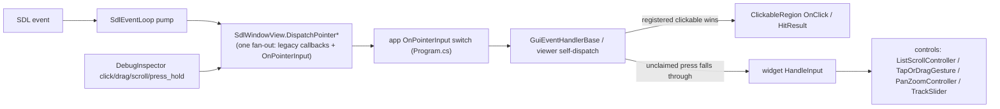

# Widgets and Controls

Taxonomy of the UI component layers (2026-07-21, post interaction-primitives P4). The distinction is
load-bearing: **widgets** own a screen region and receive host-routed input; **controls** are reusable
interaction/display elements a widget delegates to, and never receive host routing themselves. The
interaction-primitives project ([../plans/interaction-primitives.md](../plans/interaction-primitives.md))
is exactly the control layer -- "needs treatment" always means *a widget hand-rolling logic that should
be a control*.

## Contracts

| Layer | Contract | Input | Paint |
|---|---|---|---|
| Widget (pixel hosts) | `PixelWidgetBase<TSurface>` (DIR.Lib) | every host routes through `DIR.Lib.InputRouter`, which walks the regions the last paint registered and offers what none of them claimed to the widget's own `HandleInput`. `IPixelWidget.HitTestAndDispatch` is GONE (10.0) -- a widget that hit-tests AND runs the handler is a second dispatcher over the same rects, and the two `tianwen-fits` and the GUI tab carried disagreed about what a toolbar press means. `HitTest` stays, for asking WHAT is under a point without running it | layout DSL / draw helpers; registers clickables |
| Widget (TUI) | `ITuiTab` / `TuiTabBase` (TianWen.Cli) | keyboard only, over Console.Lib widgets | Console.Lib |
| Control | plain class/struct/static, no base | the OWNING widget forwards events (`controller.HandleInput(evt)`) or wires callbacks | either draws via caller-passed delegates (`DrawScrollBar(FillRect)`) or is state-only |

Input flow (pixel hosts):

```mermaid
flowchart LR
    SDL[SDL event] --> Pump[SdlEventLoop pump]
    Pump --> DP["SdlWindowView.DispatchPointer*<br/>(one fan-out: legacy callbacks + OnPointerInput)"]
    Insp[DebugInspector click/drag/scroll/press_hold] --> DP
    DP --> App["app OnPointerInput switch (Program.cs)"]
    App --> Host["GuiEventHandlerBase / viewer self-dispatch"]
    Host -->|registered clickable wins| Click[ClickableRegion OnClick / HitResult]
    Host -->|unclaimed press falls through| HI["widget HandleInput"]
    HI --> Ctl["controls: ListScrollController / TapOrDragGesture / PanZoomController / TrackSlider"]
```

`SdlWindowView.DispatchPointer{Down,Move,Up,Wheel}` is the single synthesis point (SdlVulkan.Renderer
6.28): real release coordinates on MouseUp, SDL button byte mapped to `MouseButton`, and the
DebugInspector routes through the same methods -- synthesized input can never drift from real input.

## Widget inventory

Re-counted 2026-10-10 against DIR.Lib 11.8, when the "none" this table used to give the four tabs was found
to be out of date: it counted inline scroll, drag and gesture math, and the hand-placed rows were never in it.

| Widget | Project | Interactive surfaces | Hand-rolled logic left |
|---|---|---|---|
| `PlannerTab` | UI.Abstractions | target list, handoff sliders, search box + autocomplete, chart (display) | the details panel (lines at `rect.Height / lines.Count`, a hand `LinkHit`) and the list header strips placed by offset; sliders/search are controls |
| `EquipmentTab` | UI.Abstractions | device list, segment buttons, confirm strips | the device-list rows (badge, name, source and dot as hand columns) and the profile-switch notice, a hand-placed modal whose backdrop does not swallow a press (#1444) |
| `SessionTab` | UI.Abstractions | config panel, text inputs | the config form's scroll (field y recomputed beside the tree) and the observation list, which stops at the panel edge and does not scroll (#1445) |
| `LiveSessionTab` | UI.Abstractions | exposure log, preview pan/zoom, charts (display) | the exposure log's rows, the running Flats / Polar rows and the frame split, all placed by hand (`viewer-layout-engine.md` P3); the abort confirm's backdrop does not swallow a press (#1444). Scroll is `ListScrollController` (P4), preview `PanZoomController` (P5) |
| `NotificationsTab` | UI.Abstractions | list | none |
| `GuiderTab` | UI.Abstractions | none (`HandleInput => false`) | none |
| `SkyMapTab` | UI.Abstractions | map pan + click-vs-drag, wheel/pinch FOV zoom, F3 search modal | none (click-vs-drag on `TapOrDragGesture`, P5); FOV zoom stays custom by design (unproject-based, not pixel pan-zoom) |
| `ImageRendererBase` -> `VkImageRenderer` | UI.Abstractions -> UI.Shared | file list, WB/wavelet/scrub sliders, viewport pan/zoom, resize divider, before/after split divider, toolbar dropdown, histogram | the file-list divider and the scrub drag flags (`IsResizingFileList`, `IsScrubbing`; the WB and wavelet drags are `Content.Slider` leaves now); the toolbar, file list, info panel and transport bar are hand-painted (T3); the split divider is on `SplitCompareController` |
| `VkPlanetaryTab` (extends `VkImageRenderer`) | UI.Gui | PiP ROI drag + inherited viewer surfaces | PiP drag (drag-to-position; gesture adoption optional) |
| `PixelMenuWidget` | DIR.Lib | dropdown menu list | clip-only by design |
| `TuiPlanner/Equipment/Session/LiveSession/Notifications/GuiderTab`, `TuiTabBar` | Cli/Tui | keyboard | n/a (pointer primitives do not apply) |

Viewer hosts: the ONE `ImageRendererBase` serves tianwen-fits (standalone), the GUI viewer tab, and the
chromeless Live Session / polar / guide-cam previews (`ViewerState.HideChrome`).

## Control inventory

| Control | Lives in | Used by | Notes |
|---|---|---|---|
| `ListScrollController` | DIR.Lib | Planner, Equipment, Notifications, Session config, LiveSession log, FITS FileList | the "atom" scroll model; fully adopted (6/6 lists) |
| `TapOrDragGesture` | DIR.Lib | `ListScrollController` (internal), `SkyMapTab` click-vs-drag | adopted (P5) |
| `PanZoomController` | DIR.Lib | `ImageRendererBase` viewport, `LiveSessionTab` preview | adopted (P5); gesture on the controller, display transform stays on `ViewerState` (seed per gesture, write back) |
| `ClickableRegion` / `HitResult` + Layout `.Clickable` | DIR.Lib | everything | the universal button/row primitive |
| `TextInputState` | DIR.Lib | planner search, sky-map F3, session config, equipment | state + callback contract (`OnCommit/OnCancel/OnTextChanged/OnKeyOverride`) |
| `DropdownMenuState` | DIR.Lib | viewer toolbar dropdowns, `PixelMenuWidget` | clip-only; controller adoption deferred until a menu overflows |
| `TrackSlider` (`DrawTrackSlider` + `TrackFrac`) | **DIR.Lib** (`PixelWidgetBase`, U1 of [../plans/controls-upstreaming.md](../plans/controls-upstreaming.md)) | WB, 6 wavelet layers, SER scrub | promoted; there is no `ImageRendererBase.TrackSlider.cs` any more. A new track-style control calls `DrawTrackSlider` / `TrackFrac`, never re-triplicates the bar/fill/handle/clamp math |
| `TextInputInteraction` | **DIR.Lib** (U6, shipped 2026-08-14) | all text inputs, all three hosts | key routing/clipboard/suggestion-cycling over `TextInputState`; reads the focused field from `ctx.Focus.Current` and takes `KeyContext.TabFields` as a callback, so no `IPixelWidget` appears in it |
| `PlannerSearchInteraction` | tianwen (UI.Abstractions) | planner search box | callback wiring over `TextInputState`; candidate subclass of a DIR.Lib search base |
| sky-map F3 search (`SkyMapSearchState` + `SkyMapTab.Search`) | tianwen (UI.Abstractions) | sky map | same shape as planner search (input + results + selected index + key-nav + commit); second subclass candidate |
| `PlannerSliderInteraction` | tianwen (UI.Abstractions) | planner handoff sliders | click-to-place semantics; deliberately NOT on `TapOrDragGesture` |
| `SplitCompareController` | tianwen (UI.Abstractions) | viewer before/after split | owns divider position + drag + mode + pinned settings; arms its own drag from the region it paints. DIR.Lib promotion candidate (the drag half has no domain dependency) |
| `AltitudeChartRenderer`, `GuideGraphRenderer` | tianwen (UI.Abstractions) | planner, guider | display-only |
| `ScrollableList` | Console.Lib | TUI tabs | keyboard row scroller; thumb formula already unified into `ListScrollController` at P1 |
| `Layout.Builder.ButtonGroup<T>` | **DIR.Lib** (11.1) | Home view selector, Tie breaker, device On/Off | segmented control; the style owns the chosen fill, every segment swallows its press, only an actionable one lights, a null `onSelect` is a display (press falls through) |
| `Layout.Builder.Checkbox` | **DIR.Lib** (11.1) | planetary recenter / ROI rows | drawn `IconKind.Check` in a well, whole row toggles; same hover / disabled / display rules as the group |
| `Node.DoubleClickable` | **DIR.Lib** (11.1) | Home cards and rows, Session exposure cell | runs on the second press IN PLACE of the click; no press handler reading `Clicks` |

## Rules

1. **Widgets delegate; controls implement.** A widget carrying inline scroll/drag/tap/pan-zoom math is a
   defect of layering -- adopt (or create) a control.

   **A drag is not just math, it is state plus three handler branches, and that is the part that bites.**
   The shape to avoid is a flag on the shared view state (`IsResizingFileList`, `WaveletDragBand`
   (since converted), `IsScrubbing`) plus a press, a move and a release branch. It costs more than it
   looks, because **the viewer has TWO press dispatchers** -- the embedded host routes through
   `HandleInput`, and `tianwen-fits`'s `Program.cs` has its own for dropdowns and DI-backed actions -- so
   every such branch has to be written twice and nothing connects the copies. The before/after split
   divider was added to one of them and silently did nothing in the other: it drew, it stated a resize
   cursor, and it could not be dragged.

   **A control avoids the press branch entirely.** Register the region with an `onClick` that arms the
   control's own drag (`RegisterClickable(..., onClick: _ => Split.BeginDrag(), cursor: ...)`), from the
   same rect the control painted -- so "draw == hit" (rule 3) extends to "draw == drag". Only motion and
   release are routed, in ONE line, in the one place both hosts already forward to. `SplitCompareController`
   is the reference consumer. Of the three drag flags above, `WaveletDragBand` went to a `Content.Slider`;
   `IsResizingFileList` and `IsScrubbing` predate `SplitCompareController` and are the remaining conversions
   (2026-10-10).

   **A `Layout.Content.Slider` leaf is the finished form of this** (DIR.Lib 9.2): the engine paints the
   track, registers it, and arms a `DragCapture` holding the rect it was just painted into, so "draw ==
   drag" is a property of the declaration rather than of a rect someone keeps in step. The tone popover's
   three dials and the white balance's three channels went that way and took two flags, two hit types,
   two `UpdateXDrag` methods and two track-rect lookups with them. **Only `InputRouter` honours
   `Node.OnPress`**, so a host not yet on the router needs a place to hold the capture --
   `ImageRendererBase.TryBeginRegionDrag` is the viewer's, and it goes when the toolbar goes on the
   tree.
   **A choice, a checkbox and a double-click are declarations, not patterns** (DIR.Lib 11.1). A row of
   buttons where one is "active" is `Layout.Builder.ButtonGroup`; a hand-picked fill per segment is how
   the site tie-breaker drew both halves in the same colour and said nothing about which side won
   (2026-09-23). A checkbox is `Layout.Builder.Checkbox`, never `"[x] "` in a label. A double-click is
   `.DoubleClickable(...)` on the node that was pressed, never a host arm on `clicks >= 2` that then
   searches the arranged tree for what was under the pointer (the Session tab did exactly that, by Fill
   key prefix). Still hand-built, deliberately or pending: the polar panel's cycling pills (a cycle, not a
   set of segments), the TUI's `[On|Off]` strip (colour-only, not clickable), and the viewer's toolbar
   toggles (independent, not one choice).
2. **Generic controls live in DIR.Lib** (the widget-framework layering rule): if a control has no
   TianWen domain dependency, it belongs next to `PixelWidgetBase`/`TextInputState`. Domain-specific
   interaction glue (planner slider placement, catalog search resolution) stays in UI.Abstractions --
   ideally as a thin subclass/wiring over a DIR.Lib base.
3. **Draw == hit**: controls that paint do it through caller-passed delegates and register hits from the
   same rects (`DrawScrollBar(FillRect)`, `DrawTrackSlider(..., hitBand, hit)`), so placement and hit
   regions cannot drift.
4. **Hosts route, apps wire one callback**: pointer wiring goes through `SdlWindowView.OnPointerInput`
   (never four hand-wired lambdas), and any new inspector input command must go through
   `SdlWindowView.DispatchPointer*`.

   **A touch gesture is NOT a pointer event and is not carried by that callback.** `OnPinch` /
   `OnPinchEnd` are their own pair, so a host that wires only `OnPointerInput` has no pinch zoom at all
   -- the renderer recognises the gesture, classifies the device and raises into a null delegate.
   `tianwen-fits` shipped that way, and it presents as the touchscreen not being read rather than as a
   missing branch: **a dropped event and an unread device are indistinguishable from the glass.** Check
   both ends when a gesture does nothing -- the host's wiring AND the widget's input switch.
5. **Place by arrangement, not arithmetic** (goal: ~99% layout-driven,
   [../plans/layout-driven-ui.md](../plans/layout-driven-ui.md)): chrome geometry comes from an
   arranged `Layout` tree; hand-computed `pad * dpiScale` offsets and `cursor +=` stitching are the
   placement-layer analogue of rule 1's inline scroll math. Direct pixel drawing is reserved for
   raster content inside keyed `Fill` leaves (charts, histogram, image, sky map, on-image overlays)
   and control internals.

---

## One dispatcher, DIR.Lib's, on every surface

**Since T1 every host hands its events to `DIR.Lib.InputRouter`** (`GuiEventHandlerBase` on the
desktop, `Planner.razor` in the browser), and the order is the engine's, fixed and tested there:

1. an overlay that has claimed the keyboard (`WindowUiSettings.KeyboardClaimant`),
2. any PAINTED node whose declared `Shortcut` equals the chord, gated on
   `KeyChord.BeatsFocusedField || Focus.Current is null`,
3. the focused field, through `TextInputInteraction.HandleKey`,
4. the host's `Unhandled`, which is where the active tab's own `HandleInput` lives.

Pointer events walk the regions the last paint registered, top-most first across the widgets the host
names in `Widgets` -- on the desktop that is one entry, the chrome, which is a `CompositeWidget` and
therefore yields its own regions and the active tab's from a single `CollectPaintedRegions`.

What each host keeps is only what is genuinely the platform's: the `FocusChanged` binding (SDL
`StartTextInput` / the floating `<input>`), the clipboard delegates, the pointer position the tabs
read, the navigation rail's hover repaint, the browser's rAF coalescing and its ctrl+wheel pinch. Both
call `router.AfterPaint()` once the frame is drawn, which is where `BlurIfUnpainted`, the
once-per-open focus request and the tooltip expiry live, all three needing a fact only a finished
frame has.

### A press that lands on a clickable region never reaches the tab's own mouse-down

Unchanged, and now the router's rule rather than a host's: the topmost region under the pointer owns
the press, its handler runs, and the tab's mouse-down path is skipped. Only a press that hits nothing
reaches `Unhandled`, and the tab's own answer goes back from there. There used to be an
`ISelfDispatchingInputWidget` marker on that path, meaning "hand this widget the RAW press because its
toolbar and sliders need the coordinates"; the router makes that true of every widget and a slider's
`OnPress` carries the position, so the premise went twice over and the marker was deleted. It had been
reduced to reshaping a return value that nothing reads.

**Anything that used to run AFTER a hit test therefore has to run before the router**, off a
non-dispatching `HitTest`. One site is left -- the planner's handoff-divider drag, which arms from a
press and needs its position -- and DIR.Lib 9.2's `Layout.Node.OnPress` plus `Content.Slider` delete
it in T2.

Two consequences worth knowing before building anything draggable:

- **A drag whose handle is a region must START from that region's own click binding.** The sky map's
  layer palette learned this the expensive way: its grip hit-tested a stashed rect on mouse-down,
  which never ran, so the panel drew a `CursorKind.Move` cursor over something that could not be
  moved -- and the map did not pan either, because the region had swallowed the press.
- **A click binding is handed modifiers and nothing else** -- no position, no click count -- but a
  node can now declare `.Pressable(hit, onPress)` instead, which IS handed a `PointerPress` (position,
  button, modifiers, click count) and may return a `DragCapture` that owns every move until the button
  comes up. That is the seam a draggable control should use; `OnClick` stays the answer for a button.

## The layout DSL: the engine features TianWen relies on

The engine and its DSL reference live in **DIR.Lib's README** under "Declarative Layout
(`DIR.Lib.Layout`)"; it owns the engine and TianWen is a consumer. What follows is the part a
consumer has to know, and the part that was learned by being bitten. `CLAUDE.md` keeps the one-line
form of each rule; the reasoning is here.

- **Alias, don't import.** Keep `using DIR.Lib;` and add a per-project
  `global using Layout = DIR.Lib.Layout;` (or a csproj `<Using ... Alias="Layout"/>`), then write the
  qualified `Layout.Node` / `Layout.Builder`. Do NOT `using DIR.Lib.Layout;`: it drops the
  collision-prone barewords (`Node`, `Content`, `Size<T>`) into scope. A consumer that already owns
  its own `Layout` type must rename it (PTV did: `Layout` -> `ElementGrid`).
- **Conditional background:** `.Bg(color)` always sets a value, so for a nullable background build
  the base node then `if (cond) n = n.Bg(color);`; never `.Bg(default)`, which paints transparent
  rather than leaving the property null.
- **Responsive primitives (DIR.Lib 6.14):** `Sizing.Star(weight, min, max)` clamps
  (`.WStar/.HStar(w, min, max)`, `.WClamp/.HClamp`) -- a min-clamped Star holds its floor and
  overflows *visibly* instead of starving to zero when Fixed siblings eat the container, a
  max-clamped Star's surplus redistributes to its Star siblings; `.CollapseBelow(u)` drops a Stack
  child entirely (no paint, no hit, no gap) when its arranged main extent lands under the threshold;
  `Layout.Builder.WrapH/WrapV` flow containers wrap children into new lines when out of extent
  (toolbars / chip rows). The tree is rebuilt per frame, so orientation is a plain C# branch -- no
  media-query machinery. Canonical consumer: `PlannerTab.BuildFrameLayout` (landscape = left-list
  dock, portrait = chart / collapsible compact details / list stack), pinned by
  `PlannerTabLayoutTests` (arranged rects + an offline `RgbaImageRenderer` pixel render at phone +
  desktop resolutions, the chess `PixelGameDisplayLayoutTests` pattern).
- **Five silent traps, all found on the Home board**; the measured detail is in
  [../plans/remote-profile.md](../plans/remote-profile.md).
  1. `.RowH(h)` sets `Width = Star` and silently eats a `.WFixed(w)` before it -- it means "a
     full-width row of fixed height", so anything genuinely fixed on both axes needs
     `.WFixed(w).HFixed(h)`.
  2. A `Stack` places children at the cross-axis START, so centring a row's controls needs
     `.CrossCenter()`; do NOT re-solve it with container padding or spacer sandwiches, which
     re-derive at the call site a position the engine already knows.
  3. A `Node`'s default `Width` is `Sizing.Auto`, so a container whose children are all Star
     measures to a near-zero intrinsic width and arranges to nothing -- state `.WStar()` explicitly.
  4. `.CollapseBelow(u)` must **not** be paired with a Star *minimum* on the same node (a
     min-clamped Star holds its floor and overflows, so the threshold never trips), and the engine
     prunes every under-threshold child in ONE pass rather than shedding the least important first,
     so a child that must survive takes **no** threshold rather than a small one.
  5. An icon draws at the size it DECLARES and every kind inks that full square (DIR.Lib 7.20 +
     7.21), so size a mark to the text it sits beside; both of those were measured from rendered
     ink, which is the only way to see either.
- **A mark is an `Icon`, never a symbol character in a `Text` run.** `Layout.Content.Icon` names a
  MEANING and each surface constructs what it can draw (the GPU fills rows of rectangles,
  `CellLayout` picks a block element), whereas a caret glyph in a label asks whichever face the host
  resolved to have that codepoint and draws .notdef where it does not. `IconKind.CaretUp/CaretDown`
  (DIR.Lib 7.23) are the drop-chip marks -- filled, not chevrons, because at the ten-or-fewer pixels
  a chip affords a stroked mark is two hairlines and the hole between them disappears first.
  Consumer: the Live Session mode pill.
- **`.PadX(u)` / `.Pad(across, down)` for a FIXED-height bar** (DIR.Lib 7.24; `PaddingY` null =
  "same as `Padding`", so every existing tree is unchanged). A bar with no vertical room to give
  away, padded symmetrically, loses its icon first: text overflows its rect and goes on looking
  correct, while an icon -- square by its smaller side -- collapses to a stub. That asymmetry is why
  the failure hides.
- **`PushClip(x, y, w, h)` / `PopClip()` on the widget base** (DIR.Lib 7.25), never
  `Renderer.PushClip` with a hand-built `RectInt`: that struct takes `(LowerRight, UpperLeft)`, the
  opposite order to every other rect a widget states, and the five sites here each spelled the
  inversion out. **Clips NEST and NARROW** (DIR.Lib 7.27): a push inside a push draws in the
  INTERSECTION, and a pop restores the enclosing clip rather than the whole surface, so an inner
  widget states only its own bounds and cannot escape the parent's. It was single-level until then
  (a second push replaced the first, and any pop opened all the way up), which is why nothing here
  nests today -- the five sites are one level each, and behave identically under both models. Worth
  knowing the direction of the change if you find one that does nest: under the old contract the
  rest of an outer panel painted UNCLIPPED after an inner pop, so 7.27 can only fix such a case,
  never break it. `Renderer.ClipDepth` is assertable if a widget wants to prove it left the renderer
  as it found it.
- **`Renderer.DrawTriangles`** (DIR.Lib 7.26) means a mark that is not rectangles, ellipses or text
  no longer has to reach past the abstract renderer to a backend with a triangle pipeline; the base
  has a scanline default and `VkRenderer` overrides it with one draw call. Nothing in TianWen calls
  it directly.
- Engine geometry is headless-testable (stub `Layout.IMeasureContext`); `EquipmentPanelLayoutTests`
  / `SessionConfigLayoutTests` pin arranged rects. Shipped DIR.Lib 6.0 / Console.Lib 3.3 /
  SdlVulkan.Renderer 6.7. **The offline `RgbaImageRenderer` honours clipping since DIR.Lib 7.25**,
  so a headless render finally agrees with the app about what was drawn; before that a clip the app
  applied was ignored and a control trimming to its bounds drew over the whole picture, which reads
  as a widget bug rather than a missing backend feature.

## TUI list and tree rows are trees too, never formatted strings

Console.Lib 4.10. A `ScrollableList<T>` item implements `IRowLayout.BuildRow(in RowContext)` and a
`TreeView` node `ITreeNode.BuildNodeContent`, both returning a `Layout.Node`; the widget arranges it
into the row's rect and paints it via `CellLayout`, so a row states structure and colour and **never
pads, truncates, or emits an escape code**. Authored in CELLS (`TuiRowPalette.CellFontSize` = 1
design unit = 1 cell, `CellMeasureContext.CellAuthored`) unless the tree is shared with a GPU
surface (`TuiHomeTab` overrides `MeasureContext` to `PixelAuthored`). Three rules this replaced,
each of which had cost a real bug:

- **An inline button on a row is a `.Clickable(...)` NODE**, resolved through
  `ScrollableList.DispatchRowHit` against the rect that was painted -- never a column range computed
  alongside the code that draws it. `EquipmentFieldItem.DeleteActionColumns` and
  `InfoRowItem.ButtonRegion` were exactly that, and `StepperRow` derived four offsets *twice*. A row
  also cannot see its own usable width (the list yields a column to the scrollbar once it
  overflows), so a right-anchored span drifted by one column exactly when the list scrolled -- which
  is why the OTA `[X]` used to be pinned beside the title instead of at the row's edge, where it now
  is.
- **A cell states its own pen** (`RowPen`, foreground AND background together). Foreground-only
  writes relied on whatever SGR state a previous write left in effect; the diffing cell buffer
  stores a colour per cell, so an inheriting row recorded cells with no colour and painted as a gap.
  This also retired `VisibleOverhead`/`StyleSegment` -- a nested run's closing reset used to wipe
  the enclosing row's background, so each segment re-applied the outer style on exit and the row
  scanned its own escape bytes to know how far to pad.
- **Width arithmetic becomes sizing.** `Math.Max(18, width / 2)` is a min-clamped Star
  (`.WStar(1f, 18f)`) stated once in `TuiRowPalette.LabelMinColumns`, not recomputed per row shape;
  a content column is `.WStar`, so a fixed-column budget (`width - 19`) and the comment that had
  already drifted from it both disappear.

Selection comes from `RowContext.Selected` **only when the list cursor is the truth**. Where the
selected index lives in shared state instead (`PlannerState.SelectedTargetIndex`,
`SessionTabState.SelectedFieldIndex` -- both moved by the keyboard independently of the cursor), the
row reads its own `IsSelected` and the tab writes the state from `ScrollableList.HitTestRow` on
mouse-up. Adding a capability adds a **field to `RowContext`**, never an overload: the shape this
replaced grew one rung per capability (`(width, mode)` -> `(.., isSelected)` -> `(..,
selectedColumn, columnCount)`) and every rung let an implementation silently opt out of the newest
information by overriding an older one.

## DIR.Lib's `ListCursor` and our virtualised lists (the 8.20 verdict, and what 9.2 changed)

DIR.Lib 8.20 (`SharpAstro/DIR.Lib#75`) makes a declared list keyboard-navigable with no state beside
it: a row saying `.Clickable(new HitResult.ListItemHit("views", i), ...)` is row `i`, and
`PixelWidgetBase.ListCursor` + `HandleListKey` + `.BgFocus(colour)` are the whole contract.
**Evaluated for TianWen 2026-09-12 and declined.** Written down because the reason is not visible
from either side on its own, and the evaluation is expensive to repeat.

**The cursor steps to the nearest row the LAST PAINT REGISTERED** (`TryStepListCursor` walks
`RegisteredRegions`), and **every list we have registers only the rows currently on screen**. So the
arrows stop at the edge of the viewport instead of scrolling. Measured on the Session config panel:
a 200 px-tall viewport over 25 fields, walking `Down` 24 times landed on **field 5**, not 24
(`SessionTabTests.KeyboardDown_ScrollsSelectedFieldIntoView`, which is what caught it).

**That virtualisation is OURS, not a DIR.Lib limitation** -- the mistake worth not repeating.
`PaintLayout` registers every node it is handed and `RegisterClickable` does no clip test;
`SessionTab.RenderConfigForm` drops the non-intersecting nodes itself, before painting, precisely so
off-screen rows do not become clickable outside the panel. The viewer's file list virtualises the
same way through `ListScrollController.VisibleRows()`. Restoring the cursor's reach would mean
scrolling and re-rendering mid-step, which needs the list's length -- reintroducing the
`SessionTabState.FieldCount` that adopting `ListCursor` was meant to delete.

**DIR.Lib 9.2 answered both halves of that, and the verdict above is now historical for a counted
list.** `ListCursor.Open(listId, index, count)` lets the cursor step onto a row the last paint never
registered -- the painted span stays the reachability filter wherever there IS evidence, and the count
is what says a row beyond it exists at all -- and `event Action<int> Moved` is where
`ListScrollController.EnsureVisible` hangs. `ActivateListCursor` also stopped claiming a row that
carries no handler. The Session config form runs on it now (`SessionTab.SyncFieldCursor`), with
`SessionConfigLayout.FieldListId` naming the list beside the rows that declare it.

**Two of our lists still do not fit, for reasons that are theirs rather than the cursor's:**

- **The GUI planner's target list registers NOTHING for a row body, on purpose.** An unclaimed press
  falls through to `ListScrollController` for tap-on-release and drag-to-scroll, pinned by
  `PlannerTabScrollTests.RowBodyIsUnclaimed_ButPinButtonStaysRegistered`. A cursor cannot walk a list
  nothing painted, counted or not, and registering the rows to give it one would claim the press and
  take the scroll gesture away. What it needs is a row declaration that is reachable by the keyboard
  and transparent to the pointer, or the rows to arm the scroll drag themselves through `OnPress`.
- **The terminal session form's `ScrollableList` interleaves group HEADERS with fields in one item
  space**, while the selection is indexed by FIELD (`SessionTabState.SelectedFieldIndex`, shared with
  the GUI). `MoveCursor` would step onto a header. It needs the two index spaces reconciled first --
  which is also what would fix `FindSelectedItem`, whose headers default to `FieldIndex` 0 and so
  shadow the first real field.

The terminal PLANNER list has none of that (one item per target, 1:1 with the index) and walks itself
through `ScrollableList.MoveCursor` since T1.

## The pointer's appearance is a property of a region, never a host predicate

`CursorKind` + `ClickableRegion.Cursor` + `RegisterCursor` / `HitTestCursor` (DIR.Lib 7.22), mapped
to SDL by `CursorKind.ToSystemCursor` (SdlVulkan.Renderer 7.16) -- the one place in the stack that
knows SDL calls the hand cursor `Pointer`. Both hosts here previously answered the question
themselves, and each was wrong in the way the enum's own doc predicts:

- **The FITS viewer** tested an X-band around the file-list edge **plus** a
  `ToolbarDropdown.IsOpen` negation, because the dropdown draws over that band. That is one term per
  overlay, and every overlay added later silently invalidates it -- the predicate keeps saying
  "resize handle" while something else is on top.
- **The GUI** hit-tested for `LinkHit` and could answer nothing else, so every text field in the app
  showed an arrow. `RenderTextInput` now registers `CursorKind.Text` itself, which is where the
  I-beams came from.

**Declare the cursor beside the click** (`RegisterClickable(..., cursor:)` / `.Clickable(hit,
onClick, cursor)` / `.WithCursor(kind)`), on the same reasoning that binds a click to the rect its
content was painted in (rule 3 above). A region that states nothing is **transparent** to the query,
so a row inherits its card's and a panel declares it once; `null` means "nobody had a view", **not**
Default, so a plain button cannot stamp the arrow over a host that wanted a crosshair.

- **The host asks, and picks its own default**: `guiRenderer.CursorAt(x, y) ?? CursorKind.Default`.
  `CursorAt` lives on `VkGuiRenderer` because the composition (active tab paints over chrome, so it
  is asked first) is the renderer's own knowledge; a host reconstructing that order would keep a
  second copy of it.
- **`HitTestCursor` is on `PixelWidgetBase`, not on `IPixelWidget`**, so a caller holding the
  interface cannot ask. `IGuiChrome.ActiveTab` is `IPixelWidget?` by contract, hence the
  concretely-typed `_activeTab` field behind it. Upstream gap, not a local preference.
- **A drag is the one legitimate host-side term**: once the file-list grab starts the cursor stays
  `ResizeEW` wherever the pointer travels, which no region under it can express.
- **`Layout.Builder.Split` has no `dividerCursor` yet**, so the viewer's resize handle states no
  cursor and its `ResizeHandleHit` is mapped by the host as a fallback. This still beats geometry:
  an open dropdown registers a full-viewport backdrop above everything, so it answers the hit and
  the handle correctly stops claiming the pointer.
- **Buttons deliberately keep the arrow.** `CursorKind.Pointer` documents "a link, a button", but
  this app's convention is hand-on-links-only; adopting it per-button would be a UX change, not an
  adoption.

**The same lesson, one level down: HOVER needs a z-order answer too, and it is
`ViewerState.OverlayOwnsPointer`.** DIR.Lib 9.2 has its own half of this, `WindowUiSettings.PointerOwner`,
which an open `Popover` sets as it paints -- but the two answer different questions and the flag is not
yet replaceable by it. **`PointerOwner` is a RECORD and `OverlayOwnsPointer` is a PREDICTION**: the
engine's version confines hover for anything painted AFTER the popover, which is what a `PaintLayout`
tree gets for free, while the viewer's toolbar, histogram and file list are hand-painted and resolve
their hover BEFORE any overlay has drawn. They need "will something cover me this frame", which only the
state can answer. The flag goes when the chrome goes on the tree. Clicks never need either one (paint
order IS hit-test z-order, so an
overlay's regions already win), but hover is decided at PAINT time from mouse-vs-rect, *before* the
overlay above has registered anything. The viewer toolbar, the histogram LOG button and the
file-list rows each carried their own copy of the dropdown-is-open negation, so a second overlay
would have had to find all three. **Add an overlay to that one property, never to a call site.** The
per-element hover rects themselves stay by design (the
[../plans/layout-driven-ui.md](../plans/layout-driven-ui.md) DoD tolerates interactive controls
whose look needs their own arranged rect); it is the z-order term that must not be duplicated.

## The FITS viewer widget: partials, one layout root, one slider, the live-preview host, the `?` menu

Moved here verbatim from `CLAUDE.md` on 2026-09-12; the rules that bite stay there as one-liners.

The renderer-agnostic viewer (`tianwen-fits` and the GUI 🪐 tab via `VkImageRenderer`) is a `partial
class` split by concern (`.Layout`, `.Toolbar`, `.FileList`, `.Overlays`, `.Histogram`, `.InfoPanel`,
`.StatusBar`, `.Transport`, `.Input`); add a concern as a new partial, never grow the core file back
into a monolith. All chrome is arranged from ONE layout pass rooted at `ContentRegion`; never
hand-place chrome at `(0,0,Width,...)`. One slider (`DrawTrackSlider` / `TrackFrac`, DIR.Lib's
`PixelWidgetBase`) serves WB, wavelet and SER scrub; never re-triplicate it. Details:
[docs/architecture/widgets-and-controls.md](docs/architecture/widgets-and-controls.md).

**One viewer, no mini viewer.** The Live Session pane (preview, polar alignment, a session's frames) hosts this
viewer WITH its own toolbar and status line, offering `ToolbarOffer.LivePreview`; the tab is its host (it runs the
solve through the node, `ToolbarPressPolicy` and `HostCanRun`), lists it as a routed child, and hands it the pointer
and every key but the window's (P1 of `docs/plans/live-session-preview.md`). The guide cam still hosts it chromeless
(`ViewerState.HideChrome`). Both are fed by `LiveFramePreviewSource : IPreviewSource` (normalises to
`[0,1]` by `Image.UnitScaleDivisor`, the divisor a document of the same frame uses, never the observed peak,
subsampled median/MAD stats taken over those normalised planes, `AcceptFrame(image, freezeStats)` for
`ViewerState.FreezeStretchStats`, delegates to the shared `AstroImageDocument.ComputeStretchUniforms`;
the WCS is the source's own, `IPreviewSource.Findings`, which the host sets on `LiveFramePreviewSource.Findings`
when a solve of the frame on show lands and `AcceptFrame` drops with the next frame). Embedded hosts call `SetSurfaceSize(w,h)` each
frame, not `Resize`. **`LiveFramePreviewSource.PerChannelBackground` must be non-empty and
channel-sized** (`ComputePostStretchBackground` indexes `[0]`; an empty array crashed the GUI;
`LiveFramePreviewSourceTests`).

- **There are TWO live sources and they are not interchangeable.** `LiveFramePreviewSource` is
  per-EXPOSURE (Live Session, guider, polar-align) and holds no document; `LiveStackPreviewSource` is
  the video-rate one (planetary), and it wraps an `AstroImageDocument`, which is where its histograms
  and info-panel stats come from. Cost arguments about "the live path" have to name which: a statistics
  pass that is free at one frame per 120 s is not free at 60 fps, and the per-frame path is the one that
  does NOT go through `LiveFramePreviewSource`.
- **What a display CHANNEL is has one definition per kind, in `StretchSolver`:**
  `CollectPerChannelStats` (the medians/MADs the curve is solved from) and `CollectChannelHistograms`
  (what the panel and the overlay draw), both three-for-a-mosaic and both taking a `pixelStride`. The
  document and the live preview call them rather than deciding for themselves, which is what stops the
  GUI and `tianwen-fits` disagreeing about the same frame. They are two collectors and not one because
  the two want DIFFERENT histograms -- the stats are taken with the pedestal removed (the shader
  subtracts it before the curve, so the median positioning that curve must be in the same space) while
  a viewer draws the frame's own levels; conflating them would be a silent numeric bug.
- **The "?" panel is a MENU** (`HelpPage`), because it had grown past a laptop screen and is the one
  panel opened when the viewer has misbehaved. Row 0 of a sub-page is the way back. **A page change
  re-opens the dropdown NEXT frame** (`PumpHelpPanel`): the dropdown closes itself after its
  selection callback returns, so opening from inside that callback just makes the panel vanish. Its
  tests drive ONE page at a time, on a FRESH viewer per row, and call `BuildHelpLines()` first --
  indices are assigned at build.

- **A toolbar button whose label changes width drags every button after it sideways** -- the run is
  packed left to right, and Zoom relabels continuously as the wheel turns ("Fit" / a ratio / a
  percentage). `ReservedLabelWidth` gives Zoom and Enhance their widest label so the text changes
  inside a fixed box; the rest change on a discrete action, where a re-layout is the button reporting
  what it did. Measured at 26.4 px of travel across ten buttons. **This is NOT the damage tracker** --
  per-swapchain-image damage is a real flicker mechanism (P15's tooltip) and the wrong suspect here.

## Rules in full (moved from CLAUDE.md, 2026-10-09)

CLAUDE.md keeps one line per rule for the four UI sections below; this is their full text as it stood, moved verbatim.

### The FITS viewer widget (`ImageRendererBase<TSurface>`)

Partial-class structure, one layout root, the shared slider, the live-preview host, the `?` menu and
toolbar label-width rule: `docs/architecture/widgets-and-controls.md` § The FITS viewer widget.

- **Two live sources, not interchangeable.** `LiveFramePreviewSource` is per-EXPOSURE (Live Session,
  guider, polar-align), holds no document; `LiveStackPreviewSource` is the video-rate one (planetary)
  and wraps an `AstroImageDocument`. A cost argument about "the live path" has to name which: free at
  one frame per 120 s is not free at 60 fps. `StretchSolver.CollectPerChannelStats` (pedestal-removed,
  what the curve solves from) and `CollectChannelHistograms` (the frame's own levels, what the panel and
  overlay draw) are two collectors on purpose, for the same reason. Detail moved to
  `docs/architecture/widgets-and-controls.md`.
- **GPU resource lifetime**: `docs/architecture/viewer-gpu-lifetime.md`. Never call
  `UploadDocumentTextures` outside `PrepareFrame`; never destroy a bound Vulkan object or write a shared
  descriptor set from an upload path (`VulkanContext.DeferDestroy`); a resize is its own GPU-lifetime
  path; the cached image layer samples in TEXTURE space (divide UVs by CAPACITY). Run under
  `SDLVK_VALIDATION=1 SDLVK_SYNC_VALIDATION=1` and read `validation_report` whenever this area is touched.
- **Auto-crop, two tiers**: `Image.LargestCoveredRectangle()` prefers a master's own coverage plane
  (`MAPKIND=COVERAGE` sidecar) and falls back to `CoverageEdgeWalk`; a master with no coverage plane can
  defeat the walk (V1045 Ori). A crop is a CLIP every draw path owes (destination AND source UVs),
  reaching the enhance INPUT too (`WCS.CroppedTo`, `AstroImageDocument.SourceCrop`, remembered across
  the toggle). Full rules and measurements: `docs/plans/viewer-prerelease-fixes.md` P25.
- **Absence is BORDER-REACHABLE for NaN as much as zero, and a weight deficit in the MIDDLE of a frame
  is not an edge**: only reachability from the border counts, or a saturated core (the Great Orion
  Trapezium) reads as an uncovered rim. `Image.FillInteriorHolesInPlace` then fills every interior hole
  (never the ring) so nothing downstream sees a NaN; three callers, no fourth implementation. The
  `BitMatrix` flood, its word-level perf and the full incident: `docs/plans/viewer-prerelease-fixes.md`,
  issue #250.
- **The sky behind the frame is its own toolbar button and key (`Y`, `ToolbarAction.SkyBackdrop`), not
  the annotation ladder's next rung**: a rung ANNOTATES the photograph from its own solution; the
  backdrop puts a second view BEHIND it and needs a WCS, which a rung has no precondition slot for.
  `ViewerState.ShowSkyBackdrop` is intent, `SkyBackdropActive` is capability (map + clock + catalog + a
  CD matrix); keep them apart so an unsolved frame remembers the request. Every other rule (grid
  ownership, pan clamp, site/instant provenance, object selection, the info panel, and why a click
  resolves against what is DRAWN rather than the catalogue) is shipped and pinned exactly as designed:
  `docs/plans/in-app-sky-atlas.md` § What shipped in the viewer, and P28 / P34 in
  `docs/plans/viewer-prerelease-fixes.md`.
- **Read the object catalogue through `ImageRendererBase.LoadedCatalog`, never
  `CelestialObjectDB.Value.Value`.** `AsyncLazy<T>.Value` is a non-blocking PEEK (`Result<T>?`); `Value`
  RETHROWS a failed load on every frame, so `LoadedCatalog` asks with `TryGet` instead.
- **The docked info strip REPORTS; it holds no controls.** Statistics collapse to a heading and open as
  a measured-column TABLE (`InfoPanelData.GetStatisticsTable`); controls live in toolbar popovers
  instead (white balance, tone).
- **A popover is a `Layout.Builder.Popover` node plus a `PopoverState`, nothing else to declare.**
  DIR.Lib 10.0 retired the five-obligations-per-panel `IKeyboardClaimant` pattern for a topmost-first
  stack of painted popovers (`WindowUiSettings.PaintedPopovers`); a toolbar button still owes its own
  `onPress` (a handler-less region is silently dead under the router). Design + the incident:
  `docs/plans/dir-lib-10.md`.
- The **tone popover** (`ToolbarAction.Tone`) covers curves boost/mode and the highlight soft clip; the
  math (`HdrAmount`/`HdrKnee`/`Image.ApplyHdr`) is untouched, only the panel changed. Full design:
  `docs/plans/hdr-display.md`.

### Layout DSL (`DIR.Lib.Layout`)

GUI/TUI panels are immutable `Layout.Node` trees: `Layout.Engine.Arrange` measures,
`PixelWidgetBase.PaintLayout` draws and binds clicks **from the same arranged rect** (draw == hit by
construction). Engine + DSL reference: DIR.Lib's README; the engine features TianWen leans on, the five
traps in full, the alias and conditional-background rules, the TUI row contract and the pointer-cursor
rule: `docs/architecture/widgets-and-controls.md`, read it before any layout work. The short form:

- **Build trees with `Layout.Builder`** (`VStack/HStack/Text/Box/Fill/Spacer/Grid/Overlay/Split/Dock`)
  and the fluent `Layout.Node` methods, never `new Layout.Node.X { }` or `cursor += h`.
- **Alias, don't import**: `global using Layout = DIR.Lib.Layout;` and the qualified `Layout.Node`;
  `using DIR.Lib.Layout;` drops the `Node`/`Content`/`Size<T>` barewords into scope.
- **Conditional background**: `.Bg(color)` always sets a value, so `if (cond) n = n.Bg(color);`, never
  `.Bg(default)`.
- **Interactive sub-widgets** emit `Layout.Builder.Fill(key: "...")` and draw via `drawFill`; **a text
  field is NOT one**, it is `Layout.Builder.TextInput(state, fontSize)` (see below).
- **Responsive sizing is `Sizing.Star(weight, min, max)` + `.CollapseBelow(u)` + `WrapH`/`WrapV`**;
  orientation is a plain C# branch (canonical: `PlannerTab.BuildFrameLayout`).
- **Five silent traps** (all found on the Home board), in full in the doc above: `.RowH(h)` eats a
  preceding `.WFixed(w)`; a `Stack` places children at the cross-axis START; a `Node`'s default
  `Width` is `Auto`; never pair `.CollapseBelow(u)` with a Star minimum; an icon inks the full square
  it DECLARES.
- **A mark is a `Layout.Content.Icon`, never a symbol character in a `Text` run** (a glyph draws
  .notdef where the face lacks it); every step/jog/pan mark resolves in ONE place,
  `FormRowLayout.StepMark`.
- **A choice, a checkbox and a double-click are DECLARATIONS** (DIR.Lib 11.1):
  `Layout.Builder.ButtonGroup` (never per-segment hand-picked fills), `Layout.Builder.Checkbox` (never
  `"[x] "` in a label) and `.DoubleClickable(...)` (never a host arm on `clicks >= 2`). What is still
  hand-built and why: `docs/architecture/widgets-and-controls.md` rule 1.
- **`.PadX(u)` / `.Pad(across, down)` for a FIXED-height bar**, or the icon becomes a stub while the
  text overflows and goes on looking correct.
- **`PushClip(x, y, w, h)` / `PopClip()` on the widget base**, never `Renderer.PushClip` with a
  hand-built `RectInt`.
- **TUI rows are trees too** (Console.Lib 4.10): `IRowLayout.BuildRow(in RowContext)`, inline buttons
  via `.Clickable(...)` resolved by `ScrollableList.DispatchRowHit`; a new capability is a **field on
  `RowContext`**, never an overload.
- **A box should be the engine's MEASUREMENT of its content, not a sum of the constants the body draws
  with.** State a control's widest state as `widthSample:` ON the node. What still does this by hand:
  `docs/plans/viewer-layout-engine.md` (HIGH PRIORITY).
- **A declared node takes DESIGN units**: a `Base*` constant, never a `Foo => BaseFoo * DpiScale` property,
  which the engine would scale a second time (the LOG label read "L..." at 2x), unless the tree is arranged
  at `DesignScale.One`. `DeclaredLayoutTakesDesignUnitsTests` fails on a device-pixel property named where a
  node is built; `/chrome-review` reads a diff for the rest (a value carried through a local, a box summed
  beside a node, a test seam that measures instead of reading the painted region).

### UI primitives: the cursor, a text field, and who holds focus

Full reasoning: `docs/architecture/widgets-and-controls.md` (cursor) and `docs/plans/automatic-text-input.md`
(field, focus, key routing). **Where this is GOING is `docs/plans/dir-lib-10.md` (HIGH PRIORITY,
2026-09-15)**: the engine already ships the pointer rule (click places the caret, a second click selects the
word, a drag extends; DIR.Lib 9.1 `TextInputInteraction.HandlePointer`) and every tianwen host still
hand-rolls `clicks >= 2 -> SelectAll()`, a node cannot declare a shortcut, and a popover or a slider costs a
dispatcher line per host. Until that lands, a new field, popover or drag follows the rules below; do not add a
fourth key router.

- **The pointer's appearance is a property of a REGION, never a host predicate**: declare it beside the click
  (`RegisterClickable(..., cursor:)` / `.Clickable(hit, onClick, cursor)` / `.WithCursor(kind)`); the host asks
  `guiRenderer.CursorAt(x, y) ?? CursorKind.Default`; a region stating nothing is transparent (`null`, not
  Default), so a row inherits its card's cursor.
- **HOVER needs a z-order answer, `ViewerState.OverlayOwnsPointer`** (hover is decided at PAINT time): add an
  overlay to that ONE property, never a call site. **It is NOT `WindowUiSettings.PointerOwner`**, which an
  open `Popover` sets as it paints (a RECORD, free for a `PaintLayout` tree); this one is a PREDICTION for
  hand-painted chrome (toolbar, histogram, file list) that resolves hover BEFORE any overlay has drawn.
- **Every host routes through `DIR.Lib.InputRouter`, and the ORDER is the engine's**: an open popover, then
  any PAINTED node whose declared `Shortcut` matches, then the focused field, then the widget. The desktop
  (`GuiEventHandlerBase`) and the browser (`Planner.razor`) keep only what is theirs (platform binding,
  pointer position, the rail's hover repaint, rAF coalescing) and call `AfterPaint()` once the frame is
  drawn. **A key binding that belongs to a CONTROL is declared with it**: a `.WithShortcut(key, mods)` on its
  node, or in the viewer its row in `ViewerShortcuts`, the one table its arms, its buttons' keys and its `?`
  panel come from; a key that is no control's stays an arm, since a declaration pays only where it removes a
  second copy (measured: `docs/plans/dir-lib-10.md`, "Shortcut adoption, measured"). Whether a binding beats
  a focused field is `KeyChord.BeatsFocusedField` (Ctrl, Alt or F1..F12 do; a bare letter does not). Matching
  against the PAINTED tree makes a binding inside a closed panel, or a chord for a locked tab, inert.
  - Ctrl+Tab / Ctrl+Shift+Tab name the NEXT tab rather than a tab, so they are answered before the router in
    `GuiEventHandlerBase`.
  - **A press on a region is CONSUMED there**, so anything that used to run after a hit test runs before the
    router, off a non-dispatching `HitTest` (the planner's handoff-divider drag, the last such site).
- **A text field is a declaration**, `Layout.Builder.TextInput(state, fontSize)` (`TextInputRenderer`,
  `TextInputHit`, `CursorKind.Text`; `CellLayout` on a terminal); `fontSize` is in DESIGN units; intrinsic
  width comes from the placeholder.
- **Focus is global but not settable, and there is ONE owner per window**: `DIR.Lib.TextInputFocus` owns the
  transition, the host binds `FocusChanged` ONCE (SDL `StartTextInput`/`StopTextInput`, web
  `CanvasTextOverlay`); `Focus` is idempotent and SELECTS its seed, so `Focus(input, value)` is the whole of
  "open an editor on this value". The instance is `WindowUiSettings.Focus` (`GuiAppState.AdoptWindowSettings`,
  `WebSkyMapTab.ShareWindowWith`). **Two owners is the bug class.**
- **`BlurIfUnpainted` is the router's `AfterPaint()`**, once per frame after the paint, with everything
  painted.
- **`TextInputInteraction` reads `ctx.Focus.Current`**, takes `KeyContext.TabFields` as a callback, and
  **swallows every key while a field is focused**, which is why a binding that must survive one is a
  `.Shortcut`, not a case in the host's key switch.

### Per-window widget state: `DpiScale` / `FontPath` / `EmojiFontPath` are properties, not parameters

A value constant for the whole window is a `virtual` property on `PixelWidgetBase<TSurface>` (DIR.Lib):
set once by the host, propagated by a composite widget overriding the setter, resolved by
`RenderLayout`/`ArrangeLayout`/`PaintLayout` as `?? DpiScale` / `?? FontPath`; `dpiScale: 1f` is the
device-px escape hatch and a `PixelMeasureContext` overload covers a per-axis scale or a cell-authored
tree (build it ONCE and pass the same instance to Arrange and Paint). **Do NOT reintroduce these as
`Render`/helper parameters**: per-window constant -> property, per-call derived -> parameter; `fontSize`
is NEVER a property (`AltitudeChartRenderer`, `SkyMapRenderer` keep theirs). Breakdown:
`docs/plans/dpi-scale.md`.

**Widgets in one window do NOT share a scale.** The GUI's chrome and tabs carry `GuiTheme.InterfaceScale` (1.15) over
the window's DPI (DIR.Lib 11.8's per-widget `InterfaceScale`, set in `VkGuiRenderer`); the viewers they embed (the Live
Session preview, the guide camera, the planetary view) do not, so a viewer's toolbar keeps its `tianwen-fits` size. A
widget's `DpiScale` and `Scale` include its own scale: **never read `Ui.DpiScale`** (the window's) in a widget
(`DeclaredLayoutTakesDesignUnitsTests.NoWidgetReadsTheWindowsDpiStraight`), and never carry one widget's scale or metrics
into another's layout (`chrome-review` rule 7); a rect handed over in surface pixels is fine.

**Which FACE they get is one decision, `BundledFonts.Resolve()`**, returning `(Text, Emoji, Fallback)`
together for all three hosts; **a direct `FontResolver.` call in production code is a regression**
(tests exempt). Resolving a subset is the bug it prevents (the viewer had faces but no
`FontFallback`, could not ask `CanRender`, and every missing glyph was found by eye); bundled first
because only a bundled face has known COVERAGE. **Both viewer and GUI bundle both faces**, and
which one draws a given rune is Unicode's DEFAULT PRESENTATION, not coverage order (DIR.Lib 8.15's
`EmojiPresentation`): a pictograph comes from the emoji face even where DejaVu has an outline for
it, while text-default marks (checks, stars, arrows, the warning sign) stay on the text face. So a
NEW mark is picked by what the codepoint IS, and a colour glyph cannot be tinted or dimmed, which
is what a baked icon is for. The `Lazy<FontSet>` cache and what is outstanding:
`docs/plans/font-roles-and-icon-baking.md`.
