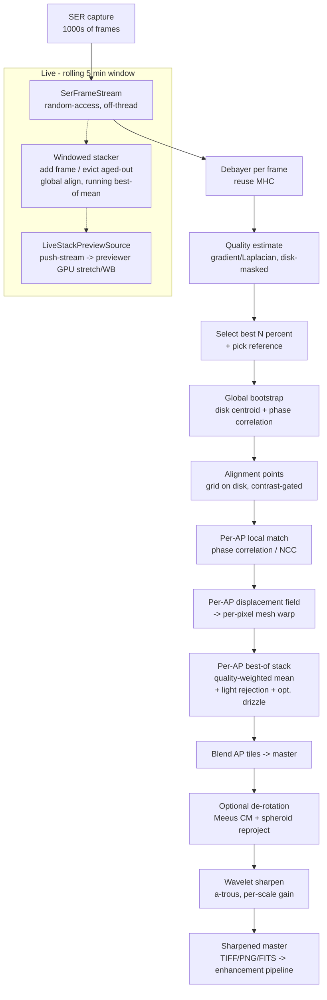

# PLAN: Planetary stacking - lucky imaging (grade, align, stack, derotate, sharpen, live)

## Goal

Add a complete planetary / lunar / solar **lucky-imaging** stacking pipeline to TianWen:
grade thousands of short SER-video frames by sharpness, select the best, align them with
multi-point (AutoStakkert-style) registration, stack with per-alignment-point quality
weighting, optionally de-rotate (WinJUPOS-style) to beat planetary rotation, and finish with
multi-scale wavelet sharpening. Plus a **live** path: a rolling ~5-minute running stack that
sharpens in front of the user as a SER plays back, wired so a live planetary camera can feed
the same stacker later.

This is the "SER/AVI video stack (planetary)" item that
[`stacking.md`](stacking.md) explicitly listed as a **non-goal / separate plan** ("Different
domain, different cadence, separate plan"). It is separate for a real reason: **planetary
alignment and stacking are fundamentally different from the deep-sky pipeline.**

## Why this is NOT the deep-sky pipeline

The shipped pipeline in [`stacking.md`](stacking.md) is deep-sky/sidereal and reuses none of
its *registration* or *integration* semantics here:

- **Alignment.** Deep-sky registers by matching *star quads* (`StarReferenceTable.FindFit`,
  `SortedStarList.FindOffsetAndRotationAsync`) - it assumes a stellar point-source population.
  A planet is one extended disk with zero usable field stars. `AnalyseStar` (HFD/FWHM/centroid)
  is meaningless on a disk. Planetary alignment is **disk-centroid + phase-correlation** (global)
  then a **grid of alignment points** each tracked locally (handles atmospheric distortion
  varying across the disk) - a displacement-mesh warp, not a single `Matrix3x2` affine.
- **Stacking.** Deep-sky does per-pixel sigma-clip rejection across ~100-500 registered subs.
  Planetary stacks the best *N%* of ~1000-10000 frames, **per alignment point** (different parts
  of the disk are sharp in different frames - the lucky-imaging insight), quality-weighted, then
  blends the AP tiles. Rejection is light (cosmic/satellite hits only).
- **Cadence.** Deep-sky: minutes-long subs, dither between them. Planetary: millisecond
  exposures, hundreds of fps, and **rotation smears detail in ~3-6 min** (Jupiter) - so the
  usable window is short, which is why de-rotation and a rolling live window both matter.

What *is* reused: the low-level pixel primitives (warp sampler, drizzle kernel, image
arithmetic, rejectors, the 1D FFT), `SER.Lib`, the multi-source previewer, and the AI/enhancement
post path. See the reuse map below.

## Decisions (confirmed with the user)

- **Multi-point AP from the start** (not a global-only v1), with a global centroid +
  phase-correlation **bootstrap** to seed the AP search. The mesh warp is a new primitive.
- **Planetary-specific align + stack** in their own namespace; only low-level primitives reused.
- **De-rotation in scope** (WinJUPOS-style): within-capture (extend the usable window) and
  multi-stack (combine stacks/channels taken at different times to a common epoch).
- **Wavelet sharpening in scope** (Registax-style multi-scale a-trous).
- **Live = a rolling ~5-minute window** best-of running stack (NOT an all-frames Welford
  accumulator - planetary rotation forbids stacking the whole night). SER-playback first, fed
  through a frame-stream abstraction so a live camera plugs in later with no rework.
- **Quality estimator is a first-class build**: a global score (frame selection + reference
  pick) and a per-AP local score (per-AP best-of selection).

## Non-goals (v1)

- **Live full-AP stacking.** Live uses the cheaper global align over the rolling window; full
  AP + mesh warp is the batch path. (AP-live is a stretch goal once the batch AP path is fast.)
- **Lunar/solar mosaic stitching.** AP stacking applies to lunar/solar surface patches, but
  panel mosaicking (multi-ROI panorama) is a separate feature.
- **GPU acceleration.** CPU (SIMD) first. Align/stack/wavelets can move onto the existing Vulkan
  pipeline (`VkFitsImagePipeline`) later; the CPU path stays the source of truth (CLAUDE.md
  CPU/GPU mirror rule).
- (Was a non-goal; now **in scope** - split-CFA stacking is the chosen v1 path, see resolved
  decision 1. The final demosaic of the integrated CFA reuses the previewer's MHC.)

## Architecture

New namespace `TianWen.Lib.Imaging.Planetary` for the planetary-specific math + orchestration.
It depends on (does not duplicate) the existing primitives in `TianWen.Lib.Imaging`,
`TianWen.Lib.Imaging.Stacking`, `TianWen.Lib.Stat`, and `SER.Lib`. The CLI command and the live
previewer wiring are thin orchestrators - zero pixel math outside `TianWen.Lib`.

### Pipeline shape



### Reuse vs build (verified against src/, 2026-06-23)

| Concern | Status | Where |
|---|:--:|---|
| SER read + frame-range slice | reuse | `SER.Lib` `SerReader`, `Cut`/`CutTo` (1.1.x) |
| SER -> [0,1] float frame | reuse | `TianWen.Lib/Imaging/Ser/SerImageBridge.cs` |
| Final demosaic of integrated CFA (once) | reuse | the previewer's `DebayerMHCAsync`/`GpuDebayerMode` |
| Split Bayer mosaic into 4 CFA sub-planes | reuse (seam) | `Image.SplitBayerChannels()` reserved in `stacking.md` item K |
| Affine warp + bilinear sampler | reuse | `Image.Transform.cs` `WarpToReferenceGridAsync:92`, `WarpRegionAsync:169`, `SubpixelValue` |
| Resample / bin | reuse | `Image.Resize.cs` `BilinearResize`, `Image.Transform.cs:346` `Downsample` |
| Drizzle (pixfrac, scale) + **Bayer drizzle** (CFA channel separation) | reuse | `Stacking/DrizzleKernel.cs`, `DrizzleStrategy.cs` (already Bayer-aware) |
| Pixel rejectors + combiners | reuse (light) | `Stacking/IPixelRejector` + Sigma/Winsorized/Percentile/MinMax |
| Image arithmetic | reuse | `Image.Arithmetic.cs` (Subtract/Divide/Add) |
| 1D FFT | reuse (basis) | `Stat/FFT.cs` |
| Planet positions / light-time | reuse | `Astrometry/VSOP87/*`, `Astrometry/SOFA/*`, `Lunar/MeeusMoon.cs` |
| Display + GPU stretch/debayer/WB | reuse | multi-source previewer, `IPreviewSource`, `ImageRendererBase` |
| Off-thread publish to render thread | reuse (pattern) | SER playback `SequencePlayer` / `TryPublishDecoded` |
| Sharpen/enhance post | reuse | `TianWen.AI.Imaging`, GHS |
| **SerFrameStream / planetary frame source** | **build** | new `Planetary/` |
| **Quality estimator** (gradient/Laplacian default + FFT-high-band option; global + per-AP) | **build** | new `Planetary/`; FFT variant reuses the 2D FFT below |
| **2D FFT + sub-pixel phase correlation** | **build** | `Stat/` (atop 1D FFT) |
| **Disk tracker**: center-of-mass (cheap, every frame) + limb/ellipse fit (center, scale, PA) | **build** | new `Planetary/` (AnalyseStar is point-source only; COM = coarse find, ellipse fit = derotation anchor) |
| **Feature detector for AP seeding** | **build** | new `Planetary/` (top-N high-gradient / corner response) |
| **Alignment points + displacement-mesh warp** | **build** | new `Planetary/` + `Image.WarpByMeshAsync` |
| **Planetary integrator (per-AP quality-weighted)** | **build** | new `Planetary/` |
| **Meeus per-planet CM formulae + disk geometry** | **build** | `Astrometry/` (positions exist; CM longitude does NOT - confirmed absent) |
| **Spheroid de-rotation reprojection** | **build** | new `Planetary/` |
| **Multi-scale wavelet sharpening** | **build** | new `Imaging/` (`WaveletSharpen`) |
| **Windowed live stacker + LiveStackPreviewSource** | **build** | `Planetary/` + `UI.Abstractions` |

## Stage design

### A. Frame source - `SerFrameStream` / `IPlanetaryFrameStream`

The deep-sky `IFrameSource` (`IAsyncEnumerable<FrameInfo>`, folder of FITS) does not fit: planetary
frames are random-access indices in one SER, read off-thread, in the thousands. Define a planetary
frame abstraction:

```csharp
public interface IPlanetaryFrameStream
{
    int FrameCount { get; }                 // -1 / unbounded for a live camera stream
    bool HasTimestamps { get; }
    DateTimeOffset? TimestampOf(int index);
    ValueTask<Image> LoadAsync(int index, CancellationToken ct);   // [0,1]; raw mosaic for Bayer
}
```

- `SerFrameStream` wraps `SerReader` + `SerImageBridge`. **Split-CFA path (decision 1):** for a
  Bayer source it loads the raw `[0,1]` mosaic and splits it into 4 CFA sub-planes via the reserved
  `Image.SplitBayerChannels()` seam - it does **not** debayer up front; the demosaic happens once,
  on the integrated CFA, after stacking. Mono loads a single plane. All `.ser` I/O stays off the
  render/UI thread (the standing previewer rule).
- The same interface is what a future `LiveCameraFrameStream` implements (frames pushed by the
  camera, `FrameCount` grows, `LoadAsync(latest)`). This is the "wire it so a camera plugs in"
  seam the user asked for - the batch grader/aligner and the live windowed stacker both consume
  `IPlanetaryFrameStream`, blind to whether it's a file or a live camera.

### B. Quality estimation - `IFrameQualityEstimator`

Lucky imaging lives or dies on the quality metric.

```csharp
public interface IFrameQualityEstimator
{
    float Score(Image frame, Rectangle region);   // higher = sharper
}
```

Blur = lost high spatial frequency (bad seeing low-pass-filters the frame). Two estimator families,
selectable behind the interface (matching AutoStakkert's selectable quality methods):

- **Spatial (default):** `GradientEnergyEstimator` (sum of squared Sobel gradients) /
  `LaplacianEnergyEstimator` (variance of the Laplacian - the classic focus measure). One
  convolution pass per frame; cheap enough for 10,000 frames x per-AP. **This is the default.**
- **Frequency (option):** `FftHighBandEstimator` - 2D FFT, ratio of high-band power to total power.
  The most direct blur measure, and nearly free to offer because the 2D FFT is built anyway for
  phase-correlation alignment (Phase 3). Costlier per frame, so it is an opt-in, not the default.

**The noise trap (applies to both):** sensor noise is broadband and inflates a naive high-frequency
score - it rewards noise, not detail. Mitigations, all in the estimator: (1) **disk-mask** - measure
only over the planet / high-signal region, never the noisy background; (2) **band-limit** - use the
mid-high band, not the very top octave where noise dominates (chiefly for the FFT variant);
(3) optional light pre-denoise + per-frame brightness normalization so frames compare fairly.

- **Global score** drives frame selection (keep best N%, default 25%) and reference pick (single
  best, then refine to a quality-weighted top-K, per decision 3).
- **Per-AP local score** (same estimator over each AP patch) drives per-AP best-of selection - the
  lucky-imaging edge: different parts of the disk are sharp in different frames.

### C. Alignment - global bootstrap, then alignment points

1. **Global bootstrap.** **Center-of-mass first (cheap, every frame):** threshold the disk
   (`background + N-sigma`, disk-masked) and take the intensity-weighted centroid in one O(N) pass -
   noise-robust (averages out), removes bulk drift so the next step searches a tiny window. Then
   sub-pixel **phase correlation** vs the reference removes residual jitter. Yields a per-frame
   integer+sub-pixel translation. **Caveat:** COM is a *relative* anchor (consistent frame-to-frame,
   which is all registration needs); it is **not** the true geometric center on a partial phase
   (crescent/gibbous Venus/Mars/Mercury - pulled toward the lit side), so derotation's absolute
   center comes from the limb/ellipse fit, never COM. Full-disk Jupiter/Saturn: COM approx center.
2. **Alignment points (AP) - feature-driven (decision 2).** Place AP patches on the highest-
   contrast surface features (a contrast/feature detector picks the centres), not a regular grid -
   APs land where there is signal to track. For each frame, match each AP patch locally to the
   reference by phase correlation / normalised cross-correlation -> a local shift per AP. The sparse
   AP shift field interpolates to a **per-pixel displacement mesh**; warp the frame by the mesh.
   This corrects seeing-induced distortion that varies across the disk - a single affine cannot.
   **Split-CFA interaction:** detect features + track APs on a luminance proxy (quadrant sum), then
   apply the *same* mesh warp to all four CFA sub-planes so they stay co-registered (cheaper than
   per-plane tracking; see remaining open questions).
3. **2D phase correlation** (new, in `Stat/`): build a 2D FFT from the existing 1D `FFT` (row-
   column decomposition), compute the normalised cross-power spectrum, sub-pixel peak via
   parabolic/centroid fit. Unit-tested against synthetic known shifts.
4. **Mesh warp** (new, `Image.WarpByMeshAsync`): per-pixel sampling using the AP displacement
   field (triangulated or bilinear-over-grid), reusing the existing `SubpixelValue` bilinear
   sampler. This is the AP analogue of the affine `WarpToReferenceGridAsync`.

### D. Stacking - per-AP quality-weighted

For each AP region: take the best-N% frames *by that AP's local score*, warp by the AP mesh,
combine by quality-weighted mean (light Sigma/MinMax rejection for transient hits), optionally
drizzle (1.5x/3x via the existing `DrizzleKernel`) for undersampled data. Blend the per-AP tiles
(feathered overlap) into the integrated result.

**Split-CFA (decision 1) - two combine modes for a Bayer source:**
- **Drizzle off**: run the per-AP quality-weighted stack **per CFA sub-plane** (4 integrations
  sharing the one luminance-proxy AP mesh) -> an integrated CFA mosaic -> a single final demosaic
  (reuse the previewer's MHC) -> linear RGB master.
- **Drizzle on = Bayer drizzle**: instead of stack-then-demosaic, **drizzle each sub-plane's real
  photosite samples directly onto the (upscaled) output grid** at their mesh-warped positions, with
  **no demosaic** - the per-frame/AP sub-pixel diversity fills each channel's grid. Reuses the
  existing Bayer-aware `DrizzleKernel`/`DrizzleStrategy`; drizzle's forward-scatter pairs naturally
  with per-sample CFA positions + the mesh. Higher resolution when upscaling. Caveat: green has 2x
  the samples (G1+G2) -> denser green grid, and pixfrac/output-scale must keep per-cell coverage
  complete (ample with planetary frame counts).

Mono produces one plane directly (drizzle optional, no CFA concern).

### E. De-rotation (WinJUPOS-style)

Jupiter smears in minutes. Two uses, both built on a new **physical-rotation layer** - the
**Meeus per-planet central-meridian formulae** (decision 4; positions exist via VSOP87/SOFA/Meeus,
but the CM-longitude + disk-geometry layer does **not** - confirmed by grep). Meeus is lighter and
amateur-accurate; the general WGCCRE model was considered and rejected as overkill:

- **6a - within-capture derotation**: de-rotate each (aligned, selected) frame to the capture
  midpoint epoch before stacking, extending the usable window past the smear limit.
- **6b - multi-stack derotation**: de-rotate finished stacks/channels taken at different times to
  a common epoch and combine (the classic WinJUPOS workflow; also fixes RGB temporal offset).

**Geometry - measured vs computed (the key split):**
- **Computed from ephemeris (Meeus), never measured:** the axis **position angle (P)**, the
  **sub-observer planetographic latitude (B / D_E)** that sets tilt + foreshortening, the
  **central-meridian longitude (System I/II/III)** at the capture time, and the apparent oblate
  ellipse *shape* (axis ratio from flattening + foreshortening). You cannot reliably recover a
  planet's pole from one seeing-blurred frame, and you do not need to - the ephemeris knows it.
- **Fit from the image (limb/ellipse fit), to anchor the model to the pixels:** the disk **center**
  (x0, y0) and **scale** (equatorial radius in px), plus an optional small PA refinement. This is
  the same limb/ellipse fit alignment uses - shared primitive.

Reprojection: fit the limb -> drop the ephemeris oblate-spheroid model (ellipse + axis PA +
sub-observer latitude + CM longitude) onto the fitted center/scale -> unproject each pixel to
planetographic lon/lat on the spheroid -> rotate longitude by `delta_t * rotation_rate` -> reproject
to the target epoch. The oblateness + foreshortening are exactly why a flat 2D image-rotation is
wrong. This is the largest astronomy build; phase it after the core stacker ships. (Moon/Sun -
libration / differential rotation - are out of v1 scope.)

### F. Wavelet sharpening - `WaveletSharpen`

Registax/AstroSurface-style multi-scale **a-trous** (B3-spline) decomposition: N detail layers +
a residual; per-layer gain + optional per-layer denoise threshold; recompose. Applied to the
linear master. CPU first (SIMD), structured so it can later move to the Vulkan pipeline with the
CPU path as the source of truth (CLAUDE.md mirror rule). The sharpened master then flows into the
existing AI-enhancement / GHS path for any further processing.

### G. Live - rolling 5-minute window + push preview

- `RollingWindowStacker`: maintains a time-based window (~5 min of capture time from frame
  timestamps; falls back to a frame count when untimed). As a frame enters: grade, global-align
  (phase correlation - cheap; full AP is batch-only in v1), and fold into a running best-of mean.
  As a frame ages out of the window: evict its contribution (running sum + per-frame contributions
  so eviction is O(pixels), not a re-stack). The window keeps only the best-graded frames it has
  seen within the time span, so the live stack tracks current seeing and never smears across
  rotation.
- `LiveStackPreviewSource : IPreviewSource` (new): the push-stream the previewer follow-up
  anticipated - and `IPreviewSource` is already documented "deliberately seek-agnostic so a future
  live-camera stream can implement it too." Its "current frame" is the latest published master:
  `FrameCount`/`FrameIndex` track frames-folded (or stay 1), `SelectFrame` is a no-op, and
  `GetChannelData`/`ChannelStatistics`/`ComputeStretchUniforms` read the current master, recomputed
  when a new one is published. The windowed stacker publishes each updated master to the render
  thread via the **same Task-handoff / double-buffer pattern** SER playback uses (`SequencePlayer` /
  `TryPublishDecoded`) - no blocking I/O on the render thread.
- **Install seam (verified)**: `ViewerController` holds `IPreviewSource? Source` and is shared by
  **both** `tianwen-fits` and the GUI viewer tab (same `ViewerController` + `ViewerState`). Today a
  source is installed only via `HandleFileRequest` (open-by-extension). Add a **non-file analogue
  `ViewerController.ShowLiveSource(IPreviewSource)`** that assigns `Source`, reuses the existing
  `StashForDispose` (retire the previous source post-frame) and `TickPlayback` / `_playerBoundSource`
  rebind. The session (running in the GUI) creates the `LiveStackPreviewSource` when live stacking is
  enabled and hands it to the GUI's `ViewerController`. The live stack then inherits the previewer's
  GPU stretch / debayer / zoom-pan / white-balance for free, in both surfaces, with no per-surface code.
- Source-agnostic: the windowed stacker consumes `IPlanetaryFrameStream`, so "SER playback now,
  live camera later" is a swap of the stream implementation, not a rewrite.

## GPU acceleration + CPU fallback

The heavy stages are embarrassingly parallel and ideal GPU-compute targets: 2D FFT +
phase-correlation, the gradient/Laplacian quality reductions, per-AP NCC, warp / mesh-warp,
drizzle scatter, the per-pixel integration reduction, and the a-trous wavelet (separable
convolutions). With thousands of frames the payoff is large.

**Stance: CPU is the source of truth; GPU is an acceleration layer that must match it.** This is the
project's existing CPU/GPU-mirror rule (CLAUDE.md), not a new one. Consequences:

- **Ship CPU-only first.** Every stage lands as a CPU (SIMD) implementation - correct, testable,
  CI-green, and runnable anywhere with no Vulkan dependency. The feature is complete on CPU before
  any GPU work. The CPU path stays the **correctness oracle** the GPU path is validated against.
- **GPU is headless *compute*, a new capability.** The existing `VkFitsImagePipeline` is
  *fragment*-shader/display (render a quad to a window). Batch + live stacking need **offscreen
  compute** (storage buffers, multi-pass dispatch, no swapchain) so the CLI and the live path can
  use it without a window. Building that compute capability in `SdlVulkan.Renderer` is Phase 13.
- **Three fallback tiers:** hardware GPU (speed) -> **CPU mirror** (guaranteed correctness +
  portability, no Vulkan) ; and the **software Vulkan renderer already used in CI** can run the real
  SPIR-V compute shaders headless to catch shader regressions (CPU-emulated, slow - a *validation*
  path checked against the CPU oracle, not a performance path).
- **Selection** mirrors the deep-sky `IntegrationStrategySelector` host-probe: a capability probe
  picks GPU-compute when available, else the CPU path.
- **Gotchas:** drizzle's forward scatter needs atomic accumulation (or a gather reformulation) on
  the GPU - the one non-trivial shader; GLSL must be **ASCII-only** (shaderc rejects non-ASCII even
  in comments).

## Phasing

CLI/engine-first, like the deep-sky plan. Phases 1-9 land in `TianWen.Lib`; the live preview
source touches `TianWen.UI.Abstractions`; the CLI touches `TianWen.Cli`. End-to-end "stack a SER
to a sharpened master" ships at **Phase 6** (global + AP + stack + wavelets); derotation and live
follow.

**Status (2026-06-23):** Phases 1-8 are **implemented + unit-tested** on branch
`feat/planetary-stacking` (AP-mesh core + wavelet sharpen + CLI; 88 tests) and **validated on a real
30,000-frame Bayer Jupiter SER** (`tianwen planetary-stack` -> linear + sharpened FITS masters + a PNG;
belts resolved). The CPU engine lives in `TianWen.Lib.Imaging` (`WaveletSharpen`/`ATrousWaveletTransform`)
+ `TianWen.Lib.Imaging.Planetary` + `TianWen.Lib.Stat`; the CLI is `TianWen.Cli/PlanetaryStackSubCommand`.
Phase 6's optional **Bayer drizzle** is now implemented (`LuckyImagingStacker.StackDrizzleAsync` +
`PlanetaryDrizzleOptions`, CLI `--drizzle <scale>`): forward-scatters raw CFA samples through the shared
`Stacking/DrizzleKernel` onto an upscaled grid (no interpolation, no demosaic). **AP-mesh drizzle** (default
on; `--drizzle-global` for whole-disk-only): `DrizzleKernel` was generalised over an internal
`ISourceToCanvas` struct map (JIT-monomorphised, no virtual dispatch; the deep-sky `Matrix3x2` path is now a
byte-identical wrapper over `AffineMap`), and the planetary path supplies a `MeshSourceToCanvas` that
forward-scatters each raw sample through the per-AP `DisplacementMesh` -- so drizzle gets the local seeing
de-warp on top of sub-Bayer resolution (it reduces to the affine `(mosaic - 2*shift)*scale` when residuals
-> 0). On the test SER the mesh-vs-global drizzle difference is subtle (small, well-tracked, seeing-limited
planet -- resolution/seeing dominates), but it is correct and matters more under stronger differential
seeing. The AS!3 reference's edge was full-res 439-point local de-warp, which the half-res split-CFA path
still cannot fully match.

**Wavelet sharpening presets (Phase 7) + CLI `--sharpen-preset`:** an a-trous decomposition is a bank of
frequency bands, so the per-scale gain curve IS a bandpass. `default` peaks the finest (noisiest) band;
`bandpass` peaks the mid belt-structure band and holds the finest down (cleaner belts, less limb noise);
`combo` lifts fine AND mid in one pass (AutoStakkert-sharpen + bandpass -- and since reconstruction is
linear, stacking two sharpenings is just one gain profile, so "which order" is moot). `--sharpen-gains`
overrides the preset.

Real-data validation surfaced + fixed a Phase-6 integrator bug: the per-AP per-pixel best-of weight
(`FrameSharpnessMap`, local Sobel energy) **amplified a faint real halo into a bright ring** -- in a
low-signal region the weight is highest in exactly the frames where that region was brightest, so the
weighted mean drifted bright (radial profile: halo r=144 inflated 0.087 -> 0.165, ~2x, plus a spurious
dark trough). Fixed with `PlanetaryDisk.SignalConfidence` + a confidence gate in
`Image.AccumulateByMeshWeightedInto` (`PlanetaryStackOptions.PerPointSignalGate`, default on): best-of
weighting stays full on the bright disk body, blends to an unbiased mean in faint regions. Gated radial
profile now matches the true baseline to ~0.001 while keeping disk-body sharpening.

Still soft vs an AutoStakkert ap439+Drizzle1.5 reference: the remaining gaps are AP count (CLI default 64,
just a param) and -- the structural ceiling -- the half-res split-CFA resolution vs a full-res 439-AP local
de-warp, not the sharpen (bandpass/combo presets + AP-mesh drizzle now cover the sharpen + local-de-warp
levers).

**Phase 9 (live) MVP shipped (2026-06-24):** `RollingWindowStacker` (`TianWen.Lib/Imaging/Planetary/`) +
`LiveStackPreviewSource` (`TianWen.UI.Abstractions/`) + a RAW/STACK toggle (transport-bar button + `K`) in
`tianwen-fits` (and the GUI viewer tab, via the shared `ViewerState`/`ImageRendererBase`). It is the
**follow-the-playhead** variant: the raw `SerPreviewSource` stays the playback driver, and the live stack
shows the quality-weighted global-aligned mean of the time-bounded window ending at the current frame,
re-folding on the fly (O(pixels) add/evict, full rebuild on backward jump / reference age-out). Global
align only (full AP stays the batch path, per non-goal #1). Demosaic-once and normalise reuse the shared
`PlanetaryMaster` helper, so the live and batch masters can never drift. Verified end-to-end in
`tianwen-fits` on a real RGGB SER + a 40-frame mono SER (toggle denoises the disk, no crash).

Live wavelet sharpen is now **adjustable in the viewer**: 6 Registax-style per-a-trous-layer gain sliders
(finest first) + an on/off + reset, in the info panel directly under the RGB white-balance sliders, shown
for the stacked view. `LiveStackPreviewSource` caches the un-sharpened master and re-applies the wavelet
pass off-thread on a slider change (no re-stack), so dragging a layer updates the image within a frame or
two; the validated planetary fine-scale denoise is reused so amplified gains don't pull up limb grain. Not
yet done: the independent "EAA free-run" stack mode, and Phases 10-13.

| Phase | Scope | Depends on | Risk | Status |
|---|---|---|:--:|:--:|
| 1 | `IPlanetaryFrameStream` + `SerFrameStream` (off-thread, debayer-on-load) + small SER fixture test (reuse `Cut`) | SER.Lib 1.1 | Low | DONE |
| 2 | `IFrameQualityEstimator` + Gradient/Laplacian (disk-masked) + best-N% selection + reference pick | 1 | Low | DONE |
| 3 | 2D FFT + sub-pixel **phase correlation** in `Stat/` (synthetic-shift tests) | - | Medium | DONE |
| 4 | **Global align**: disk-centroid + phase-correlation translate; first end-to-end stack (best-of mean, no AP) on a real SER | 1,2,3 | Medium | DONE |
| 5 | **Alignment points**: feature-detector AP placement + per-AP local match + `Image.WarpByMeshAsync` (mesh warp); luminance-proxy mesh applied to all CFA sub-planes | 3,4 | High | DONE |
| 6 | **Planetary integrator**: per-AP quality-weighted best-of stack + tile blend + optional drizzle; **end-to-end milestone** | 4,5 | High | DONE |
| 7 | **`WaveletSharpen`** (a-trous, per-scale gain/denoise) | 6 | Medium | DONE |
| 8 | **CLI**: `tianwen planetary-stack` (or `tianwen stack --planetary`) orchestrator | 6,7 | Low | DONE |
| 9 | **Live**: `RollingWindowStacker` (5-min window) + `LiveStackPreviewSource` push-stream wired into the previewer (GUI + tianwen-fits) | 4,6 | Medium | DONE (MVP: follow-the-playhead, global align; sharpen/EAA-free-run deferred) |
| 10 | **De-rotation 6a** (within-capture): Meeus per-planet CM + disk geometry + spheroid reproject; derotate-to-midpoint before stack | 6 | High |
| 11 | **De-rotation 6b** (multi-stack / RGB temporal): derotate finished stacks to a common epoch + combine | 10 | High |
| 12 | **Live camera stream** (`LiveCameraFrameStream`) feeding the same windowed stacker (true EAA) | 9 | Medium |
| 13 | **GPU compute acceleration**: headless compute capability in `SdlVulkan.Renderer` (storage buffers, no swapchain) + GPU impls of FFT/quality/NCC/warp/drizzle-scatter/integrate/wavelet, capability-probed; CPU mirror stays source of truth + fallback; software-Vulkan CI shader-exercise | 6,7 | Medium |

## Resolved design decisions (2026-06-23)

These were the open questions; all six are now decided (the user took the high-fidelity fork on
each where one existed):

1. **Bayer planetary -> split-CFA from the start.** Align + stack each Bayer quadrant separately
   (higher per-cell SNR before demosaic interpolation smooths it out), then demosaic the integrated
   CFA. Reuse the `Image.SplitBayerChannels()` seam the deep-sky plan reserved (`stacking.md` item
   K). This raises Phase 1 (frame source emits 4 sub-planes) and the integrator (4 sub-channel
   stacks + a final demosaic of the integrated CFA).
2. **AP placement -> feature-driven.** Place alignment points on the highest-contrast surface
   features (AutoStakkert-style), not a regular grid. Needs a contrast/feature detector (new) feeding
   AP centres; raises Phase 5.
3. **Reference frame -> single-best, then refine to top-K.** Bootstrap with the single highest-
   quality frame; once a coarse align exists, rebuild the reference from a quality-weighted mean of
   the top-K (upsampled). Avoids the chicken-and-egg of needing an align to build a top-K reference.
4. **De-rotation ephemeris -> Meeus per-planet central-meridian formulae** (Astronomical Algorithms),
   not the general WGCCRE model. Lighter, amateur-accurate, per-planet CM longitude + disk geometry.
   Still new code on top of the existing VSOP87/SOFA positions, but smaller than WGCCRE.
5. **Live AP -> global align only.** The live 5-min-window path uses disk-centroid + phase-correlation
   global align; full feature-driven AP stays batch-only (AP-live is a later stretch).
6. **Output -> mirror the deep-sky stacking output.** Emit the linear master (FITS/TIFF) **and** a
   display PNG, minus the deep-sky-only plate-solve / SPCC steps (don't apply to a planet). For
   planetary the PNG is the wavelet-sharpened display image. **DONE (deviation from deep-sky):** the
   deep-sky `MasterPreviewRenderer` auto-stretch is an MTF that targets a faint background and so
   blows a bright disk out to a white blob -- planetary uses its own gentle, near-linear stretch
   instead: `Image.ComputePlanetaryStretchUniforms` (per-channel black point at p0.5% + a single
   COMMON scale so the sky stays colour-neutral + a mild gamma->MTF midtones lift), rendered through
   the single-source `Image.RenderStretchedRgba16` via `MasterPreviewRenderer.RenderPlanetaryAsync`
   (CLI `--png-gamma`, default 0.75). No autocrop (the disk is small and centred; the full frame is fine).

## Remaining open questions

- **Split-CFA + AP interaction**: run feature detection / AP tracking on a luminance proxy
  (quadrant sum) and apply the same mesh warp to all four CFA sub-planes, or track per sub-plane?
  Luminance-proxy is far cheaper and keeps the four planes co-registered; likely the answer.
- **Feature detector**: reuse a thresholded local-contrast / Harris-style corner response, or a
  simpler "top-N highest-gradient cells"? The latter is cheaper and probably enough for AP seeding.

## Cross-links

- [`stacking.md`](stacking.md) - the deep-sky/sidereal pipeline this one deliberately does not
  reuse for align/stack (only low-level primitives). That doc's "SER/AVI video stack" non-goal
  points here.
- [`multi-source-previewer.md`](multi-source-previewer.md) - SER playback + `IPreviewSource`; the
  live stack displays through it, and `LiveStackPreviewSource` is the push-stream its follow-up
  note anticipated.
